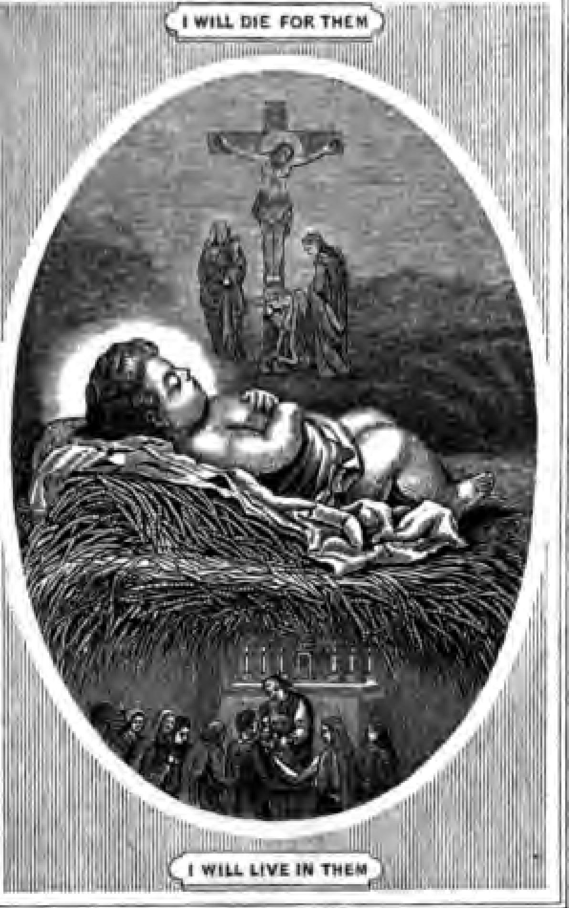

This book was produced in EPUB format by the Internet Archive. The book pages were scanned and converted to EPUB format automatically. This process relies on optical character recognition, and is somewhat susceptible to errors. The book may not offer the correct reading sequence, and there may be weird characters, non-words, and incorrect guesses at structure. Some page numbers and headers or footers may remain from the scanned page. The process which identifies images might have found stray marks on the page which are not actually images from the book. The hidden page numbering which may be available to your ereader corresponds to the numbered pages in the print edition, but is not an exact match; page numbers will increment at the same rate as the corresponding print edition, but we may have started numbering before the print book's visible page numbers. The Internet Archive is working to improve the scanning process and resulting books, but in the meantime, we hope that this book will be useful to you. The Internet Archive was founded in 1996 to build an Internet library and to promote universal access to all knowledge. The Archive's purposes include offering permanent access for researchers, historians, scholars, people with disabilities, and the general public to historical collections that exist in digital format. The Internet Archive includes texts, audio, moving images, and software as well as archived web pages, and provides specialized services for information access for the blind and other persons with disabilities. Created with hocr-to-epub (v.1.0.0) This is a digital copy of a book that was preserved for generations on library shelves before it was carefully scanned by Google as part of a project to make the world's books discoverable online. It has survived long enough for the copyright to expire and the book to enter the public domain. A public domain book is one that was never subject to copyright or whose legal copyright term has expired. Whether a book is in the public domain may vary country to country. Public domain books are our gateways to the past, representing a wealth of history, culture and knowledge that's often difficult to discover. Marks, notations and other marginalia present in the original volume will appear in this file - a reminder of this book's long journey from the publisher to a library and finally to you. Usage guidelines Google is proud to partner with libraries to digitize public domain materials and make them widely accessible. Public domain books belong to the public and we are merely their custodians. Nevertheless, this work is expensive, so in order to keep providing this resource, we have taken steps to prevent abuse by commercial parties, including placing technical restrictions on automated querying. We also ask that you: + Make non-commercial use of the files We designed Google Book Search for use by individuals, and we request that you use these files for personal, non-commercial purposes. + Refrain from automated querying Do not send automated queries of any sort to Google's system: If you are conducting research on machine translation, optical character recognition or other areas where access to a large amount of text is helpful, please contact us. We encourage the use of public domain materials for these purposes and may be able to help. + Maintain attribution The Google "watermark" you see on each file is essential for informing people about this project and helping them find additional materials through Google Book Search. Please do not remove it. + Keep it legal Whatever your use, remember that you are responsible for ensuring that what you are doing is legal. Do not assume that just because we believe a book is in the public domain for users in the United States, that the work is also in the public domain for users in other countries. Whether a book is still in copyright varies from country to country, and we can't offer guidance on whether any specific use of any specific book is allowed. Please do not assume that a book's appearance in Google Book Search means it can be used in any manner anywhere in the world. Copyright infringement liability can be quite severe. About Google Book Search Google's mission is to organize the world's information and to make it universally accessible and useful. Google Book Search helps readers discover the world's books while helping authors and publishers reach new audiences. You can search through the full text of this book on the web at|http : //books . google . com/  THE SACRIFICE OF LOVE.  |n Jfoni Soaks. BY THOMAS A KEMPIS. TR\N8IATED FROM THE ORIGINAL LATIN, BY TUE RIGHT REV. R. CHALLONER, D.D., V.A. WITH REFLECTIONS TRANSLATSD SFBHALLT FROM THB FRBNCH FOR THIS RDITION AND PRAYERS AT THE END3 OF THE CHAPTERS, DUBLIN : M*GLASHAN..AND GILL, 60 UPPER SAOi:Tn.I.E STREET. 1873. [All rights reserved.} Jesus said to all : If any man will come after me, let him deny himself, and take up his cross daily, and follow me. — Luke ix. 23. , any remark by way of introduction is uncalled for. It has been in the hands of the Christian world upwards of three centuries ; it has been translated into almost all languages; it has received the unqualified approbation of every learned and pious ornament of the Church; even Fontenelle has emphatically described it as the most excellent production that ever yet issued from the hand of man — God himself having dictated the Scriptures — and it is still held in as high estimation, by people of every denomination, as it was at any time since it came from the pen of Thomas a Kempis. In the present edition, a ** Practical Reflection," (translated specially for it from the French) and a Prayer have been introduced at the end of each chapter. It is hoped that they will be considered by the reader as a valuable addition to the original work ; the former, as a practical epitome of the sentiments and maxims contained in the text ; the latter, as an invocation to Almighty God, that He may, by the infusion of grace into our hearts, induce us to love and practice the duties and precepts inculcated therein. May God, in His divine mercy, deign to bless the undertaking; may it, through Him, be the means of discovering to us the loveliness of virtue and the deformity of vice ; of causing us ever to adhere to the one, and, with equal perseverance, to fly from the other ; and may it, in effect, tend to His further honour and glory, and to the sanctification and salvation of souls. Amen. A BRIEF ABSTRACT OF THE LIFE or THOMAS A KEMPIS. Thomas a Kempis was bom in 1380, at Kemp, a village situated near Cologne* His parents were of low condition, and highly respected for their piety. " He was brought up " (to use the language of one of the writers of his life) ** in poverty and hardship: his father earned his bread by incessant labour and the sweat of his brow; his mother assiduously watched over the education of her children, she was always attentive to the concerns of the family ; abstemious, silent, and extremely modest.*^ Thus, in his earliest years, he acquired those respectable habits which decent poverty inculcates; he experimentally felt how great a friend it is to virtue ; and all his writings show how much he respected it. He was f laced in one of the houses belonging to the Society of Brothers and Sisters of Common Life, when about six years old r Gerard de Groote, whose life he afterwards wrote, a person remarkable for his piety and erudition, was its founder. It was divided into two classes, the Lettered Brothers, or Clerks, who lived according to the rule of St. Augustine, and applied themselves with exemplary zeal and assiduity to sacred and profane learning for the education of youth ; and the Unlettered, who were ema2 VI LIFE OF THOMAS A KBMPIS. ployed in mechanical arts and manual labour. The female part of them, called Sisters, was employed in the same manner, and in the education of girls in works of laborious industry, suitable to their sex and condition. The whole society held their property |in common ; they had stated hours of prayer, but made no vow ; and, when they thought proper, were at full liberty to retire from the community. The school in which Thomas a Kempis entered himself was in the town of Daventer, in West Friesland; where Florentius^ the immediate successor of Gerard de Groote, was vicar of the principal church. Florentius received Thomas a Kempis with great tenderness, and after having supplied him with all the books which he wanted for the prosecution of his studies, and kept him some time in his family, he placed him with a respectable matron, by whom he was furnished, without charge, with his board. Her house was filled with members of the same society, to whom she showed the same gratuitous hospitality. The account which Thomas a Kempis gives (De discipulis Florentii, ch, i) of the manner in which the members of this little household spent their time is very edifying. " Much was I delighted," he says, " with the devout conversation, the irreproachable manners, and the humility of my brethren. I had never seen such piety or charity. Taking no concern in what passed beyond their w^ls, thev remained at home, employed in prayer and study, or in copying out useful books, and sanctifying this occupation by short but frequent ejaculations of VU devotion. They appeared to have but one heart and one soul. Their dress was homely — ^their diet spare, their obedience to their superiors without reserve ; their prayer continual. By degrees, the uniform tenor of their blameless, unpretending lives, gained them general good-will ; and they became universally respected, as true disciples of Christ, and true lovers of their neighbour." While Thomas a Kempis remained in this community, his favourite occupation appears to have been the copying of useful books ; and he warmly exhorted others to the same occupation. In his sermon, Christus scribit in terra, he thus expresses himself on this subject : " To transscribe works which Jesus Christ loves, by which the knowledge of Him is diffused, His precepts taught, and the practice of them inculcated, is a most useful employment. If he shall not lose his reward, who gives a cup of cold water to his thirsty neighbour, what will not be the reward of those, who, by putting good works into the hands of their neighbours, open to them the fountains of eternal life I Blessed are the hands of such transcribers I Which of the writings of our ancestors would now be remembered, if there had been no pious hand to copy them ? " Thomas a Kempis took due time for delibera* Hon before he determined on a religious state. His master, Florentius, wished those who inclined to it, to be slow in forming such a resolution, but, having formed it, to be careful to avoid every thing which might divert them from it. One of the biographers of Thomas a Kempis mentions, that, in a conversation with him, Florentius mentioned to him three temptations, to which beginners in a spiritual life were particularly exposed. The first was, when a person, recently converted to a life of virtue, returns to his worldly friends, on the pretence of endeavouring to convert them. Of ten who yield to this temptation, there is scarcely one, Florentius used to say, that does not relapse into his former habits. The second temptation is, when a lowly layman, who has led for some time a regular and pious life, wishes to enter into holy orders. This, he says, according to Florentius, proceeds too often from a secret pride, which makes the layman wish for a higher occupation than that of his humble lot. The third temptation is, when a priest, who is gifted with talents and learning, seeks for the dignities of the Church, merely from a wish, as he flatters himself, of being useful to his neighs hours. This was often described by Florentius as a most dangerous illusion. To seek for dominion over others, he used to say, is a strong mark of reprobation. When he attained his nineteenth year, Thomas a Kempis determined to enter into the order of St. Augustine. A respectable tradition deduces that order from the celebrated doctor of the Church of that name. Till the eleventh century, the monks of St. Augustine seem to have been little more than a voluntary association of ecclesiastics ; about that time they were fixed into a permanent order. They exercised a variety of ecclesiastical functions; and their public schools for the instruction of youth were particularly esteemed. Florentius encouraged ix Thomas a Kempis in his resolution to enter among them. He observed to him, that both a life of action and a life of contemplation were approved of by Christ ; that the state which united them was preferable, and should therefore, without a special call to one of them, be preferred to either. Thomas a Kempis was overjoyed to find that the opinion of his reverend guide accorded with his own. He told Florentius that he joyfully accepted his advice, and mentioned to him his wish to enter into a monastery of that order, recently established on the banks of the Vecht, near the town of Zwoll, of which John a Kempis, the brother of Thomas, was at that time prior. With a letter of Flcwrentius, recommending him strongly to the community, he repaired to it immediately. It was a subject of great joy to the brothers to meet in this manner. Thomas a Kempis continued a novice during five years. It would seem from some passages in his writings, that during this time he was visited with severe interior troul^s. It is supposed that in the following passage he relates an occurrence which happened to himself :~** When a certain person, in anxiety of mind» was often wavering between hope and fear, and on a time being overwhelmed with grief» had prostrated himself in prayer in the church, before an altar, resolved these things within himself, saying : If I did but know that I should still persevere I And presently he heard within him an answer from God : — And if thou didst know this, what wouldst thou do f Do now what thou wouldst then do^ and thou shalt be very secure! And immediately, being comforted and strengthened, he committed himself to the Divine will, and his anxious wavering ceased. Neither had he a mind any more to search curiously, to know what should befall him hereafter, but rather studied to inquire what was the will of God.'* — Lib. i., ch. 25, § 2. From the time' of his profession till his decease, a period of sixty years, Thomas a Kempis remained in the monastery of Zwoll, and in the continual practice of every virtue of his state. He was visited by tnany and long interior trials and temptations ; but his prayers, his self-denial, and his watchfulness over himself, were constant. *• Silence," he says himself, " was his friend, labour his companion, prayer his auxiliary." An interesting account of his progress in spirituality seems to be given us by himself, in the 15th, i6th, and 17th chapters of his ** Soliloquy of the Soul," He begins it by mentioning his many sins, and the great mercy of God, in withdrawing him from his repeated infidelities, and healing the general deformity, as he terms it, of his soul. Of his sins, he speaks in the strongest terms, but we must not understand his expressions in their strict sense; they are the language of a soul, whom God has raised to a view, not ordinarily given in this life, of his adorable perfections. Such a soul has an exquisite sense of the beauty, wisdom, and justice of the Divine will ; and therefore considers even the slightest deviation from it as an act of heinous rebellion. He mentions, that the spiritual delights which be experienced, when he first dedicated himself xl to God, were veiy great: for God, he says, would not then visit him with great sufiferings ; wisely considering that the tender shoot, just brought uuder the shelter of his wings, would shrink at the first rough blast. By degrees God lovingly prepared him for the trials which he designed him ; he showed him the conflicts which the saints of the Old and New Testament sustained, their vigilance, their exertions, their constancy, their rewards. He declares that at first he was terrified, and seemed to sink under every wave, but God was always his refuge and support. " O, how great," he exclaims, " hath been the mercy of God to me ! How often, when I was almost overcome, has He been my deliverer I Sometimes my passions assailed me as a whirlwind ; but God sent forth His arrows, and dissipated them. The attack was often renewed, but God was still my support. By degrees I was weaned from every thing earthly, and adhered to God alone. Then I experienced how sweet, how full of mercy, God is to those who truly love him. O my God! how merciful hast Thou been to me I Many have been forsaken by Thee, and are lost, who were less guilty than I am. But Thy mercies are unspeakable 1 " From the " Imitation of Christ," it appears that he had frequently before his eyes the abuse of human learning, and was too often obliged to see that it was attended with the worst consequences. It also appears, that he was sometimes the subject of slander and obloquy. Thomas a Kempis was successively promoted to the office of bursar, master of the novices, and sub-prior. The first volumes oi nis works contain his sermons : the greatest part of them are addressed to the novices. The reader must not expect to find in them the splendour, pathos, or dignified instruction of Massillon, Bossuet, or Bourdaloue; but he will find in them much solid precept, much that invigorates his devotion, and many touches of piety by a master^s hand. By deCTees his reputation for virtue and piety extended beyond the monastery. Many persons in the neighbourhood wished to place themselves under his spiritual direction ; and numbers sought his pious and edifying conversation. But he avoided their visits as much as he could. At the first moment that Christian civility allowed, he took leave of company saying, that " he must leave them, as one was waiting for him in his cell." What passed between him and the visitant of his cell, he himself has described in the 2i8t chapter of the third book of ** The Imitation of Christ." Every such hour was dearer to him than the last, "I have sought for rest everywhere," he often said, towards the close of hfs life, " but I found it nowhere, except in a little corner with a little book." He died on the 25th of July, in the year 147 1, in the 92nd year of his age. He is described to have been of small stature, well proportioned, and to have had a piercing eye. His biographers mention, that when he sung the divine office in the choir, his countenance had a holy irradiation, which filled the spectators both with awe and piety. His body was discovered in 1672. , B CHAP. PAO« 1 Following Christ, and despising all the vanities of the world . . . , i 2 Having an humble sentiment of one*s self .. .. ..4 3 The doctrine of truth .. •• 7 4 Prudence in our doings • • • • 13 5 The reading of the holy Scriptures . . 15 6 Inordinate affections . . . . 17 7 Flying vain hope and pride . . . . 19 8 Shunning too much familiarity . . 21 9 Obedience and subjection . . • . 23 10 Avoiding superfluity of words . . 26 zi Acquiring peace, and zeal of spiritual progress .. .. ..28 12 The advantages of adversity . . 32 13 Resisting temptation .. ••34 14 Avoiding rash judgment .. •• 39 15 Works done out •? charity .• ••41 16 Bearing the defects of others • . 43 17 A monastic life . . . . • • 45 i8 The examples of the holy fathers •• 47 19 The exercises of a good religious man 5 1 20 The love of solitude and silence . . 56 21 Compunction of heart .. ..62 22 The consideration of the misery of man 66 23 The thoughts of death .. ..72 24 Tudgment and the punishment of sins 77 25 The fervent amendment of oar life •• 83 CHAP. BOOK

II. PAQI 1 Interior conversation . . . . 91 2 Humble submission . • . . 96 3 A good peaceable man . . • . 99 4 A pure mind and simple intention • • 102 5 The consideration of one's self . . 104 6 The joy of a good conscience . . 107 7 The love of Jesus above all things .. iii 8 Familiar friendship with Jesus .. 113 9 The want of all comfort . . . . 117 10 Gratitude for the grace of God .. 122 X I The small number of the lovers of the cross of Jesus .. .. ..126 12 The King's highway of the Holy Cross 130 BOOK

III. 1 The eternal speech of Christ to a faithful soul . . . . * . . 140 2 Truth speaks within us without the noise of words . . . . . . 142 3 The words of God are to be heard with humility, and many weigh them not 145 4 We ought to walk in truth and humility in God's presence . . . . 150 5 The wonderful effects of divine love . . 154 6 The proof of a true lover .. .. 159 7 Grace is to be hid under the guardianship of humility . . . . . . 163 8 Acknowledging our unworthiness in the sight of God . . . . 168 9 All things are to be referred to God, as to our last end . . . . 171 10 It is sweet to serve God, despising this world . . . . . . 174 1 1 The desires of our heart are to be examined and moderated .. ..178 «HAF. 12 Learning patience and fighting against concupiscence .. .. .. i8o Z3 The obedience of an humble subject, after the example of Jesus Christ . . 184 14 Considering the secret judgments of God, lest we be puffed up with our good works . . . . . . 188 15 How we are to be disposed, and what we are to say, when we desire anything .. .. .. igi 16 True cotnfort is to be sought in God alone .. .. .. 194 17 We ought to cast all our care upon God .. .. ,. 197 x8 Temporal miseries are to be borne patiently, after the example of Christ 199 19 Of supporting injuries, and who is proved to be truly patient . . 202 20 The confession of our own infirmity, and the miseries of this life . . 205 21 We are to rest in God above all goods and gifts . . . . . . 209 22 The remembrance of the manifold benefits of Czod . . . . . . 214 23 Four things which must bring peace 218 24 We are not to be curious in inquiring into the lives of others . . . . 222 25 In what things the firm peace of the heart and true progress doth consist 224 26 The eminence of a free mind, which humble prayer procures better than reading .. .. .. 227 27 Self-love chiefly keeps a person back from the Sovereign Good . . 230 28 Against the tongues of detractors . . 234 29 How in the time of tribulation God is to be invoked and blessed . . 236 30 Of asking the divine assistance, and of confidence of recovering grace . . 238 31 Of disregarding all things created, that 80 we may find the Creator . . 243 32 Denying ourselves, and renouncing cupidity .. .. .. 247 33 The inconstancy of our heart, and of directing our intention to God . . 250 34 He that loves God, relishes him above all things and in all things . . 253 35 There is no being secure from temptation in this life . . . . . . 256 36 Against the vain judgments of men . . 258 37 A pure and full resignation of ourselves to obtain freedom of heart . . 261 38 The good government of ourselves in outward things, and of having recourse to God in dangers . . 264 39 A man must not be over eager in his affairs . . . . . . 266 40 A man hath no good himself, and he cannot glory in anything . . 269 41 The contempt of all temporal glory and honour . . . . . . 272 42 Our peace is not to be placed in men 274 43 Against vain and worldly learning . . 276 44 Of not drawing to ourselves exterior things .. .. .. 279 45 Credit is not to be given to all men ; men are prone to ofFend in words . . 281 46 Having confidence in God, when words arise against us . . . . 285 XVll CHiP. TAQK 47 All grievous things are to be endured for life everlasting . . . . 289 48 The day of eternity, and the miseries of this life . . . . . . 292 49 The desire of eternal life, and how great things are promised to them that fight . . . . . . 297 50 How a desolate person ought to oSet himself into the hands of God . . 303 51 We must exercise ourselves in humble works, when ^we cannot attain to higher things . . . . . . 309 52 A man ought not to esteem himself worthy of consolation, but rather deserving of stripes .. .. 311 53 The grace of God is not communicated to the earthly-minded . . 314 54 The different motions of nature and grace .. .. ..318 55 The corruption of nature, and the efficacy of divine grace . . . . 324 56 We ought to deny ourselves and to imitate Christ by the cross . . 329 57 A man should not be too much dejected when he falls into some defects 333 58 Of not searching into high matters, nor into the secret judgments of God 336 59 All hope and confidence is to be fixed in God alone , . • . . . 343 BOOK

IV. 1 With how great reverence Christ is to be received 348 2 The great goodness and charity of God shown to man in this sacrament . . 356 OHAP. PAGB 3 It 18 profitable to communicate often 362 4 Many benefits are bestowed on them who communicate devoutly . . 367 5 The dignity of the sacrament, and the priestly state . . . . ... 37a 6 A petition concerning the exercise proper before communion . . . . 376 7 Examination of one's conscience, and a resolution of amendment . . 378 8 The oblation of Christ on the cross, and the resignation of ourselves . . 382 9 We must offer ourselves, and all that is ours, to God, and pray for all . . 385 to The Holy > Communion is not lightly to be forborne . . , . . . 38^ 1 1 The Body of Christ and the Scriptures are most necessary to a faithful soul 395 12 He who is to communicate, ought to prepare for Christ with great diligence . . . . . . 402 T3 A devout soul should desire ardently to be united to Christ in the sacrament .. .. .. 405 14 The ardent desire of some devout persons to receive the body of Christ. . 409 15 The grace of devotion is obtained by humility and self-denial . . . . 413 16 We ought to lay open our necessities to Christ, and crave his grace . . 417 17 A fervent love and vehement desire to receive Christ . . . . . . 419 18 That a man be not a curious searcher into this sacrament, but an humble follower of Christ, submitting to holy faith .. .. ••423 Divided according to the different necessities of the Faithful. For Priests. — Book I, cap. i8, 19, 20, 25. B.

II. c. II, 12. B.

III. c. 3, 10, 31, 56, B.

IV. c- 5, 7f 10, II, 12, 18. For those who live in seminaries. — B cap. 17, 18, 19, 20, 21, 25. B.

II. c. 2, 3, 10, 31, 56. B.

IV. c. 5, 7, 10, II, 12, 18. For students, particulariy those of Philosophy and Divinity. — B cap. i. 2, 3, 5. B.

III. c. 2, 43, 44, 48, 58. B.

IV. c. 18. For persons grieved at their slow progress in study. — Book

III. cap. 29, 39, 41, 47. For Religious of both sexes. — The Chapters above mentioned for those who live in Seminaries ; and the Chapters following, for those aspiring to piety. For persons who aspire to piety. — B cap. 15, 18, 19, 20, 21, 22, 25. B.

II. c. I, 4, 7, 8, 9, II, 12. B.

III. c 5, 6, 7, II, 27, 31, 32, 33. 53. 54. 55. 56. For persons afflicted and humiliated. — B cap. 12. B.

II. c. II, 12. B.

III. c. 12, 15, i6, 17, 18, 19, 20, 21, 29, 30, 35, 41, 47, 48, 49, 50, 52, 55, 56. For those too sensible of sufferings. — B cap. 13. B.

II. c. 12. For ihose in temptations. — B cap. i3. B.

II. c. 9. B.

III. c 6, i6, 17, 18, 19, 20, 21, 23. 30, 35. 37. 47. 48. 49. 5o, 52, 55For those suffering interior trials. — Book

II. cap. 3, 9, II, 12. B.

III. c. 7, 12, 16, 17, 18, 19, 20, 21, 30, 35, 47, 48, 49, 50, 51, 52, 55, 56. For those troubled about the future, their health, fortune, &c. — Book

III. cap. 39. For persons distracted by their occupations. — Book

III. cap. 38, 53. For those assailed by calumnies and lies. — Book

II. cap. 2. B.

III. c. 6, II, 28, 36, 46. For persons commencing their conversion. — B cap. 18, 25. B.

II. c. i. B.

III. c. 6, 7, 23, 25, 26, 27, 33, 37^ 52, 54, 55. For those -who are pusillanimous, weak, or negligent.— H cap. 18, 21, 22, 25. B.

II. c. 10, II, 12. B.

III. c. 3, 6, 27, 30, 35, 37, 54. 55. 57For a Retreat. — Preparation : Book

III. cap. 53. B. I. c. 20, 21. Miseries of man, and death : B. I. c 22, 23. Judgment and Hell : B. I. c. 24. B.

III. c. 14. Heaven : B.

III. c. 48. Conclusion : B.

III. c. 59. To obtain interior peace. — B c. 6, ii. B.

II. c, 3, 6. B.

III. c. 7, 23, 25, 38. Fdr dissipated persons. — B cap. r8, 2i, 22, 23, 24. B.

II. -c. 10, 12. B.

III. c. 14, 27, 33. 45. 53. 66For hardened sinners. — B cap. 23, 24. B.

III. c. 14, 55. For indolent persons. — Book

III. cap. 24, 27. For those who hear lies. — Book I, cap. 4. For those inclined to pride. — B cap. 7, 14. B.

II. c.

II. B. 111. c. 7, 8, 9, II, 13, 14, 40, 52. XXI For querulous and obstinate persons. — B cap. 9. B.

III. c. 13, 32, 44. For impatient persons. — Book

III. cap. 15, 16, 17, 18, 19. For the disobedient. — B cap. 9. B.

III. c. 13, 32. For those who are given to much talking. — B cap. 10. B.

III. c. 24, 44, 45. For those who busy themselves about the faults of others, and neglect their own. — B cap. II, 14, 16. B.

II. c. 5. For those whose devotion is false or badly directed. — Book

III. cap. 4, 6, 7. To direct the intention. —Book

III. cap. 9, For those who are too susceptible. — Book

III. cap. 44. For those who are too much attached to the delights of human friendship. — B cap. 8, 10. B.

II. c. 7, 8. B.

III. c. 32, 42, 45. For those who take offence at the simplicity or obscurity of the Scriptures. — Book I, cap. 5. For those inclined to jealousy. — Book

III. cap. 22, 41. PRAYERS In the Imitation of Christ, IN BOOK

III. Before spiritual reading; in cap. 11. To obtain the grace of devotion ; in cap. 3. For the help of divine consolation ; in cap. 5. c2 XXll PRAYEBS IN THB To obtain an increase of the love of God ; in cap. 5. Acts of abasement in the presence of God ; in cap. 8. For those who live in retirement and piety; in cap. 10. Acts of profound humility ; in cap. 14. Acts of resignation ; in cap. 15, 16, 17, 18, 39, 41. For patience ; in cap. 19. For those in affliction or temptation ; or, for those who experience the love of God ; in cap. 20, 21. An act of thanksgiving ; in cap. 2Z. For those who think they have received less from God than others, either for body or for soul ; in cap. 22. For purity of mind and detachment from creatures ; in cap. 23. For those beginning their conversion; or, for those desirous of advancing in virtue; in cap. 26. To obtain strength and wisdom ; in cap. 27. For those in great affliction ; in cap. 29. Prayer after communion ; or, to excite oneself to the love of God ; in cap. 34. An act of humility ; in cap. 40. When we receive any grace from God ; in cap. 40. When attacked with calumny ; in cap. 46. Prayer on the happiness of heaven ; in cap. 48. Acts of humility and contrition ; in cap. 52. To obtain grace ; in cap. 55. For priests and religious, to obtain perseverajice m their vocations ; in cap. 56. An act of confidence in God ; in cap. 57. For all who aspire to piety ; in cap. 59. XXUl IN BOOK

IV. In pcesence of the Blessed Sacrament ; in cap. I, 2,3,4,9, II, 13, 14, 16, 17. The dignity of priests, and the sanctity of their ministry ; in cap, 5. For priests and those in seminaries ; in cap. 11. DEVOTIONS FOR THE HOLY COMMUNION. Three days before Receiving, First day. — Morning, Book III., cap. 53. Noon, B cap. 20. Evening, B cap. 21. Spirit of retirement. Second day. — Morning, B cap. 22, Miseries of man ; B cap. 23 , Deadi. Noon, B cap. 24 ; Book

III. cap. 14, Judgment and Hell. Evening, Book

III. cap. 48, Heaven, Book HI. cap. 59, Conclusion. Third day.— Morning, Book

IV. caps. 6 and 7. Noon, Book

IV. caps. 18 and 10, Evening, Book

IV. caps. 12, 15, and g. On the day of Communion, Morning — Book

IV. caps, i, 2, 3^ 4. Before and during Mass — Book

IV. caps. 9, 16, 17. (After the Pater noster, 1^ aside your book, say the Acts before Communion, or rather the Act of Contrition, and those of Faith, Hope, and Charity, gmd the three prayers which follow the Agnus Dei.) (After the holy Communion, remain in adoration until the end of Mass; say the Acts after Communion.) . After Mass— Book

IV. caps, ii, 13, 14. (Omit parag. 6, 7, and 8. Rtcite the Benedictus, Magnificat, Nunc dimittis, and the Te Deutn, either in the chapel or returning home.) During the day and evening — Book

III. caps. 21, 34, 48. (Repeat the 9th chapter of Book IV., and choose one of the prayers before set down, Book

IV. cap. 6, and following.) Six days following Communion. First day. — Return thanks to Jesus Christ, and excite yourself to His love. Book

III. caps. 5. 7. 8. 10. Second day. — Listen to the voice of Jesus Christ speaking to the soul, after having received Him. Book

II. cap. i, B.

III. c. i, 2, 3. Third day. — Detach the soul from creatures. Book

III. caps. 26, 31, 24, 45. Fourth day. — Renounce yourself and give yourself entirely to God. Book

III. caps. 15, 17, 27,37Fifth day. — Suffer with patience and in union with the sufferings of Jesus Christ. Book

II. cap. 12, B.

III. 0. 16, 18, 19. Sixth day. — Persevere in fervour and be constant in your good resolutions. B cap. 19, 25, B.

III. c. 23, 55. If you cannot read the four chapters, read the first and fourth of each day. Two may also be read in the morning and two in the evening. 

# BOOK I: ADMONITIONS USEFUL FOR THE SPIRITUAL LIFE

§ 

## CHAPTER I: Of following Christ, and despising all the vanities of the world

I, HethatfoUoweth me,walk€th not in darkness, saith our Lord, (John viii. 12.) These are the words of Christ, by which we are admonished that we must imitate his life and manners, if we would be truly enlightened and delivered from all blindness of heart. Let it then be our chief study to meditate on the life of Jesus Christ. IL The doctrine of Christ surpasseth all the doctrines of the saints 5 and whosoever hath the Spirit, will find therein a hidden manna. But it happeneth that many, by frequent hearing the gospel, are very little affected, because they have not the Spirit of Christ But he who would fully and feelingly understand the words of Christ, must study to make his whole life conformable to that of Christ.

III. What doth it avail thee to discourse profoundly of the Trinity, if thou be void of humility, and consequently displeasing to the Trinity ? In truth, sublime words make not a man holy and just; but a virtuous life maketh him dear to God. I had rather feel compunction, than know its definition. If thou didst know the whole Bible by heart, and the sayings of all the philosophers, what would it all profit thee, without the love of God and his grace ? Vanity of vanities, and all is vanity, besides loving God and serving him alone. This is the highest wisdom : by despising the world to tend to heavenly kingdoms.

IV. It is vanity thereof to seek after riches, which must perish, and to trust in them. It is vanity also to be ambitious of honours, and to raise one's self to a high station. It is vanity to follow the lusts of the flesh, and to desire that for which thou must afterWards be grievously punished. It is vanity to wish for a long life, and to take little care of leading a good life. It is vanity to mind only this present life, and not to look forward into those things which are to come. It is vanity to love that which passeth with all speed, and not to hasten thither where everlasting joy remains.

V. Often remember that proverb : The eye is not satisfied tuith seeing, nor is the ear filled tuith AeariTZ^.— Eccles. i. 8. Study, therefore, to withdraw thy heart from the love of visible things, and to turn thyself to things invisible. For they that follow their sensuality, defile their conscience and lose the grace of Grod. 

### Reflection

In this world we have but one interest, that of our salvation, and no one can be saved but in Jesus Christ and through Jesus Christ ; faith in his word, obedience to his commandments, imitation of his virtues, — that is life, there is none other : everything besides is vanity; and I have seen, says the wise man, that " man has no longer anything of all the lalnmrs with which he wears himself out under the sun." Riches, pleasures, grandeur; what are all these when the body is cast into the grave, and when the soul departs into eternity? Think on these things from this day forward, nay from this very minute, for to-morrow perhaps it may be too late. Work while the light of day lasts ; hasten to collect together a treasure which can never perish : the night cometh when no man can work (John ix. 4). Barren desires will not save you ; it is work that God requires. Therefore imitate Jesus if you wish to live eternally with Jesus. But who can, O my God, impart unto us such holy dispositions? — a light sufficiently clear to distinguish true happiness from what is but folly and vanity j a docile faith, to reduce our minds to the subjection and obedience of Jesus Christ ; an unshaken hope of eternal things, which may induce us to renounce those that are but temporal ; an ardent charity, which may cause us to imitate our Leader ; an abundant effusion of his spirit which may render our lives entirely spiritual and conformable to his own. These are the gifts of thy liberality, which we expect from thine infinite mercy, aud which we beseech thee to grant to us. Amen. 

## CHAPTER II: Of having an humble Sentiment of one's self

I. All men naturally desire to know 5 but what dotb knowledge avail witliout the fear of God ? Indeed an humble husbandman, that serveth God, is better than a proud philosopher, who, neglecting himself^ considers the course of the heavens. •He who knows himself well, is mean in his own eyes, and is not delighted with being praised by men. If I should know all things that are in the world, and should not be in charity, what help would it be to me in the sight of God, who will judge me by my deeds?

II. Leave off that excessivedesire of knowing J because there is found therein much distraction and deceit They who are learned, are desirous to appear and to be called wise. There are many things, the knowledge of which is of little or no profit to the soul. And he is very unwise who attends to other things than what may serve to his salvation. Many words do not satisfy the soul ; but a good life gives ease to the mind -, and a pure conscience affords a great confidence in Grod.

III. The more and better thou knowest, the more heavy will be thy judgment, unless thy life be also more holy. Be not therefore puffed up with any art or science : but rather fear upon account of the knowledge which is given thee. If it seems to thee that thou knowest many things, and understandest them well enough, know at the same time that there are many more things of which thou art ignorant. Be not high minded, but rather acknowledge thy ignorance. Why wouldst thou prefer thyself to any one, since there are many more learned and skilful in the law than thyself ? If thou wouldst know and learn anything to the purpose, love to be unknown, and esteemed as nothing.

IV. This is the highest and most profitable lesson, truly to know and to despise ourselves. To have no opinion of ourselves, and to think always well and commendably of others, is great wisdom and high perfection. If thou shouldst see another openly sin, or commit some heinous crime, yet thou oughtest not to esteem thyself better 5 because thou knowest not how long thou mayest remain in a good state. We are all frail : but see thou think no one more frail than thyself. 

### Reflection

Man has been lost by pride ; humility raises him up and re-establishes him in grace with God. His merit consists not in what he knows, but in what he does. Knowledge in worldly matters will not justify him before the supreme tribunal ; it will rather make his sentence more severe. Knowledge certainly has its advantages, since it comes from God ; but it con  ceals a great pit-fall and a great temptation. It puffeih up (i Cor. viii. i), says the apostle ; it nourishes pride ; it inspires a secret preference of one's self, a preference criminal and foolish at the same time, for the most extended knowledge is but another kind of ignorance, aud true perfection consists solely in the dispositions of the heart. Let us always remember that we are nothing, that we possess nothing of ourselves but sin, that justice wishes that we should humble ourselves beneath all creatures, and that, in the kingdom of Jesus Christ, many that are first ihaU he Uutf and the last shall be first (Matt. xix. 30). These are, O Lord, but instructions and lessons : men in giving them, only strike the ear y thou alone canst convey them to the mind and heart, and make us taste, love, and practise them, by the unction of that holy grace, strong, sweet, and powerful at the same time, which we beseech thee to grant va, through Jesus Christ our Lord. Amen. 

## CHAPTER III: Of the doctrine of Truth

I. Happ-s is he whom truth teacheth by itself, not by figures and words that pass, but as it is in itself. Our opinion and our sense often deceive us, and discover but little. What signifies making a great dispute about abstruse and obscure matters, for the ignorance of which we shall not be questioned at the day of judgment. ~ It is a great folly for us to neglect things profitable and necessary, and willingly to busy ourselves about those which are curious and hurtful. We have eyes, and see not. H. And what need we concern ourselves about questions of philosophy ? He to whom the Eternal Word speaketh, is set at liberty from a multitude of opinions. From one Word are all things, and this one all things speak -, and this is the Beginning, which also speaks to tis, (JohnviL 23). Without this Word no one understands or judges rightly. He to whom all things are one* and who draws all things to one, and who sees all things in one, may be steady in heart, and peaceably repose in God. 0 Truth, my God, make me one with thee in everlasting love. 1 am wearied with often reading and bearing many things : in thee is all that I will or desire. Let all teachers hold their peace ; let all * The author seems here to allude to tha passage of St. Paul, I Cor. ii. a, where he says, " that he desired to know nothing but Jesus Christ, and htm crucified." creatures be silent in thy sight 3 speak thou alone to me.

III. The more a man is united within himself, and interiorly simple, the more and higher things doth he understand without labour, because he receives the light of understanding from above. A pure, simple, and steady spirit, is not dissipated by a multitude of affairs : because he performs them all to the honour of God, and endeavours to be at rest within himself, and free from all seeking of himself. Who is a greater hinderance and trouble to thee, than thine own unmortified affection of heart ? A good and devout man first disposes his works inwardly, which he is to do outwardly. Neither do they draw him to the desires of an inordinate inclination : but he bends them to the rule of right reason. Who has a stronger conflict than he who strives to overcome himself ? And this must be our business, to strive to overcome ourselves, and daily to gain strength against ourselves, and to grow better and better.

IV. All perfections in this life are attended with some imperfections: and all our speculations with a certain obscurity. The humble knowledge of thyself is a surer way to God, than the deepest search after science. Learning is not to be blamed, nor the mere knowledge of anything, which is good in itself, and ordained by God : but a good conscience and a virtuous life is always to be preferred before it. But because many make it more their study to know, than to live well, therefore are they often deceived, and bring forth no fruit, or very little. ,

V. Oh ! if men would use as much diligence in rooting out vices and planting virtues, as they do in proposing questions, there would not be so great evils committed, nor scandals among the people, nor so much relaxation in monasteries. Verily, when the day of judgment comes, we shall not be examined what we have read, but what we have done : nor how learnedly we have spoken, but how religiously we have lived. Tell me now where are all those great doctors, with whom thou wast well acquainted whilst they were living and flourished in learning ? Now others possess their livings, and I know not whether they ever think of them. In their life-time they seemed to be something : and now they are not spoken of.

VI. Oh ! how quickly doth the glory of the world pass away ! Would to God their lives had been answerable to their learning ! then would they have studied and read well. How many perish in the world through vain learning, who take little care of the service of Grod ! And because they choose rather to be great than to be humble, therefore they are lost in their own imaginations. He is truly great, who is great in charity. He is truly great, who is little in his own eyes, and makes no account of the height of honour. He is truly prudent, wbo looks upon all earthly things as dung, that he may gain Christ. And he is very learned indeed, who does the will of Grod, and renounces his own will. 

### Reflection

There are two doctrines, but there is only one truth. There are two doctrines j one of God, unchangeable as himself; the other of man, variable like him. The uncreated Wisdom, the Divine Word, pours the first into the souls prepared to receive it ; and the light communicated to them is a part of himself— of the substantial and eternal truth. Offered to all, it is bestowed most abundantly on him who if humble of heart ; and as it comes not of himself, and can at any momen*: L%; taken away from him, and depends in no manner on the intelligence which it enlightens, he possesses it without being tempted to indulge in vain glory on account of having it The doctrine of man, on the contrary, flatters his pride, because it is the father of pride. ** That idea belongs to me ; I was the first to express it ; no one knew anything of it before me." Proud spirit, behold thy language ! But soon the powerful reasoning, which forms his joy, is disputed ; the world laughs at the false ideas which he believed true, — at his imaginary discoveries ; to-morrow they are thought of no more, and time erases even the name of the madman who lived only for earthly immortality. O Jesus, graciously pour thy holy truth into me and let it preserve me for ever from the foolish wanderings of my soul I O Eternal Wordf happy the man whom thou teachest by thyself, in appearing to him such as thou art ! Vouchsafe to grant me this grace, O my God ! unite me perfectly to thee, by the sacred bonds of eternal charity ; let all the masters in the world whose instructions are contrary to thine, be silent before thee ; do thou alone speak to me ; come, that I may receive thee ; speak that I may hear thee, but with that humility, attention, respect, and docility with which thou inspirest thy dearly beloved disciples. O thou Light which enlighteneth every man thatcorneth into the world, let me open my heart and mind to thee, that I may receive thee and believe in thy luime, that, regenerated in thee, I may no longer adhere to flesh and blood ; that I may no longer pursue either T the inordinate desires of nature or the will of man ; that I may in all things perform the will of God, to the end I may always live and believe as one of his children. In fine, that I may experience myself, that thou art full of grace and truth, the principle and source of all the gifts and graces that are given to men. Amen. 

## CHAPTER IV: Of Prudence in our Actions

I. We must not be easy in giving credit to every word of suggestion, but carefully and leisurely weigh the matter according to God. Alas ! such is our weakness, that we often more readily believe and speak of another that which is evil, than that which is good. But perfect men do not easily give credit to every report 5 because they know man's weakness, which is very prone to evil, and very subject to fail in words.

II. It is great wisdom not to be rash in our doings, nor to maintain too obstinately our own opinion. As also not to believe every man*s word, nor presently to tell others the things which we have heard or believed. Consult with a wise and conscientious man 5 and seek rather to be instructed by one that is better, than to follow our own inventions. A good life makes a man wise according to God, and expert in many things. The more humble a man is in himself, and more subject to God, the more wise will he be in all things, and the more at peace. 

### Reflection

As God should be the last end of our actions ai well as of our desires, it is necessary that in actings we should avoid abandoning ourselves to the precipitate movements of nature, the tendency of which is to draw everything to itself. And as no person knows himself, he cannot be his own guide, and therefore wisdom demands that he should attempt nothing of importance, without having taken counsel in a spirit of submission and humility. This just distrust of ourselves prevents falls and purifies the heart. The Scriptures say : Counsel will guard you mid draw you hack from the evil way, 

### Prayer

Grant, O my Savi6ur, that I may observe with the greatest nicety that precept of charity towards my neighbour, which thou gavest us when thou didst command us to love our neighbour as thou didst love us, since this precept is absolutely necessary for salvation. But give us also that delicacy of charity, which prevents us from wounding it in any way ; for thou hast said, that to offend our neighbour is to wound the apple of thine eye. Grant therefore that I may avoid thy displeasure, by not incurring the di»« pleasure of my neighbour. Amen. 

## CHAPTER V: Of Reading the Holy Scriptures

I. Truth is to be sought for in holy Scripture, not eloquence. All holy Scripture ought to be read with that spirit with which it was made. We must rather seek for profit in the Scriptures, than for subtlety of speech. We ought as willingly to read devout und simple books, as those that are high and profound. Let not the authority of the writer offend thee, whether he was of little or great learning 5 but let the love of pure truth lead thee to read. Inquire not who said this, but attend to what is said.

II. Men pass away, but the truth of the Lord remains for ever, God speaks many* ways to us, without respect of persons. Our curiosity often hinders us in reading the Scriptures, when we attempt to understand and discuss that which should be simply passed over. If thou wilt receive profit, read with humility, simplicity, and faith : and seek not at any time the fame of being learned. Willingly enquire after and hear with silence the words of the saints 5 and be pleased with the parables of the ancients : for they are not spoken without cause. 

### Reflection

What is it that human reason understands ? Almost nothing ; but faith embraces the infinite. He who believes is therefore for above him who reasons, and simplicity of heart is much preferable to the knowledge which nourishes pride. It was the desire of knowledge which destroyed the first man ; he sought knowledge, he found death. God, who speaks to us in the Scriptures, has not wished to satisfy our vain curiosity, but to enlighten us as to our duties, to exercise our faith, to purify and nourish our souls by the love of what is truly good — which is altogether contained in himself. Humility of soul therefore is the most necessary disposition to read with profit the holy writings ; and we have already largely profited by them when we are brought to understand how much they are above our weaJc and limited reason. 

### Prayer

It is not by the Holy Scripture alone that thou speakest to us, O Lord ; thou instructest us by various persons, and in different manners : grant us therefore the grace to bring to the perusal of books of piety the same dispositions with which we should read the sacred writings. Grant that, being instructed in thy law and in diy holy will by the reading of good books, we may endeavour to fulfil them in all things, that so what thou teachest may be the rule of our conduct. Amen. 

## CHAPTER VI: Of Inordinate Affections

I. Whensoever a man desires anything inordinately, he is presently disquieted within himself. The proud and covetous are never easy. The poor and humble of spirit live in much peace. The man that is not yet perfectly dead to himself, is soon tempted and overcome with small and trifling things. He that is weak in spirit, and in a manner yet carnal and inclined to sensible things, can hardly withdraw himself wholly from earthly desires. And therefore he is often sad when he withdraws himself from them, and is easily moved to anger if any one thwarts him.

II. And if he has pursued his inclinations, he is presently tormented with the guilt of his conscience ; because he has followed his passions which help him not at all towards the peace he sought for. It is then by resisting our passions that we are to find true peace of heart, and not by being slaves to them. There is no peace therefore in the heart of a carnal man, nor in a man that Is ad  dieted to outward things; but only in a fervent spiritual man. 

### Reflection

A heavy yoke is upon the children rf" Adam (Ecdes. xl. 1 ), wearied without repose by the desires of corrupt nature. If they yield, sadness, trouble, bitterness, and remorse inunediately seize on their souls. " Proud still in the depths of ignominy, restless and weary of myself," says St Augustin in relating the disorders of his youth ; " I departed far from 3rou, O my God ! through paths all sown with sterile griefs." It costs man more to yield to his desires than to conquer them ; and if the combat against passions is difficult, its fruit is ineffiible peace. Let us call the Lord to our aid in this holy fight, let us not fear the labour of it ; that will be short : to-day» to-morrow, and then eternal repose 1 Give us, O Lord, that interior peace, that repose of conscience, that tranquillity, which raises our confidence in thy goodness that thou wilt carry on and complete the work which thy mercy hath begun in us ; this peace of God which surpasseth all understanding, which keeps our minds and our hearts in thy love, and which thou alone canst give. Calm the storms and emotions of our passions, by giving us courage to overcome them. Grant that our desires may become submissive to reason, our reason to &ith, and the whole man to God. Amen. B CBAF. Til. I9 

## CHAPTER VII: Of flying Vain hope and Pride

I. He is vain who puts his trust in man^ or in creatures. Be not ashamed to serve others, aad to appear poor in the world, for the love of Jesus Christ. Confide not in thyself) but place thy hope in God. Do what is in thy power, and God will be with thy good will. Trust not in thy own knowledge, nor in the cunning of any man living ; but rather in the grace of God, who helps the humble, and humbles those who presume of themselves.

II. Glory not in riches if thou hast them ; nor in fnends, because they are powerful ; but in Grod, who gives all things, and desires to give himself above all things. Boast not of thy stature, nor beauty of the body, which is spoiled and dbfigured by a little sickness. Do not take a pride in thy talents or thy wit, lest thou displease God, to whom appertaineth every natural good quality and talent which thou hast.

III. Esteem not thyself better than others. lest perhaps thou be accounted worse in the sight of (rod, who knows what is in man. Be not proud of thy own works, for the judgments of God are different from the judgments of men 3 and oftentimes that displfeaseth him, which pleaseth men. If thou hast anything of good, believe better things of others that thou mayest preserve humility. It will do thee no harm to esteem thyself the worst of all 5 but it will hurt thee very much to prefer thyself before any ona Continual peace is with the humble 5 but in the heart of the proud is frequent envy and indignation. REPLECTION. In considering the weakness of man, the uncertainty of life, the sufferings with which he is assailed on all sides, the darkness of his reason, the fickleness of his will, prone to evil from his youth (Gen. viii. 21), we are astonished that a single impulse of pride can spring up in so miserable a creature ; and nevertheless pride is the very foundation stone of our degraded nature. Acccording to the thought of a Father of the Church, " it separates us from wisdom, it causes us to wish ourselves to be our own good, as God himself is good in himself; " such madness is there in crime 1 It is then that man relies on himself, and admires himself in everything that distinguishes him from others and elevates him in his own 'eyes, such as bodily advantages, wit, birth, fortune, even grace ; thus abusing at the same time the gifts of the Creator and of the Redeemer. Oh ! how terrible is this disorder, and how much should we be troubled when we discover in ourselves a feeling of vain glory, or when we are tempted to prefer ourselve3 to one of our brethren ! Let us often bring before our mind the Pharisee of the Gospel and his false piety ; so satisfied with himself and so criminal in the sight of God ; his contempt for the publican who went doion into his house justified on account of the humble confession of his wretchedness, and let us say from our heart with him : — Oh God I he merciful tome a tinner I 

### Prayer

To render every service we can to our neighbour, and not to blush at being poor for the love of Jesus Christ, our head and model, who debased himself^ taking the form of a servant^ and lived in such extreme poverty that he had not where to lay his head ; to humble ourselves, at least in heart, and spirit, beneath all mankind, and to prefer ourselves to none : these are, O my God ! the surest means to acquire and preserve the precious treasure of humility ; but we will never undertake to practise them, without the assistance of thy grace, which, O God ! we most humbly beseech thee to grant us, through Jesus Christ our Lord. Amen. CHAPTER VIIT. Of shunning too much Familiarity. I. Discover not thy heart to every one (Eccl. viii. 22), but treat of thy affairs with a man that is wise and feareth God. Keep not much company with young people and strangers. Be not a flatterer with the rich, nor willingly appear before the great. Associate thyself with the humble and simple, with the devout and virtuous, and treat of those things which may be to edification. Be not familiar with any woman, but recommend all good women in general to God. Desire to be familiar only with God and his Angels; and fly the acquaintance of man. We must have charity for allj but familiarity is not expedient. It sometimes happens that a person, when not known, shines by a good reputation, who when he is present is disagreeable to them that see him. We think sometimes to please others by being with them j and we begin rather to disgust them by the evil behaviour which they discover in us. 

### Reflection

We should only lend ourselves to men : to God alone should we give ourselves. Too close an intercourse with the creature divides the soul and weakens it ; it should live for higher things. Our conversation is 171 heaven, says the Apostle. (Philipp. iii. 20.) In order to change the earth into a paradise, and to b^n in time what is to form our occupation for eternity, thou dost command us, O Father of mercies, to have no connection but with persons of piety, of regular morals, who are simple and humble, and only to converse on edifying subjects; thou dost command us to hold a familiar converse with thee and with thine Angels. O most loving God ! grant us grace to perform what thou commandest, and command what thou pleasest. Amen. 

## CHAPTER IX: Of Obedience and Subjection* I. It is a very great thing to stand in obedience, to live under a superior, and not to be at our own disposal. It is much more secure to be in the state of subjection, than in authority. Many are under obedience more out of necessity than for the love of Grod 3 and such as these are in pain, and easily repine. Nor will they gain freedom of mind, unless they submit themselves with their whole heart for God*s sake. Run here or there 5 thou wilt find no rest, but in an humble subjection under the government of a superior. The imagination and changing of places have deceived many.

II. It is true, everyone is desirous of acting according to his own liking, and is more inclined to such as are of his own mindc But if God be amongst us, we must sometimes give up our own opinion for the sake of peace. Who is so wise as to be able fully to know all things ? Therefore trust not too much to thine own thoughts 3 but be willing also to hear the sentiments of others. Although thy opinion be good, yet if for God's sake thou leavest it to follow that of another, it will be more profitable to thee.

III. For I have often heard, that it is more safe to hear and take counsel than to give it. It may also happen that each one's thought may be good -, but to refuse to yield to others, when reason or a just cause requires it, is a sign of pride and wilfulness. 

### Reflection

Christ humbled himself, becoming obedient unto death, even the death of the cross (Philipp. ii. 8). Who aftei that will refuse to obey? There is no order in the world, no life except through obedience: it is the bond that unites men to each other and to their Creator ; the foundation of peace and the principle of universal harmony. The family, the city^ the Church, in which the great society of intelligence exists only by it ; and the highest perfection is, for creatures, but more perfect obedience; it alone secures us against error and sin. What is error ? The thought of a fallible mind, which recognises no master and is only obedient to itself. What is sin ? The act of a corrupted will, which acknowledges no master and is obedient to itself alone. But whom should we obey ? Is it a man like ourselves ? No ; man has no legitimate empire over man ; his power is but force, and when he commands in his own name he insolently usurps a right which in no way belongs to him. God is the only monarch, and aU legitimate authority is an offshoot, a participation, of his eternal and infinite power. Thus, as the Apostle teaches, there is no power hut from God (Rom. xiii. 1), and it is subjected to a divine rule, as well in the temporal order as in the religious order ; so that in obeying a pontiff, a prince, a father, anyone in short who is really God's minuter to thee for good (Rom. xiii. 4), it is God only that you obey. Happy is he who understands this heavenly doctrine ; delivered from the servitude of error and of the passions, from the servitude of man, he enjoys the liberty qf the glory of the children of God (Rom. viii. 21). 

### Prayer

To follow those maxims, so contrary to nature ; to prefer the merit of obedience to the pleasure of commanding ; to love rather to be governed by another, than to govern one's self, we must be free from pride, free from self-love; we must be very humble and diffident of ourselves ; and thou alone, O my God, canst bestow these disposit'ons. Snatch then from my heart every sentiment of ambition, and give me a sincere love for dependence. Make me, O Lord, one of those children to whom thou hast promised the kingdom of heaven. Grant that I may obey as a child, with humility, simplicity, and joy : that I may consider nothing in those who govern and direct me, but thy divine authority ; that I may discover nothing in what they advise or command, but thy holy will, and obey them from the bottom of my heart, for the love of thee. Amen. CHAPTER

X. Of avoiding superfluity of Words

I. Fly the tumult of men as much as thou canst : for treating of worldly affairs hinders very much, although they be discoursed of with a simple intention. For we are quickly defiled and ensnared with vanity. I could wish I had often been silent, and that I had not been in company. But why are we so willing to talk and discourse with one another, since we seldom return to silence without prejudice to our conscience ? The reason we are so willing to talk is because by discoursing together we seek comfort from one another, and would gladly ease the heart, wearied by various thoughts. And we very wiUingly talk and think of such things as we most love and desire, or which we imagine contrary to us.

II. But, alas ! it is often in vain and to no purpose : for this outward consolation is no smdl hinderanceof interior and divine comfort. Therefore we must watch and pray, that our time may not pass away without fruit. If it be lawful and expedient to speak, speak those things which may edify. A bad custom, and the neglect of our spiritual advancement, is a great cause of our keeping so little guard upon our mouth. But devout conferences concerning spiritual things, help very much to spiritual progress ; especially where persons of the same mind and spirit are associated together in God. RBPLECTION. It is written that every idle word that men shall speak they shall render an account for it in the day of judgment (Matt. xii. 36). Let us not be astonished at such severity : everything is serious in human life, every moment of which may have such formidable consequences. That time which you waste in frivolous talk was given to you in order to gain heaven. Compare the end for which you received it with the use which you make of it ; and nevertheless how can you know with certainty that even one hour more will be granted to you ? O Lord ! thou thyself hast commanded us to watch and pray, that we enter not into temptation (Matt, xviii. 41 J ; but in vain hast thou given this salutary admonition, unless thou wilt grant us this vigilance and spirit of 

### Prayer

In vain dost thou exhort us to restrain our tongues, unless thou governest them by thy grace. Set a watch, O Lord, brfore my mouthy and a door round about my lips (Psal. cxl. 9), to the end, that I may speak little, never speak ill, and (ilw7i3r8 speak in such a manner as to edify those with whom I converse. Amen. 

## CHAPTER XI: Of acquiring Peace and Zeal in spiritual progress

I. We might have much peace if wo would not busy ourselves with the sayings and doings of others, and with things which belong not to us. How can he remain long in peace, who entangles himself with other people's cares^ who seeks occasions abroad, and who is little or seldom inwardly recollected ? Blessed are the single hearted, for they shall enjoy much peace.

II. What was the reason why some of the saints were so perfect and contemplative? Because they made it their study wholly to mortify in themselves all earthly desinjs: and thus they were enabled, with the whole interior of their heart, to cleave to God, and freely to attend to themselves. We are too much taken up with our own passions, and too solicitous about transitory things. And seldom do we perfectly overcome so much as one vice, nor are we earnestly bent upon our daily progress j and therefore we remain cold and tepid.

III. If we were perfectly dead to ourselves, and no ways entangled in our interior, then might we be able to relish things divine, and experience something of heavenly contemplation. The whole and greatest hinderance is, because we are not free from passions and lusts 5 nor do we strive to walk in the perfect way of the saints. And when we meet with any small adversity, we are too quickly dejected, and turn away to seek after human consolation.

IV. If we strove like valiant men to stand in the battle, doubtless we should see that our Lord would help us from heaven. For he is ready to help them that fight and trust in his grace, who furnishes us with occasions of fighting that we may overcome. If we place our progress in religion in c2 3© THE IMITATION OF CHRIST. these outward observances oi.y. our devotion will quickly be at an end. But let us lay the axe to the root, that being purged from passions, we may possess a quiet mind.

V. If every year we rooted out one vice, we should soon become perfect men. But now we often find it quite otherwise : that we were better and more pure in the beginning of our conversion, than after many years of our profession. Our fervour and progress ought to be every day greater : but now it is esteemed a great matter if a man can retain some part of his first fervour. If we would use but a little violence upon ourselves in the beginning, we might afterwards do all things with ease and joy. It is hard to leave off our old customs,, and harder to go against our own will. But if thou dost not overcome things that are small and light, when wilt thou overcome greater difficulties ? Resist thy inclination in the beginning, and break off the evil habit ; lest perhaps by little and little the difficulty increase upon thee. Oh I if thou wert sensible how much peace thou shouldst procure to thyself, and joy to others, by behaving thyself well, thou wouldst be more solicitous for thy spiritual progress. REPLECTION. Peace I leave with you, my peace I give unto yru^ not eu the world gives it (John xiv. 27). What kindly sweetness, what touching love are in these words of Jcsiis Christ, and at the same time what deep instruction ! All men desire peace, but there are two kinds of peace, the peace of Jesus Christ, and the peace of the world. The world says to the ambitious man : the desire for greatness troubles thee and agitates thee — mount, raise thyself. It says to the miser : covetousness devours thee, amass, amass riches without ever resting. It says to the worldling tortured by his desires : inebriate thyself with every pleasure. It says in short to each passion : enjoy thyself and thou shalt have peace. Deceptive promise ! cares, sadness, in* quietude, disgust, remorse ; these constitute the peace of the world. Jesus says: triumph over yourself, fight against your desires, conquer your covetousness. bridle your passions : and the soul, obedient to his commands, reposes in an ineffable calm. The pains of life — sufferings, injustices, persecutions, do not take away anything from His peace; and that heavenly peace, which surpasseth all understanding (Philipp. iv. 7), accompanies him on his last journey and follows him even to heaven where his happiness is consummated. PRAYEB. These sentiments, O my God, were dictated by thy Holy Spirit ; we receive them with respect, and desire to put them in practice; but this same Spirit has taught US that without thy grace we can do nothing ; that with it we shall labour to advantage ; that we shall obtain as many victories as we experience combats ; that without it we shall be certainly conquered. Thou owest this grace, O Lord, to no roan ; but thou hast promised it to those who would ask it from thee in the name of thy dearly beloved Son. It is through him we ask it ; refuse us not O God, come to our assUtanee, encourage and fortify us : O Lord, make haste to help us. Amen. 

## CHAPTER XII: Of the Advantage of Adversity. It is good for us to have sometimes troubles and adversities -, for they make a man enter into himself, that he may know that he is in a state of banishment, and may not place his hopes in anything of this world. It is good that we sometimes suffer contradictions, and that men have an evil or imperfect opinion of us, even when we do or intend well. These things are often helps to humility, and defend us from vain glory. For then we better run to Gc d, our inward witness, when outwardly we are despised by men, and little credit is given to us.

II. Therefore should a man establish himself in such manner in God, as to have no need of seeking many comforts from men. When a man of good will is troubled or tempted, or afflicted with evil thoughts, theu he better understands what need he hath of Grod; without whom he finds he can do no good. Then also he laments, he sighs and prays, by reason of the miseries which he suffers. Then he is weary of living longer, and wishes death to come, that he may be dissolved and be with Christ, Then also he well perceives that perfect security and full peace cannot be found in this world. 

### Reflection

It is in adversity that each one of us learns to know what he really is. PFhat doth he know, that hath not heen tried? (Eccl. xxxiv 9.) The man with whom everything prospers is exposed to a great danger : it is much to be feared that his. soul may yield to a heavy sleep, and that at the hour of awaking it may be said to him : Remember that thou didst receive good things in thy life-time (Luke xvi. 25). On this earth sufferings are a grace of the elect ; they incline us to virtue, they fumish us with fresh occasions of merit, and make us resemble the Son of God, of whom it is written : — Christ was to svffer and to rise again from the dead (Acts xvii. 3). Support me, O Lord, under aU the troubles and contradictions which thou ordainest me to suffer, that 34 THE IMITATION OF CUBIST. they may not weaken my charity for my neighbour, nor my fidelity towards thee. Grant that temptations, far from separating me from thee, may unite me more closely to thee, by obliging me to experience a continual and pressing need of thy powerful assistance. Amen. CHAPTER

XIII. Of Resisting Temptation

I. As long as we live in this world we cannot be without tribulation and tempta* tion. Hence it is wricten in Job, (vii. i) : Marts life upon en th is a temptation. Therefore ought every one to be solicitous about his temptations, and to watch in prayer j lest the devil (who never sleeps, but goes about seeking whom he may devour J find room to deceive him. No man is so perfect and holy as not to have sometimes temptations : and we cannot be wholly without them.

II. Temptations are often very profitable to a man, although they be troublesome and grievous : for in them a man is humbled, purified, and instructed. All the saints have passed through many tribulations and temptations, and have profited by them : and they who could not support temptations, have become reprobates, and fell oiF. There is not any order so holy, nor place so retired, where there are not temptations and adversities.

III. A man is never entirely secure from temptations as long as he lives : because we have within us the source of temptation, having been bom in concupiscence. When one temptation or tribulation is over, another comes on : and we shall have always something to suffer, because we have lost the good of our original happiness. Many seek to fly temptations, and fall more grievously into them. By flight alone we cannot overcome : but by patience and true humility we are made stronger than all our enemies.

IV. He who only declines them outwardly, and does not pluck out the root, will profit little; nay, temptations will sooner return to him, and he will find himself in a worse condition. By degrees, and by patience, with longanimity, thou shalt, by Good's grace, better overcome them, than by harshness and thine own importunity. In temptation often take counsel, and deal not roughly with one that is tempted j but comfort him, as thou wouldst wish to be done to thyself.

V. Inconstancy of mind, and small confidence in God, is the beginning of all temptations. For as a ship without a rudder is tossed to and fro by the waves, so the man who is remiss, and who quits his resolution, is many ways tempted. Fire tries iron, and temptation tries a just man. We often know not what we can do : but temptation discovers what we are.

VI. However, we must be watchful, especially in the beginning of temptation j because then the enemy is easier overcome, when he is not suffered to come in at the door of the soul, but is kept out and resisted at his first knock. Whence a certain man said : Withstfind the beginning, after-remedies come too late. For first a bare thought comes to the mind ) then a strong imagination ; afterwards delight, and evil motion and consent. And thus, by little and little, the wicked enemy gets full entrance, when he is not resisted in the beginning. And how much the longer a man is negligent in resisting, so much the weaker does he daily become in himself, and the enemy becomes stronger against him.

VII. Some suffer great temptations in the beginning of their conversion, and some in the end. And some there are who are much troubled in a manner all their lifetime. Some are but lightly tempted, according to that wisdom and equity of the ordinance of God, who weighs the state and merits of men, and pre-ordains all for the salvation of his elect.

VIII. We must not therefore despair when we are tempted, but pray to God with so much the more fervour, that He may vouchsafe to help us in all tribulations : who, no doubt, according to the saying of St. Paul, will make such issue tvith the temptation, that we may he able to sustain it, — i Cor., x. Let us therefore humble our souls under the hand of God in all temptations and tribulations : for he tvill save the humble in spirit, and exalt them, — Psalm xxxiii. 19.

IX. In temptations and tribulations a man is proved as to what progress he has made : and in them there is greater merit, and his .virtue appears more conspicuous. Nor is it much if a man be devout and fervent when he feels no trouble 3 but if in 38 THB IMITATION OF CHAI8T. the time of adversity he bears up with patience, there will be hope of a great adrancement. Some are preserved from great temptations, and are often overconie in daily little ones 3 that being humbled^ they may never presume of themselves in great things, who are weak in such small occurrences. RIFLKCTION. No man is free from temptations. They purify us, prove us, instruct us, humiliate us. It is not only by flight or by violent resistence that we triumph, but by a calm patience, and by abandoning ourselves confidently into the hands of God. Let us watch, nevertheless, according to the precept of Jesus Christ, watch ye and pray (Mark, xiv. 28) . We can easily conquer a temptation at its birth, but if we let it increase and grow strong, we suffer, in succumbing to it, the punishment of neglecting it and of our own presumption. Do you really desire to conquer? If so, repulse the enemy at his very first attack. Do you wish to draw the advantage from the conflict, in view of which God permits you to be tcmptdd ? If to, acknowledge your misery, your weakness, your helplessness ; and humiliate yourself more and more. Humility is the foundation of our security, of our peace, and of all perfection. I am sensible, O Jesus, that in the time of temptation, if left to myself, I cannot but offend thee, and that, carried along by my natural inclination for evil. , 39 I am in danger of falling into sin. But I will stretch out my hand to thee as St. Peter did, and confidently hope thou wilt support me from perishing. Amen. 

## CHAPTER XIV: Of avouUng Rash Judgment

I. Torn thy eyes back upon thyself, and see thou judge not the doings of others. In judging others a man labours in vain, often errs, and easily sins : but in judging and in looking into himself, he always labours with frmt. We frequently judge of a thing according as we have it at heart: for we easily lose true judgment through private affection. If Grod were always the only object of our desire we should not so easily be disturbed at the resistance of our opinions.

II. But there is often something lies hid within, or occurs from without, which draws us along with it. Many secretly seek themselves in what they do, and are not sensible of it. They seem also to continue in good peace, when things are done according to their will and judgment : but if it fall out contrary to their desires, they are soon moved and become sad. Difference of thoughts and opinions is too d2 40 THE IMITATION OF CHAI8T. frequently the source of dissensions amongst friends and neighbours, amongst religious and devout persons.

III. An old custom is with difficulty relinquished : and no man is led willingly further than he himself sees or likes. If thou reliest more upon thine own reason or industry than upon the virtue that subjects to Jesus Christ, thou wilt seldom and hardly be an enlightened man : for Grod will have us perfectly subject to himself, and to transcend all reason by inflamed love. REPLKCTION. There is in us a secret malice which delights in discovering the imperfections of our brethren ; and this is why we are so prompt to judge them, forgetting 

## CHAPTER XV: Of Works done out of Charity

I. Evil ought not to be done either for any thing in the world, or for the love of any man 5 but for the profit of one that stands in need, a good work is sometimes freely to be omitted, or rather to be changed for a better. For by doing thus, a good work is not lost, but is changed into a better. Without charity the outward work profiteth nothing : but whatever is done out of charity, be it never so little and contemptible, all becomes fruitful. For God regards, more with how much affection and love a person performs a work, than how much he does.

II. He does much who loves much. He does much that does well what he does. He does well who regards rather the common good than his own will. That seems often to be charity which is rather natural affection j because our own natural inclination, self-will, hope of retribution, desire of our own interest, will seldom be wanting.

III. He that has true and perfect charity seeks himself in no one thing -, but desires only the glory of Grod in all things. He envies no man, because he loves no private joy, nor does he desire to rejoice in himself, but above all good things he wishes to be made happy in God. He attributes nothing of good to any man, but refers it totally to God, from whom all things proceed as from their fountain; in the enjoyment of whom all the saints repose as in their last end. Ah ! if a man had but one spark of perfect charity, he would doubtless perceive that all earthly things are full of vanity. 

### Reflection

Almost all the actions of man spring from a vitiated principle; from that triple concupiscence of which St. John speaks, and against which Christian life is but a perpetual conflict. Boundless love of ourselves, so difficult to entirely conquer, too often corrupts works apparently the most pure. How many labours, how many alms, how many acts of penitence, on which we perhaps place reliance, are barren as far as regards heaven I God only gives himself to those who love him. He is the prize of charity, of that unspeakable love, boundless and without measure, which, when everything else passes away, remains eternally. 

### Prayer

Oh ! Lord, thou alone who makest Saints, Lord who art God himself, penetrate, possess, transform into thyself all the powers of my soul ; be my life, my only life, both now and for e?er. Amen. 

## CHAPTER XVI: Of bearing the Defects of otners

I. What a man cannot amend in himself or others, he must bear with patience, till God ordains otherwise. Think that perhaps it is better so for thy trial and patience 5 without which our merits are of little worth. Thou must, nevertheless, under such impediments, earnestly pray that God may vouchsafe to help thee^ and that thou mayest bear them well.

II. If any one, being once or twice admonished, does not comply, contend not with him 5 but commit all to God, that his will may be done, and that He may be honoured in all his servants, who knows how to convert evil into good. Endeavour to be patient in supporting the defects and imfirmities of others, of what kind soever^ because thou also hast many things which others must bear withal. If thou canst not make thyself such a one as thou wouldst, how canst thou expect to have another according to thy liking ? We would willingly have others perfect j and yet we mend not our own defects.

III. We would have others strictly corrected ; but are not willing to be corrected ourselves. The large liberty of others displeases us 5 and yet we would not be denied anything we ask for. We are willing that others should be bound up by laws 5 and we suffer not ourselves by any means to be restrained. Thus it is evident how seldom we weigh our neighbour in the same balance with ourselves. If all were perfect, what then should we have to suffer from others for God*s sake.

IV. But now God has so disposed things, that we may learn to bear one another's burdens J for there is no man without defectj no man without his burden j no man sufficient for himself; no man wise enough for himself) but must support one another, comfort one another, assist, instruct, and admonish one another. But how great each one's virtue is, best appears by occasion of adversity : for occasions do not make a man frail, but show what he is. ^ 

### Reflection

You would not be able, you say, to bear such and such faults ; a powerful motive to humble yourself I For God, who is perfection itself, bears them and even much greater ones. That which renders you so susceptible is not zeal for your neighbour, but a harsh, uritable, suspicious self-love. Direct your regards on yourself, and see if your brethren have nothing to suffer from you ? True piety is sweet and patient, because it enlightens you as to what you really are. He who feels himself weak, and grieves on that account, is not easily shocked by the weaknesses of others; he knows that all of us require support, indulgence and mercy ; he excuses, he compassionates, he pardons, and thus preserves peace within himself and charity without. 

### Prayer

Permit us not, O God, to yield to our feelings, but grant that we may sacrifice them for the happiness of pleasing thee, since to feel much and not to follow the bent of our feelings, to keep silence when the heart is moved, and to withhold ourselves when we are all but overcome, is the most essential practice and the surest mark of that truly Christian virtue, which is to gain for us eternal happiness. This, O Jesus, we hope to obtain from thy infinite bounty. Amen. 

## CHAPTER XVII: Of a Monastic life

I. Thou must learn to renounce thy own will in many things, if thou wilt keep peace and concord with others. d3 It is DO small matter to live in a monastery, or in a congregation, and to converse therein without reproof, and to persevere faithfully till death. Blessed is he who has there lived well, and made a happy end. If thou wilt stand as thou oughtest, and make a due progress, look upon thyself as a banished man, and a stranger upon earth. Thou must be content to be made a fool for Christ, if thou wilt lead a religious life.

II. The habit and the tonsure contribute little 3 but a change of manners and an entire mortification of the passions make a true religious man. He that seeks here any other thing than purely God and the salvation of his soul, will find nothing but trouble and sorrow. Neither can he long remain in peace, who does not strive to be the least, and subject to all.

III. Thou camest hither to serve, not to govern } know that thou art called to suffer and to labour, not to be idle and talkative. Here, then, men are tried as gold in the furnace. Here no man can stand, unless he be willing with all his heart to humble himself for the love of God. 

### Reflection

What is a good religious ? Me is a Christian always occupied in striving after perfection. The religious life is but a life, so to speak, more Christian, and the abnegation of self is the epitome of all the duties that it imposes. Now those duties are also ours, since it is not only to some, but to all that Jesus Christ has said : Be you, therefore, perfect^ as also your heavenly Father is perfect (Matt. v. 48). In order to fulfil this great vocation, let us renounce ourselves ; let us unite ourselves fully to the sacrifice of our divine leader ; let us love especially dependence, humiliations and scorn. Salvation is a building which can only be erected on the ruins of pride. PRAYBB. O Lord, vouchsafe to make us perfect Christians, by an interior renouncmg of all things, and even of ourselves; by a complete conversion; by an entire mortification of our fiesh, of our senses, of our passions, and of our own will. Make us persevere with an inviolable fidelity to the last moment, that by the signal grace of final perseverance a happy death may crown a happy life. Amen. 

## CHAPTER XVIII: Of the Examples of the holy Fathers

I. Look upon the lively examples of the holy fathers^ in whom true perfection and religion were most shining, and thou wilt see how little, and almost nothing, that is which we do. , Alas ! what is our life if compared to theirs. The saints aud friends of Christ served the Lord in hunger and thirst; in cold and nakedness 5 in labour and weariness; in watch ings and fastings ; in prayers and holy meditations ; in persecutions and many reproaches.

II. Ah ! how many and how grievous tribulations have the apostles, martyrs, confessors, virgins, and all the rest, gone through, who have been willing to follow Christ's footsteps ; for they hated their lives in this world, that they might possess them for eteinity. Oh ! how strict and mortified a life did the holy fathers lead in the desert ! How long and grievous temptations did they endure ! how often were they molested by the enemy ! What frequent and fervent prayers did they offer to God ! What rigorous abstinence did they go through ! What great zeal and fervour had they for their spiritual progress ! How strong a war did they wage for overcoming vice ! How pure and opright was their intention to (Jod ! They laboured all the day, and in the night they gave themselves to long prayers ; though even whilst they were at work, they ceased not from mental 

### Prayer

III They spent all their time profitably : every hour seemed short which they spent with God 5 and through the great sweetness of divine contemplation, they forgot even the necessity of their bodily refreshment. They renounced all riches, dignities, honours, friends, and kindred 5 they desired to have nothing of this world j they scarce allowed themselves the necessaries of life : the serving the body, even in necessity, was irksome to them. They were poor, therefore, as to earthly things, but very rich in grace and virtue. Outwardly they wanted, but inwardly they were refreshed with divine graces and consolations.

IV. They were strangers to the world, but near and familiar friends to God. They seemed to themselves as nothing, and were despised by this world 5 but in the eyes of God they were very valuable and beloved. They stood in true humility, they lived in simple obedience, they walked in charity and patience 5 and therefore they daily advanced in spirit, and obtained great favour with God. They were given as an example for all religious, and ought more to excite us to make good progress than the number of the lukewarm to grow slack.

V. Oh ! how great was the fervour of all religious in the beginning of their holy institution. Ohl how great was their devotion in prayer 1 how great their zeal for virtue. How great discipline was in force amongst them ! How great reverence and obedience in all flourished under the rule of a superior! The footsteps remaining still bear witness •that they were truly perfect and holy men, who, waging war so stoutly, trod the world under their feet. Now he is thought great who is not a transgressor, and who can with patience endure what he hath undertaken.

VI. Ahl the lukewarmness and negligence of our state 5 that we so quickly fall away from our former fervour, and are now even weary of living, through sloth and tepidity. Would to God that advancement in virtues was not wholly asleep in thee, who hast often seen many examples of the devout. REFLECTION, In sight of the admirable examples which so many fervent disciples of Jesus Christ have left us, let us blush at our cowardice, and let us animate ourselves to walk courageously in their footprints. Let us often repeat the words of a Saint : Ifliat ! cannot I do what others have done ? And add with the Apostle : / can do all things in him who strengtheneth me (Philipp. iv. 13). All our strength consists in feeling our weakness and in knowing the remedy for it, which is the grace of the Saviour. Enter not, O Lord, into judgment with thy scr*vant, for my life, when compared with the conduct of the saints, can never justify me. Grant me the grace which thou my Saviour, didst merit for me, of attending to the discharge of my duties, of entering into the spirit of religion, of observing its rules and maxims, and of conforming my life to my faith ; that so, when I appear before thee, I may be clothed in the robes of thy justice, supported by thy mercy, and animated vnth thy love. Amen. 

## CHAPTER XIX: Of the Exercises of a good religious Man

I. The life of a good religious man ought to be eminent in dl virtues 3 that he may be such interiorly, as he appears to men in his exterior. And with good reason ought he to be much more in his interior, than he exteriorly appears 5 because he who beholds us is God, of whom we ought exceedingly to stand in awe, wherever we are, and like angels walk pure in his sight. We ought every day to renew our resolution, and excite ourselves to fervour, as if it were the first day of our conversion, and to say : Help me, O Lord God, in my good resolution^ and in thy holy service, and give me grace now, this day, perfectly to begin, for what I have hitherto done is nothing.

II. According as our resolution is, will the progress of our advancement be : and he hath need of much diligence who would advance much. Now, if he that makes a strong resolution often fails, what will he do who seldom or but weakly resolves ? The falling off from our resolutions happens divers ways 3 and a small omission in our exercises seldom passeth without some loss. The resolutions of the just depend on the grace of God, rather than on their own wisdom ; and in whom they always put their trust, whatever they take in hand. For man proposes, but God disposes : nor is the way of man in his own hands.

III. If, for piety's sake, or with a design to the profit of our brother, we sometimes omit our hccustomed exercise, it may afterwards be easily recovered. But if, through a loathing of mind, or negligence, it be lightly let alone, it is no small fault, and will prove hurtful. Let us endeavour what we can, we shall still be apt to fail in many things. But yet we must always resolve on something certain, and in particular against those things which hinder us most. We must examine and order well both our exterior and interior 5 because both conduce to our advancement.

IV. If thou canst not continually recollect thyself, do it sometimes, and at least once a day, that is, at morning or evening. In the morning resolve, in the evening examine thy performance, how thou hast behaved this day in word, work, or thought 5 because in these perhaps thou hast often offended God and thy neighbour. Prepare thyself like a man to resist the wicked attacks of the devil : bridle gluttony, and thou shalt the easier restrain all carnal inclinations. Be never altogether idle 5 but either reading, or writing, or praying, or meditating. or labouring in something that may be for the common good. Yet in bodily exercises a discretion is to be used ; nor are they equally to be undertaken by all.

V. Those things which are not common are not to be done in public ; for particular things are more safely done in private. But take care thou be not slack in common exercises, and more forward in things of thy own particular devotion ; but having fully and faithfully performed what thou art bound to, and what is enjoined thee, if thou hast any time remaining, give thyself to thyself according as thy devotion shall incline thee. All cannot have the self-same exercise $ but this is more proper for one, and' that for another. Moreover, according to the diversity of times, divers exercises are more pleasing; for some relish better on festival days, others on common days. We stand in need of one kind in time of temptation, and of another in time of peace and rest. Some we willingly think on when we are sad ; others when we are joyful in the Lord.

VI. About the time of the principal festivals we must renew our good exercises, and more fervently implore the prayers of the saints. We ought to make our resolution from festival to festival, as if we were then to depart out of this world, and to come to the everlasting festival. Therefore we ought carefully to prepare ourselves at times of devotion, and converse more devoutly, and keep all observances more strictly, as being shortly to receive the reward of our labours from God.

VII. And if it be deferred, let us believe that we are not well prepared, and that wo are as yet unworthy of the great glory which shall be revealed in us at the appointed time; and let us endeavour to prepare ourselves better for our departure. Blessed is that servant, says the evangelist St. Luke, whom, when his Lord shall come, he shall find thatching. Amen, I say to you, he shall set fdm over all his possessions*-^ Luke. xii. 43. RBPLBCTION. The life of man upon earth is a warfare (Job. vii. i) against the devil, against the world, and against himself. Some retire into the cloister in order to lesist more easily, others remain in the midst of the world ; but no one can conquer except by the exercise of continual vigilance. The habit of reflection, the love of retirement, constant attention to one's words, thoughts, and sentiments ; fidelity to the most trifling duties, to the most humble practices ; preserve from temptations and draw down graces from heaven. The Holy Ghost says. He who neglects small things will fall by little and little, ASPIRATION. Grant me, O God, the grace to practise all the duties and virtues thou hast commanded, through Jesus Christ, our Lord. Amen. 

## CHAPTER XX: Of the Love of Solitude and Silence I. Seek a proper time to retire into thyself, and often think of the benefits of God. Let curiosities alone. Read such matters as may rather move thee to compunction, than give thee occupation. If thou wilt withdraw thyself fh)m superfluous talk and idle visits, as also from giving ear to news and reports, thou wilt find time sufficient and proper to employ thyself in good meditations. The greatest saints avoided the company of men as much as they could, and chose to live to God in secret.

II. As often as I have been amongst men, said Seneca, / have returned less a mxin : this we often experience when we talk long. It is easier to be altogether silent than not to exceed in words. It is easier to keep retired at home, than to be able to be sufficiently upon one's guard abroad. Whosoever, therefore, aims at arriving at internal and spiritual things, must, with Jesus, go aside from the crowd. No man is secure in appearing abroad, but he who would willingly lie hid at home. No man securely speaks, but he who loves to hold his peace. No man securely governs, but he who would willingly live in subjection. No man securely commands, but he who has learned well to obey.

III. No man securely rejoiceth, unless he have within him the testimony of a good conscience Yet the security of the saints was always full of the fear of God. Neither were they less careful or humble in themselves, because they were shining with great virtues and graces. But the security of the wicked arises from pride and presumption, and will end in deceiving themselves. Never promise thyself security in this life, though thou seemest to be a good religious man, or a devout hermit.

IV. Oftentimes, they that were bitter in the judgment of men, have been in greater danger by reason of their too great confidence. So that it is better for many not to be altogether free from temptations, but to be often assaulted, that they may not be too secure 5 lest perhaps, they be lifted up with pride, or take more liberty to go aside after exterior comforts. Oh ! how good a conscience would that man preserve, who would never seek after transitory joy, nor ever busy himself with the world. Oh ! how great peace and tranquillity would he possess, who would cut ofi^ all vain solicitude, and only think of the things of God and his salvation, and place his whole hope in God.

V. No man is worthy of heavenly comfort who has not diligently exercised himself in holy compunction. If thou wouldst find compunction in thy heart, retire into thy chamber, and shut out the tumults of the world, as it is written : Have compunction in your chambers. — Ps. iv.5. Thou shalt find in thy ceU what thou shalt often lose abroad. Thy cell, if thou continue in it, grows sweet ; but if thou keep not to it, it becomes tedious and distastefid. If, in the beginning of thy conversion, thou accustoni thyself to remain in thy cell, and keep it well, it will be to thee afterwards a dear friend, and a most agreeable delight.

VI. In silence and quiet the devout soul goes forward, and learns the secrets of the scriptures. There she finds floods of tears, with which she may wash and cleanse herself every night, that she may become so much the more familiar with her Maker, by how much the farther she lives from all worldly tumult. For God with his holy angels will draw nigh to him who withdraws himself from his acquaintance and friends. It is better to lie hid, and take care of one*s self, than, neglecting one's self, to work even miracles. It is commendable for a religions man to go seldom abroad, to fly being seen^ and not to desire to see men.

VII. Why wilt thou see what thou must not have ? The world passeth away, and the concupiscence thereof, — I. John, ii. 17. The desires of sensuality draw thee abroad^ but when the hour is past, what dost thou bring home, but a weight upon thy conscience, and a dissipation of heart. A joyful going abroad often brings forth a sorrowful coming home, and a meny evening makes a sad morning. So all carnal joy enters pleasantly; but in the end brings remorse and death. "What canst thou see elsewhere which thou seest not here ? Behold the heavens and the earth, and all the elements , for of these are all things made.

VIII. What canst thou see anywhere which can continue long under the sun ? Thou thinkest perhaps to be satisfied, but thou canst not attain to it. If thou couldst see all things at once before thee, what would it be but a vain sight? Lift up thine eyes to God on high, and pray for thy sins and negligences. Leave vain things to vain people 3 but mind thou the things which God has commanded thee. Shut thy door upon thee, and call to thee Jesus, thy beloved. Stay with him in thy cell ; for thou shalt not find so great peace anywhere else. If thou hadst not gone abroad, and hearkened to ramours, thou hadst kept thyself better in good peace ; but since thou art delighted sometimes to hear news, thou must from thence suffer a disturbance of heart. 

### Reflection

What do you seek in the world ? Is it happiness ? There is none in it Listen to that cry of distress, that wailing lamentation which arises from all parts of the earth, and continues from age to age. It is the voice of the world. What more do you seek ? Enlightenment, help, consolation, in order to accomplish your pilgrimage in peace ? The world is de« livered up to the spirit of darkness, to all the unholy desires that he inspires, to all the crimes and to all the evils of which he is the principle ; and that is why the prophet cries out : Lo, / have gone far off fly ing away ; and I abode in the wilderness (Psalm liv. 8) . There, amid the silence of creatures, God speaks to the heart, and his word is so marvellous, so sweet and so ravishing, that the soul no longer desires to hear anything but Him, until the day when, the veils being rent asunder, she will contemplate Him foce to fade. Christianity has peopled the deserts with those chosen souls who, flying from the world and trampling beneath their feet its pleasures, its honours, its treasures, and flesh and blood, ofler to us, in the purity of their lives, an image of the life of the angels. Nevertheless, Christians are not all called to this sublime state of perfection ; but in the midst of the noise and tumult of society, all should create for themselves, in the bottom of their hearts, a solitude into which they may retire to converse with Jesus Christ, and to recollect themselves in his presence. It is thus that, drawn away from the thoughts of temporal to the thoughts of eternal things, they will be disgusted with the former, and will t)e in the world as if they were not in it. Happy is the state in which is accomplished for the faithful man what the Apostle says : Your l\fe is hid with Christ in God (Coloss. iii. 3). Grant us, O Lord, the grace to mortify in ourselves the curiosity and love of sensible pleasures, which induce us to seek in the world that peace, tranquillity, consolation, and delight, which we can discover in Thee only ; to the end that, renouncing all for thy love, we may be so happy as to win and possess Thee^ without fear of losing Thee during eternity. Amen* CHAPTER XXI. Of Compunction of Heart

I. If thou wilt make any progress, keep thyself in the fear of God, and be not too free, but restrain all thy senses under discipline^ and give not thyself up to foolish mirth. Give thyself to compunction of heart, and thou shalt find devotion. Compunction opens the way to much good which dissipation is wont quickly to lose. It is wonderful that any man can heartily rejoice in this life, who weighs and considers his banishment and the many dangers of his soul.

II. Through levity of heart, and the little thought we have of our defects, we feel not the sorrows of our soul 5 but often vainly laugh, when in all reason we ought to weep. There is no true liberty, nor good joy, but in the fear of God, with a good conscience. Happy is he who can cast away all impediments of distractions, and recollect himself to the union of holy compunction. Happy is he who separates himself from all that may burden or defile his conscience. Strive manfully : custom is overcome by custom. If thou canst let men alone, they will let thee do what thou hast to do.

III. Busy not thyself with other men*s affairs, nor entangle thyself with the causes of great ones. Have always an eye upon thyself in the first place 5 and take special care to admonish thyself preferably to all thy dearest friends. If thou hast not the favour of men, be not grieved thereat 5 but Jet thy concern be, that thou dost not carry thyself so well and so circumspectly as it becomes a servant of God, and a devout religious man, to demean himself. It is oftentimes more profitable and more secure for a man not to have many comforts in this life, especially according to the flesh. Yet, that we have not divine comforts, or seldomer experience them, is our own fault ; because we do not seek compunction of heart, nor cast off altogether vain and outward satisfactions.

IV. Acknowledge thyself unworthy of divine consolation, and rather worthy ol much tribulation. When a man has perfect compunction, then the whole world is to him burdensome and distasteful. A good man always finds subjects enough for mourning and weeping. For whether he considers himself or thinks of his neighbour, he knows that no man lives here without tribulation : and the more thoroughly he considers himself the more he grieves. The subjects for just grief and interior ' B 

## CHAP. XXI: 6$ compunction are oar vices and sini^ in which we lie entangled in such manner as seldom to be able to contemplate heavenly things.

V. If thou wouldst oftener think of thy death than of a long life, no doubt but thou wouldst more fervently amend thyself. And if thou didst seriously consider in thy heart the future punishments of hell or purgatory, I believe thou wouldst willingly endure labour and pain, and fear no kind of austerity. But because these things reach not the heart, and we still love the things which flatter us, therefore we remain cold and very sluggish.

VI. It is oftentimes a want of spirit, ■which makes the wretched body so easily complain. Pray therefore humbly to our Lord, that he may give thee the spirit of compunction ; and say with the prophet: Feed us, O Lord, with the food of tears, and give us for our drink tears in measure, — Ps. Ixxix. 6. 

### Reflection

P^n is at the bottom of human life. Sufferings of the body, maladies of the soul, inquietudes, afflictions, sin, of such is the overpowering burden which we must carry from our birth to the grave; and T" nevertheless, by hard labour, man gucoeeds in discovering, in the midst of his miseries, certain insensate joys with which he greedily intoxicates himsdf. Let us fly those mad joys of the world ; let us fix our thoughts on the punishment which must follow them, on our innumerable faults; and let us ask of God, with compunction of heart, that repentance full of love, those happy tears which Jesus has blessed by those consoling words : Many sint are forgiven her because she hath loved much fLuke, vii. 47)PRATKR. Grant me, O Lord, a contrite and humble heart, a sacrifice which thou wilt never despise. Give me this holy sorrow, and according to thyself, in order to make me shed torrents of tears even to the last moment of my life ; that sorrow which thy dearly beloved Son has promised to turn into joy in the mansion of the blessed, into which I hope thy mercy will be pleased to receive me. Amen. CHAPTER XXII. Of the Consideration of the Misery of Man

I. Thou art miserable wherever thou art, and which way soever thou turnest thyself, unless thou turn thyself to God. Why art thou troubled because things do not succeed with thee according to thy will and desire? Who is there that has all things according to his will? I J Neither I, nor thou, nor any man upon earth. There is no man in the world without some trouble or afHiction, though he be a king or a pope. Who is it that is most at ease ? doubtless he who is willing to suffer something for (rod's sake.

II. Many unstable and weak men are apt to say : Behold how well such a one lives, how rich, how great, how mighty and powerful ! But attend to heavenly goods, and thou wilt see that all these temporal things are nothing, but very uncertain, and rather burdensome ! because they are never possessed without care and fear. The happiness of a man consisteth not in having temporal things in abundance: but a moderate competency sufficeth. It is truly a misery to live upon earth. The more a man desireth to be spiritual, the more this present life becomes distasteful to him 3 because he the better understands and more clearly sees the defects of human corruption. For to eat, drink, watch, sleep, rest, labour, and to be subject to other necessities of nature, is truly a great misery and aflBiic  68 TUB IMITATIOW OF CHSI8T. tion to a devout man, who desires to be released and free from all sin.

III. For the inward man is veiy much burdened with the necessities of the body in this world. And therefore the prophet devoutly prays to be freed from them, saying : Frwn my necessities, deliver me, O Lord. — Ps. xxiv. 17. But woe to them that know not their own misery, and more woe to them that love thb miserable and corruptible life. For some there are who love it to that degree, although they can scarce get necessaries by labouring or begging, that if th^ could live always here, they would not care at all for the kingdom of God.

IV. O senseless people, and infidels in heart, who lie buried so deep in earthly things, as to relish nothing but the tilings of the flesh ! Miserable wretches ! they will in the end find to their cost, how vile a nothing that was which they so much loved. But the saints of God, and all the devout friends of Christ, made no account of what pleased the flesh, or flourished in this life ; but their whole hope and intentions aspired to eternal goods. Their whole desire tended upwards, to things everlasting and invisible; fearing that the love of visible things might draw them down to things below. Lose not, brother, thy confidence of going forward to spiritual things 3 there is yet time, the hour is not yet past.

V. Why wilt thou put off thy resolutions from day to day? Arise, and begin this very moment, and say : Now is the time for doing and now is the time to fight 5 now is the proper time to amend my life. When thou art troubled and aflBiicted, then is the time to gain merit. Thou must pass through fire and water, before thou comest to refreshment. Unless thou do violence to thyself thou wilt not overcome vice. As long as we carry about us this frail body, we cannot be without sin, nor live without uneasiness and sorrow. We would fain be at rest from all misery; but because we have lost innocence by sin, we have also lost true happiness. We must therefore have patience,^ and wait for the mercy of God till iniquity pass away, and this mortality be swallowed up by immortal life.

VI. Oh ! how great is human frailty, which is always prone to vice. To-day thou confessest thy sins^ and tomorrow thou again committest what thoQ hast confessed. Now thou resolvest to take care, and an hour after thou doest as if thou hadst never resolved. We have reason, therefore, to humble ourselves and never think much of ourselves, since we are so frail and inconstant That we mav also quickly be lost through negligence, which with much labour and time was hardly gotten by grace.

VII. What will become of us yet in the end, who grow lukewarm so very soon ? Woe be to us if we are for giving ourselves to rest, as if we had already met with peace and security, when there does not appear any mark of true sanctity in our conversation. It would be very needful that we should yet again, like good novices, be instructed in all good behaviour : if so, perhaps there would be some hopes of future amendment, and greater spiritual progress. 

### Reflection

Man hem qfa woman, living for a short HmCf is filled with many miseries (Job, xiv. i). This is our destiny such as sin has made it. Listen to the wailings of the entire human race, of which Job was » figure : Let the day perish wherein I was horn, and the night in which it was said: A man child is conceived, Why did I not die in the womb, why did J not perish when I came out of it ? Why received upon the knees ? Why suckled at the breast f For now I should have been asleep and still, and should have rest in my sleep (Job, iii. 3, 11 — 13). But already the dawn of a great hope was breaking on that terrible misery. / know that my Redeemer Uvethf and in the last day I shaU rise out of the earth. And I shall be clothed again with my skin^ and in my flesh I shall see my God (Job, xix. 25, a6) . Then ^U changes ; those griefs, without consolation before, united with those of the Redeemer, are no longer anything but a necessary expiation, a proof of justice and of mercy, the seed of eternal joys. Christ, by his death, opened heaven to fallen man, who, as an only favour, demanded from the earth a grave (Job, iii. 21, 22). And we would grieve on account of sufferings for which God reserves so great a reward ! And murmurings would be on our lips, when, by tribulation, Jesus Christ designs to make us partners in the merits of his sacrifice I No longer shaill it be so, Oh ! Lord ; I acknowledge my blindness, my ingratitude, and on this earth I no longer desire anything but to have a part in your passion, in order to share one day in your glory. 

### Prayer

O Lord, set me free from the fatal chains which attach me to this body of sin ; deliver my soul from the load which oppresses it ; inspire me with the sincere resolution of being totally thine; and when Thou shalt have bestowed on me diese happy dispositions, eall me to Thyself, to the end that I msQr be united to Thee for ever. Amen. 

## CHAPTER XXIII: Of the thoughts of Death

I. Very quickly must thou be gone from hence) see then how matters stand with thee : a man is here to-day, and to-morrow Ue is vanished. And when he is taken away fix>m the sight, he is quickly also out of mind. Oh ! the dulness and hardness of man's hearty which only thinks on what is present, and looks not forward to things to come 1 Thou oughtest in every action and thought 10 to order thyself, as if thou wert immediately to die. If thou hadst a good conscience, thou wouldst not much fear death. It were better for thee to fly sin, than to be afraid of death. If thou art not prepared to-day, how wilt thou be prepared to-morrow ? To-morrow is an uncertain day j and how dost thou know that thou shalt be alive tomorrow >

II. What benefit is it to live long, when we advance so little ? Ah ! long life does not always make us better, but often adds to our guilt ! Would to God we had behaved ourselves well in this world even for one day ! B CHAP, XXIII. 7J Many count the years of their conversion : but oftentimes the fruit of amendment is small. If it be frightftil to die, perhaps it will be more dangerous to live longer. Blessed is he that has always the hour of his death before his eyes, and every day disposes himself to die. If thou hast at any titoe seen a man die, think that thou must also pass the same way.

III. In the morning imagine that thou shalt not live till night 5 and when evening comes, presume not to promise thyself the next morning. Be therefore always prepared, and live in such a manner that death may nsvef. find thee unprovided. Many die suddenly, and when they little think of it : For the Son of Man will come at the hour when he is not looked for, — Matt xxiv. 44. When that last hour shall come, thou wilt begin to have quite other thoughts of thy whole past life j and thou wilt be exceedingly grieved that thou hast been so negligent and remiss.

IV. How happy and prudent is he who strives to be such now in this life, as he desires to be found at his death. For it will give a man a great confidence of dying happily^ if he has a perfect contempt of the worlds a fervent desire of advancing in virtue^ a love for discipline, the spirit of penance> a ready obedience, selfdenial, and patience in bearing all advenities for the love of Christ. Thou mayest do many good things whilst thou art well; but when thou art sick^ I know not what thou wilt be able to do. Few are improved by sickness ; they also that travel much abroad seldom become holy.

V. Trust not in thy fnends and kinsfolk, nor put off the welfare of thy soul to hereafter ; for men will sooner forget thee than thou imaginest. It is better now to provide in time, and send some good before thee, than to trust to others helping thee after thy death. If thou art not now careftd for th3rself, who will be careful for thee hereafter ? The present time is very precious : Behold^ now is the acceptable time; behold, now is the day for salvation, — 2 Cor. vi. a. But it is greatly to be lamented, that thou dost not spend this time more profitably 5 wherein thou mayest acquire a stock on which thou mayest live for ever ! The time will come> when thou wilt wish for one day or hour to amende and I know not whether thou wilt obtain it*

VI. O my dearly beloved, firom how great a danger may est thou deliver thyself 5 from how great a fear mayest thou be fi-eed^ if thou wilt bur now be always fear* fill, and looking for death ! Strive now so to live, that in the hour of thy death thou mayest rather rejoice than fear. Learn now to despise all things, that then thou mayest begin to live with Christ Learn now to die to the world, that then thou mayest freely go to Christ Chastise thy body now by penance, that thou mayest then have an assured confidence.

VII. Ah, fool ! why dost thou think to live long, when thou art not sure of one day? How many, thinking to live long, have been deceived, and unexpectedly have been snatched away ? How often hast thou heard related^ that such a one was slain by the sword -, another drowned 3 another, falling from on high, broke his neck 3 this man died at the table j that other came to his end when he was at '? — J 6 THB IMITATIOH OF CHRIST. Some have perished by fire, some by the sword; some by pestileuce; and some by robbers. Thus death is the end of all ; and man's life passeth suddenly like a shadow. VII I. Who will remember thee when thou art dead, and who will pray for thee ? Do now, beloved, do now all thou canst, because thou knowest not when thou shalt die ; nor dost thou know what shall be&Il thee after death. Whilst thou hast time, heap up to thyself riches that will never die, think of nothing but thy salvation -, care for nothing but the things of God. Make now to thyself friends, by honour* ing the saints of God, and imitating theit actions ; that when thou shalt fail in this life, they may receive thee into everlasting dwellings.

IX. Keep thyself as a pilgrim and a stranger upon earth, to whom the afiairs of this world do not in the least belong. Keep thy heart free and raised upwards to God ; because thou hast not here a lasting city. Send thither thy daily prayers, with sighs and tears ; that after death thy spirit may be worthy to pass happily to our Lord* Amen. 

### Reflection

Approach that grave. Look upon those whitened and mouldering bones . behold all that remains on this earth of a man with whom you were perchance acquainted and who, a few years ago, thought no more of death than you do to-day. Should not his fortune, and that of those belonging to him, and the establishment of his family, have been his first thoughts ? Therefore he was occupied with them to the very last moment. What is the result ? Now go and enter his house. Indifferent heirs are enjoying the riches which he amassed, and labour themselves to amass more : beyond that, no thought of the dead man. Something of him, however, still exists, and the grave does not shut him up entirely. He had a soul, a soul ransomed by the blood of Jesus Christ : where is it ? At the moment it quitted the body its eternal dwelling place was fixed; either in heaven, without further fear, or in hell without further hope. Dreadful, dreadful sdternative ! And now, plunge into the cares of the world ; put off your conversion ; still continue to say: It will be time enough tomorrow. 1V4 adman! that time, which you abuse, digs your grave, and to-morrow will be etemity. ASPIRATION. Grant, O my God, that a happy death may be the end and the crown of a well-speQt life. Amen. 

## CHAPTER XXIV: Of Judgment and the punishment of Sins

I. In all things look to thy end, and how thou shalt be able to stand before a severe V «>r himself* **^ ««>««ii to Truly we deceive ourselves through the inordinate love we bear to our flesh.

III. What other things shall that fire feed on but thy sins ? The more thou sparest thyself now, and foUowest the fleshy the more grievously shalt thou suffer hereafter, and the more fuel dost Ihoji lay up for that fire. In what things a man has more sinned, ia those shall he be more heavily punished. There the slothful will be pricked forward with burning goads, and the glutton will be tormented with extreme hunger and thirst There the luxurious and the lovers of pleasures' will be covered all over with burning pitch and stinking brimstone, and the en« vious, like mad dogs, will howl for grief.

IV. There is no vice which will not there have its proper torment. There the proud will be filled with all confusion, and the covetous be straitened with most miserable want. There one hour of suffering will be more sharp than a hundred years here spent in the most rigid penance. There is no test, no comfort for the damned ; but here there is sometimes int«rmission of labour, and we receive- comfort from our friends. 8o "»o wi 2* "^i '■. b«„ „ ^1 Then simple obedience shall be more prized than all worldly craftiness. VJ. Then a pure and good conscience shall be a greater subject of joy than learned philosophy. Then the contempt of riches shall weigh more than all the treasures of worldlings. Then wilt thou be more comforted that thou hast prayed devoutly, than that thou hast fared daintily. Then wilt thou rejoice more that thou hast kept silence^ than that thou hast made long discourses^ or talked much. Then will holy works be of greater value than many fair words. Then will a strict life and a hard penance be more pleasing than all the delights of the earth. Learn at present to suffer little things, that then thou mayest be delivered from more grievous sufferings. Try first here what thou canst sufier hereafter. If thou canst now endure so little, how wilt thou be able to bear everlasting torments ? If a little suffering now makes thee so impatient, what will hell-fire do hereafter ? Surely, thou canst not have thy pleasure 83 THB IMITATIOV OF CBRIST. in this world, and afterwards reign with Christ.

VII. If to this day thou hadst alwajs lived in honours and pleasures, what would it avail thee, if thou wert now in a moment to die? All then is vanity but to love God and to serve him alone* For he that loves God with his whole heart neither fears death, nor punishment, nor judgment, nor hell; because perfect love gives secure access to God. But he that is yet delighted with sin, no Wonder if he be afraid of death and judgment It 18 good, however, that if love as yet reclaim thee not from evil, at least the fear of hell restrains thee. But he that lays aside the fear of God will not be able to continue long in good, but will quickly fall into the snares of the devil. 

### Reflection

Gcd is patient, sajrs St. Augustin, because he is eternal. But after the days of patience shall come the day of justice ; terrible, inevitable day, when all flesh shall appear before the king of eternity, in order to render an account of their works, and even of their thoughts. Transport yourself in spirit to that formidable moment ; see how the dust of the tombs is stirred. ^ and how the dead from all quarters rush to the feet of the sovereign judge. Then all secrets are brought to light, the conscience has no longer any darkness, and each one awaits in silence the &te which is to be allotted to him for ever. The two cities sepasate ; the great sentence is pronounced ; it opens heaven to the just, and falls upon sinners with all the weight of eternal reprobation. Surrounded by the ^thful. angels and by the brilliant body of the elect, Jesus Christ reascends to his glory. Satan seizes his prey and drags it into the abyss. All is consummated for ever. There remain now but the joys of heaven and the despair of hell. "Whilst you are still on the earth the choice between those future abiding places is left to you choose then ; but remember there can be no repentance beyond the grave. O Lord, strike my heart with that salutary fear ^f thy judgments which is the beginning of true wisdom. Grant that this fear may be followed by hope and confidence, and that thy divine love may crown all its gifts ; so that, loving Thee above all things, I may place all my happiness in serving Thee alone ; and that, having served Thee with fidelity on earth, I may glorify Thee for ever in heaven. Amen. 

## CHAPTER XXV: Of fervent amendment of our whole Life

I. Be vigilant and diligent in God's service, and often think with thyself to what end thou earnest hither^ and why thou didst leave the world: was it not that thoa mierhtest live to God^ and become a spin* tual man ? Be fervent therefore in thy spiritual progress, for thou shalt shortly receive the reward of thy labours ; and th&i grief and fear shall no more come near thee. Thou shalt labour now a little, and thcu shalt find great rest, yea, everlasting joy. If thou continue faithful and fervent in working. God will doubtless be faithful and liberal in rewarding. Thou must preserve a good and firm hope of coming to the crown 5 but must not think thyself secure, lest thou grow n^ligent or proud.

II. When a certain person, in anxiety of mind, was often wavering between hope and fear, and on a time, being overwhelmed with grief, had prostrated himself in prayer in the church before a certain altar, he revolved these things within himself, saying : ff I did hut know that I should still persevere: and presently he heard within himself an answer from God : j4nd if thou didst know this what wovldst thou do ? Do now what thou wouldst then do, and thou shalt he very secure. And immediately, being comforted and Strengthened, he committed himself to the divine will, and his anxious wavering ceased. Neither had he a mind any more to search curiously, to know what should befall him hereafter, but rather studied to inquire what was the will of God, welt pleasing and perfect, for the beginning and accomplishing every good work. Trust in the Lord, and do good, said the prophet, and inhabit the land, and thou shalt he fed with its riches, — Ps. xxxvi. 3. There is one thing which keeps many back from spiritual progress and fervent amendment of life, and that is, the apprehension of difficulty, or the labour which must be gone through in the conflict. And they indeed advance most of all others in virtue, who strive manfully to overcome those things which they find more troublesome or contrary to them. For there a man makes greater progress and merits greater grace, where he overcomes himself more, and mortifies himself in spirit.

IV. But all men have not alike to overcome and mortify. Yet he that is diligent and zealous, although he have more passions to fight against, will be able to make a greater pro  gress than another who has fewer passions, but is, withal, less fervent in the pursoit of virtues. Two things particularly conduce to a great amendment : these are, forcibly to withdraw one's self from that to which nature is viciously inclined, and earnestly to labour for that good whidi one wants the most. Study likewise to fly more carefully, and to overcome those faults which most frequently displease thee in others.

V. Turn all occasions to thy spiritual profit ; so that, if thou dost see or hear any good examples, thou mayest be spurred on to imitate them. But if thou observest anything that b blameworthy, take heed thou committest not the same ; or, if thou at any time hast done it, labour to amend it out of hand. As the eye observeth others, so thou art also observed by others. Oh ! how sweet and comfortable it is to see brethren fervent and devout, regular and well disciplined ! How sad a thing, and how afflicting, to see such walk disorderly, and who practise nothing of what they are called to ! How hurtful it is to neglect the intent of our vocation, and to turn our minds to things that are not our business.

VI. Be mindful of the resolution thou hast taken^ and set before thee the image of the crucifix. Well mayest thou be ashamed, if thou hast looked upon the life of Jesus Christ, that thou hast not yet studied to conform thjrself more to his pattern, although thou hast been long in the way of God. A religious man, who exercises himself seriously and devoutly in the most holy life and passion of our Lord, shall find there abundantly all things profitable and neces^ sary for him ; nor need he seek any bettel model than that of Jesus. O, if our crucified Jesus did but come into our heart, how quickly and sufficiently learned should we be !

VII. A fervent religious man bears and takes all things well that are commanded him. A negligent and lukewarm religious man has trouble upon trouble, and on every side sufiers anguish ; because he has no comfort within^ and is hindered from seeking any without. A religious man that lives not in discipline, lies open to dreadful ruin. He that seeks to be more loose and remiss will always be uneasy, for one thing or other will displease him.

VIII. How do so many other religious do, who live under strict monastic discipline? They seldom go abroad; they live very retired: their diet is very poor ; their habit coarse ; they labour much -, they speak little; they watch long; they rise early; they spend much time in prayer ; they read often ; and keep themselves in all kinds of discipline. Consider the Carthusians, the Cistercians, and the monks and nuns of divers orders 3 how every night they rise to sing psalms to the Lord. It would therefore be a shame for thee to be sluggish at so holy a time, when such multitudes of religious begin with joy to give praises to God.

IX. O that we had nothing else to do but to praise the Lord our God with our whole heart and mouth ! O that thou didst never want to eat, nor drink, nor sleep, but couldst always praise God, and be employed solely in spiritual exercises ! Thou wouldst then be much more happy than now, whilst thou art under the necessity of serving the flesh. BOOK I, CHAP, XXV, 89 Would to God there were no such necessities, but only the spiritual refreshments of the soul, Which, alas, we taste too seldom!

X. When a man is come to this, that he seeks his comfort from nothing created, then he begins perfectly to relish God 5 then likewise will he be well content, however matters happen to him. Then will he neither rejoice for much, nor be sorrowfiil for little ; but will commit himself wholly and confidently to God, who is to him all in all ; to whom nothing perishes or dies, but all things live to him, and serve him at a beck without delay.

XI. Always remember thy end, and that time once lost never returns. Without care and diligence thou shait never acquire virtue. If thou beginnest to grow lukewarm, thou wilt begin to be uneasy. But if thou givest thyself to fervour, thou shalt find great peace 5 and the grace of God and love of virtue will make thee feel less labour. A fervent and diligent man is ready for all things. It is a greater labour to resist vices and passions, than to toil at bodily labours. He that does not shun small defects, by little and little falls into greater. Thou wUt alwzjs rejoice in the evening. If thou spend the day profitably. Watch over thyself, stir up thyself, admonish thyself J and whatever becometh of others, neglect not thyself. The greater violence thou oflTerest to thyself, the greater progress thou wilt make. Amen. REPLICTION. Are you sincerely resolved to work out your salvation ? Have you a firm will to do so ? Then prepare yourself for the labour, for the struggle. For such is the price of salvation. Broad is the way that leadeth to destruction; but how narnyu)^ says the Evangelist, is the way that leadeth to life (Matt vii. i3» 14)' Without doubt, grace renders this labour, this struggle, more easy for the faithful man ; in the midst of fatigues and sufferings he enjojrs a heavenly peace which the sinner knows not of. Nevertheless, continual efforts are necessary to enable him to triumph over himself, to conquer his desires, his passions, the worid, and the prince qfthis world (John, 3(iv*» 30). What has made the saints but this persevering and courageous struggle ? PRAYE1U Thou knowest, O Lord, that we can do nothing if Thou dost not assist us ; but thy grace will make u» capable of all, if Thou wilt vouchsafe to grant it ; and everything will appear not only possible^ but easy to us, if Thou vouchsafe to increase in tM, as we beseech Thee, the divine virtues of ^th, hope^ and charity. Amen. END OP THE P1R8T BOOK. 

# BOOK II: ADMONITIONS LEADING TO THE INTERIOR LIFE

, § 

## CHAPTER I: Of Interior Conversation

I. The kingdom of God is within you^ saith the Lord. — Luke^ xvii. 2Z. Convert thyself with thy whole heart to the Lord; and quit this miserable worlds and thy soul shall find rest. Learn to despise exterior things^ and give thyself to the interior, and thou shalt see the kingdom of God will come into thee. For the kingdom of God is peace and joy in the Holy Ghost, which is not given to the wicked. Christ will come to thee, discovering to thee his consolation, if thou wilt prepare him a fit dwelling within thee. All his glory and beauty is in the interior, and there he pleaseth himself. Many a visit doth he make to the internal \ maUi sweet is his communication with him, delightful his consolation, much peace, and a familiarity exceedingly to be admired.

II. O faithful soul, prepare thy heart for this thy spouse, that he may vouchsafe to come to thee, and dwell in thee. For so he saith : If any man love me^ he will keep my word, and we will come to Mm^ and we will make our abode with him.^^ John, xiv. 23. Make room, then, for Christ within thee, and deny entrance to all others. When thou hast Christ, thou art rich, and he is sufficient for thee 3 he will provide for thee, and will be thy faithful Procurator in aU things, so that thou needst not trust to men. For men quickly change and presently fail : but Christ remains for ever, and stands by us iirmly to the end.

III. There is no great confidence to be put in a frail mortal man, though he be profitable and beloved 5 nor much grief to be taken, if sometimes he be against thee and cross thee. They that are with thee to-day may be against thee to-morrow ; and, on the other hand, often change like the wind. Place thy whole confidence in Grod, and ^3 let him be thy fear and thy love 5 he will answer for thee, and do for thee what is for the best Thou hast not here a lasting city; and wherever thou art> thou art a stranger and a pilgrim : nor wilt thou ever have rest, unless thou be interiorly united to Christ

IV. Why dost thou stand looking about thee here, since this is not thy resting place? Thy dwelling must be in heaven, and all things of the earth are only to be looked upon as passing by. All things pass away, and thou along with them. See that thou cleave not to them, lest thou be ensnared and be lost Let thy thoughts be with the Most High, and thy prayer directed to Christ without intermission. If thou knowest not how to meditate on high and heavenly things, rest on the passion of Christ, and willingly dwell in his sacred wounds. For if thou fly devoutly to the wounds and precious stigmas of Jesus, thou shalt feel great comfort in tribulation; neither wilt thou much regard the being despised -by men, but wilt easily bear up against detracting tongues. 94 TH£ IMITATION OF CHRIST.

V. Christ was also in this world despised by men, and in his greatest necessity forsaken by his acquaintance and friends, in the midst of reproaches. Christ would suffer and be despised ; and dost thou dare to complain of any one ? Christ had adversaries and backbiters^ and wouldst thou have all to be friends and benefactors ? Whence shall thy patience be crowned, if thou meet with no adversity ? If thou wilt suffer no opposition, how wilt thou be a friend to Christ ? Suffer with Christ and for Christ, if thou desirest to reign with Christ.

VI. If thou hadst once perfectly entered into the interior of Jesus, and experienced a little of his burning love, then wouldst thou not care at all for thy own convenience or inconvenience, but wouldst rather rejoice at reproach; because the love of Jesus makes a man despise himself. A lover of Jesus and of truih, and a true internal man, that is free from inordinate affections, can freely turn himsef to God, and in spirit elevate himself above himself, and rest in enjoyment.

VII. He to whom all things relish as they are, that is, in God, who is the very truths not as they are said or esteemed to be, he is wise indeed^ and taught rather by Grod than men. He who knows how to walk internally, and to make little account of external things, is not at a loss for proper places or times for performing devout exercises. An internal man quickly recollects himself, because he never pours forth bis whole self upon outward things. Exterior labour is no prejudice to him, nor any employment which for a time is necessary ; but as things fall out, he so accommodates himself to them. He that is well disposed and orderly in his interior, heeds not the strange and perverse carriages of men. As much as a man draws things to himself, so much is he hindered and distracted by them.

VIII. If thou hadst a right spirit within thee, and wert purified from earthly affections, all things would turn to thy good and to thy profit. For this reason do many things displease thee, and often trouble thee ; because thou art not as yet perfectly dead to thyself, nor separated from all earthly things. Nothing so defiles and entangles the heart of man as impure love to created things. V 90 THB IMITATION OP CBBI8T. If thou reject exterior comfort^ thou wilt be able to contemplate heavenly things and frequently to feel excessive joy interiorly. RBPLECTION. The Christian soul detached from the ^vorld, has but one desire for time and for eternity, the desire of being united with Jesus, of that inefiable union with which the divine singer ravishes us in the mysterious canticle of love. My beloved to me, and thy care, that God may be with thee in everything that thou doest. Have a good conscience, and God will sufficiently defend thee. For he whom God will help, no man's malice can hurt. If thou canst but hold thy peace and suffer, thou shalt see without doubt that the Lord will help thee. He knows the time and manner of delivering thee, and therefore thou must resign thyself to him. It belongs to God to help and to deliver us from all confusion. Oftentimes it is very profitable for the keeping us in greater humility, that others know and reprehend our faults.

II. When a man humbles himself for his defects, he then easily appeases others, and quickly satisfies those who are angry with him. The humble man God protects and delivers : the humble He loves and comforts : to the humble He inclines himself: to the humble He gives grace, and after he has been depressed, raises him to glory. To the humble He reveals his secrets, and sweetly draws and invites him to Himself. The bi'mble man having received reV proach, maintains himself well enough in peace, because he is fixed in Grod, and « not in the world. Never think thou hast made any progress till thou look upon thyself as inferior to all. 

### Reflection

Of what consequence to you are the discourses and the thoughts of men I It is not they who are to judge you. If they wrongfully accuse you, He who sees into the depths of all consciences has already justified you. If they reproach you with real faults, should you not be happy to be warned of them, happy to suffer a salutary humiliation ? That which troubles you is the pride which cannot bear being called to task. The humble man is not irritated, is not excited, even when passion unjustly condemns him. Full of the knowledge of his own misery, no one can ever humble him more than he already humbles himself in his heart. Do you wish that nothing should change the calm of your soul ? Then abandon yourself to God in all things ; and in troubles, contradictions and annoyances, say with Jesus Christ: YeSf Father^ for so it hath seemed good in thy sight (Luke, X., 21). 

### Prayer

O Lord, if Thou art for me, who shall be agains^ me ? If Thou art for me, I shall fear nothing tha^ man can do. Yes, my God, Thou art with me in order to defend me ; therefore I will despise my enemies ; and, let them use what efforts they pl«ise for my destruction ; I will remain tranquil in the midst of affronts, contempt, and bad treatment. I must become meek and humble of heart; must humble myself under thy mighty hand ; I must depend on Thee alone ; I must await with patience the time and manner in which Thou hast resolved to deliver me ; and these sentiments Thou alone canst bestow; refuse them not> then, I beseech Thee, O Lord. Amen. 

## CHAPTER III: Of a good peaceable man

I. Kkep thyself first in peace, and then thou wilt be able to bring others to peace. A peaceable man does more good than one that is very learned. A passionate man turns every good into evil, and easily believes evil. A good peaceable man turns all things to good. He that is in perfect peace suspects no man ; but he that is discontented and disturbed is tossed about with various suspicions : he is neither easy himself, nor does he suffer others to be easy. He often says that which he should not say J and omits that which would be better for him to do. He considers what others are obliged to do, and neglects that to which he himself is obliged. Have therefore a zeal in the first place V over thyself, and then thoa mayest justly exercise thy zeal towards thy neighbour.

II. Thou knowest well enough how to excuse and colour thy own doings, and thoa wilt not take the excuse of others. It were more just that thou shouldst accuse thyself, and excuse thy brother. If thou wilt be borne withal^ bear also with another. See how far thou art yet from true charity and humility, which knows not how to be angry with any one, or to have indignation against any one but one*s self. It is no great thing to be able to converse with them that are good and meek, for this is naturally pleasing to all. And everyone would willingly have peace^ and love those best that agree with them. But to live peaceably with those that are harsh and perverse, or disorderly, or such as oppose us, is a great grace and a highly commendable and manly exploit. .

III. Some there are who keep themselves »n peace, and have peace also with others. And there are some that are neither at P^ace within themselves, nor suffer others o?h ^^ peace j they are troublesome to the^*^ ^ut always more troublesome to And some there are who keep themselves Ml peace, and study to restore peace toothers. Yet all our peace in this miserable life is rather to be placed in humble suffering, than in not feeling adversities. He who knows how to suffer will enjoy much peace. Such a one is conqueror of himself and lord of the world, a friend of Christ, and an heir of heaven. 

### Reflection

Blessed are the peace-makers, for they shall he called the children of God (Matt, v., 9). Understand the grandeur of that name and the deep instruction which it contains. Peace is perfect order; and trouble, dissensions, discords, war, have entered into the world by the violation of order and by sin. Therefore there is no peace where sin reigns ; no peace in the man whose thoughts, affections, and wishes are not in all things confoirmable to order, to truth, and to the will of God; there is no peace in the society, the doctrines and laws of which depart from the law and the doctrines revealed by God. No ; peace is only for the children of God : they taste it in themselves and extend it to others ; it runs, so to speak, from their hearts, like the rivers that watered the happy dwelling place of our first father in the time of his innocence. And when the last hour comes, it shall be still peace ; for the kingdom of God is justice and peace (Rom. xiv., 17). Children of God, possess ycfu the kingdom prepared for you from the foundam Hon of the tcoild (Matt, xxv., 34), Q^ Y lOa THE IMITATION OP CHBI8T* ASPIRATION. Grmnt, O Lord, that, resigning myself in all things to thy blessed will, I may find peace and happiness in being, doing, and suffering whatever Thou sbalt appoint. Amen. CHAPTER IV, Of a pure Mind and timple Intentkm. I. With two wings a man is lifted up above earthly things 5 that is^ with simplicity and purity » Simplicity must be in the intention, purity in the affection. Simplicity aims at God; purity takes hold of Him, and tastes Him. No good action will hinder thee, if thou be free from inordinate affections. If thou intendest and seekest nothing else but the will of God and the profit of thy neighbour, thou shalt enjoy internal liberty. If thy heart were right, then every creature would be to thee a looking-glass of life and a book of holy doctrine. There is no creature so little and contemptible as not to manifest the goodness of God.

II. If thou wert good and pure within, then wouldst thou discern all things without impediment, and understand them right. A pure heart penetrates heaven and hell. According as every one is interiorly-, so be judgeth exteriorly. If there be joy in the world, certainly the man whose heart is pure enjoys it. And if there be anywhere tribulation and anguish, an evil conscience feels the most of it. As iron put into the fire loses the rust and becomes all fiery : so a man that turns himself wholly to God puts off his sluggishness, and is changed into a new man.

III. When a man begins to grow lukewarm he is afraid of a little labour and willingly takes external comfort. But when he begins perfectly to overcome himself, and to walk manfully in the way of God, then he makes less account of those things which before he considered burthensome to him. 

### Reflection

When Jesus Christ wished to propose a model to his disciples, did He choose it from amidst men distinguished by their knowledge or by the superiority of dieir intellect ? No: He called to Him a little child, set him in the midst of them, and said ; Amen, I say to you, unless you he converted and become as little children, you shall not enter into the kingdom of heaven (Matt, xviii., 2, 3). Now, what do we see in infiincy ? Simplicity and purity. It believes, it loves^ it acts without any thought within itself, but by a pure impulse of the^ heart ; and this is what pkues God. Having cleansed me, O Lord, in the sacred waters of regeneration, plunge me into the fire of thy divine love ; inflame me with thy holy spirit ; and may that sacred source of fire purify and completely transform me, by divesting me of myself, and clothing me with Jesus Christ AmeiL 

## CHAPTER V: or the considention of one's self

I. We cannot trust much to ourselves, because we oflen want grace and understanding. There is but little light in us, and this we quickly lose through negligence. Many times also we perceive not that we are so blind interiorly. We often do ill, and do worse in excusing it. We are sometimes moved with passion, and we mistake it for zeal. We blame little things in others, and pass over great things in ourselves. We are quick enough at perceiving and weighing what we sutler from others j but we mind not what others sulFer from us. He that would well and duly weigh his own deeds, would have no room to judge hardly of others.

II. An internal man prefers the care of himself before all other cares 5 and he that diligently attends to himself, is easily silent with regard to others. Thou wilt never be internal and devout, unless thou pass over in silence other men's concerns, and particularly look to thyself. If thou attend wholly to thyself and to God, thou wilt be little moved with what thou perceivesl without thee. Where art thou, when thou art not present to thyself? And when thou hast run orver all things, what profit will it be to thee if thou hast neglected thyself? If thou desirest to have peace and true union, thou must set all the rest aside, and turn thy eyes upon thyself alone.

III. Thou wQt then make great progress, if thou keep thyself free fcom all temporal care. But if thou set a value upon anything temporal, thou wilt fail exceedingly. Let nothing be great in thy eyes, nothing high, nothing pleasant, nothing agreeable to thee, except it be purely God, or of God^ { 106 THE IMITATION OF GBRX8T. Look upon as vain; all the comfort which thou meetest with from any creature. A soul that loveth God despiseth all things that are less than God. None but Grod eternal and incomprehensible, who fills all things, can afiR>rd true comfort to the soul and true joy to the heart REPLECTION. If you knew evciything good and evil in each man, not excepting a single one, what would it avail you if you did not know yourself? On the last day you shall not be questioned respecting the consciences of others. Lay aside therefore a solicitude, the prime mover of which is almost alwajrs pride and malignity, and occupy yourself with a task more agreoible to God and more useful to yourself. The grand, true knowledge is to know one's self; that diould be our study at all times. Then we leam to despise ourselves, to groan over the wounds of our hearts, over the uncurbed self-love which holds us under its dominion ; over the secret and sinful desires which torture u^ ; and we cry out with the Apostle : H^ho shall deliver me from the body qf this death 7 (Rom. vii., 24.) Happy, happy deliverance! But what shall we find afterwards, if we have been fiuthful ? God alone ; and in Him all things, all consolation, all good. O my soul, since it is thus, begin from this moment to disengage thyself from the weight that crushes thee down, from the earth and from creatures, in order to attach thyself to God alone. PRAVEa. My God who alone art eternal, alone art immense^ Thou alone canst fiU the vast extent which Thou hast gTvcn to my heart ; to Thee alone I should entirely adhere : wherefore I stand in need of thy grace and instructions ; I cast myself down at thy feet, to solicit them ; and supplicate thy holy spirit to form in me those inefiable sighs and ardent prayers which Thou always hearest. May I know Thee, O £x>rd, and may I know myself; that, wholly employed in what interests my salvation, I may neglect and despise all the rest Such is the end of all my vows and desires. Amen. 

## CHAPTER VI: Of the joy of a Good Conscience

I. The glory of a good man is the testimony of a good conscience. Keep a good conscience^ and thou shalt always have joy. A good conscience can bear very much, and is very joyful in the midst of adversity. A bad conscience is always fearful and uneasy. Sweetly wilt thou take thy rest, if thy heart reprehend thee not. Never rejoice but when thou hast done well. The wicked never have true joy, neither do they feel internal peace : because there is no peace to the tvicked, saith the Lord,'--^ Isaiah^ xlviii., 22. \ And if they shall siy. We are in peace, evils will not come upon us, and who shall dare to hurt us ? believe them not ; for the wrath of God will rise on a sudden, and their deeds will be brought to nothing, and their projects will perish.

II. To glory in tribulation is not hard to him that loves : for so to glory, is to glory in the cross of our Lord. That glory is short-lived, which is g^ven and taken by men. The glory of the world is always accompanied with sorrow. The glory of men is in their own consciences, not in the mouths of others. The joy of the just is from Grod and in God, and they rejoice in the truifu He that desires true and everlasting glory, values not that which is temporal. And he that seeks after temporal gloiy, or does not heartily despise it, shows himself to have little love for that which is heavenly. That man has great tranquility of heart, who neither cares for praises nor dispraises.

III. He will easily becontent and in peace, whose conscience is clean. Thou art not more holy if thou art praised^ nor any thing the worse if thou art dispraised. What thou art, that thou art 3 nor canst DOCK

II. ## CHAP. VI: 109 thou be said to be greater than God sees thee to be. If thou coasiderest well what thou art within thyself, thou wilt not care what men say of thee. Man beholds the face) but God looks upon the heart. Man considers the actions; but God weighs the intentions. To do always well, and to hold one's self in small account^ is a mark of an humble soul. To refuse comfort from any created thing, is a sign of great purity and interior confidence.

IV. He that seeks no outward testimony for himself, shows plainly that he has committed himself wholly to God. For not he that commendeth himself^ saith St. Paul, is approved, hut he whom God comr mendeth. — 2 Cor., x., 18. To walk with God within, and not to be held by any affection without, is the state of an inttrnal man. 

### Reflection

There is no repose for him who does not find it in himself. The restless heart which seeks in creatures the peace of which it is interiorly deprived, labours under a serious delusion ; it is not there. Why do V no THE IMITATION OF GHRI8T. you deceive jroundf ? The sea stined up by tempests IS not more agitated than the worid ; and jrou say to it : Alleviate my trouble \ There is no odm but in the bosom of God ; there is no joy but in a pore conscience. Pleasures distiacty passions intoxicale Ibr a moment; but when that moment is passed, what remains ? And even whikit lasts how often is there disgust and bitterness I Do jrou vrish, on the contrary, to procure for yourself a felicity comparable to that which accompanies innocence ; something which, even here, rather resembles heaven; the state of a soul detached from the earth, and tranquil under the hand of God, whom it already possesses by hope and by love ? Well then, let that state become yours ; tasU and set that the Lord is sweet (Psalm xiii., 9) ; make an efibrt ; only have the will ; He who gives the good will, will give you also tbe power to accomplish it PRATia. Thou knowest, O Lord, to how many temptations^ interior trials and dangers we are exposed, both from our ruitural and violent inclinations to evil, and our unceasing repugnance to do good. How shall vre be able to resist so many and such powerful enemies^ bent as they are upon our destruction, if Thou in thy bounty assist us not ? It is to Thee we raise up our hearts and our minds ; it is to Thee we look for succour to keep us from 3rielding to temptation, to deliver us from the greatest of all evils — sin, and to preserve us from perishing everlastingly. Amen. CHAPTER VIL Of the Love of Jesus above all things

I. Blessed is he who knows what it is to love Jesus, and tQ despise himself for the sake of Jesus. We must quit what we love for this Beloved, because Jesus will be loved alone above all things. The love of things created is deceitful and inconstant : the love of Jesus is faithful and perseverant. He that cleaveth to creatures shall fall with them. He that embraceth Jesus shall stand firm for ever. Love him, and keep him for the friend ; who; when all go away, will not leave thee, nor suffer thee to perish in the end. Thou must at last be separated from all things else, whether thou wilt or not. IL Keep thyself with Jesus both in life and death, and commit thyself to his care who alone can help thee, when all others fail Thy Beloved is of such a nature that He will admit of no other j but will have thy heart to Himself, and sit there like a king on his own throne. u2 V If thou couldst but purify thysdf well from affection to creaturesy Jesus would willingly dwell with thee. Thou wilt find all that in a manner lost^ which thou hast placed in men oat dE Jesus. Do not trust or rely upon a windy reed ; for ailjlesh is grass, and all the glory tkere^ of as the flower of the field. — Isa., xJ., 6.

III. Thou wilt soon be deceived, if tbon only regard the outward show of men. For if thou seek thy comfort and thy gain in others, thou wilt often meet with loss. If in all things thou seek Jesus^ doubtless thou wilt find Jesus. But if thou seek thyself, thou* wilt indeed find thyself, but to thine own ruin. For a man does himself more harm if he seek not Jesus^ than the whole world and all his enemies would be able to do him. 

### Reflection

Drawn on by the charm qf feeling, as Bossoet nys, we seek our good in creatures which escape from us and vanish like shadows. We wish to love and to be loved ; and we remove ourselves from the source of real love, from the infinite love: Understand at last how mad it is to attach our hearts to that which passes away, and how vain are the friendships of the earth, which depart with years and with interesU. Let us love Jesus only ; let us love him as he loves us and as he wishes to be loved. The measure of our love Jor him^ says St. Bernard, is la love him without measure. ASPIRATION. Grant, O Jesus, that I may love Thee without measure, both for time and eternity. Amen. CHAPTER VIIT. Of familiar Friendship with Jesus. I. When Jesus is present, all goes well, and nothing seems difficult; but when Jesus is absent everything is hard. When Jesus speaks not within, our comfort is worth nothing ; but if Jesus speak but one word, we feel great consolation. Did not Maiy Magdalen arise presently from the place where she wept, when Martha said to her : The master is here, and calls for thee? — John, xi., 28. Happy hour^ when Jesus calls from tears to joy of spirit ! How hard and dry art thou without Jesus! How foolish and vain if thou desire anything out of Jesus ! Is not this a greater change than if thou wert to lose the whole world ?

II. What can the world profit thee without Jesus ? To be without Jesus is a grievous hell, and to be with Jesus a sweet paradise. V 1 14 TU£ IMITATION OF CHRIST. If Jesus be with the^ no enemy can hurt thee. Whosoever finds Jesos finds a good treasure^ yea^ good above all goods. And he that loseth Jesus loseth exceeding much, and more than if he lost the whole world. He is wretchedly poor who lives without Jesus ; and he is exceedingly rich who is well with Jesus.

III. It is a great art to know how to converse with Jesus : and to know how to keep Jesus is great wisdom. Be humble and peaceable, and Jesns will be with thee. Be devout and quiet, and Jesus will stay with thee. Thou mayest quickly drive away Jesus, and lose his grace^ if thou decline after outward things. And if thou drive Him away fix>m thee, and lose Him^ to whom wilt thou fly, and whom, then, wilt thou seek for thy friend ? Without a friend thou canst not well livej and if Jesus be not thy friend above all, thou wilt be exceedingly sad and desolate. Thou actest then foolishly, if thou puttest thy trust or rejoiceth in any other. We ought rather to cboose to have the whole world against us, than to offend Jesus. Of all therefore that are dear to thee, let Jesus always be thy special beloved.

IV. Let all things be loved for Jesus* sake, but Jesus for his own sake. Jesus Christ alone is singularly to be loved, who alone is found good and faithful above all friends. For Him, and in Him, let both fi iends and enemies be dear to thee ; and for all these must thou pray to Him, that all may know and love Him. Neither desire to be singularly praised or beloved: for this belongs to God alone, who hath none like to himself. Neither desire that any one's heart should be set on thee ; nor do thou let thyself be taken up with the love of any one -, but let Jesus be in thee and in every good man.

V. Be pure and free interiorly, without being entangled by any creature. Thou must be naked and carry a pure heart to God, if thou wilt attend at leisure, and see how s^eet the Lord is. And indeed thou wilt never attain to this, unless thou be prevented and drawn by his grace J that so thou mayest all alone be united to Him alone, having cast out and dismissed all others. \ For when the grace of Grod comes to a roan, then he is strong and powerful for all things J and when it departs, then he is poor and weak, left, as it were, only to stripes. In these he must not be dejected nor despair, but stand with an even mind, resigned to the will of God, and bear, for the gloiy of Jesus Christ, whatever shall befall him : because after winter comes summer • after the night the day returns; after a storm there tbllows a great calm. 

### Reflection

Love caused the Son of God to come down upon earth : love raises us up to Him. Then it establishes itself between our souls and Jesus as a ravishing union ; then is accomplished this promise : / will not leave you orphanSf 1 will come to you (John, xiv. 1 8). Come then, O my Jesus, come and break the last bonds which attach me to creatures and fetant the happy moment when I shall no longer live but for Thee. Grant that, forgetting mjrself, I may see and desire Thee alone, and that I may repose on thjf breast like the well-beloved disciple, in that delicious peace which the world does not give, which it is unable even to comprehend, but which also its storms cannot trouble. 

### Prayer

Be Thou, O Jesus, the reigning object and sovereign good of my soul. Grant that, animated by thy spirit, formed upon thy example, fiuthful to thy graces, and obedient to thy orders, I may live for Thee, from Thee, and like Thee, in order to commence that occupation on earth, which I hope to continue in heaven, which is to possess and to love Thee for ever. Amen. 

## CHAPTER IX: Of the Want of all Comfort. I* It is not hard to despise all human comfort, when we have divine. But it is much, very much^ to be able to want all comfort^ both human and divine ', and to be willing to bear this interior banishraent> for God*s honour^ and to seek one's self in nothings nor to think of one*s own meiit What great thing is it, if thou be cheerfiil and devout when grace comes ? This hour is desirable to alL He rides at ease, that is carried by the grace of Grod. And what wonder if he feel no weight, who is carried by the Almighty, and led on by the sovereign Guide.

II. We willingly would have something to comfort us : and it is with difficulty that a man can put off himself. The holy martyr, Lawrence, overcame the world, with his prelate 5 because he r I 1 8 THE IMITATION OF CHBIST. despised whatever seemed delightful in this world ; and for the love of Christ he also suffered the high priest of Grod, Sixtus> whom he exceoiingly loved^ to be taken away from him. He overcame, therefore, the love of man by the love of the Creator : and instead of the comfort he had in man, he made choice rather of Crod*s pleasure. So do thou also learn to part with a necessary and beloved friend for the love of God And take it not to heart when thou art forsaken by a friend; knowing that one time or other we all must part.

III. A man must go through a long and great conflict in himself, before he can leam fully to overcome himself, and to draw his whole affection towards God. When a man stands upon himself, he easily declines after human comforts. But a true lover of Clirist and a diligent pursuer of virtue does not hunt after comfons, nor seek such sensible sweetnesses j but is rather willing to bear strong trials and hard labours for Christ.

IV. Therefore, when God gives spiritual comfort, receive it with thanksgiving : but know that it is the bounty of God, not thy merit. 1^ BOOK

II. CHAP.

IX. 119 Be not puffed up, be not oveijoyed, nor vainly presume 5 but rather be the more humble for this gift> and the more cautious and fearful in all thy actions : for this hour will pass away, and temptation will follow. When comfort shall be taken away from thee, do not presently despair^ but wait with humility and patience for the heavenly visit: for God is able to restore thee a greater consolation. This is no new thing nor strange to those who have experienced the ways of God : for in the great saints and ancient prophets there has often been this kind of variety.

V. Hence, one said, at the time when grace was with him: In my abundance 1 saidf 1 shall never he moved, — Ps. xxix., 7. But when grace was retired, he immediately tells us what he experienced' in himself: Thou hast turned away thy face from me, and I became troubled* Yet in the mean time he despairs not, but more earnestly prays to the Lord^ and says .• To Thee, O Lord, I will cry, and I will pray to. my God. At length he receives the fruit of his prayer, and witnesses that he was heard, saying : The Lord hath heard me, and hath had mercy on me: the Lord is become my helper. X But in what manner? Thou hast turned, says he, my mourning into joy to me, and Thou hast encompass^ me with gladness. If it has been thus with great saints, we that are weak and poor must not be discouraged if we are sometimes fervent, sometimes cold 5 because the spirit comes and goes, according to his own good pleasure. Wherefore holy Job says : Thou visitest him early in the morning, and then provest him suddenly, ^^Jobf vii., i8,

VI. Wherein then can I hope, or in what must I put my trust, but in Grod's great mercy alonci and in the hope of heavenly grace? For whether I have with me good men, or devout brethren, or faithful friends, or holy books, or fine treatises, or sweet singing and hymns, all these help little, and give me but little relish, when I am forsaken by grace, and left in my own poverty. At such a time there is no better remedy than patience, and leaving myself to thic will of God.

VII. I never found any one so religious and devout as not to have sometimes a subtraction of grace, or feel a diminution of fervour. No saint was ever so highly wrapt and illuminated^ as not to be tempted at first or last. For he is not worthy of the high contemplation of God, who has not for God's sake been exercised with some tribulation. For temptation going before is usually a sign of ensuing consolation. For heavenly comfort is promised to such as have been proved by temptation. To him that overcometh, saith our Lord, / tvUl^ive to eat oj the tree of life. — Apoc.,iie J.

VIII. Now divine consolation is given, that a man may be better able to support adversities. And temptation follows, that he may not be proud of good. The devil never sleeps, neither is the flesh yet dead : therefore thou must not cease to prepare thyself for battle, for on the right hand, and on the left, are enemies that never rest. 

### Reflection

Although the holy humanity of the Saviour did not cease to enjoy, by its intimate union with the divine Word, an unchangeable peace and joy, still He often felt in his soul the afflictions and grief which have become a part of human nature. Who has not present to his mind these great words : My soul is sotrouiful even unto death ^Matt. xxvi , 38), Mif God, my God, why hast Thou forsaken me (Matt, xxvii.,46)? \ 122 TUB IMITATION OF CHAIST. Thus also the Christian soul, without losing its pace is proved by sadness and interior tribulations. If it always tasted consolation, it is to be feared that it might fall into carelessness. Instead then of grieving and troubling yourself, rather rejoice ; for it is written : They that sow in tears shall reap in joy (P^alm czxv.» s). PRATBR. Grant, O Jesus, that I may prefer Thy holy will to my own inclinations, and that 1 may serve Thee more for Thystlf than from any selfish motive. This I desire, O Jesus, but do Thou give me courage to accomplish it, and grant that henceforth I may prefer submission to thy pleasure to every other consolation. Amen. CHAPTER

X. Of Gratitnde for the Grace of God

I. Why seekest thou rest, since thou art born of labour ? Dispose thyself to patience, rather than consolation 5 and to bear the cross, rather than to rejoice. For who. is there amongst worldly people that would not willingly receive comfort and spiritual joy, if he could always have it? For spiritual consolations exceed all the delights of the world and pleasures of the flesh. For all worldly delights are either vain or filthy ; but spiritual delights alone are pleasant and honesty springing from virtue, and infused by God into pure minds. But these divine consolations no man can always enjoy when he will : because the time of temptation is not long away.

II. But what very much oppose these heavenly visits are a false liberty of mind, and a great confidence in one*s self. God doth well in giving the grace of consolation : but man does ill in not return • ing it all to God, with thanksgiving. And this is the reason why the gifts of grace cannot flow in us: because we are ungrateful to the Giver -, nor do we return all to the fountain's head. For grace will always be given to him that duly returns thanks : and what is wont to be given to the humble will be taken away from the proud.

III. I would not have any such consola* tion as should rob me of compunction : nor do I wish to have such contemplation as leads to pride. For all that is high is not holy ; nor all that is pleasant good -, nor every desire pure ; nor is everything that is dear to us pleasing to God. I willingly accept of that grace which always makes me more humble and fearful, and more ready to forsake myself r 124 THB IMITATIOH OF CHKI8T. He that has been taught by the gift of grace^ and instructed by the scourge of the withdrawing of it, will not dare to attribute anything of good to himself; but will rather acknowledge himself to be poor and naked. Give to God what is his, and take to thyself what is thine : that is, give thanks to God for his grace; but, as to thyself, be sensible that nothing is to be attribute to thee but sin and the punishment due to sso.

IV. Put thyself always in the lowest place, and the highest shall be given to thee : for the highest stands not widiout the lowest. The saints that are highest in the sight of God are the least in their own eyes, and the more glorious they are, the more humble they are in themselves. Being fiill of the truth and heavenly glory, they are not desirous of vain glory. They that are grounded and established in God can by no means be proud. And they that attribute to God all whatsoever good they have received, seek not glory from one another, but that glory which is from God alone, and desire above all things that God may be praised in themselves and in all the saints, and to this same they always tend. BOOK

II. CHAF.

X. 12^

V. Be grateful then for the least, and thou shalt be worthy to receive greater things. Let the least be unto thee as something very great, and the most contemptible as a special favour. If thou considerest the dignity of the Giver, no gift will seem to thee little, which is given by so great a Grod. Yea, though He give punishment and stripes, it ought to be acceptable : for whatever He suffers to befall us. He always does it for our salvation. He that desires to retain the grace of God, let him be thankful for grace when it is given, and patient when it is withdrawn. Let him pray that it may return ; let him be cautious and humble, lest he lose it. 

### Reflection

Man is so poor, that he has not even a good thought, a good desire, which does not come to him from on high. Of himself he can do nothing, not even desire to be freed from his misery, which he knows of only by supernatural light. If the divine mercy did not prevent him, he would languish in aa eternal incapacity of all good. Therefore the more abundantly grace is given to him, the more reason has he to humiliate himself, seeing what he would be without it ; what he is if left to himself. Madman I why should you take pride in the gifts of God ? whai \ 126 THB IMITATIOH OP CHRIST. host tkom that tham host noi received t And \f than hast rteeivtd^ why doU thou glory as if thou hadtt not received tl / (i Cor., it., 7). Pride must yield to these words, and man must annihilate himself in the presence of Him who alone can draw him forth firom the abyss into which sin has cast him. rRATBR. I give Thee thanks, O my God, for all the benefits that I have received from thine infinite liberality, whether in the order of nature or in the order of grace. I most humbly demand pardon for the littk care I have hitherto taken to return Thee thanks. I detest both my pride and ingratitude^ which are capable alone of stopping the course of thy graces. Thou inspirest me, O Lord, with the resolution of becoming more humble and gratefuL Vouchsafe to fortify me in this disposition ; grant me the grace to put it in practice all the days of my life ; and as there is no moment that is not distingiushed by some of thy gifts, may I eveiy moment give Thee the most sincere proofs of my gratitude. Amen. 

## CHAPTER XL: Of the small number of the Lovers of the Cross of Jesos

I. Jesus has now many lovers of his heavenly kingdom, but few are willing to bear his cross. He has many that are desirous of comfort but few of tribulation. He finds many companions of his table> but few of his abstinence. All desire to rejoice with him : few are willing to suffer with him. Many follow Jesus to the breaking of breads but few to the drinking of the chalice of his passion. Many reverence his miracles 5 but few follow the ignominy of his cross. Many love Jesus as long as they meet with no adversity } many praise Him and bless Him as long as they receive consolations from Him. But if Jesus hide himself, and leave them for a little while, they either fall into complaints or excessive dejection.

II. But they that love Jesus for Jesus's sake, and not for any comfort of their own, bless him no less in tribulation and anguish of heart, than in the greatest consolation. And if He should never give them his comfort, yet would they always praise Him and give Him thanks. III, Oh ! how much is the pure love of Jesus able to do, when it is not mixed with any self interest or self love ! Are not all those to be called hirelings, who are always seeking consolation ? Are they not convinced to be rather lovers of themselves than of Christ, who are always thinking of their own profit and gain? \  Where shall we find a man that is willing to serve God gratis ?

IV. Seldom do we find any one so spiritual^ as to be stripped of all things. For who shall be able to find the man that is truly poor in spirit, and divested of all affection to all created things ? His value is (as of things that are brought) from afar and from the remotest coast. — Prov., xxxi. lo. If a man gives his whole substance, it is yet nothing. And if he do great penance, it is yet little. And if he attain to all knowledge, he is far off still. And if he have great virtue, and exceeding fervent devotion, there is still much wanting to him j to wit, one thing, which is chiefly necessary for him. And what is that ? That, having left all things else, be leave also himself, and wholly go out of himself, and retain nothing of self love. And when he shall have done all things which he knows should be done, let him think that he has done nothing.

V. Let him not make great account of that which may appear much to be es* teemed, but let him in truth acknowledge himself to be an unprofitable servant 3 as truth itself has said : When ye shall have done all these things that are commanded you, say : We are unprojitahle servants, — Luke, xvii. 10. Then may he be truly poor in spirit, and may say with the prophet, / am alone and poor. — Ps. xxiv. 16. Yet no one is indeed richer than such a man, none more powerful, none more free ; who knows how to leave himself and all things, and place himself in the very lowest place. 

### Reflection

We must love God for God Himself, arid not on account of the joys we feel in serving Him ; for if He withdrew his consolations from us, what would become of this mercenary love ? He who still seeks himself in anything docs not know how to love. Look to your model, contemplate Jesus ; He sought Himself in nothing. Ftyr Christ did not please Him," sdf (Rom.

XV. 3) . He sacrificed everything for you, his repose, his life, even his will : Not as I willt He said, Init as Thou wilt (Matt. xxvi. 39). He suffered everything ; even to the cross, even to the desertion of His Father : My God, my God, why hast Thou forsaken me 7 (Matt, xxvii. 46.) Let us enter, after his example, into this spirit of sacrifice ; and, detached henceforth from every interest of our own, let us accept, with equal serenity, the goods and the ills, the pains and the joys, so that having V no thoughts nor desires but those of Jesus, we may be united with Him in that perfect unity, which, when about to leave ^this world, He asked from his Father for us, as the last and greatest of his gifts. ASPIRATION. Grant, O most sweet Jesus that I may follow thy cross, and that being detached from all things, I may attach myself only to Thee for all eternity. Amen. CHAPTER

XII. Of the King's Highway of the Holy Cross. To many this seems a hard saying : Deny thyself, take up thy cross, and follow Jesus. — Matt., xvi. 24. But it will be much harder to hear that last word : Depart from me, ye cursed, into everlasting fre. — Matt., xxv, 41. For they that at present willingly hear and follow the word of the cross^ shall not then be afraid of eternal condemnation. The sign of the cross will be in heaven, when the Lord shall come to judge. Then all the servants of the cross who in Iheir lifetime have conformed themselves to Him that was crucified, shall come to Christ, their judge, with great confidence.

II. Why, then, art thou afraid to take up thy cross, which leads to a kingdom ? / T In the cross is salvation : in the cross is life : in the cross is protection from thy enemies. In the cross is infusion of heavenly sweetness : in the cross is strength of mind : in the cross is joy of spirit. In the cross is the height of virtue : in the cross is the perfection of sanctity. There is no health of the soul^ nor hope of eternal life, but in the cross. Take up therefore thy cross, and follow Jesus, and thou shalt go into life everlasting. He is gone before thee, carrying his cross) and He died for thee upon the cross, that thou mayest also bear thy cross^ and love to die on the cross. Because, if thou die with Him, thou shalt also live with Him ; and if thou art his companion in sufferings thou shalt also partake in his glory.

III. Behold the cross is all, and in dying to thyself all consists : and there is no other way to life and true internal peace, but the way of the holy cross and of daily mortification. Go where thou wilt, seek what thou wilt, and thou shalt not find a higher way above, nor a safer way below, than the way of the holy cross. Dispose and order all things according as thou wilt, and as seems best to thee 5 and thou wilt still find something to suffer^ either willingly, or unwillingly, and so thou shalt still find the cross. For either thou shalt feel pain in the body, or sustain in thy soul tribulation of spirit.

IV. Sometimes thou shalt be left by God, other times thou shalt be afflicted by thy neighbour 5 and what is more, thou shalt often be a trouble to thyself. Neither canst thou be delivered or eased by any remedy or comfort : but as long as it shall please God, thou must bear it. For God would have thee learn to sufFei tribulation without comfort, and wholly to submit thyself to Him, and to become more humble by tribulation. No man hath so lively a feeling of the passion of Christ, as he who hath happened to suffer such like things. The cross therefore is always ready, and everywhere waits for thee. Thou canst not escape it, whithersoever thou runnest : for whithersoever thou goest, thou earnest thyself with thee, and shalt always find thyself. Turn thyself upwards, or turn thyself downwards 5 turn thyself without, or turn thyself within thee 5 and everywhere thou shalt find the cross. And everywhere thou must of necessity have patience^ if thou desirest inward peace^ and wouldst merit an eternal crown. V If thou carry the cross willingly, it will carry thee, and bring thee to thy desired end, to wit, to that place where there will be an end to suffering, though here there will be no end. If thou carry it unwdlingly, thou makest it a burden to thee, and loadest thyself the more, and nevertheless thou must bear it. If thou fling away onecross, without doubt thou wilt find another, and perhaps a heavier.

VI. Dost thou think to escape that which no mortal could ever avoid? What saint was there ever in the world without his cross and affliction ? Our Lord ' Jesus Christ himself was not one hour of his life without suflering : Thus it behoved, saith He, Christ to stiffler, and to rise again Jrom the dead the third day, — Luke, xiiv. 46. And how dost thou pretend to seek another way than this royal way, which is the way of the holy cross ?

VII. The whole life of Christ was a cross and a martyrdom : and dost thou seek rest and joy ? \ 134 I'UB IMITATION OF CHRIST. Thou errest if thou seekest any other thing than to suffer tribulations: for this whole mortal life is full of miseries and beset on all sides with crosses. And the higher a person is advanced in spirit, the heavier crosses shall he often meet with : because the pain of his banishment increases in proportion to his love. VII 1. Yet this man, thus many ways afflicted, is not without some alloy of comfort for his ease, because he is sensible of the great profit which he reaps by bearing the cross. For whilst he willingly resigns himself to it, all the burden of tribulation is converted into an assured hope of comfort from God. And the more the flesh is brought down by affliction, the more the spirit is strengthened by inward grace. And sometimes gains such strength through affection to tribulation and adversity, by reason of loving to be conformable to the cross of Christ, as not to be willing to be without suffering and affliction 5 because such a one believes himself by so much the more acceptable to God, as he shall be able to bear more and greater things for Him. This is not man's power, but the grace of Christ, which can and does effect such great things in frail flesh, and what it naturally abhors and flies, even this, through fervour of spirit, it now embraces and loves.

IX. To bear the cross, to love the cross, to chastise the body, and bring it under subjection, to fly honours, to be willing to sufler reproaches to despise one*s self, and wish to be despised -, to bear all adversities and losses, and to desire no posterity in this world 5 is not according to man's natural inclination^ If thou lookest upon thyself, thou canst do nothing of this of thyself. But if thou confldest in the Lord, strength will be given thee from heaven, and the world and flesh shall be made subject to thee. Neither shalt thou fear thine enemy the devil, if thou art armed with faith, and signed with the cross of Christ.

X. Set thyself then like a good and faithful servant of Christ, to bear manfully the cross of thy Lord, crucifled for the love of thee. Prepare thyself to suffer many adversities and divers evils in this miserable life 5 for so it will be with thee, wherever thou art : and so indeed wilt thou find it, wheresoever thou bide thyself. T It must be so, and there is 110 remedy against tribulation and sorrow, but to bear them patiently. Drink of the chalice of thy Lord lovingly, if thou desirest to be his friend, and to have part with him. Leave consolations to God, to do with them as best pleaseth Him. But prepare thou thyself to bear tribulations, and account them the greatest consolations : for the sufferings of this life bear no proportion with .the glory to come, even if thou alone couldst suffer them all. XL When thou shalt arrive thus far, that tribulation becomes sweet and savoury to thee for the love of Christ 5 then think that it is well with thee, for thou hast found a paradise upon earth. As long as suffering seems grievous to thee, and thou seekest to fly from it, so long will it be ill with thee, and the tribulation from which thou fliest will everywhere follow thee. XIL If thou set thyself to what thou oughtest 5 that is, to suffer and die to thyself, it will quickly be better for thee, and thou shalt find peace. Although thou shouldst have been wrapt up to the third heaven with St. Paul, thou f art not thereby secured that thou shalt suffer no adversity. /, said Jesus, taill show him how great things he must suffer for my namds sake, — Acts, ix. 16. To suffer, therefore, is what waits for thee, if thou wilt love Jesus, and constantly serve Him.

XIII. Would to Grod thou wert worthy to suffer something for the name of Jesus ! how great a glory would be laid up for thee, how great joy would it be to all the saints of God, and how great edification to thy neighbour! All recommend patience, but alas ! how few are there that desire to suffer. With good reason o ugh test thou willingly to suffer a little for Christ, since many suffer greater things for the world.

XIV. Know for certain that thou must lead a dying life 5 and the more a man dies to himself, the more he begins to live to God. No man is fit to comprehend heavenly things, who has not resigned himself to suffer adversities for Christ. Nothing is more acceptable to God, nothing more wholesome for thee in this world, than to suffer willingly for Christ. And if thou wert to choose, thou oughtest i2 IjS THE IMITATION OF CBMIST. to wish rather to suffer adversities for Christ, than to be delighted with many comforts : because thou wouldst thus be more like to Christy aud more conformable to aU the saints. For our merit and the advancement of our state consists not in having many sweetnesses and consolations^ but rather in bearing great afflictions and tribulations.

XV. If indeed there had been any thing better^ and more beneficial to man*s salvation, than suffering, Christ certainly would have shown it by word and example. For He manifestly exhorts both his disciples that followed Him, and all that desire to follow Him, to bear the cross, saying : If any man will come after wic, let him deny himself, and take up his cross daily and fol' low me, — Luke, ix. 23. So that when we have read and searched all, let this be the final conclusion, that through many iribulations we must enter into the kingdom of God. — Acts, xiv. 21. 

### Reflection

The doctrine of the cross, unto the Jews indeed a stumbling bioek, and unto the Gentiles foolishness (i Cor. i., 23), is what men understand the least. Their reason will humble itself to the mystery of a God dying to save them; but the idea that they should associate themselves to this mystery by dying to themselves, to their passions, to their wills, to their desires, — that is what they revolt against, and which makes them say like the Caphamaites : This saying is hard, and who can hear it ? (John vi. 61). Nevertheless, it is necessary that we should hear it, for our salvation depends on it. Heaven was separated from the earth ; the cross has re-united them ; and it is from the foot of the cross that everything departs which goes to heaven. Let us, therefore, cling to the cross ; that it may be our consolation as well as our strength here below. O Lord, grant that in future I may rejoice and delight in sufferings ; to the end, that having suffered for Jesus Christ and like Jesus Christ ; that having died on the cross with Him, Thou wilt be mercifully pleased to receive me into the mansions of the blessed, there to live and reign for all eternity. Amen.. SMD or THE SECOND BOOK. 

# BOOK III: OF INTERIOR CONSOLATION

§00klll. 

## CHAPTER I: or the Internal Speech of Chrht to a ikithfiil Soul, IDisciple.] I. / *7xi. hear what the Lord God wUl speak tome. — Ps. Ixxxiv. Happy is that soul which heareth the Lord speaking within her, and from his mouth receiveth the word of comfort ! Happy ears, which receive the accents of the Divine whisper, and take no notice of the whisperings of the world. Happy ears indeed, which hearken to truth itself teaching within, and not to the voice which soundeth without. Happy eyes, which are shut to outward things, and attentive to the interior. Happy they who penetrate into internal things, and endeavour to prepare themselves more and more, by daily exercises, to the attaining to heavenly secrets. BOOK

III. CHAPTER I. H^ Happy they who seek to be wholly intent on God, and who rid themselves of every worldly impediment. Mind these things, O my soul, and shut the doors of thy senses, that thou mayest hear what the Lord thy God speaks within thee. [ChrisL]

II. Thus saith thy beloved: / am thy salvation, thy peace, and thy life : abide in me, and thou shalt find peace. Let alone all transitory things 3 and seek things eternal. What are all temporal things but deceit ? And what will all things created avail thee, if thou be forsaken by thy Creator. Cast off then all earthly things, and make thyself agreeable to thy Creator, and faithful to Him, that so thou mayest attain to true happiness. 

### Reflection

I«t US listen to the Divine Wisdom : My delight is to he with the children of men (Prov., viii. 31), Rut the greater part of mankind, not understanding this language, or fearing to understand it, withdraw from Him to take delight in the company of creatures. He was in the world and the world knew him not (John, i. 10). This is why the Apostle cautions us against loving the world or the things which are in the woi Id. If we wish, then, to draw ID ourselves the spirit of God, ol which the unction \ itmckeik ail tkingf (i John, ii. tjy, let us aepante oufielfcs from the world ; let os renounoe its maxims, iti pkuuics, its tumultous societies. Jesus is only found in the desert ; neither shall any man hear Bis viieein the streets (MatL, xiL 19) ; but when He has resolved to pour out His &voars on the feithful soul, H« leads her unto the wilderness^ and there He speaks to her heart (Osee^ ii. 14). How can the deItghu of this celestial conveisation be described? lliofe who have tasted the pleasure of it once can no longer bear the conversations of men; ASPIEATIOK. O Jesus ! speak to my heart ; henceforth I wish to bear thy voioe alone, amid the silence of all creatures. CHAPTER

II. The Thith speaks within as withont noise of wocdai [DUciple] I. SpEJK, Lordyfor tky servant heareth, — i Kings, ii*. 10. lam thy servant, give me understanding that I may know thy testimonies, — Ps. cjviii. I2j. Incline my heart to the words of thy mouth ', let thy speech distil as the dew. Heretofore the children of Israel said to Moses : Speak thou to us, and we will hear: let not the Lord speak to us, lest we du*. — £xod.^ XX. 19. It is not thus^ O l/ird, it is not thus I pray; but rather with the prophet Samuel, I BOOK lU. CH/F

II. 143 humbly and earnestly entreat Thee : Speak, Lord, for thy sTvant heareth. Let not Moses, nor any of the prophets speak to me 5 but speak Thou rather, O JiOrd God, who art the inspirer and enlightenerof all the prophets : for Thou alone without them canst perfectly instruct me ; but they without Thee will avail me nothing.

II. They may indeed sound forth words, but they give not the spirit. They speak wdl j but if Thou be silent they do not set the heart on fire. They deliver the letter, but Thou disclosest the sense. Tlieypublish mysteries, but Thou explamest the meaning of the thing signified. They declare the commandments, but thou enablest us to keep them. They show the way, but Thou givest strength to walk in it. They work only outwardly, but Thou instructest and enlightenest the heart. They water exteriorly, but Thou givest the increase. They cry out with woids, bat Thou givest understanding to the hearer.

III. liet not then Moses speak to me, but Thou, O Lord my God, the eternal Truth, lest I die and prove fruitless, i^ I be only V 144 "^HB IMITATION OF CHAI8T. outwardly admonished, and not enkindled within. Lest the word which I have heard and not fulfilled, which I have known and not loved, •which I have believed and not observed, rise up in judgment against me. Speak then, O Lardy for thy servant heareth^for Thou hast the words of eternal life, —John, vi. 69. Speak, that it may be for some comfort to my soul» and for the amendment of my whole life ; and to thy praise, and glory, and everlasting honour. 

### Reflection

There it a voice which speaks to us interiorly and as if in the depths of our souls, when closing our ears to the noise of creatures, we wish to listen to God alone, and call Him to us with all the ardour of our desires. It was this voice which for from men, ravished the Pauls, the Antonys, the Pacomes, in the desert, and revealed to them in their obscurity the secrets of Divine Wisdom : It is this voice which instructs the saints, inflames them, consoles them, and inebriates them, so to speak, with its celestial sweetness. Moses and the prophets were covered with a veil for the disciples of Emmaus : Jesus comes, and the shadows which obscure their intelligence are dissipated ) something unknown is stirred up within them, so that they said one to the other : tVas not our heart burning ivithin us, whilst He spoke in the way, and opened to ut the Scriptures ? (Luke, xxiv., 3a\ BOOK HI. CHAP. in. 145 And wc, poor unfortunates whom the tumult of the world still distracts, what shall we do ? Do we not wish also to listen to Jesus ? Let us hasten to summon to us the divine guide, and let us say with our whole soul : Lord^ stay with us, because it is towards evening, and the day is now far spent (Luke, zxiv. 29}. O my God, I beseech Thee to supply my deficieh. cies, by speaking to me, by enlightening my mind, by touching my heart, by granting me the grace to hear thy divine word ; to relish, to love, and to put it in practice, that so it may not draw down on me a more severe condemnation, but may become to me a word of eternal life. Amen. CHAPTER

III. That the Words of God are to be heard with Humility, and that many weigh them not. [^Christ, ^ I. My son, hearmy words, words most sweet, exceeding all the learning of the philosophers, and of the wise men of this world. My words are spirit and life, and not to be estimated by the sense of man. They are not intended to indulge and gratify a vain and humorous fancy, but are to be heard in silence, and received with all humility and great affection. V [pisciple,'\

II. And I said. Blessed is the man, whom Thou, O Lord, shalt ifistruct, and shalt teach him out of thy law ; that Thou may est give him rest from the evil days (Ps. xciii. 12, 13), and that he may not be desolate upon the earth. \Christ,'\

III. It is I who have taught the prophets from the beginning, and even till now I cease not to speak to all ^ but many are deaf to my voice, and hard. The greater number listen more willingly to the world than to God, and more readily follow the desires of the flesh than the good will of God. The world promises things temporal and of small value, and is served with great eagerness 3 I promise things most excellent and everlasting, and men's hearts are not moved ! Who is there that serves and obeys me in all things, with that great care with which the world and its lords are served ? Be thou ashamed, O Sidon, saith the sea. And if thou ask why, hear the reason. For a small living, men run a great wayj for eternal life, many will scarce move a single foot from the ground. An inconsiderable gain is sought after: for one penny, sometimes, men shamefully quarrel ; they are not afraid to toil day and night for a trifle, or some slight promise.

IV. But alas ! for an unchangeable good, for an inestimable reward, for the highest honour and never-ending gloiy, they are unwilling to take the least pains. Be ashamed, then, thou slothful servant, who art so apt to complain, seeing that they are more ready to labour for death than thou for life. They rejoice more in running after vanity than thou in the pursuit of truth, And indeed they are sometimes frustrated by their hopes : but my promise deceives no man, nor sends away empty him that trusts in me. What I have promised I will give 5 what I have said I will make good : provided a man continues to the end faithful in my love. I am the rewarder of all the good, and the strong trier of all the devout

V. Write my words in thy heart, and think diligently on them : for they will be very necessary in the time of temptation. What thou understandest not when thou readest, thou shalt know in the day of visitation. I am accustomed to visit my elect in two manner of ways — by trials and by comfort. k2 V 148 TUB IMITATIOH OF CHRIST. And I read them dailj two lessons ; one to rebuke their yices, the other to exhort them to the increase of virtues. He that has manj words^ and slights them, has that which shall condemn him at the last daj. A PRAYER TO IMPLORE THE GRACE OF DBTOTIOV.

VI. O Lord, my God, Thau ari all my good, and who am /, thai I should dan speak to Thee ? I am thy most poor servant, and a wretched little worm, much more poor and contemptible than I can concave, or dare express. Yet, remember, O Lord, that I am noting, I have nothing, and can do nothing. Thou alone art good, just, and holy: Thou canst do all things : Thou givest all things : Thou Jillest all things, leaving only the sinner empty. Remember thy tender mercies, and Jill my heart with thy grace. Thou who wUt not have thy works to be empty,

VII. How can I support myself in this wretched life, unless Thy mercy and grace strengthen me ? Turn not thy face from me; delay not ! thy visitation ; withdraw not thy comfort ; lest my soul become as earth without water to Thee. O Lordy teach me to do thy will^ teach me to converse worthily and humbly in thy sight ;for Thou art my tvisdom, who know* est me in Truth, and didst know me before the world was made, and before 1 was bom in the world, 

### Reflection

There is nothing more rare than a sincere desire for salvation ; and that is what should make us tremble, for the lot of each of us will be what we shall have made it : God aids us ; He comes by his grace to the assistance of free will, but He does not force it. Now, what do we see ? What spectacle does the world offer to us ? We do not sp«Jc here of the impious man resolved to lose himself, and already marked with the stamp of reprobation: we speak of those who call themselves and believe themselves to be the disciples of Jesus Christ. In theory. Christians wish to save themselves ; but they wish at the same time, they wish above all, to possess the goods and to taste the pleasures of the earth. They will give to God, in passing, some compulsory prayers ; they will make themselves acquainted with His law in order to know what it stricdy commands * then, tranquil on that point, they will go off in pur« suit of the honours, of the riches, of the pleasures, which they call legitimate, or they will sleep in a life of sloth, permitted in their opinion, because it apparendy does not violate any formal precept. But in all that, where is the (aith which should nik all our actions with m view to eternity ? Where is die love perpetually occupied with its object, the love greedy for sacrifices ? Where is penitence ? Where is the cross? And this, O God! is desiring our salvation! Is it not written that whosoever shall seek to save his life, shail Ume il t (Luke, zvii. 53). Let each one judge himself on these words, b^re the terrible day when the Lord Himself wUl judge him. CHAPTER

IV. That we onght to walk in Troth and Hnmility in Ood*» presence. [CArii/.] I. Son, walk before me in truth and always seek me in the simplicity of thy heart He that walks before me in truth shall be secured from evil occurrences^ and truth shall deliver him from deceivers and from the detraction of the wicked. If truth be on thy side, thou wilt be free from all anxiety, and unconcerned at all that vain man can say against thee. [Dwcijo/e.] Lord, this is true ; as Thou sayest, so, I beseech Thee, let it be done with me. Let thy truth teach me, let thy truth guard me, and keep me till I come to a happy end. Let the same deliver me from all evil affections and all inordinate love, and I shall walk with Thee in perfect freedom of heart BOOK III, CHAP. IV, 151 [Christ.] II

I, who am Truth, will teach thee those things which are right and pleasing in my sight. Think on thy sins with great compunction and sorrow : and never esteem thyself to be anything for thy good works.

III. Thou art indeed a sinner, subject to, and entangled with many passions. Of thyself, thou always tendest to nothing, thou quickly fallest, thou art quickly overcome, easily disturbed and dissolved. Thou hast not anything in which thou canst glory, but many things for which thou oughtest to humble thyself; for thou art much weaker than thou art able to comprehend.

IV. Let nothing then seem much to thee of all thou doest. Let nothing appear great, nothing valuable or admirable, nothing worthy of esteem^ nothing high, nothing truly praiseworthy or desirable, but what is eternal. Let the eternal Truth please thee above all things, and thy own exceeding vileness ever displease thee. Fear nothing so much, blame and abhor nothing so much, as thy vices and sins, which ought to displease thee more than any losses whatsoever. r Some persons walk not sincerely before me 5 but being led with a certain curiosity and pride, desire to know the hidden things of my providence, and to understand the high things of God, neglecting themselres and their own salvation. These often fall into great temptations and sins, through their pride and curiosity 5 because I stand against them.

V. Fear the judgments of God j dread the anger of the Almighty 5 but presume not to examine the works of the Most High} but search into thine own iniquities, bow many ways thou hast offended, and how much good thou hast neglected. Some only carry their devotions in their books, some in pictures, and some in outward signs and figures. Some have me in their mouths, but little in their hearts. There are others, who being enlightened in their understanding and purified in their afiection, always breathe after things eternal, are unwilling to hear of earthly things, and grieve to be subject to the Necessities of nature -, and such as these perceive what the spirit of truth speaks to them. For it teaches them to despise the things of tlie earth, and to love heavenly things j t to disregard the world, and all the day and night to aspire after heaven. 

### Reflection

/ am the Almighty God : walk before me and be perfect (Gen. ivii. 1). I'hus the Lord spoke to the father of believers, and this commandment addresses itself with still greater force to Christians, who have contemplated, in the Son of Man, the model of all perfection. It is said also to them : Be you perfect as also your heavenly Father is perfect (Matt.

V. 48). Wonderful precept ; which, raising our fallen nature, teaches us what ransomed man is, what the Christian is in the eyes of God. But how can we, weak creatures bent to the earth by the burdens of the flesh, approach to that sovereign perfection, to which we are ordered to advance without ceasing ? Listen to Jesus Christ : I am the way, and the truth, and the life (John, xiv. 6). He is the vray which leads to dod, the truth which is God Himself. He is the life promised to those that vralk in truth, who do the truth, according to the words of the Apostle. Therefore all is in Jesus Christ and through Jesus Christ. United to his, our thoughts, our affections, our actions, become divine, and as the perfection of the Son is the very perfection of the Father, by our union with the Son, which commences on earth and will be consummated in heaven, we become perfect, as the Father is perfect. Preserve me, O Lord, from all illusions, and grant me solid piety, and a true devotion, which may induce me to know the source of my disorders ; root K ;\ r up my vices and passions, and purify me from sin. Let thy truth set me at liberty, that I may both feel and pursue the impressions of thy spirit, forget creatures, despise the world, raise myself above the earth, hate and despise myself, and sigh only for what is heavenly and everlasting. Amen. 

## CHAPTER V: Of the wonderful B£Fiects of Diirane Lore. [Disciple.] I. I blbss thee, O heavenly Father, Father of my Lord Jesus Christ ; because Thou hast vouchsafed to be mindful of so poor a wretch as I am. 0 Father of mercies and God of all comfort, I give thanks to Thee, who sometimes art pleased to cherish with thy consolation, me, that am unworthy of any comfort. 1 bless Thee and glorify Thee for evermore, together with thy only begotten Son, and the Holy Ghost, the Comforter, to all eteniity. O Lord God, my holy lover, when Thou shalt come into my heart, all that is within me will be filled with joy. Thou art myglory, and the joy of my heart Thou art my hope acd my refuge in the day of my tribulation.

II. But because I am as yet weak in love. BOOK HI. CHAP.

V. IS5 and imperfect in virtue, therefore do I stand in need of being strengthened and comforted by Thee. For this reason visit me often, and instruct me in thy holy discipline. Free me from evil passions, and heal my mind of all disorderly affections ; that being healed and well purified in my interior, 1 may become fit to love, courageous to suffer, and constant to persevere.

III. Love is an excellent thing, a great good indeed : which alone maketh light all that is burthensome, and equally bears all that is unequal. For it carries a burthen without being burthened, and makes all that which is bitter, sweet and savoury. The love of Jesus is noble and generous, it spurs us on to do great things, and excites us to desire always that which is most perfect Love will tend upwards, and is not to be detained by things on earth. Love will be- at liberty, and free from all worldly affection, lest its interior sight be hindered, lest it suffer itself to be entangled with any temporal interest, or cast down by Nothing is sweeter than love; nothing stronger, nothing higher, nothing more generous, nothing more pleasant, nothing T l^(> THB IMITATION OP CHRIST. fuller or better in heaven or earth : for lore proceeds from God, and cannot rest but in God, above all things created.

IV. The lover flies, runs and rejoices ; he is free and not held. He gives all for all, and has all in all ; because he rests in one sovereign Good above all, from whom all good flows and proceeds. He looks not at the gifts, but turns himself to the Giver, above all goods. Love often knows no measure^ but is inflamed above measure. Love feels no burthen, values no labours, would willingly do more than it can ; complains not of impossibility, because it conceives that it may and can do all things. It is able, therefore, to do anything, and it performs and effects many things, where he that loves not, faints and lies down. Love watches, and sleeping, slumbers not. When weary, is not tiredj when straitened is not constrained J when frighted, is not disturbed J but like a lively flame, and a torch all on fire, it mounts upwards, and securely passes through all opposition. Whosoever loveth, knoweth the cry (A this voice. A loud cry in the ears of God, to the ardent affection of the soul, which saith, O my God, my Love, Thou art all mine) and I am all thine.

VI. Give increase to my love, that I may learn to taste, with the interior mouth of the heart, how sweet it is to love, and to swim, and to be resolved in love. Let me be possessed by love, going above myself through excess of fervour and ecstacy. Let me sing the canticle of love, let me follow Thee, my Beloved, on high, let my soul lose herself in thy praises, rejoicing exceedingly in thy love. Let me love Thee more than myself, and myself only for Thee, and all others in Thee, who truly love Thee, as the law of love commands, which shines forth from Thee. VH. Love is swift, sincere, pious, pleasant, and delightful ; strong, patient, faithful, prudent, long-suffering, courageous, and never seeking itself : for where a man seeks himself, there he falls from love. Love is circumspect, humble, and upright 5 not soft; not light, not intent upon vain things 5 is sober, chaste, stable, quiet, and keeps a guard over all the senses. Love is submissive and obedient to superiors, in its own eyes mean and contempjtible ', devout and thankful to God, always T trusting and hoping in Him, even then^ when it tastes not the relish of God's sweetness : for there is no living in love without some pain or sorrow.

VIII. Whosoever is not readj to suffer all things, and to stand resigned to the will of his Beloved, is not worthy to be called a lover. He that loveth, must willingly embrace all that is hard and bitter, for the sake of his Beloved, and never suffer himself to be turned away from Him by any contrary occurrence whatsoever. 

### Reflection

God is charity : and he thcU abideth in ehannff (Undethin God, and God in him (i John, iv. i6). But charity has its times of proof as well as its times of enjoyment ; and this entire life should be only a continual exercise of charity, or the consummation of a great sacrifice, of which an eternal life and an unchangeable love shall be the reward. All the attributes of charity, given in detail by St. P&ul, bring to our minds the idea of sacrifice ; and the infinite love itself could only manifest itself fully to us by an infinite sacrifice. God so loved the tvorld, as to give his only begotten Son (John, iii. i6) ; and our love for God can only be properly shown by a sacrifice ; not indeed by an equal one, for that would be impossible, but by a similar one, by the gift of oui entire be ng, or by the perfect obedience of our souls, of our hearts, and of our senses, to the will of Him who has loved us to much. BOOK

III. CHAP. t. 159 Grant, O Lord, that, becoming insensible and indifferent to all creatures, we may feel neither ardour nor attachment but for Thee alone, and that, being ever disposed to suffer all and to lose all rather than thy love but for one moment, we may love Thee in preference to all things else, and esteem our whole self of infinitely less consideration than Thee. Preserve us in that habitual love of Thee, which is sanctifying grace; inspire us with an acdve love to animate us in all our actions. Give us that perpetual love, which, causing us to do all for and by Thee, procures for us the happiness of dying in the exercise of thy love, to continue it throughout a blessed eternity. Amen. CHAPTER

VI. Of the Proof of a true Lover. Christ] I. My son, thou art not as yet a valiant and prudent lover ! 'Disciple.]

II. Why, O Lord? Christ]

III. Because thou fallest off from what thou hast begun, upon meeting with a little adversity, and too greedily seekest after consolation. A valiant lover stands his ground in temptations, and yields not to the crafty persuasions of the enemy. As he is pleased with me in prosperity, so I displease him not when I send adversity. IV, A pradent lover considers not so much the gift of the lover, as the love of the giver. He looks more at the good- will than the value : and prizes his Beloved above all his gifts. A generous lover rests not in the gift, but in me above every gift. All is not lost^ if sometimes thou hast not that sense of devotion towards me or my saints, which thou wouldst have. That good and delightful affection, which thou sometimes perceivest, is the effect of present grace, and a certain foretaste of thy heavenly country. But thou must not rely too much upon it| because it goes and comes. But to fight against the evil motions of the mind which arise, and to despise the suggestions of the devil, is a sign of virtue and of great merit.

V. Let not therefore strange fancies trouble thee, of what kind soever they be that are suggested to thee. Keep thy resolution firm, and thy intention upright towards God. Neither is it an illusion, that sometimes thou art wrapt into an ecstacy, and presently returnest to the accustomed weaknesses of thy heart. For these thou rather sufFerest against thy will, than procurest; and as long as thou art displeased with them, and resistest them, it is merit and not loss.

VI. Know that the old enemy strives by all means to hinder thy desire after good, and to divert thee from every devout exercise -, namely : from the veneration of the saints j from the pious meditation of my passion 5 from the profitable remembrance of thy sins 5 from keeping a guard upon thy own heart 5 and from a firm purpose of advancing in virtue. He suggests to thee many evil thoughts, that he may weary thee out and frighten thee; that he may withdraw thee from prayer and the reading of devout books. He is displeased with humble confession ; and if he could, he would cause thee to let alone communion. Give no credit to him, value him not, although he often lays his deceitful snares in thy way. Charge him with it when he suggests wicked and unclean things, and say to him : Begone, unclean spirit; be ashamed, miserable wretch; thou art very filthy indeed to suggest such things as these to me. Depart from me, thou wicked impostor | V l6a THE IMITATION OP CBEIST. thoa thalt have no share in me;' but my Jesus will be with me, as a valiant warrior, and thou shalt be confounded. I had rather die» and undergo any tonnent whatK>ever, than yield to thj suggestions. Be silent, I will hear no more of thee, although thou so often strive to be troublesome to me. The Lord is my light and my salviUion : whom shall I fear? — Ps. xxvi

i. If armies in camp should stand together against me, my heart shall not Jear. — Ps. xxvi. 3. The Lord is my helper and my redeemer.— ^Ps. xviii. 15.

VII. Fight like a good soldier: and if sometimes thou fall through frailty, rise up again with greater strength than before, confiding in my more abundant grace ; but take great care thou yield not to any vain complacency and pride. Through this, many are led into error, and sometimes fall into incurable blindness. Let this fall of the proud, who foolishly rely on their own strength, serve thee for a warning, and keep thee always humble. RBFLICTION. Not every one tttat saith to me. Lord, Lord, shall enter into the kingdom of heaven ,• but he that doetk the mil of my Father who ia in heaven^ he shall f enter into the kingdom of heaven (Matt. vii. ai). It is by works that real love is known. Alwa^rs prompt to obey, he nercr grows weary, never becomes discouraged. In sorrow and in joy, in consolation and in suffering, he praises, he blesses equally Him who strikes and who heals (Deuter. xxxii. 39), accoiding to the divine precepts, impenetrable to creatures. If temptations come to prove him, he combats, he le* gists with peace, because he does not rely on his own strength, and expects victory only through assistance from on high. If he sometimes yields, he at once rises up again without trouble, humiliated, but not conquered. His repentance, although deep, is calm, because it is free from the irritation of pride. His &ults afflict him and do not surprise him. He knows his weakness and he grieves on account of it, full of confidence in the grace which will sustain him, if he is faithful to it Detached from the earth and from its vanities, which are called goods, what does he wish for ? What God wishes : he has no other will, no other desire. 

### Prayer

I beseech Thee earnestly, O Lord, to pour into my frozen heart the sacred (ire of charity, to inflame and consume it ; to the end, that it may love nothing but for Thee and in Thee ; that it may love Thee alone and above all things, in whatsoever state thy divine providence shall vouchsafe to place it, either in this life or in the next. Amen. 

## CHAPTER VIL: That Grace is to be hid under the Guardianship of HumiUty

I. My son, it is more profitable and more V safe for thee to hide the grace of devotion, and not to be elevated with it, not to speak much of it, not to consider it much ; but rather to despise thyself the more, and to be afraid of it, as given to one unworthy. Thou must not depend too much on this affection which may be quickly changed into the contrary. When thou hast grace, think with thyself how miserable and poor thou art wont to be when thou art without it Nor doth the progress of a spiritual life consist so much in having the grace of consolation, as in bearing the want of it with humility, resignation, and patience; so as not to grow remiss in the exercise of prayer at that time, nor to suffer thyself to omit any of thy accustomed good works : But that thou willingly do what lies in thee, according to the best of thy ability and understanding; and take care not wholly to neglect thyself, through the dryness or anxiety of mind which thou perceivest.

II. For there are many who, when things succeed not well with them, presently grow impatient or slothful. Now the way of man is not always in his own power ; but it belongs to Grod to give and to comfort when He will, and as much as He will, and to whom He will, and as it shall please Him, and no more. Some wanting discretion, have ruined themselves upon occasion of the grace of devotion ; because they were desirous of doing more than they could, not weighing well the measure of their own weakness, but following rather the inclinations of the heart, than the dictates of reason. And because they presumptuously undertook greater things than were pleasing to God, therefore they quickly lost his grace. They became needy, and were left in a wretched condition, who had built themselves a nest in heaven; to the end that being thus humbled and impoverished, they might learn not to trust to their own wings, but to hide themselves under mine. Those who are as yet but novices, and inexperienced in the way of the Lx)rd, if they will not govern themselves by the counsel of discreet persons, will be easily deceived and overthrown.

III. And if they will rather follow their own judgment, than believe others who have more experience, they will be in danger of coming off ill, if they continue to refuse to lay down their own conceits. They that are wise in their own eyes, V l66 THE IMITATION OF CHK18T. aeldom humbly suffer themselves tobe ruled by others. It is better to have little knowledge with humility and a weak understanding, than greatertreasuresof learning with self-conceit. It is better for thee to have less, than much which may puff thee up with pride. He is not so discreet as he ought to be» who gives himself up wholly to joy, forgetting his former poverty and the chaste fear of Grod, which apprehends the losing that grace which is offered. Neither is he so virtuously wise, who in the time of adversity, or any tribulation whatsoever, carries himself in a desponding way, and conceives and reposes less confidence in me than he ought.

IV. He who is too secure in the time of peace will often be found too much dejected and fearful in the time of war. If thou couldst but always continue humble and little in thy own eyes, and keep thy spirit in due order and subjection, thou wouldst not fall so easily into dangers and offences. It is a good counsel, that when thou hast conceived the spirit of fervour, thou shouldst meditate how it will be with thee when that light shall leave thee. Which^ when it shall happen, remember that the light may return again, which for thy instruction, and my gloiy, I have withdrawn from thee for a time.

V. Such a trial is oftentimes more profitable than if thou wert always to have prosperity according to thy will. For man's merits are not to be estimated by his having many visions or consolations, nor by his knowledge in Scriptures, nor by his being placed in a more elevated station 5 but by his being grounded in true humility, and replenished with divine charity 5 by his seeking always, purely and entirely, the honour of God ^ by his esteeming himself as nothing, and sincerely despising himself; and being better pleased to be despised and humbled by others, than to be the object of their esteem. RBFLICTIOK. To recognise one's misery and never to lose sight of it ; to abandon one's self into the hands of God, with a lively faith and an obedient love ; this is the entire spiritual life, of which humility is the foundation. He who says to himself in the bottom of his soul : I am nothing but weakness and poverty, relies in no way on himself and places his entire hope in Jesus. He follows with simplicity the movements of grace, does not rise into fervour, does not sink into dryness; always satisfied, provided that the divine l68 THB IMITATIOK OP CHRIST. win B ■crompfahci m him. Pride* wliidi often hides icsdf under the icO of that which is most hdy, does noc sedooe him by the vain desire of a state apparendj moie perfect, to which he b not calloL Faithful and tianquil in his own path,hesajstoGod: Girt me wiidom, thai siUetk ky thy tkrone, and eaU mu mot of/nm awumg thy ekUdren. : for i am thy MervoHt ani the mm of thy handmaid, a, weak man, and ofihort time, and fidlin^ short of the under' standing qf judgment and laws (Wisdom, ix. 4* 5). When it is not thy will, O Lord, to bestow opon me the grace of thy divine consolations, grant that I may bear the privation of them with patience, with submission, with strength, and with joy ; and that I may be equally feuthfiil in the dischaigeof all my exercises of devotion and charity. When Thou vouch* safest to give me this grace, grant that I may receive it with gratitude, and employ it with due moderation ; that I may conceal it under the saf(^;uard of humility ; that I may tremble, reflecting on the account that I must give of it, and that I may profit thereby for thy glory and for my own salvation. Amen. 

## CHAPTER VIIL: Of acknowledging our unworthiness in the aght of God* [Duciple.] I. I fyiLL Speak to my Lord, whereas 1 am but dust and ashes, — Gen., xviii. ^7' If I think anything better of myself, be  hold Thou standest against me : and my sins bear witness to the truths and I cannot contradict it. But if I humble myself> and acknowledge my own nothingness, and cast away all manner of esteem of myself, and (as I really am) account myself to be mere dust, thy grace will be favourable to me and thy light will draw nigh to my heart, and all selfesteem, how small soever, will be sunk in the depth of my own nothingness, and there lose itself for ever. It is there Thou showest me to myself, what I am, what I have been, and what I am to come to : for I am nothing, and I knew it not. If I am left to myself, behold I am nothing, and all weakness -, but if Thou shouldst graciously look upon me, I presently become strong, and am filled with a new joy. And it is very wonderful that I am so quickly raised up, and so graciously embraced by Thee; I who by my own weight am always sinking to the bottom.

II. It is thy love that effects this, freely preventing me and assisting me in so many necessities j preserving me also from grievous dangers, and, as I may truly say, delivering me from innumerable evib. r 170 THE IMITATION OF CHBIST. For, by an evil loving of myself^ I lost myself: and by seeking Thee alone, and purely loving Thee, J found both myself and Thee, and by this love have more profoundly annihilated myself. Because Thou, O most sweet Lord, art bountiful to roe above all desert, and above all I dare hope or ask for.

III. B}essed be Thou, O my God ; for though I am unworthy of all good, yet thy generosity aud infinite goodness never cease to do good even to those who are ungrateful, and that are turned away from Thee. O convert us unto Thee, that we may be thankful, humble, and devout 5 for Thou art our salvation, our power, and our strength. 

### Reflection

God shows Himself, in the Scriptures, full of immense compassion for faults purely human, if it may be so expressed; but he is without pity for prid^ the beginning of all sin (Eccles. x, 15) ; for pride, which is the special crime of the rebellious angel, and which directly attacks the Sovereign Being. He has said : /, the Lord, this is my name ; I will not give my glory to another (Isaias, x. 15) . Now all pride tencb, in its essence, to make itself equal to God, to make itself God : a disorder than which a greater one cannot alone be conceived, but which we would hesitate to believe possible, if it were not continually before our eyes, and if we did not feel the germs of it in ourselves. Therefore see how God blasts it ; first by that irony which freezes the soul with a supernatural terror : Behold Adam is become as one of us (Gen. iii. 22) ; Adam cast naked, with his sin, on accursed earth ! Adam, who had just heard these words : Tkou shall die the death (Gen. ii. 17)! Then read in the Gospel the fearful maledictions pronounced on the proud Pharisees, whilst he who humbles himself is at once justified. A woman weeps at the feet of Jesus ; she humiliates herself on account of her sins ; she scarcely ventures to ask pardon for them ; her silence alone supplicates. The Saviour moved by her tears, consoles her, and many sins are forgiven her because she hath loved much (Luke, vii. 47). 

### Prayer

O my God, have pity on thy poor creature! With my forehead bowed down in the dust, I humble myself before Thee. I feel and I confess my misery, my profound corruption, my lamentable weakness, and everything which would separate me from Thee for ever, if thy great mercy d^d not come to my aid through the free gift of grace. Deign, O Lord, to pour it into my soul. Do not abandon me; save me or I shall perish. O God, have pity on thy poor creature. Amen. CHAPTER

IX. All things are to be referred to God as to our fast end. [^Christ, "] I. My son, I must be thy chief and last end, if thou desiresttobe truly happy. By this intention shall thy affection be purified, which too often is irregularly bent upon thyself and things created. \  For if in anything thou seek thyself, thou presently faintest away within thyself, and growest dry. Refer, therefore, all things principally to me ; for it is I that have given thee alL Consider everythintg as flowing finom the Sovereign Good 5 and therefore they most all be returned to me, as to their origin.

II. Out of me, both little and great, rich and poor, as out of a iiving fountain, draw living water 5 and they who freely and willingly serve me shall receive grace for grace. But he that would glory in anything else besides me» or delight in any good as his own (not referred to me), shall not be established in true joy, nor enlarged in his heart, but in many kinds shall meet with perplexities and anguish. Therefore thou must not ascribe anjrthing of good to thyself, nor attribute virtue to any man 5 but give all to God, without whom man is nothing. I have given aU, I will have all returned to me again, and I very strictly require thanks for all that I give.

III. This is that truth by which all vaxn glory is put to flight. And if heavenly grace and true charity come in, there shall be no envy or narrow  J ness of heart, nor shall self-love keep^its hold. For divine charity overcomes all, and dilates all the powers of the soul. If thou art truly wise, thou wilt rejoice in me alone 5 thou wilt hope in me alone : fw none is good but God alone (Luke, xviiL 19), who is to be praised above all, and to be blessed in all. R£FLECTIOir. All that is good flows from God, who is the supreme good, and all that He does is good, because He draws it from himself. There is not in the world any real evil but sin ; for the punishment of sin is not an evil, because, supported with patience, it expiates it, and because it always re-establishes the order which sin had disturbed. Thus we hold from God life, intelligence, love, which should ascend again perpetually towards their source ; and of ourselves we can do nothing, not even say: My Father/ (Rom. viii. 15). For we know not what we should pray for as we ought : but the spirit himself askethjor us with unspeakable groantng$ (Rom. viii. 26). The only thing which belongs to us is sin ; it is the fruit of our free will, and it* wages is Death (Rom. vi. 23). 

### Prayer

May 1 relish these motives, O my God ; may they be conveyed from my mind to my heart 5 may I not attribute to myself the least good, but refer all to Thee, who alone art the author of every good work ; may thy divine charity and thy grace purify my intentions; may I have no other but that of referring alljto thy 1,4 \ 174 ^HB IMITATION OF CHRIST. glory ; to do and to suflfer all for thy love ; to repose in Thee alone both my confidence and my joy ; so that my soul, being disengaged from every particular love, may love Thee entirely, who alone art good, v«rho alone deservcstto be praised, blessed, glorified, beloved, and served on earth as well as in heaven. Ameiu CHAPTER

X. That it is sweet to serve God, despising this World. [^Disciple.] I. Now will I speak, O Lord, and will not be silent ; I will say in the hearing of my God, my Lord, and my King that is on high : O, how great is the multitude of thy sweetness, O Lordj which Thou hast hidden for those thatfoar Thee, — Ps. xxx. 20. But what art Thou to those that love Thee ? what to those that serve Thee with their whole heart ? Unspeakable, indeed, is the sweetness of thy contemplation, which Thou bestowest on those that love Thee. In this, most of all, hast Thou shown me the sweetness of thy love, that when I had no being Thou hast made me -, and when I strayed far from Thee, Thou hast brought me back again, that I might serve Thee j and Thou hast commanded me to love Thee.

II. O Fountain of everlasting love, what shall I say to Hiee ? How can I ever forget Thee, who hast vouchsafed to remember me, even after that I was corrupted and was lost ? Thou hast beyond all hope shown mercy to thy servant ; and beyond all my desert bestowed thy grace and friendship on me. What return shall I make to Thee for this favour ? for it is a favour not granted to all, to forsake all things, and renounce the world, and choose a monastic life. Can it be much to serve Thee, whom the whole creation is bound to serve. It ought not to seem much to me to serve Thee 3 but this seems rather great and wonderful to me, that Thou vouchsafes t to receive one so wretched and unworthy into thy service, and to associate him to thy beloved servants.

III. Behold all things are thine which I have, and with which I serve Thee. Though Thou rather servest me, than I Thee. Lo ! heaven and earth, which Thou hast created for the service of man, are ready at thy beck, and daily do whatever Thou hast commanded them. And this is yet but little 3 for Thou hast T 1^6 THB IMITATION OF CHKI8T. abo appointed the angels for the service of man. But what is above all this is, that Thou Thyself hast vouchsafed to serve man, and hast promised that Thou wilt give him Thjself.

IV. What shall I give Thee for so many thousands of favours ? O that I could serve , Thee all the days of my life ? O that I were able^ if it were bat for one day, to serve Thee worthily ! Indeed Thou art worthy of all service, of all honour, and of eternal praise. Thou art truly my Lord, and I am thy poor servant, who am bound with all my strength to serve Thee, and ought never to grow weary of praising Thee. This is my will, this is my desire 5 and whatever is wanting to me do Thou vouchsafe to supply.

V. It is a great honour, a great glory, to serve Thee, and to despise all things for Thee. For they who willingly subject themselves to thy most holy service shall have a great grace. They shall find the most sweet consolations of the Holy Ghost, who for the love of Thee have cast away all carnal delights. BOOK

III. C^AP.

X. t77 They shall gain great freedom of mind, who for thy name enter upon the narrow way, and neglect all worldly care.

VI. O pleasant and delightful service of God, which makes a man truly free and holy. O sacred state of religious bondage, which makes men equal to angels, pleasing to God, terrible to the devils, and commendable to all the faithful ! O service worthy to be embraced and always to be wished for, which leads to the Supreme Good, and procures a joy that will never end, 

### Reflection

The world is so enslaved by the passions, that it can understand nothing of the felicity of the children of God. Sometimes it pities them as the world knows how to pity, casting on them a look of contempt ; sometimes it contemplates them with a kind of stupid astonishment. It has no idea of what takes place in the soul united to its Creator ; no idea of the consolations and of the delicious calm which it enjoys. Saint Paul crying out : / exceedingly abound with joy in all our trilnilalion (2 Cor., vii. 4), is an inexplicable mystery to it ; it will never be able to conceive that pure joy, which is justice and peace in the Holy Ghost (Rom., xiv. 17). What then is the lot of the worldly man ? an immense discontent scattered over with a few pleasures ; and, when God does not entirely abandon him, remorse. Search into his heart, and that is all you will find. Remorse is his justice,. ^uid discontent his peace. \ I7B THB IMITATION OF CHKIST. ASPIRATION. Grant me thy grace, O my God, and if my affections, my desires, my love, and my fidelity, can never be worthy of Thee, may they all at least be devoted to thy service. Amen. CHAPTER

XI. That the Desires of our Heart are to be examined and moderated. [ChristJ] I. Son, thou hast many things still to learn, which thou hast not yet well learned. [Disciple.]

II. What are these things, OLord? IChrisL']

III. That thou conform in all things thy desire to my good pleasure ; and that thou be not a lover of thyself, but earnestly zealous that my will may be done. Desires often inflame thee, and violently hurry thee on ; but consider whether it be for my honour or thy own interest that thou art more moved. If thou hast no other view but me, thou wilt be well contented with whatever I shall ordain : for if there lurk in thee anything of self-seeking, behold this it is that hinders thee and troubles thee.

IV. Take care then not to rely too much upon any desire which thou hast conceived before thou hast consulted me, lest afterwards thou repent, or be displeased with that which before pleased thee, and which thou zealously desirest as the best. For every inclination which appears good is not presently to be followed : nor every contrary affection at first sight to be rejected. Even in good desires and inclinations, it is expedient sometimes to use some restraint ; lest by too much eagerness thou incur distraction of mind ; lest thou create scandal to others by not keeping within discipline, or by the opposition which thou may est meet with from others, thou be suddenly disturbed and fall

V. In some cases thou must use violence, and manfully resist the sensual appetite, and not regard what the flesh has a mind for, or what it would fly from 5 but rather labour that whether it will or not, it may become subject to the spirit. And so long must it be chastised and kept under servitude, until it readily obey in all things and learn to be content with a little, and to be pleased with what is plain and ordinary, and not to murmur at any incoavenience. V REPLECTIOIV. We have to fight a severe battle: against our mrnds which lead us astray, seduced by false lights and by a lamentable curiosity; against our desires which trouble us ; against our senses, the desires of ^diidi stain the soul and bend it down to the earth. Sad condition of fiedlen man I But God has not abandoned him ; he can conquer if he wishes to do so. Faith represses the sickly inquietude of the mind, and fixes it in truth. An entire submission to the Divine Will produces peace of heart, by stifling vain desires and those which even deceive piety by an appearance of good. And finally we triumph over the senses by prayer, by humility, and by penitence, by ehastising the body and bringing U into subjection (i Cor. ix. 37). It is in this war of each moment that the Christian arrives at perfection. PRAYIR. Finish, O Lord, what Thou hast begun, and having enlightened my mind, speak now to my heart ; teach me what Thou wilt liave me to know ; teach me to do in all things thy holy will, because Thou art my God ; teach me never to give ear either to the desires of my senses, or to those of the flesh, or to the wiU of man, but to consult, to seek, to follow but thy will, and to conform myself perfectly thereto in all things, that so it may be done on earth as it is in heaven. Amen. CHAPTER

XII. of learning Patience, and of fighting against Concupiscence. [Disciple.] I. O Lord (tod, patience, as I perceive, is very necessaiy for me : this life is exposed to many adversities. For notwithstanding all I can do to live in peace> my life cannot be without war and sorrow. [^Christ]

II. So it is, son : but I would not have thee seek for such a peace as to be without temptations^ or to meet with no adversities. But even then to think thou hast found peace, when thou shalt be exercised with divers tribulations, and tried in many adversities. If thou shalt say thou art not able to suffer so much, how then wilt thou endure the fire of purgatory ? Of two evils, one ought always to choose the least. That thou mayest, therefore, escape the everlasting punishments to come, labour to endure present evils with patience, for Grod*8 sake. Dost thou thinkthe men of this world suffer little or nothing ? Thou shalt not find it so, though thou seek out for the most delicate.

III. But thou wilt say they have many delights, and follow their own wills, and therefore make small account of their tribulations.

IV. Suppose it to be so, that they have all they desire, how kmg dost thou think this will last ? V 1 82 THB IMlTATIOIf OF CHRIST. Behold, they shall vanish away like smoke that abound in this world, ^nd there shall be no remeipbrance of their past joys. Nay, even whilst they are living they enjoy them not without, a mixture of bitterness, irksomeness, and fear. For the very same thing in which they conceive a delight, doth often bring upon them a punishment of sorrow. It is but just it should be so with them, that since they inordinately seek and follow their pleasures, they should not satisfy them without confusion and uneasiness. Oh ! how short, iiow deceitful, how inordinate and filthy are these pleasures ! Yet through sottishness and blindness, men understand this not^ but like brute beasts, for a small pl^sure in this mortal life, they incur the eternal death of their souls. But thou, my son, go not after thy lusts, but turn away from thy own will, — Eccli., xviii. 30. Delight in the Lord, and He will give thee the requests of thy heart, — Ps. xxxvi. 4.

V. For if thou wilt be delighted in truth, and receive more abundant consolation from me, behold, in the contempt of all worldly things and in the renouncing all those mean pleasures, thou shalt be blessed, and an ex^ / ceeding great comfort be derived to thy soul. And the more thou withdrawest thyself from all comfort in things created, the more sweet and the more powerful consolations wilt thou find in me. But thou shah not at first attain to these, without some sorrow and labour in the conflict The old custom will stand in thy way, but by a better custom it shall be overcome. The flesh will complain, but by the fervour of the spirit it shall be kept under. The did serpent will tempt thee and give thee trouble, but by prayer he shall be put to flight : moreover, by keeping thyself always employed in some useful labour, his access to thee shall be in a great measure impeded. 

### Reflection

All flesh has sinned, all flesh must suffer : it is the present law of humanity ; the law of justice, for God would not be God if disorder remained unpunished ; the law of love, for suffering, accepted and united to the sufferings of the Saviour, heals the soul and establishes it again in its primitive state of innocence. Of what then do you complain when this divine law is exercised in your case ? Is it because the divine mercy desires to regenerate you ? Is it for being made like to Jesus Christ, who wished, nay, who had to suffer, in order to redeem you ? His was the great expiation ; but, in order that it may be M 2 V 184 THE IMITATION OF CHKIST. ipplied 10 m, it ii naxssMxj tluc wc should nodst oursdvd woithj, by joining oura to it. Th« rojittry of tt]¥»tion ia consumm^t^ in each one of us ori the crOM J and (he cross i* the sole happiness of the earth, ioi there ii no othei but perfect submission to order, from which calm of conscience and pctce of hcut ipring. The world dazzles you by its apparent joys ; but do you imafpnc that its YOtahes^ even its most bvoured onci, have aothing to suffer ? Tonnentcd by their mad desires> which increase by being ind ulgedf drd you ever see a si ngle one of them sadsRed? New desires torment them iinceasingly. And have they not besides, as weLl as others^ even more than oihcrsj to bear the erils of lite ; itv cares, its troubles^ its inquietude^ and the innuTner^le ho5t of maladies which anc the childicn of vice and of the secret troubles of the soul ? Such are, O my God, the motives which thy boTj ■pint employs in the sacred writing in order to excite us to patience. Vouchsafe to pour into my sonJ the holy unction of thy grace, that they may make on my mind the lively imprewion which Thou czpt^testi to the end that I may suffer with patience, submission, and joy, for the love of Thee, all the pains inseparable from this miserable state of corruption and moiialityi and that so 1 may pass in the end from the trials of this life to the un&peakable delights of a happy eternity* Amen* i CHAPTER XIIT, n dT 411 humble ServADtt »^ J«uj Chrirt. [Cfirist.] I. Son, be who strives to withOtv t^e ObeJlenn of *ii humble &ervaiit» afto- th* example erf J«uj Chrirt. draw himself from obedience, withdraws himself from grace ; and he that seeks to have things for his own particular uses^ loses such as are common. If a man doth not freely and willingly submit himself to his superior^ it is a sign that his flesh is not as yet perfectly obedient to him, but oftentimes rebels and murmurs. Learn^ then, to submit thyself readily to thy superior, if thou desirest to subdue thy own flesh. For the enemy without is sooner orercome, if the inward man be not laid waste. There is no more troublesome or worse enemy to the soul than thou art thyself, when not agreeing well with the spirit. Thou must in good earnest conceive a true contempt of thyself, if thou wilt prevail over flesh and blood. Because thou hast yet too inordinate a love for thyself, therefore art thou afraid to resign thyself wholly to the will of others.

II. But what great matter is it, if thou, who art but dust and a mere nothing, submit thyself for God*s sake to men, when I, the Almighty and the Most Highj who created all things out of nothing, have, for thy sake, humbly subjected myself to man ? V I became the most humble and most abject of all men, that thou mightest learn to overcome thy pride by my humility. Learn, O duat, to obey ; learn to humble thyself, thou that art but dirt and mire, and to cast thyself down under the feet of all men. Learn to break thy own will, and to yield thyself up to all subjection.

III. Conceive an indignation against thyself; suffer not the swelling of pride to live in thee; but make thyself so submissive and little, that all may trample on thee, and tread thee under their feet, as the dust of the streets. What hast thou, vain man^to complain of? What answer canst thou make, O wretched sinner, to those that reproach theej thou that hast so often offended God, and many times deserved hell ? But mine eye hath spared thee, because thy soul was precious in my sight, that thou mightest know my love, and mightest be always thankful for my favour, and that thou mightest give thyself continually to true subjection and humility, and bear with patience to be despised by all. 

### Reflection

There exists but one will which has the essential (111. 187 and absolute right of being obeyed, the will of the Eternal Being, who has created and who preserves everything ; and hence the adtnirable prayer of the prophet king : Teach me to do thy will, for Thou art my God (Ps. cxlii. 10). This sovereign will has ministers to remind us of its ordinances, and to maintain the observance of them in the ^mily, in the State, in the Church ; and obedience is due to them, because they represent God, each in its order, according to the steps of a sublime hierarchy, which ascends from the father to the king, from the king to the pontiff, from the pontiff to Jesus Christ, and from Jesus Christ to Him who sent Him. Thus duty is nothing but the divine commandment, and virtue is only obedience to this commandment. All sin, on the contrary, is disobedience and revolt ; and man is conceived in revolt because he is conceived in sin. Thus the sacrifice which has expiated sin and regenerated human nature, consisted essentially, according to the doctrine of the great Apostle, in an infinite obedience. Christ humbled himself, becoming obe* dient unto death, even the death qfthe cross (Philipp. ii. 8). And we, wretched sinners, ransomed by that immense obedience, refuse to obey ! We would oppose our wills to the will of the Almighty, by the fearful pride which has created hell, where in darkness, in torments, in rage and despair, in the ignominy of the most hideous and abject slavery, the rebellious angd and his accomplices will eternally repeat the woids : / urill not obey, 

### Prayer

O my God ! preserve me from lo mad, from so criminal a pride I Let thy grace teach me to subiiMt myself to Thee, and to all those that Thou hast placed over me. I am a soiouma" on the earth ; hide^ V 1 86 TUB IMITATIOW OF CHKI8T. noC thy eommMimenta from wte. My §(ml kaih eoveUd too lomg for thy juU^ieaiiona at aU timet (Ps. cxriii. 19. so). CHAPTER

XIV. Of comiileriiiKthe tecret Jodgoients of Ood, kst we be poflfeJ op with our own good Worin* ^Disciple,] I. Thou thunderest forth over my head thy judgments, O Lord^ and lliou shakest all my bones with fear and trembling, and my soul is terrified exceedingly. I stand astonished, and conuder that the heavens are not pure in thy sights If in the angels Thou hast found sin, and hast not spared them, what will become of me? Stars have fallen from heaven, and I that am but dust, how can I presume? They whose works seemed praiseworthy, have fallen to the very lowest 5 and such as before fed upon the bread of angels, I have seen delighted with the husks of swine.

II. There is then no sanctity, if Thou, O Lord, withdraw thy hand. No wisdom avails, if Thou cease to govern us* No strength a of any help, if thou support us not. f No chastity is secure without thy protection. No guard that we can keep upon ourselves will profit us, if thy holy providence watch not over us. For if we are left to ourselves, we sink and we perish -, but if Thou visit us, we are raised up and we live. For we are unsettled, but by Thee we are strengthened : we are tepid, but by Thee we are inflamed.

III. O how humbly and lowly ought I to think of myself : how little ought I to esteem whatever good I may seem to have. Oh ! how low ought I to cast myself down under the bottomless depths of thy judgments, O Lord: where I find myself to be nothing else but nothing! Oh I immense weight ! Oh ! sea that cannot be passed over, where I find nothing of myself but altogether nothing ! Where, then, can there be any reason for . glorying in myself? where, any confidence in any conceit of my own virtue ? All vain glory is swallowed up in the depth of thy judgments over me.

IV. What is all flesh in thy sight ? Shall the clay glory against Him that formed it ? 14 'i How can he be puffed up with the vain talk of men, whose heart in truth is subjected to God? All the world will not move him whom tfuth hath established in humility. Neither will he be moved with the tongues of all that praise him, who hath settled his whole hope in God. For, behold, they also that speak are all nothing, for they shall pass away with the sound of their words : but the truth of the Lord remainethfor ever. — Ps. cxvi. a. 

### Reflection

One of the most dangerous and frequent temptations is that of pride in doing good. Even if it relax its vigilance a little, the soul which grace had raised above nature and corruption, glides away imperceptibly, and falls again into itself. We are guaranteed against certain i^ults, we have practised certain virtues ; self love is arrested by this thought, and rests complacently on it. We look into ourselves, we are satisfied with ourselves, we think ourselves better than others, and we even come to secretly attribute to ourselves the gifts of God ; a crime which is one of those that ofiend Him the most. What does he then do ? He retires ; He abandons the madman who relied on his own strength; He abandons him to pride. Then take place those frightful falls which astonish and terrify us ; those unexpected fells, sad examples of divine justice. Woe to him who rests on his own justice ! Ruin awaits him. The apostle says : I am not conscious to myself of anything, yet am I not hereby justified : hut he that judgeth me is the Lord ( i Cor. iv. 4) . I know it, O my God ; I sometimes repeat it ; and yet 1 am full of pride, of vain glory and presumption, because thy eternal truth has not yet penetrated niy heart with these grand principles. Let it thunder forth this truth ; but let not the noise of this thunder lull me to sleep ; make its voice resound in my ears ; let it humble, cast down, and penetrate me with the ndutary fear of thy judgments ; let it finish its work by subjecting me perfectly to its dominion ; let it confirm me in a solid and sincere humility ; let it make me dread all from myself, aiKi hope everything fromThee. Penetrated with these sentiments, all the praises of men will never be capable of inspiring me with the slightest vanity. This ^vour I request, O my God, through thy only well-beloved Son, who being God, liveth and reigneth with Thee in the unity of the Holy Ghost, world without end. Amen. CHAPTER

XV. How we are to be disposed, and what we are to say when we desire anything. IChrist,] I. My Son, say thus, on every occasion : Lord, if it be pleasing to Thee, let this be done in this manner. Lord, if it be to thy honour, let this be done in thy name. Lord, if Thou seest that this is expedient^ and approvest of it, as profitable for me, then grant that I may use it to thy honour. But if thou knowest that it will be hurtf igj THE IMITATIOW OF CHRIST. fol to me^ and not e^^edient for the salvation of mj soul, take awaj from me such a desire. For every desire is not from the Holy Ghost, though it seem to a man right and good. And it is sometimes hard to judge truly, whether it be a good or bad spirit that urges thee on to desire this or that : or whether thou art not moved to it by thy own spirit. Many in the end have been deceived, who at first seemed to be led by a good spirit.

II. Whatsoever, therefore, presents itself to thy mind as worthy to be desired, see that it be always with the fear of God and humility of heart, tbatthou desire oraskforit. And above all, thou oughtest, with a resignation of thyself, to commit all to me, and to say : Thou knowest, O Lord, what is best; let this or that be done, as thou wilt Give what Thou wilt, how much Thou wilt, and at what time Thou wilt. Do with me as Thou knowest, and as best pleaseth Thee, and is most for thy honour. Put me where Thou wilt, and do with me in all things accordnng to thy will. I am in thy hand, turn me round which way Thou wilt. Lo, I am thy servant, ready to obey Tbee in all things ; for I do not desire to live for myself, but for Thee ; O that I could do so, after a faithful and perfect manner, A PRATER For the fulfilling the will of God. [DiscipleS\ 111. Grant me thy grace, most merciful Jesus, that it may be with me, and continue with me to the end. Grant me always to will and desire that which is most acceptable to Thee, and which pleaseth Thee best. Let thy will be mine, and let my will always follow thine, and agree perfectly with it. Let me always will or not will the same with Thee : and let me not be able to will or not will any otherwise than as Thou wiliest or wiliest not,

IV. Grant that I may die to all things that are in the world: and for thy sake love to be despised, and not to be kn^wn in this world. Grant that I may rest in Thee above all things desired, and that my heart may be at peace in Thee* Thou art the true peace of the heart 5 Thou art its only rest : outside of Thee all things are hard and uneasy. v In this peace, in the selfsame, that is in Thee« the one sovereign eternal Good, I will sleeps and I will rest. Amen. — Ps. iv. 9. 

### Reflection

Never fully satisfied with what he is and what he possesses ; wearied with the emptiness of his heart ; always restless, always aspiring to some good which is constandy flying from him ; man has not a moment of real repose, and his life passes on in Tain denies. This is not only a great misery but also a great danger; for eovetoumess is the root of all evils (i Tim, vi. 10). The imagination, which, in that state, is drawn forcibly towards ever3rthing that attracts it, obscures the reason, unsettles and leads astray even the will itself; and thus we should aim at carefully keeping it in check, even when the objects that occupy it appear free from all kinds ot evil, and when we believe that we seek in its dreams only a legitimate solace and innocent distraction. Piety itself even wanders astray easily, if it is not on its guard against desires apparentiy the most holy. What then are we to do ? Pray to God that His will may Oedone^ conform ours entirely to it, and centre in it all our desires. CHAPTER XVI. That true Comfort is to be sought in God alone. \_Disciple,] I. Whatsoeveb I can desire or imagine for my comfort, I look not for in this life, but hereafter. For if 1 alone should have all the comforts J7 of this world, and might enjoy all its delights, it is certain they could not last long. Wherefore thou canst not, O my soul, be fully comforted, nor perfectly delighted, but in God, the comforter of the poor, and the support of the humble. Expect a little while, my soul 5 wait for the divine promise, and thou wilt have plenty of all that is good in heaven. If thou desirest too inordinately these present things, thou wilt lose those that are heavenly and everlasting. Let temporal things serve thy use, but the eternal be the object of thy desire. Thou canst not be fully satisfied with any temporal good, because thou wast not created for die enjoyment of such things.

II. Although thoii shouldst have all created goods, yet this could not make thee happy and blessed : but in God, who created all things, all thy beatitude and happiness consists. Not such a happiness as is seen or cried np by the foolish admirers of this world, but such as good Christians look for, and of which they that are spiritual and clean of heart, whose conversation is in heaven, have sometimes a foretaste. All human comfort is vain and short. -V Blessed and trae is that comfort which is inwardly received from truth. A devout man always carries about him Jesus, his Comforter, and saith to Him, be with me O Lord Jesus, in all places and at all times. Let this be my consolation, to be willing to want all human comfort. And if thy comfort also be withdrawn, let thy will and just appointment for my trial be to me as the greatest of comforts. For Thou wUt not he angry always ; neither wilt Thou threaten for ever, — Ps. ciL 9. 

### Reflection

Every creature groaneth, says the Apostle ; and, from age to age, the entire world repeats it after him. What then do you seek for in creatures ? What do you ask of them, and what can they give you ? Always agitated, full of troubles, like you, they long for repose, and find it not. How can peace come to yoa from the very breast of anguish and from the storms perpetually raised by th« passions? Cease deceiving yourself; cease to say to the tempests: calm me. Calm is in God, and only in Him ; in Him alone are repose, peace, joy, and consolation. Turn yourself then to the Lord your God, and renounce everything but Him : then, only then, will yoa commence to enjoy true happiness. Grant me, O God, the grace to perceive the vanity and nothingness of creatures, and depnve me freely of BOOK.

III. CHAP. XVXI. I97 all consolations that proceed from them : may I soar both in thought and desire into the bosom of thy divine Majesty, and may I live therein by anticipation, as in the source of my only true felicity. Amen. CHAPTER XVII. That we ought to cast all our care npoa Ood. [Christ] I. Son, suffer me to do with thee what I will : I know what is best for thee. Thou thinkest as man ; thou judgest in many things as human affection suggests. [Disciple.]

II. Lord, what Thou sayest is true 3 thy care over me is greater than ail the care I can take of myself. For he stands at too great a hazard that does not cast his whole care on Thee. Lord, provided that my will remain but right and firm towards Thee, do with me whatsoever it shall please Thee. For it cannot but be good, whatever Thou shalt do by me. If Thou wilt have me to be in darkness, be Thou blessed j and if Thou wilt have me to be in light, be Thou again blessed 5 if Thou vouchsafe to comfort me, be Thou blessed 5 and if it be thy will I should be afflicted, be Thou always equally blessed. [Christ']

III. Son, it is in this manner T / 198 THB IMITATION OF CHRIST. thou must stand affected, if thou desire to walk with me. Thou must be as ready to suffer as to rejoice 3 thou must be as willing to be poor and needy, as to be full and rich. [^Disciple,]

IV. Lord, I will suffer willingly for Thee whatsoever Thou art pleased should befall me. I will receive with indifference from thy hand good and evil, sweet and bitter, joy and sorrow 5 and will give Thee thanks for all that happens to me. Keep me only from all sin, and I will fear neither death, nor hell. Cast me not off for ever, nor blot me out of the book of life; and what tribulation soever befalleth me shall not hurt me, 

### Reflection

It cannot too often be repeated that the Christian life consists solely in wishing what God wishes, and only what He wishes. Our desires almost always deceive us, as a consequence of our ignorance and of our corruption. But God knows all that is hidden from us ; He knows the secret dispositions of our hearts, the measure of their weakness, the trials to which it is good we should be subjected ; the assistance we should get in order to support them. He will not permit any one to be tempted beyond his strength. What confidence, what peace should we not find in this thought. What is there sweeter than to abandon ourselves without reserve to Him who has done all . Ipp for His poor creatures 5 to lose oursehres in Him by the intimate union of our wills to His, reserving nothing to ourselves but the action of grace and of love ; so that our souls, our entire beings, may breath forth these words, which comprise all : My Lord and my God, Do with me, O Lord, whatever Thou pleasest; dispense to me either good or evil, health or sickness, life or death, prosperity or adversity, consolations or trials ; Thou wilt find me disposed, with the assistance of thy grace, to receive all things indifferently from thy fatherly hand, with patience, with submisgion, with joy, with love and thanksgiving. In one thing, alone. Thou wilt not admit of indifference, and that is, in the business of my salvation. Overwhelm me, therefore, with every misfortune, provided Thou art pleased to preserve me from sin ; take from me all riches except those of thy grace; and in depriving me of all, deprive me not of Thyself ; be Thou always my portion, both for time and eternity. Amen. CHAPTER XVIII. That temporal Miseries are to be borne with Patience after the example of Jesus Christ. [Christ^ I. Son, I came down from heaven for thy salvation ; I took upon me thy miseries, not of necessity, but moved thereto by charity, that thou mightest learn patience, and mightest bear without repining the miseries of this life. For from the hour of my birth till my r aOO THB IMITATIOM OF CHKItT. exptiing on the oogs, I was never without sudmng. I underwent a great want of temporal things ; I freqoentlj heard many complaints against me ; I meekly bore with coiifusion and reproaches ; for my benefits I received ingratitude ; for my miracles, blasphemies ; and for my heavenly doctrine, reproaches. [DiscipieJ]

II. Lord, because Thou wast patient in thy life-time, in this chiefly fulfilling the commandment of thy Father, it is fitting that I, a wretched sinner, should, according to thy will, take all with patience ; and, as long as Thou pleasest, support the burden of this corruptible life, in order to my salvation. For though this present life be burthensome, yet it is now become through thy grace, very meritorious; and by the help of thy example and the footsteps of thy saints, more supportable to the weak, and more lightsome. It is also much more comfortable than it was formerly under the old law, when the gate of heaven remained shut, and the way to heaven seemed more obscure 5 when few concerned themselves to seek the kingdom of heaven. Neither could they, who were then just and to be saved, enter into thy heavenly kingdom, before thy passion, and the payment of our debt by thy sacred death.

III. O I how great thanks am I obliged to return to Thee, for having vouchsafed to show me and all the faithful, a right and good way to an everlasting kingdom. For thy life is our way : and by holy patience we walk on to Thee, who art our crown. If Thou hadst not gone before and instructed us, who would have cared to have followed ? Alas ! how many would have staid afar off, and a great way behind, if they had not before their eyes thy excellent example ? Behold we are still tepid, notwithstanding all the miracles and instructions we have heard : what then would it have been, if we had not this great light to follow Thee ? 

### Reflection

The life of man on earth is full of grief, of misery, and of sufferings. Who is there that does not know this ? We are visibly punished, and as the justice which chastises us is all-poweiful, there are no means of escape from the chastisement. Now, in this condition, human wisdom has seen but the choice between two dtematives, cither to shut its eyes to the nature of things and deny that it was punishment, or to seek a distraction from it in the indulgence of the V aoa THE IMITATIOV OF CHRIST. I— linni It has damnded happinen from pride and from the senses^ and, deceived in its bopea^ it has veiled its head, sajing : There is no remedy. The world was in this conditioa, when suddenly a voice was heard : BUsted are they thai mottm I (BlatL ▼. 5] . The nacions listen and are astonished : something new b stirred up within them ; they ondersrandy they taste the joy of tears, and from the height of the cross, on which the man. of tarrows (Is. liii. 3) is suspended an inexhaustible river of unknown oodsolatjons flows over the entire human race. Life has lose its sadncw, since Jesus, bathed in a sweat of blood, and in the midst of his agony, cried out : Ify %(mi u wrrovcfvl even unto death (Mark, ziv. 34). PRATER. O Holy Victim! O Lamb of God who takest away the sins of the world ! Gram that I may sofier with Thee, and die with Thee, by uniting my suficrings to those which re-opened hciven to us after sin had shut it against us. Amen. CHAPTER XIX. Of supporting Injuries, and who u proTcd to be tnily patioit [C^rw^.] I. What is it thou sayest, my SOD ? Cease to complain^ consideriDg my passion, and the sufferings of the saints. Thou hast not yet resisted unto blood. What thou sufferest is but little, in comparison to them who have suHered so miurb, who have been so strongly tempted, so grievously afflicted, so many ways tried and exercised. Tbou must then call to mind the heavy sufferings of others, that thou mayest'the easier bear the little things thou sufferest. And if to thee they seem not little^ take heed lest this also proceed from thy impatience. But whether they be little or great, strive to bear them all with patience. II, The better thou disposest thyself for sufferings the more wisely dost thou act, and the more dost thou merit ; and thou wilt bear it more easily, thy mind being well prepared for it, and accustomed to it. Do not say, I cannot take these things from such a man, and things of this kind are not to be suffered by me, for he has done me a great injury, and he upbraids me with things I never thought on ; but I will suffer willingly from another, and as far as I shall judge fitting for me to suffer. Such a thought is foolish^ which considers not the virtue of patience, nor by whom it shall be crowned j but rather weighs the persons, and the offences committed.

III. He is not a truly patient man, who will suffer no more than he thinks good, and firom whom he pleasetb. The truly patient man minds not by whom it is he is exercised, whether by his superior. V 204 THK IMITATIOK OF CHRlbT. or by one of his equals^ or by an inferior ; whether by a good and holy man^ or by one that is perverse and unworthy. But how much soever and how often soever any adversity happens to him from anything created^ he takes it all with equality of mind, as from the hand of God, with thanksgiving, and esteems it a great gain. For nothing, how little soever, that is suffered for God's sake, can pass without merit in the sight of God.

IV. Be thou, therefore, ready prepared to fight, if thou desirest to gain the victory. Without fighting, thou canst not obtain the crovni of patience. If thou wilt not suffer, thou refusest to be crowned ; but if thou desirest to be crowned, fight manfully, and endure patiently. Without labour there is no coming to rest, nor without fighting can the victory be obtained. [Disciple,]

V. May thy grace, O Lord, make that possible to me, which seems impossible to me by nature. Thou knowest that I can bear but little, and that I am quickly cast down by a small adversity. Let all exercises of tribulation become amiable and agreeable to me^ for thy name's sake J for to suffer and to be afflicted for Thee is very healthful for my souJ. 

### Reflection

If we have often to sufier from our neighbour, he has not the less to suffer from us. But you say : there are many things hard to bear. Well then, your merit will be the greater on that account. Grace is given to you only for the purpose of doing by its means what would be totally impossible to unaided human namre. Besides, what is there that happens to you, which God has not foreseen, which God has not willed. Patience then is only a sweet and calm submission to what He ordains, and without it wc live in perpetual trouble ; fw who hath raisted God^ and hath Itod peace 7 (Job. ix. 4) . Who after that will dare to murmur, to be passionate, or to return evil for evil ? 

### Prayer

O Jesus ! be our model Thou hast taught us to say to God : Forgive us our trespasses as we forgive those who trespass against us. That is what we ask every day, what we promise every day. Grant that our prayer may be fulfilled. Amen. CHAPTER XX. Of the Confession of our own Infirmity, and of the Miseries of thitUfe. [Disciple.] I. / »ill confess against myself my unjustice. — Ps.xxxi. 5. I will confess to Thee, O Lord, my infirmity. It is oftentimes a small thing which casts me down and troubles me. v I make a resolatioD to behave myself valiantly -, but when a small temptation comes, I am brought into great straits. It is sometimes a very tri£ing thing from whence proceeds a grievous temptation. And when I think myself somewhat safe^ I find myself sometimes, when I least apprehend it, almost overcome with a small blast.

II. Behold, then, O Lord, my abjection and fraUty, every way known to Thee. Have pity on me and draw me out of the mire, that 1 stick not fast therein, that I may not be utterly cast down forever. This it is which often drives me back, and confounds me in thy sight, to find that I am so subject to fall, and have so little strength to resist my passions. And although 1 do not altogether consent, yet tbeir assaults are troublesome and grievous to me, and it is exceedingly irksome to me to live thus alwa3rs in a conflict. From hence my infirmity is made known to me 5 because wicked thoughts do always much more easily rush in upon me, than they can be cast out again.

III. O ! that Thou the most mighty God of Israel, the zealous lover of faithful souls, wouldst behold the labour and sorrow of thy servant, and stand by me in all my under« takings. Strengthen me with heavenly fortitude, lest the old man, the miserable flesh, not fully subject to the spirit, prevail and get the upper hand, against which we must fight as long as we breathe in this most wretched life. Alas ! what kind of life is this, where afflictions and miseries are never wanting ; where all things are full of snares and enemies. For when one tribulation or temptation is gone, another cometh^ yea, and while the first conflict lasteth, many others come on, and those unexpectedly.

IV. How can a life be loved, that hath so great bitterness, that is subject to so many calamities and miseries ? How can it be called life, since it begets so many deaths and plagues ? And yet it is loved, and many seek their delight in it. Many blame the world that it is deceitful and vain, yet they are not willing to quit it, because the concupiscence of the flesh too much prevails. But there are some things that draw them to love the world, — others to despise it. T The lust of the flesh, the lust of the eyes, and pride of life, draw to the love of the worlds but the pains and miseries which justly follow these things, breed a hatred and loathing of the world.

V. But, alas ! the pleasures of sin prevail over the worldly soul, and under these thorns she imagines there are delights, because she has neither seen nor tasted the sweetness of God, nor the internal pleasures of virtue. But they that perfectly despise the world, and study to live to God under holy discipline, experience the divine sweetness, that is promised for those that forsake all : and such clearly see how grievously the world is mistaken, and how many ways it is imposed upon« 

### Reflection

What are the trials which come to us from without, in comparison to those which we find within ourselres ? We resist the first with all our strength ; in the second case it is divided, and the powers of the soul fight against each other. This is what casts down weak souls, humiliated by this shameful war, and without cease trembling lest they may succumb. This is why the Apostle said : fflto shall deliver me from the body of this death 7 The grace qf God by Jesus Christ our Lord. (Rom. vii. 24, 25) . Let us therefore cast ourselves into His divine arms, which, with inexpressible love, are stretched out to receive us ; let us draw near to His sacred hear^ from which cmanatgi BOOK HI. CHAP. XXI. 200 a Tirtiie terrible to the powers of evil. Let us rely but on Him ; let us place our hopes in Him only. 

### Prayer

Vouchsafe, O Lord, to grant us thy grace, to the end that we may detach ourselves from this life, that we may quit this world, that we may renounce ourselves, and that nothing may prevent us from obtaining those spiritual delights which are to be found but in Thee, O my God ; delights Thou hast promised to all such abnegations, and which are a foretaste of the eteriwd felicity to which we aspire. Amen. CHAPTER XXI. That we are to rest in God above all goods and gifts. [Disciple.] I. Abovb all things, and in all things, do thou, my soul, rest always in tJie Lord, for he is the eternal rest of the saints. Give me, O most sweet and loving Jesus, to repose in Thee above all things created 5 above all health and beauty, above all glory and honour, above all power and dignity, above all knowledge and subtlety, above all riches and arts, above all joy and gladness, above all fame and praise, above all sweetness and consolation, above all hope and promise, above all merit and desire, above all the gifts and presents that Thou canst give and iiifuse, above all the joy and jubi  lation that the mind can contain and experience 5 in fine, above all angels and archangels, and all the host of heaven ; above all things visible and invisible, and above all that which is less than Thee, my God 1

II. For Thou, O Lord, my God! art the best above all things 5 Thou alone most high 5 Thou alone most powerful 5 Thou alone most sufficient and most full 3 Thou alone most sweet and most comfortable. Thou alone most beautiful and most loving. Thou alone most noble and most glorious above all things; in whom all things are found together in all their perfection, and always have been and always will be. And therefore whatever Thou bestowest upon me, that is not Thyself, or whatever Thou revealest to me concerning Thyself, or promisest, as long as I see Thee not, nor fully enjoy Thee, is too little and insufficient. Because indeed my heart cannot truly rest, nor be entirely contented, till it rest in Thee, and rise above all thy gifts, and all things created.

III. O my most beloved Spouse, Christ Jesus, most pure Lover, Lord of the whole creation; who will give me the wings of BOOK

III. CHAP* XXI. ail true liberty, to fly and repose in Thee ? Ob, when shall it be fully granted me to attend at leisure, and see how sweet Thou art, O Lord, my God ? When shall I fully recollect myself in Thee, that through the love of Thee I may not feel myself, but Thee alone, above all feeling and measure, in a manner not known to all? But now I often sigh and bear my misfortune with grief. Because I meet with many evils in this vale of miseries, which frequently disturb me, afflict me, and cast a cloud over me ; often hinder and distract me, allure and entangle me, that I cannot have free access to Thee, nor enjoy thy sweet embraces, which are ever enjoyed by blessed spirits. Let my sighs move Thee, and this manifold desolation under which I labour upon earth.

IV. O Jesus, the brightness of eternal glory ', the comfort of a soul in its pilgrimage ; my tongue cannot express the sentiments of my heart} but my silence itself speaks to Thee. How long doth my Lord delay to come } Let him come to me, his poor servant, and make me joyful ; let him stretch forth his T band, and deliver me, a wretch, from all anguish. Come : for without Thee I can never have one joyful day or hour, for Thou art my joy J and without Thee my table is empty. I am miserable, and in a manner imprisoned, and loaded with fetters, till Thou comfort me with the light of thy presence, and restore me to liberty, and show me a favourable countenance.

V. Let others seek, instead of Thee, whatever else they please^ nothing else doth please me, or shall please me, but Thou, my Grod, my hope, my eternal salvation. I will not hold my peace, nor cease to pray, till thy grace returns, and Thou speak to me interiorly.

VI. Behold here I am : behold I come to Thee, because Thou hast called upon me. Thy tears, and the desire of thy soul, thy humiliation and contrition of heart, have inclined and brought me to Thee.

VII. And I said, O Lord, I have called upon Thee, and have desired to enjoy Thee, and am ready to renounce all things for Thee. For Thou didst first stir me up, that I might seek Thee. BOOK

III. CUAP. XXI. 213 Be Thou, therefore, blessed, O Lord, who hast shown this goodness to thy servant, according to the multitude of thy mercies. What hath thy servant more to say in thy presence, but to humble himself exceedingly before Thee 5 always remembering his own iniquity and vileness. For there is none like to Thee, amongst all things that are wonderful in heaven or on earth. Thy works are exceedingly good, thy judgments are true, and by thy providence all things are ruled. Praise, therefore, and glory be to Thee, O Wisdom of the Father ! let my tongue, my soul, and all things created, join in praising and blessing Thee. REFLECTION In proportion as the faithful soul disengages itself from the earth and from itself, all its thoughts, all its desires arise and rush to confound themselves with Him whom it alone loves. There it groans on account of the bonds which tie it down and keep it on the earth. Urged on by a love which increases every moment, it would wish to break its envelope of clay, and spring into the breast of the infinite Being to whom it aspires, and to lose itself eternally in Him. There is no rest for it, until it is completely united to the object of its ardent desires, until it can say» in a. transport of delight, in the divine inebriation of its X 2!4 THE IMITATION OF CHRIST. happiness, in the enver-ending enjoyment and possession of its celestial spouse : My btloved to meg and 1 to Him (Cant ii. 16). PRAYIR. When, O my God, shall my heart rest in Thee alone? when shall its desires be gratified, and its troubles appeased? Hasten, O Lord, hasten the happy moment wherein nothing shall be able either to disturb the peace of my soul, or divert it from a perfect attention to Thee; wherein she will be no longer sensible but to Thee alone, and not sensible to herself but in Thee, In expectation of this happy term, detach me more and more from this miserable life^ and occupy totally my hopes and desires, O Thou who alone canst satisfy them. Amen. CHAPTER XXII. Of tiie remembrance of the manifold Benefits of Ood. [Disciple,] I. Open, O LoTd, my heart in thy law, teach me to walk in thy commandments. Give me grace to understand thy will, and to commemorate, with great reverence and diligent consideration, all thy benefits, as well in general as in particular ; that so I may be able worthily to give Thee thanks for them. But I know and confess that I am not able to return Thee due thanks, not even for the least of them. I am less than any of thy benefits he-. Stowed upon me 5 and when I consider thy excellency, my spirit loses itself in the greatness of thy majesty.

II. All that we have in soul and body, all that we possess outwardly or inwardly, by nature or grace^ are thy benefits^ and commend the bounty, mercy, and goodness, of Thee from- whom we have received all good. And though one has received more, another less, yet all is thine, and without Thee even the least cannot be had. He that has received greater things cannot glory in his own merit, nor extol himself above others, nor exult over the lesser j because he is- indeed greater and better who attributes less to himself, and is more humble and devout in returning thanks. And he who esteems himself the vilest of men, and judges himself the most unworthy, is fittest to receive the greatest blessings.

III. But he that has received fewer must not be troubled, nor take it ill, nor envy him that is more enriched 3 but attend rather to Thee, and very much praise thy goodness, for that Thou bestowest thy gifts so plentifully, so freely, and so willingly, without respect to persons. All things are free, and therefore Thou art to be praised in all. V Thou knowest what is fit to be given to every one : and why this person hath less, and the other more, is not our business to decide, but thine, who keepest an exact account of the merits of each one.

IV. Wherefore, O Lord God, I take it for a great benefit, not to have much, which outwardly and according to men might appear praiseworthy and glorious; so that a person, considering his own poverty and meanness, ought not upon that account to be weighed down, or to be grieved and dejected, but rather to receive comfort and ^reat pleasure. Because Thou, O God, hast chosen the poor and the humble, and those that are despised by this world, for thy familiar fri^ids and domestics. Witness the apostles themselves, whom Thou didst appoint rulers over all the earth. And yet they conversed in this world without complaint; so humble and simple, without any malice or guile, that they were even glad when they suffered affronts and reproaches for thy name; and what the world flies from, they embraced with great affection.

V. Nothing therefore ought to give so great joy to him that loves Thee, and knows %IJ thy benefits, as the accomplishment of thy will in himself, and the pleasure of thy eternal approbation. With which he ought to be so far contented and comforted, as to be willing to be the least, as any one would wish to be the greatest ; and to enjoy as much peace and content in the lowest place as in the highest; and to be as willing to be despicable and mean, and of no name and repute in the world, as to be preferred in honour, and greater than others. For thy will, and the love of thy honour, ought to be regarded above all, and to comfort and please him more than any benefits whatsoever, which he hath received, or can receive. HEPLECTION. Let US profit by the grace which is given to us, without enquiring whether others have received a fuller measure of it. God communicates Himself as He pleases ; He is the master of his gifts ; and wha| are we that we can require Him to render an account of them ? Let us bless Him for those which He accords to us in his gratuitous goodness, and let us bless Him again for those which He refuses to us ; acknowledging that we are unworthy of the Vsast of his benefits. If you are humble, you will not aspire to extraordinary favours ; and if you want lutmility, those favours, fer from being useful to you, will only serve to destroy you, by nourishing in you vain selfV a^ THE IMITATION OF CHRIST. etteem and pride. A lively grmdtude towards the Lord, a perfect submission to his will, fidelity to the path through which he leads you — that is what you should desire. With that you will repose in peace, because you will repose in God ; and because in Him you will find aid against temptations, peace in sufifierings, consolations in the miseries and pains of life, and in short the love which makes all things easily home. PRATIR. Grant, O ix>rd, that I may never cease to be impressed with the sense of thy manifold benefits to me, and that I may ever hold in remembrance the love which Thou, vi^o art the adoration of the angels, hadst for contempt ; and may I, through the assistance of thy divine grace, imitate to the utmost that human weakness vrill permit, thy humility and compliance. A.men« CHAPTER XXIII. Of f*ur things which bring much peace. {^Christ,} I. Son, I will teach thee now the way oi peace and true liberty. [Disciple^

II. Do, Lord, I beseech Thee, as Thou sayest, for I shall be very glad to hear it. [Christ.]

III. Endeavour, my son, rather to do the will of another, than thy own. Ever choose rather to have less than more. Always seek the lowest place, and to be inferior to every one. BOOK

III. CH^AP. XXIII. 219 Always wish and pray that the will of God be entirely fulfilled in thee. Behold, such a man as this enters upon the coast of peace and rest. [Disciple.]

IV. Lord^this thy short speech contains much perfection. It is short in words^ but full in sense^ and plentiful in its fruit. For if I could faithfully observe it, I should not be so easily troubled. For as often as I find myself disquieted and disturbed, I am sensible it is because I have strayed from this doctrine. But do Thou, O Lord, who canst do all things^ and always lovest the progress of the soul, increase in me thy grace, that I may accomplish these thy words, and perfect my salvation. A PRAYER Against Evil Thoughts.

V. O Lord, my God, depart not from me ! O my Grod, have regard to help me 5 for divers evil thoughts have risen up against me, and great fears, afflicting my soul. How shall I pass without hurt ? How shall I break through them ? [Christ,']

VI. / tuill go before thee, and ti'ill humble the great ones of the earth. — Isa. xlv. 2. o '2 V I will open the gates of the prison^ and reveal to thee hidden secrets, IDisciple.]

VII. Do, Lord, as Thou sayest, and let all these wicked thoughts flee from before thy face. This is my hope and my only comfort, to fly to Thee in all tribulations, to confide in Thee, to call on Thee from my heart, and patiently to look for thy consolation. A PRATER For enlightening of the Mind.

VIII. Enlighten me, O good Jesus, with the brightness of internal light, and cast out all darkness from the dwelling of my heart. Restrain my many wandering thoughts, and suppress the temptations that violendy assault me. Fight strongly for me, and overcome these wicked beasts, I mean these alluring concupiscences : that peace may be made in thy power, and the abundance of thy praise may resound in thy holy court, \yhich is a clean conscience. Command the winds and storms, say to the sea, Be thou still; and to the north wind. Blow thou not; and a great calm shall ensue.

IX. Send forth thy light and thy truth, ,1 that they may shine upon the earth -, for I am as earth that is empty and void, till Thou enlightenest me. — Gen

i. Pour forth thy grace from above 5 water my heart with the dew of heaven ; send down the waters of devotion to wash the face of the earth, to bring forth good and perfect fruit. Lift up my mind, oppressed with the load of sins, and raise my whole desires towards heavenly things ; that having tasted the sweetness of the happiness above, I may have no pleasure in thinking of the things of the earth.

X. Draw me away, and deliver me from all unstable comfort of creatures 3 for no created thing can fully quiet and satisfy my desires. Join me to Thyself by an inseparable bond of love 5 for Thou alone canst satisfy the lover, and without Thee all other things are frivolous, 

### Reflection

Even the Prophets of Israel that prophesy to Jeru* salevif and that see visions of peace for htr ; and there is no peace, saith the Lord (Ezec. xiil 16). And the world also prophesies visions of peace to its yota* lies ; but that peace which it places in pleasure, in the satisfaction of pride and of all the passions, shows itself only at a distance, in order to mislead those who follow it, Bnd when they think themselves about to seize on it, it suddenly vanishes, as the dream of them that awake (Ps. Ixxii. 20). Real peace^ on the contrary, is but the tranquillity of a pure conscience ; it consists in restraining our desires, not in satisfying them. If there is a retired place, an obscure employment, a position, a rank contemptible to the world, it is especially there. The more the heart humiliates itself, the more it is calm and deep. 

## CHAPTER XXIV: That we are not to be curious ia inquiring into the Liret of Others. {^Christ,] I. Son, be not curi ous, and give not way to useless cares. What is this or that to thee ? Do thou follow me. For what is It to thee whether this man be such or such -, or that man do or say this or the other ? Thou art not to answer for others^ but must give an account for thyself: why, therefore, dost thou meddle with them ? Behold, I know every one, and I see all things that are done under the sun 5 and I know how it is with every one, what he thinks, what he would have, and at what his intention aims. .3 All things, therefore, are to be committed to me 5 but, for thy part, keep thyself in good peace, and let the busybody be as busy as he will. Whatsoever he shall do or say will come upon himself, because he cannot deceive me.

II. Be not solicitous for the shadow of a great name 3 neither seek to be familiarly acquainted with many, nor to be particularly loved by men. For these tHings beget distractions and great darkness in the heart. I would willingly speak my words to thee, and reveal my secrets to thee, if thou wouldst diligently observe my coming, and open to me the door of thy heart. Be careful and watch in prayers, and humble thyself in all things. 

### Reflection

Why should you look with an envious eye on the actions of your brethren ? Who has charged you to keep watch over their consciences and their works ? Leave to God a care which He reserves to himself, and think only of rendering an account of yourself. Pfeopleare almost always deceived when j udging others, and they prepare for themselves a more severe judgment, by usurping a right which does not belong to them, and by wounding, by malicious and reckless suspicions, the love due to their neighbour. Charity is patient, is kind, and thinketh no evil (i Cor. xiii. T 224 1'HE IMITATION OF CHRIST. 4, 5). Imagine of others everything that is good; pardon, that you may be pardoned ; and judge not, that you may not be judged (MUtt. vii. i). Call me back, O my God, continually to myself; destroy in me the spirit of curiosity ; deliver me from vain anxieties ; let me be taken up entirely with my own concerns, without troubling myself about such as are not committed to my care. May I never think, but in order to know and fulfil allmy duties ; that, disengaged from every unprofitable care, I may always be diligent to make good use of thy visitations, to open to Thee the door of my heart, that I may be sufficiently happy to hear and sp^ to Thee, that thy presence may establish in my heart both peace and tranquillity. Amciu CHAPTER XXV. In what things the firm Peace of the Heart and tnse Frogres* do consist. [ Christ.'] I. Son, I have said, Peace J leave tvith you, my peace I give unto you ; not as the world giveth, do I give unto you* — John, xiv. 27. Peace is what all desire 5 but all care not for those things which appertain to true peace. My peace is with the humble and meek of heart. Thy peace shall be with much patience. f If thou wilt hear me, and follow my voice, thou wilt enjoy much patience. [Disciple.]

II. What then shall I do. Lord? [Christ,']

III. In everything attend to thyself, what thou art doing, and what thou art saying ; and direct thy whole intention to this, that thou mayest please me alone, and neither desire nor seek anything out of me. And as for the sayings or doings of others, judge of nothing rashly ; neither busy thyself with things not committed to thy carej and thus may it be brought about that thou shalt be little or seldom disturbed. But never to feel any trouble at all, nor to suffer any grief of heart or body, is not the state of this present life, but of everlasting rest Think not therefore that thou hast found true peace, if thou feelest no burden 5 nor that then all is well, if thou have no adversity ', nor that thou hast attained to perfection, if all things be done according to thy inclination. Neither do thou conceive a great opinion of thyself, or imagine thyself to be especially beloved, if thou experience great devotion and sweetness : for it is not in such things as these that a true lover of virtue is known. o ^ T a>6 THE IMITATION OF CHRIST. i nor doth the progress and perfection of a man consist in these things. E Disciple.']

IV. In what, then, O Lord ? Christ.']

V. In offering thyself with thy whole heart to the will of God ; not seeking the things that are thine, either in little or great, either in time or eternity. So that with the same equal contenance thou continue giving thanks, hoth in prosperity and adversity, weighing all things in an equal balance. If thou come to be so valiant and longsuffering in hope, that when interior comfort is withdrawn, thou canst prepare thy heart to suffer still more, and dost not justify thyself, as if thou oughtest not to suffer such great things, but acknowledgest my justice in all my appointments, and praisest my holy name, then it is that thou walkest in the true and right way of peace, and mayest hope without any doubt to see my face again, with great joy. And if thou arrive to an entire contempt of thyself, know that then thou shalt enjoy an abundance of peace, as much as is possible in this state of banishment. 

### Reflection

It cannot be too often repeated that a man's greatness, security and peace consist in renouncing him  self, in despising himself, in considering himself as nothing befoie God ; in desiring, in all things, only thc accomplishment of his holy will, without any regard to his own interests, and by abandoning himself without reserve to all that it pleases Him to ordain. Religious fervour, consolations, and the sweemess of his love, are granted to us and withdrawn from us in accordance with designs of whichVe are quite ignorant They pass away, and everything which passes away produces trouble if we have attached ourselves too closely to it. Therefore, let us love God alone ; let us desire God alone ; let us love Him for his own sake, in sorrow as well as in joy, in bitterness as well as in gladness of heart Permit not, O my God, that I ever give way to any illusion with respect to the true peace of the heart and its progress in virtue. Lead me Thyself into the road of peace. Represent to me effectually that it cannot be found but in a perfect contempt of myself and an entire dependence on thy holy will. Inspire me with these dispositions, and I shall enjoy the inestimable favour which Thou hast bequeathed to thy disciples, before thy admirable ascension into heaven. Amen. CHAPTER XXVI. Of the Bminence of a Free Mind, which humble prayer better produces than reading. [^Disciple-I ^* Lord this is the work of a perfect man, never to let one's mind slacken from attending to heavenly things, V and to pass through many cares, as it were without care 5 not after the manner of an indolent person, but by a certain prerogative of a free mind, which doth not cleave by an inordinate affection to anything created

II. Preserve me, I beseech Thee^ O my most merciful God, from the cares of this life, that I be not too much entangled by them; from the many necessities of the body, that I may not be ensnared by pleasure } and from all hindrances of the soul, lest, being overcome by troubles^ I be cast down. I do not say from those things which worldly vanity covets with so much eagerness, but from those miseries which, by the general c.urse of our mortality, as punishments, weigh down and keep back the soul of thy servant from being able, when it will, to enter into liberty of spirit.

III. O my God, who art unspeakable sweetness, make me look upon as bitter, all carnal comfort which withdraws me from the love of things eternal, and wickedly allures me to itself, by setting before me a certain present delightful good. O my God, let not flesh and blood prevail over me, let it not overcome me j let not the world and its transitory glory deceive me; let not the devil supplant me by his ccaft. Give me fortitude, that I may stand my ground 5 patience, that I may endure ; and constancy, that I may persevere. Give me, in lieu of all the comforts of this world, the most delightful unction of thy spirit 5 and instead of carnal love, infuse into me the love of thy name.

IV. Behold! eating, drinking, clothing, and other necessaries, appertaining to the support of the body, are burdenspme to a fervent spirit. Grant that I may use such things with moderation, and not be entangled with an inordinate affection to them. It is not lawful to cast them all away, for nature must be supported 5 but to require superfluities, and such things as are most delightful, thy holy law forbids : for otherwise the flesh would grow insolent against the spirit. In all this, I beseech Thee, let thy hand govern and direct me, that I may no way exceed. 

### Reflection

Seeing how men are wrapt up in the present li/e, the importance which they attach to everything connected with it, the desires which consume them to amass riches and to ensure to themselves the perpetual enjoyment of them, could anyone ever believe that > a ;0 THB IMITATION OF CHRIST. they ^c aware that this life must end, and that indeed very soon ? In their imaginaiy wisdom they forget nothing but eternity : it alone affects them in ■o way, or moves them so slightly that they think only of it from time to time, and even then in a careless manner, in the short intervals of their business or of their pleasures. How pitiful this is! And how different is the example given them by the Saviour ! As a stranger in the land^ and as a umyjaring man turning in to lodge (Jerem. xiv. 8). Such is our model. The man who starts on a journey carries with him only what is necessary on the way ; thus, on our journey towards heaven^ we should use tlie things of this world only in case of necessity, and should see in everything beyond this only a burden, often dangerous, or at least always useless. What is this world to me, O my God 1 I go to the house of my Father. All besides is nothing to« me. What are labour and fetigue to me, provided that I finally arrive at the goal tov?ards which all my desires tend ? My heart and my Jiesh have rejoiced in the living God, Thy altars, O Lord of hoits, my King and my God. Blessed are they that dwell in thy house : they shall praise Thee for ever and ever. (Ps. Ixxxiii. a, 5). CHAPTER XXVII, That self- love chiefly keeps a person back from the Sovereign Good. [Christ.] I. My son, thou must give all for alJ, and be nothing of thy own. . 23 I Know that the love of thyself is more hurtful to thee than anything in the world. Everything, according to the love or inclination which thou hast to it, cleaveth to thee nGiore or less. If thy love be pure, simple, and well ordered, thou shalt not be a captive in anything. Covet not that which thou mayest not have. Seek not to have that which may curb or rob thee of thy inward liberty. It is wonderful that thou wilt not, from the very bottom of thy heart, commit thyself wholly to me, with all things that thou canst desire or have.

II. Why dost thou pine away in vain grief ? Why dost thou suffer thyself to be overwhelmed with useless cares ? Be resigned to my good pleasure, and thou shalt suffer no loss. If thou seekest this or that, or wouldst be here or there, for the sake of thy own interest, or the pleasing of thy own will, thou shalt never be at rest, nor free from solicitude : for in everything thou wilt find some defect 3 and in every place there will be some one that will cross thee.

III. It is not therefore the obtaining or multiplying things exteriorly that avails thee, but rather the despising of thero, and cutting them up by the root out of thy heart : which I would not have thee to understand only with regard to money and riches, but also with regard to the ambition of honour^ and the desire of empty praise, all which things pass away with the world. The place avails little, if the spirit of fervour be wanting ; neither shall that peace stand long which is sought from abroad, if the state of thy heart wants the true foundation 3 that is, if thou stand not in me. Thou mayest change, but not better thyself. For when occasion happens, thou shalt find that which thou didst fly from, and even more. A PRAYER For Cleansing the Heart and obtaining Heavenly Wisdom. [Disciple,]

IV. Confirm me, O God, by the grace of thy Holy Spirit. Give me power to be strengthened in the inward man, and to cast out of my heart all unprofitable care and trouble. Let me not be drawn away with various desires of anything whatsoever, whether it be of little or great value ; but teach me to look upon all things as passing away^ and myself as passing along with them. For nothing is lasting under the sun^ where all is vanity and affliction of spirit. O how wise is he who considers things in this manner ! V, Give me, O Lord, heavenly wisdom, that I may learn above all things to seek Thee, and to find Thee above all things, to relish Thee and to love Thee, and to understand all other things as they are, according to the order of thy wisdom. Grant that I may prudently decline him that flatters me and patiently bear with him that contradicts me. For it is great wisdom not to be moved with every kind of words, nor to give ear to the wicked flattering syren > for thus shall we go on securely in the way we have begun. 

### Reflection

However little a man seeks himself, he departs from God ; on the instant trouble is born within him ; for, he either does not obtain the object of his desires, or he is at once disgusted with it ; always tormented, either by his desires, or by remorse or disgust. He has wished to be rich and powerful, to possess titles and honours; things which can only be attained to by hard labour, and which rarely are found in conjunction with a pure conscience. What matters that ? Behold him raised to the summit of V 2J4 THB IMITATION OF CU&IST. worldly prosperity 1 He wants nothing of all that be desired. Now ask him if be is content. And in reply nothing but complaints and cries of anguish and pain will issue from the mouth of that happy man of the world. Thus, on one side the goods of this earth, goods so ardently coveted, weary the soul without satisfying it ; and on the other, unless he has more than ordinary grace, as Jesus Christ Himself teaches us (Matt. zix. 23, 34), they precipitate him into destruction. On the contrary, he who renoun« oes himself entirely, he to whom God alone is everything, enjoys unchangeable peace. Even sufferings are sweet to him, because they increase his hope and purifiy bis love, and because the affliction of a moment gives birth to eternal joy. CHAPTER XXVIII. Against the Tongue of Detractor*. [Christ,] I. Son, take it not to thy heart if some people think ill of thee, and say of thee what thou art not willing to hear. Thou oughtest to think worse of thyself, and to believe that no one is weaker than thyself. l( thou walkest interiorly , thou wilt make small account of flying words. It is no small prudence to be silent in the evil time, and to turn within to me^ and not to be disturbed with the judgments of men. f . 235

II. Let not thy peace be in the tongues of men 5 for whether they put a good or bad construction on what thou doest^ thou art still what thou art. Where is true peace and true glory ? Is it not in me ? And he who covets not to please men 5 nor fears their displeasure^ shall enjoy much peace. All disquiet of heart and distraction of the senses arise from inordinate love and vain fear. RBFLECTIOW. Some persons arc troubled more on account of the judgments of men than those of God. What strange folly ! When we shall appear at the supreme tribunal, what will the blame or the praise of creatures avail us ? We will be neither condemned nor absolved according to their vain thoughts. It is truth which will judge us, and its sentence will be eternal. He who during his life vras intoxicated with praise, must go to expiate his crimes, hidden where there shall be weeping and gnashing of teeth (Matt. XXV. 30). Another, who was overwhelmed with contempt and outtages. will hear these words : Come ye blessed qf my Father, possess you the king" dom prepared for you from the foundation of the world (Matt. xxv. 34) ; for the judgments of God are not like our judgments, nor his justice like our justice. He hath searched out the deep and the heart qf men (Eccles. xlii. 18). Have Him only therefore iJi view, and be indifferent to all other V 2^6 THE IMITATION OF CHRIST. things. Of what use is that which wc leave behind at the entrance ot the tomb ? Praises sought after sully the conscience and kill the merit of the good we have done in order to gain them. Extirpate in me, O Lord, all self-love ; inspire me with sincere humility : grant that I may seek nothing but thy pleasure, and fear nothing so much as to ofiend Thee ; suffer not human considerations ever to interfere with the reverence which I owe to Thee ; but grant that a respectful and predominant sense of thy presence and of thy will, may induce me to perform all my actions, and to give up and to suffer all things for thy love. Amen, CHAPTER XXIX. How in the time of Tribulation Cod is to be invoked and blessed* [Disciple.] I. Blessed, O Lord, be thy name for ever, who hast been pleased that this trial and tribulation should come upon me. I cannot fly from it, but must of necessity fly to Thee, that Thou mayest help me and turn it to my good. Lord, I am now in tribulation, and my heart is not at ease : but I am much afflicted with my present suffering. And now, dear Father, what shall I say ? T I am taken, Lord, in these straits : Oh^ save me from this hour I But for this reason I came unto this hour, that Thou mightest be glorified, when I shall be exceedingly humbled and delivered by Thee. May it please Thee, O Lord, to deliver me : for, poor wretch that 1 am, what can I do, and whither shall I go without Thee ? Give me patience, O Lord, at this time Help me, O my God, and I will not fear, how much soever I may be oppressed.

II. And now, in the midst of these things, what shall I say ? Lord, thy will be done : I have well deserved to be afflicted and troubled. I must needs bear it, and would to God it may be with patience, till the storm pass over, and it be better. But thy almighty hand is able to take away from me this temptation also, and to moderate its violence, as Thou hast often done heretofore for me, lest I quite sink under it, O my Gody my mercy ! And how much the more difficult this is to me, so much the easier to Thee, is this change of the right hand of the Most High, — Ps. Ixxvi.

II. r 238 THE IMITATIOM OF CHRIST. AKFLICTIOV. The fint movement of the soul, when tried by tempoukm, should be to humble itself, to acknowled|^ its weakness, and to have recourse immediately, with m lively frith, to Him who is its strength. Lord^ smve me, I perish (Matt. viii. 15) : and God will hasten to the aid of that poor soul ; He will stretch forth his all-powerful hemd to aid it : He wiU comunand the winds and the sea^ and there shaU eonu a great eabn (Matt viii. 26). Then again, when the heart is bent down by affliction, oppressed by anguish, vrhat should it do ? It should throw itsdf on the breast of God, the Father qf our Lord Jenu Christ The father qf mercies and the God qfall contort (3 Cor

I, 3). Grant, O Lord, that whensoever Thou shalt please to visit me vnth trials or tribulations, I may immediately have recourse to Thee; place my full and entire confidence in Thee; b^ of Thee grace to enable me to sanctify them by offering them to Thee as a small testimony of my willingness to suffer anything for Thee, from Thec^ or by Thee. Amen. 

## CHAPTER XXX: Of asking the Divine Assistance, and of Confidence of recovering Grace. [Christ.] I. Son, I am the Lord, who gives strength in the day of tribulation. Come to me when it is not well with lliee. BOOK

III. CMAP. XXX. 239 This is that which most of all hinders heavenly comfort, that thou art slow in turning thyself to 

### Prayer

For before thou earnestly prayest to me, thou seekest in the mean time many comforts, and delightest thyself in outward things. And hence it comes to pass, that all things avail thee little, till thou take notice that I am He who delivers those that trust in me. Nor is there out of me any powerful help, nor profitable counsel, nor lasting remedy. But now, having recovered spirits after the storm, grow thou strong again in the light of my tender mercies : for 1 am at hand, to repair all, not only to the full, but even with abundance and above measure.

II. Is anything difficult to me ? or shall I be like one that promises and does not perform ? Where is thy faith ? Stand firmly, and with perseverance. Have patience and be of good courage ; comfort will come to thee in its proper season. Wait for me, wait, I will come and cure thee. It is a temptation that troubles thee, and a vain fear that afrights thee. What does that solicitude about future accidents bring thee^ but only sorrow upon sorrow? Sufficient for the day is the evil thereof.—Matt vi. 34, It is a vain and unprofitable thing to conceive either grief or J07 for future things, which perhaps will never happen.

III. But it is incident to man to be deluded with such imaginations -, and a sigo of a soul that is as jet weak, to be so easily drawn away by the suggestions of the enemy. For he cares not whether it be with things true or false that he abuses and deceives thee : whether he overthrow thee with the love of things present or the fear of things to come. Let not therefore thy heart be troubled, and let it not fear. Believe in me, and trust in my mercy. When thou thinkest I am far from thee, I am often nearest to thee. When thou judgest that almost all is lost, then oftentimes it is that thou art in the way of the greatest gain of merit. AH is not lost when anything falls out otherwise than thou wouldst have it Thou must not judge according to thy present feeling ; nor give thyself up in sudi manner to any trouble, from whencesoever it comes -, nor take it so^ as if all hope were gone of being delivered out of it

IV. Think not thyself wholly forsaken^ although for a time I have sent thee some tribulation, or withdrawn from thee the comfort which thou desirest -, for this is the way to the kingdom of heaven. And without doubt it is more expedient for thee and for the rest of my servants, that thou be exercised by adversities, than that thou shouldst have all things according to thy inclination. I know thy secret thoughts, I know that It is very expedient for thy soul that thou shouldst sometimes be left without consolation, lest thou shouldst be puffed up with good success, and shouldst take a complaisance in thyself,imagining thyself to be what thou art not. What I have given I can justly take away, and restore it again when I please.

V. When I give it, it is still mine ; when I take it away again, I take not anything that is thine j for every best gift, and every perfect gift is from above. — James, i. 17. If I send thee afflictions, or any adversity, repine not, neither let thy heart be cast down. I can quickly raise thee up again, and turn all thy burden into joy. V s^ rms onTATiov of cemirr. KftvEtbelaB* I an jiBi, lod grtatlr to be prmiwd. vbcB I 6tal thos with the^ VL Ii" i^oQ fhiBifcrtf nsbdr and oousdercc I^JB^ in tgqrfa, thon oi^test nev^er to he » iromA dgocttd and troiibled for anj aiietfciii : &ai rc^er to rejoice and ghre thanks : jea, •o imJT di3& as a ifkedal safa§ect of joy, iMKL ■ggy*^ thee vith «onaws» I do doc •pKethee* As iie Fsikiw kaik /oratf ai^, / also hare kvffs i-aa ijohn, xr. 9), sad I to mj bdored dacip£es» whom oertainljr 1 did not send to temporal jors^ bat to gfeat conflicu^ not to honoms, bot to contempt ; not to idleness, but tolaboors; not to rest, bat to bring forth mocfa firnit in patience. Remember these words, O mj son. KBrixcnov. Altfaoogh mca know dm the present life b but a sole of tiiminan, there is in than, nevcfti cztnon&naij leuiing imuiiis mnrentrating them* fclrcs in that sbon life:, and judging of things only bj their rdation to it. They deuc abore all to be hapfijr; but they wish to be so heie below; they icdc on thecaitha happiness which is not there and which cannot be there ; and in doing so they miselably deceive thcmselTcs. Some pboe it in the pleasures and riches of the worid. Otheis» convinced of the nothingness of these^ torn to God ; but they wish that the desife of felicity, which torments ^ein, ^ould be satisfied from the present moment, al¥ra3rs ready to make themselves uneasy and to complain, when God withdraws sensible graces from them, or when He tries them by sufferings or by temptations. They do not comprehend that human nature is in a diseased condition, and incapable in that state of all real happiness ; that the trials, of which they complain, are the necessary remedies which the heavenly physician makes use of, in his goodness, in order to heal them, and that all our hopes on this earth, and all our peace, consist in abandoning ourselves entirely to Him, with a confidence full of love. And this is why the prophet-king returns so often to this prayer: Have mercy on me, O Lord, for I am weak : heal me, O Lord,/or my bones are troubled (Ps* vi. 3). ASPIRATION. Abandon me not, O God ! to the di^rder of my passions, but be Thou their master by thy grace, and keep me always in the possession of thy love. Amen. CHAPTER XXXI. Of dtsregarding all things created, that so we may find the Creator

I. LoBD, I stand much in need of a grace yet greater, if I must arrive so far that it may not be in the power of any man or anything created to hinder me. For as long as anything holds me, I cannot freely fly to Thee. He was desirous to fly freely to Thee, who T 344 'THE IMITATION OF CHRIST. said, ff^ will give me wings like a dove, and I will fly away and be at rest, — Ps. liv. 7. What can be more at rest than a simple eye that aims at nothing but God ? And what can be more free than he who desires nothing upon earth ? A man ought therefore to pass and ascend above everything created, and perfectly to forsake himself, and in ecstasy of mind to stand and see that no creatures can be compared with Thee 3 because Thou infinitely transcendest them all. And unless a man be at liberty from all things created, he cannot freely attend to things divine. And this is the reason why there are found so few contemplative persons ; because there are few that wholly sequester themselves from transitory and created things.

II. For this a great grace is required, which may elevate the soul and carry her up above herself. And unless a man be elevated in spirit, and set at liberty from all creatures, and wholly united to God, whatever he knows and whatever he has is of no great weight. Long shall he be little, and lie grovelling beneath, who esteems anything great, but only one immense, eternal Good And whatsoever is not Grod is nothings and ought to be accounted as nothing* There is a great difference between the wisdom of an illuminated devout . man and the knowledge of a scholar. Far more noble is that learning which flows from above, from the divine influence, than that which with labour is acquired by the industry of man.

III. Many are found to desire contemplation 5 but they care not to practise those things which are required thereunto. It is a great impediment that we so much regard signs and sensible things^ and have but little of perfect mortification. I know not what it is, by what spirit we are led, or what we pretend to, who seem to be called spiritual persons ; that we take so much pains, and have a great solicitude for transitory and mean things, and scarce ever have our senses fully recollected to think of our own interior.

IV. Alas ! after a slight recollection, we presently wander out of ourselves again, neither do we weigh well our works by a strict examination. We take no notice where our affections lie; nor do we lament the great want of purity in all we do. i?2 ^ Y 24^ THE IMITATION OF CHRIST. For nil Jlesh had corrupted its way, and therefore the great flood ensued.-Gen. vi. la. As therefore our interior affection is much corrupted, it must needs be that the action which follows should also be corrupted, which is a testimony of the want of inward vigour. From a pare heart proceeds the fruit of a good life.

V. We are apt to inquire how much a man has done ; but with how much virtue he has done it, is not so diligently considered. We ask whether he be strong, rich, beautiful, ingenious, a good writer, a good singer, or a good workman ; but how poor he is in spirit, how patient and meek, how devout and internal, is what few speak of. Nature looks upon the outward things of a man, but grace turns itself to the interior. Nature is often deceived, but grace hath its trust in (rod, that it may not be deceived. 

### Reflection

Until our Ijfe is hid with Christ in God (Coloss. iii' 3)f we belong to Him but imperfectly, wc are not one with the Son and with the Father ; we mre not consummated in unity ; there is something between us and God ; we cling still to ourselves and to creatures ; our love is divided ; sometimes it springs towards heaven, and sometimes it crawls on the earth. -In order to live the life hid with Jesus Christ in God, we must break the bonds which attach us to the world. Then, separated from all that is transitory, enveloped, so to speak, with the Divine Being, plunged in his light, the soul sees but Him alone, only feels itself in Him, sees only by his truth and by his love, which He communicates to it by inexplicable and marvellous means. Intimately united to the Son, aud through the Son to the Father, Jesus Christ, its model and its spouse, renders it more and more conformable to himself. Let us therefore hasten to break our chains, let us seek Jesus alone, let us desire Him only : to whom should we go ? He has the words of eternal life. Let us leave everything in order to follow Him, and let the dead bury theif dead (Luke. ix. 60). PRATBR. In vain dost Thou propose to me, O my God, such holy dispositions, if Thou thyself placest them not in my heart by that all powerful grace which makes every» thing easy and possible. If Thou wilt have me to fly .towards Thee, give me the wingt of a dove ; detach me from the earth ; purify and elevate my heart, that it may come to Thee, and fix itself in thy bosom, there to enjoy that rest which can be found only ia Thee: Amen. 

## CHAPTER XXXII: Of denying ourselves and renouncing Cupidity.. [Christ.'] I. Son, thou canst not possess perfect liberty if thou dost opt deny thyself. T 34^ I'HB IMITATION OF CHRIST. All self-seekers and self-lovers are bound in fetters, full of desires, full of cares, -unsettled, and seeking always their own ease, and not the things of Jesus Christ : but oftentimes devising and framing that which shall not stand. For all shall come to nothing that proceeds not from God. Take this short and perfect word : Forsake all, and thou shali find all ; leave thy desires, and thou shalt find rest. Consider this well, and when thou shalt put it in practice, thou shalt understand all things. ^Disciple.]

II. Lord, this is not the work of one day, nor children's sport 5 yea, in this one short sentence is included the whole perfection of a religious man. [Christ.]

III. Son, thou must not ber turned back, nor presently cast down, when thou hearest what the way of the perfect is } but rather be incited thereby to undertake great things, or at least to sigh after them with an earnest desire. I would it were so with thee, and that thou wert come so far that thou wert no longer a lover of thyself, but didst stand wholly at my beck, and at his whom I have appointed Father over thee 5 then wouldst r thou exceedingly please me^ and all thy life would pass in joy and peace. Thou hast yet many things to forsake^ which unless thou give up to me without reserve, thou shalt not attain to that which thou demandest. 1 counsel thee to buy of me gold fire-tried, that thou may est he nch. — Apoc. iii. i8. That is heavenly wisdom which treads under foot all things below. Set aside the wisdom of the earth, that is, seeking to please the woHd and thyself.

IV. I have said 5 thou shouldst give things that are high and of great esteem with men, to purchase those which are thought contemptible. For true heavenly wisdom seems very mean and contemptible, and is scarce thought of by men , that wisdom which teaches to think meanly of one's self, and not to seek to become great upon earth 5 which many praise in words, but in their life they are far from it J yet this same is that precious pearl which is hidden from many. — Matt. xiii. 46. 

### Reflection

What is man when delivered up to himself, to hia mind governed by no rules, to his desires, to his passions ? A slave to the numerous errors which in turn seduce him ; a slave to his sinful desires and to -T the objects of those desires ; is there a moie degracfing servitude than his ? And this, O my God ! is the state of erery creature that refuses to submit himself entirely to Thee. In order to be free, it is necessary to obey. Perfect liberty is nothing bat the perfect accomplishment of the evangelical precepts and counsels, and all these precepts and counsels may be reduced to the renunciation of one'^s self. Man then is free like God Himself, of whom he becomes the true image ; he is free, for this absolute abnegation of himself delivers him from the two-fold slavery of error and of the nassions. IVe me the children of the fret : by iht freedom wherewith Christ has mad* 'IS free (Galat. iv. 31). Grant me,0 Lord, the inestimable tfcasnre of wisdom ; to the end that I may soar above the judgments and the prejudices of the world and all human considerations; that I may discover the nothingness of all created objects ; that an utter contempt may lead me to a perfect detachment from them ; and that entertaining such a proper idea of them as I ought, I nay neither love nor esteem any other but Thee ; adhere entirely to Thee as to my all, and this with an inviolable fidelity, for ever and ever. Amen. CHAPTER XXXIII. itancy of owr Heart, and directing tention to God. [Chrht.'[ I. Son, trust not to thy present Of the inconstancy of o«r Heart, and directing oar fiiud in^ tention to God. afFection; it will quickly be changed into another. As long as thou livest thou art subject to change, even against thy will j so as to be sometimes joyful, at other times sad ; now easy, then troubled j at one time devout, at another time dry 5 sometimes fervent, at other times sluggish 5 one day heavy, another lighter. But, he that is wise and well instructed in spirit stands above all these changes ; not minding what he feels in himself, nor on what side the wind of mutability blows ; 6ut that the whole bent of his soul may advance toward its due and wished-for end. For so he may continue one and the selfsame, without being shaken, by directing without ceasing, through all this variety oi events, the single eye of his intention towards me,

II. According as the eye of thy intention is pure, with so much more constancy mayest thou pass through these divers storms. But in many the eye of pure intention is dark 5 for men quickly look towards something delightful which comes in their way^ And it is rare to find one wholly free from self-seeking. So the Jews heretofore came into BeX 2^2 THE IMITATION OF CHRIST. tbania, to Martha and Mary, not for Jesus only but that they might see Lazarus also. — John, xi. The eye of the intention, therefore, must be purified, that it may be single and right j and must be directed unto me, beyond all the various objects that interpose themselves. 

### Reflection

The mind of man goes to and fro, without ever resting, and his heart is borne along by the same inconstancy. Now, those changes which take place in us, sometimes in spite of ourselves, are either temptations which we must combat, or misfortunes which we must bear, or else trials to which we must humbly submit. And this is why we should labour without intermission to purify our wills, which alone are under our own control; otherwise we must quickly fall either into sin or into trouble, or into both together. He who wishes sincerely to be to God and only to Him, does not fear the attacks of hell, for he knows that he is invincible in Him who strengthens him. He does not grow irritated with himself; he sees his weaknesses with a peaceful mind ; he glories in his infirmities^ that the power of Christ may dwelt in him (a Cor. xii. 9). ASPIRATION. Grant, O God, that my soul may be entirely thine, at all times and for ever ; and that by my perpetual fidelity, I may merit eternal happiness. Amen. BOOK III, CHAP. XXXIV. 2^3 CHAPTER XXXIV. That he that loves Ood relishes him above all things and in all thii^. [^Disciple,] I. Behold, my God and my AU, What would I have more, and what can I desire more happy ? O savoury and sweet Word 1 but to him that loves the TFbrd, not the world, nor the things that are in the world. My God and my All ! Enough is said to him that understands ; and it is delightful to him that loves to repeat it often. For when Thou art present, all things yield delight) but when Thou art absent, all things are loathsome. Thou givest tranquillity to the heart, and great peace, and pleasant joy. Thou makest us think well of all, and praise Thee in all things ; nor can anything without Thee afford any lasting pleasure : but to make it agreeable and relishing to Thee, thy grace must be present, and it must be seasoned with the seasoning of thy wisdom.

II. He that has a relish of Thee will find all things savoury. And to him that relishes Thee not, what can ever yield any true delight ? But the wise of this world and the admirers of the flesh are far from the relish of thy •;irisdom: because in the world is much vanitj, and following the flesh leads to death. But they that follow Thee> by despising the things of this world, and mortifying the flesh, are found to be wise indeed : for they are translated from vanity to truth, from the flesh to the spirit. Such as these have a relish for God: and what good soever is found in creatures, they refer it all to the praise of their Maker. But great, yea, very great, is the difference between the relish of the Creator and the creature ; of eternity and of time j of light uncreated and of light enlightened.

III. Light eternal, exceeding all created lights, dart forth thy light from above, that it may penetrate the inward parts of my heart. Cleanse, cherish, enlighten, and enliven my spirit with its powers, that it may be absorbed in Thee, with ecstasies of joy. Oh ! when will this blessed and desirable hour come, when Thou shalt fill me with thy presence, and become to me All in AU? As long as this is not granted me, my joy will not be full. Alas ! the old man is still living in me ; he is not wholly crucified, not perfectly dead. -t , 255 He still lusts strongly against the spirit 5 he wages war within me, and suffers not the kingdom of my soul to be quiet

IV. But, O Lord, who rulest the power of the sea, and appeasest the motion of its waves (Ps. Ixxxviii. 10), arise and help me. Scatter the nations that delight in wars (Ps. Ixvii. 3 1). Crush them by thy power. Show forth, I beseech Thee, thy wonderful works : and let thy right hand be glorified, for there is no hope nor refuge for me, but in Thee, O Lord, my God. 

### Reflection

It is Strange that, knowing God, all our soul should not be absorbed in his love ; that it should still linger amongst creatures, instead of plunging into and losing itself in the source of all good. What is happiness but love ? And what is infinite happiness but boundless love ? Our hearts therefore require an infinite object, they require God : nothing created could ever satisfy them. What is the world to me ? Of what use is it to me ? What can it give me ? My soul is greater than all its goods, and God only is greater than my soul. God alone, therefore God alone, now and for ever ; God alone eternally ! O Lord, how sweet it is to love only Thee, and to say to Thee with one's whole heart, ** My God and my All, my Lord and my God !" O grant that these words may enter into my soul ; do Thou impress them, indelibly impress them, upon my mind and in cil 2^6 THE IMITATION OF CHRIST. my heart, in order that I may clearly understand and for ever practise them. Amen. CHAPTER XXXV. That there it no heing secure from Temptation in this life. [Christ,] I. Son, thou art never secure in this life ; but as long as thou livest thou hast always need of spiritual arms. Thou art in the midst of enemies^ and art assaulted on all sides. If, then, thou dost not now make use of the bucKler of patience, thou wilt not be long without a wound. Moreover, if thou dost not ^x, thy heart on me, with a sincere will of suffering all things for my sake, thou canst not support the heat of this warfare, nor attain to the victory of the saints 5 it behoveth thee therefore to go through all manfully, and to use a strong hand against all things that oppose thee. For to him that overcomes is given manna (Apoc. ii. 17), and to the sluggard is left much misery.

II. If thou seekest rest in this life, how then wilt thou come to rest everlasting } BOOK.

III. CHAP. XXXV. aj7 Set not thyself to seek for much rest, but for much patience. Seek true peace, not upon earth, but in heaven 3 not in men, nor in other things created, but in God alone. Thou must be willing, for the love of God, to suffer all things: labours and Sorrovirs, temptations and vexations, anxieties, necessities, sicknesses, injuries, detractions, reprehensions, himiiliations, confusions, corrections, and contempt. These things help to obtain virtue, try a novice of Christy and procure a heavenly crown. I will give an everlasting reward for this short labour, and glory without end for transitory confusion.

III. Dost thou think to have always spiritual consolations when thou pleasest ? My saints had not so 3 but met with many troubles, and various temptations, and great desolations. But they bore all with patience, and confided more in God than in themselves ; knowing that the sufferings of this life bear no proportion to the greatness of the glory to come. Wouldst thou have that immediately, which others, after many tears and great labours, have hardly obtained ? £xpect the Lord, do manfully, and be of good heart -, do not despond, do not fall off, but constantly offer both soul and body for the glory of God. I will reward thee most abundantly, and will be with thee in all thy tribulations. 

### Reflection

Guard yourself against expecting in this world a repose which is not in it ; heaven can only be gained by much labour, and whilst you are on earth, you will have to combat continually. There are many who, having fought bravely for a time, suddenly waver, fall into despair, and like cowards abandon the victory. The reason is, they relied only on themselves. God abandons them as a punishment of their pride. It is not enough to fight during a day, during two days ; we must combat without intermission even to the end. He that shall persevere to the end, he shall be saved (Matt. xziv. 13). 

### Prayer

O Lord, speak efficaciously to my heart ; inspire me with the holy dispositions which Thou requirest ; an invincible courage, an immovable constancy, a perfect submission to diy holy will, an entire confidence in thy almighty protection, both in order to strengthen and make me persevere to the end. Amen. CHAPTER XXXVI. Against the vain Judgments of Men. IChrist.] I. Son, cast thy heart firmly on the Lord, and fear not the judgment of ^9 man, when thy conscience gives testimony of thy piety and innocence. It is good and happy to suffer in this way 5 nor will this be grievous to an humble heart, nor to him who trusts in God more than in himself. Many say many things, and therefore little credit is to be given to them. Neither is it possible to satisfy all. Though Paul endeavoured to please all in the Lord, and made himself all unto all ; vet he made little account of his being judged by the judgment of men. — 1 Cor. iv. & ix.

II. He laboured for the edification and salvation of others, as much as he could, and as lay in himj but he could not prevent his being sometimes judged or despised by others. Therefore he committed all to God, who knows all, and defended himself by patience and humility against the tongues of those that spoke evil, or that thought and gave out at pleasure vain and faulty things of him. However, he answered them sometimes, lest his silence might give occasion of scandal to the weak. .

III. Who art thou, that thou shouldst be \ afraid of a mortal man ? To-day he is, and to-morrow he appears no more. Fear God, and thou shalt have no need of being afraid of man. What can any one do against thee by his words and injuries ? He rather hurts himself than thee ) nor can he escape the judgment of God, whoever he be. See thou have Grod before thine eyes> and do not contend with complaining words. And if at present thou seem to be overcome, and to suffer a confusion whidi thou hast not deserved, do not repine at thts, and do not lessen thy crown by impatience. Rather look up to me in heaven, who am able to deliver thee from all confusion and wrong, and to repay every one according to his works. 

### Reflection

Wherefore do jou make yourself uneasy on account of the judgments of men, and what are their vain thoughts to you ? At the most, they see but the exterior of things : their eyes cannot penetrate to the interior of the soul, where good and evil lie concealed. Do not be afflicted therefore if they condemn you, and do not be elated if they praise you. But prostrate yourself before God, and say to Him : If Thou, O Lordf unit mark iniquities ^ Lord^ who shall stand it ? (Ps. cxxiz. 3). Some exaggerate to themselves the importance of what they call their reputation, and, in the excessive heat with which they defend it, there is often more self-love than true zeal. Jesus Christ, loaded with infamies, has given us quite a different example. All the saints have been, like Him, persecuted and calumniated. When we have done all in our power not to scandalize our brethren, our consciences should be tranquil : we have no more to do but to rest in peace under humiliations. God knows all, and that suffices. O my God, since those who censure, detract, calumniate, and persecute me, are of more prejudice to themselves than to me, I am obliged to pray for them as I would for myself: enlighten them, O Lord, to the end that they may know and detest their injustice ; pour thy divine charity into their hearts, that they may be reclaimed and converted ; grant to them, as well as to me, an invincible patience, a sincere humility, a filial fear of thy judgments, and an ardent desire to please Thee above all things. Amen. CHAPTER XXXVIl. Of a pure and full Resignation of ourselves, for the obtaining Freedom of Heart. [Christ.'] I. Son, leave thyself and thou shalt find me. Stand without choice, or any self-seeking, and thou shalt always gain. For greater grace shall always be added to thee, when thou hast perfectly given up thyself, without resuming thyself again. Q^ [DisJ]

II. Lord, how often shall I resign myself, and in what shall I leave mjrself ? [Christ]

III. Always^ and at all times 5 as in little, «o also in great : I make no exception, but will have thee to be found in all things divested of thyself. Otherwise, how canst thou be mine, and I thine, unless thou be, both within and without, freed from all self-will ? The sooner thou effectest this, the better will it be for thee 5 and the more fully and sincerely thou dost it, the more wilt thou please me, and the more shalt thou gain.

IV. Some there are that resign themselves, but it is with some exception : for they do not trust wholly to God, and therefore are busy to provide for themselves. Some also at the first offer all 5 but afterwards being assaulted by temptation, return again to what they left 5 and therefore they make no progress in virtue. These shall not attain to the true liberty of a pure heart, nor to the grace of a delightful familiarity with me, unless they first entirely resign themselves up, and offer themselves a daily sacrifice to me : for without this, divine union neither is nor will be obtained.

V. I have often said to thee, and I repeat it again 3 forsake and resign thyself> and thou shalt enjoy a great inward peace. Give all for all 3 seek nothing, call for nothing back ; stand purely, and with a full confidence in me, and thou shalt possess me. Thou shalt be at liberty within thy own hearty and darknessshall not overwhelm thee. Aim only at this^ pray for this, desire this, that thou mayest be divested of all self-seeking, and thus naked, follow the naked Jesus; that thou mayest die to thyself^ and live eternally to me. Then all vain imagination shall vanish, all evil disturbances and superfluous cares. Then also immoderate fear shall leave thee, and inordinate love shall die. tEFL£CTtON. Thou hast said, O my Saviour: If any man will eome afttr mty let him deny himself^ ^^ ^^^ ^P '*^ cross and follow me (Matt xvi. 24). We cannot hesitate; we must choose between the world and Thee; No man can serve two masters (Matt. vi. 24) . To seek one's self is to remove one's self from Thee. Thou, O Lord, dost not reign fully in the place where there is still any attachment to the things of tliis earth, any secret pleasure in the gifts either of nature or of grace, Alas ! how can any one, having tasted of the joy of union with Thee, refuse to unite himself more closely to Thee ? O incomprehensible weakness and madness of the human heart ! PRATER. O Lord ! I am resolved to consummate the sacrifice which Thou rcquiresl from those who wish to belong to Thee. Let no one speak to me henceforth of the world or of myself 5 1 have broken the last of my fetters ; I am dead ; I see no longer but the life clf Jesus Christ in me; this body is like the winding-sheet which envelops me; behold me stretched in the tomb, buried with Jesus Christ in God. Amen. CHAPTER XXXVIII. Of the good goTernment of ourselres in outward things, and of having recourse to God in dangers. [Christ] I. Son, thou must diligently make it thy aim, that in every place, and in every action or outward employment, thou be invsrardly free, and master of thyself; and that all things be under thee> and not thou under them. That thou may est be lord and ruler of thy actions^ not a slave or bondsnian. But rather a freeman, and a true Hebrew, transferred to the lot and to the liberty of the children of God. Who stand above the things present, and contemplate those that are eternal. Who look upon passing things w»th the left eye, and with the right those of heaven. Who suffer not themselves to be drawn away by temporal things to cleave to them ; but rather draw these things to that end fox which they were ordained by God, and appointed by that Sovereign Artist, who has left nothing in all his works but what is regular and orderly.

II. If likewise, in all events, thou rulest not thyself by the outward appearance, nor lookest on the things which thou seest or hearest with a carnal eye, but presently, on every occasion, dost enter like Moses into the tabernacle to consult the Lord, thou shalt sometimes hear the divine answer, and come out instructed in many things present and to come. For Moses always had recourse to the tabernacle, for the deciding of all doubts and questions -, and fled to the help of prayer, against !he dangers and wickedness of ^ So must thou in like manner fly U ^ closet of thy heart, and there must earnesu^ implore the divine assistance. For Joshua and the children of Israel (as thou readest, Jos. ix.) were therefore deceived by the Gideonites 5 because they did not first consult the Lord, but, too easily giving credit to fair words, were deluded with counterfeit piety. "V SKPLECTIOM. The majoritj of men, ruled by first impressions, act without consulting God, and pass their lives in repenting in the evening yrhdX they have done in the morning. We should continually labour to combat so deplorable a weakness, by forcing ourselves to resist the sudden impulses which arise within us. He who is not master of himself runs a great risk : every moment he is near succumbing. He must exercise himself in conquering the imagination which carries away the soul, in submitting his heart and his desires to an inflexible rule. But what can we, poor infirm creatures, do, if we are not aided ? Of ourselves we can do nothing. God is our only refuge ; let us therefore implore his assistance with confidence^ let us implore it without ceasing. O Lord, God of my salvation, I have cried out before Thee, day and night. Blessed be the Lord, for he hath heard the voice qf my supplication! The Lord is my helper and my pvotecter ; in Him hath my heart confided, and I have been helped; and myjlesh hath JUmrished again, and with my will 1 will give praise to Him (Ps. xxvii. 6. 7). All my hours shall say : Lord, who is Uke to Thee? (Ps. xxxiv. 10). CHAPTER XXXIX. That a man must not be over eager in his affaiTB. \Christ.'\ Son, always commit thy cause to me^ 1 will dispose well of it in due season. Wait for my disposal, and thou shalt find it will be for thy advantage. [Disciple.]

II. Lord, I willingly commit all things to Thee ; for ray care can profit little. I wish I was not too much set upon future events, but offered myself with all readiness to thy divine pleasure. [Christ]

III. My son, oftentimes a man eagerly sets about a thing which he desires ; but when he has obtained it, he begins to be of another mind. For mens inclinations are not wont to continue long upon the same thing, but rather pass from one thing to another. It is then a thing not of the least importance, to forsake thyself even in the least thing.

IV. A man's true progress consists in denying himself 3 and the man that has renounced himself is very much at liberty, ^ and very safe. But the old enemy, who opposes all that is good, fails not to tempt, but by day and night lays his dangerous plots to draw the unwary into his deceitful snares. Watch ye^ and pray, that ye enter not into temptation* — Matt. xxvi. 41. REPLKCTIOW. There is in wordly affiurs a terrible danger for the soul, when it does not attentively watch over itself. We'do not speak of the temptations of interest, which are neverthdess strong and various, and which ordinarily, in the end, at least weaken the conscience. Even when they have not this sad result, they dry up the heart, preoccupy the mind, and turn it away from God and firom the grand thought of our salvation. There is always something urgent, which must be attended to ; and under this pretext, without any settled design, by the pressure alone of the occupations we have made for ourselves, we abandon, littlt by little, the exercises which nourish piety — holy reading, prayer, and the indispensable duties of religion ; and thus life slips away, full of projects, of cares, of labours, in forgetfiilness of the only necessary thing. Oh ! think above all upon that which shall never end. Extinguish in yourself the desire of what passes away; trust in Providence; wish only what God wills, as He wills it, and when He wills it. This is the way of peace and the only solid foundation of hope at the last hour. PHAYER. Grant, O my God that, regardless of temporal things, I may only think of thy services, and rely in all things on Him who deigns that I should be both called and become his son ; who commands me to expect every good and excellent gift from the Best of Fathers. Such is the grace that Thou inspirest mc to demand ; refuse it not, I conjure Thee. Amen. CHAPTER XL. That man hath no good in himself and that he cannot slorjr in anything. [DiscipleJ] I. Lord, what is man, that Thou art mindful of him ? or the son of man that Thou vouchsqfest to visit him ? — Ps. viii. j. What hath man deserved, that Thou shouldst give him thy grace ? Lord, what cause have I to complain, if Thou forsake me ? or what can 1 justly allege, if Thou refuse to grant my petition ? This, indeed, I may truly think and say : Lord, I am nothing, lean do nothing, I have nothing of myself that is good : but I fail and am defective in all things, and ever tend to nothing. And unless I am supported and interiorly instructed by Thee, I become quite tepid and dissolute.

II. But Thou, O Lord, art always the same, and endurest for ever 5 always good, just, and holy 5 doing all things well, justly and holily, and disposing them in wisdom. But J, who am more inclined to go back than to go forward, continue not always in x)ne state} for seven different seasons are changed over me. T Yet it quickly becomes better when It pleaseth Thee, and Thou stretchest out thy helping hand 3 for Thou alone, without man's aid^ can assist me, and so strengthen me that my countenance shall be no more changed, but my heart shall be converted, and take its rest in Thee alone.

III. Wherefore, if I did but well know how to cast away from me all human comfort, either for the sake of devotion, or through the necessity of seeking Thee j becaase there is no man that can comfort me. Then might I justly depend on thy grace, and rejoice in the gift of new consolation.

IV. Thanks be to Thee from whom all proceeds, as often as it goes well with me. But, for my part, I am mere vanity, and nothing in thy sight ; an inconstant, weak man. What have I then to glory in ? or why do I desire to be esteemed ? Is it not for nothing ? And this most vain. Truly vain-glory is an evil plague, a very great vanity ; because it draws us away from true glory, and robs us of heavenly grace. For whilst a man takes pleasure in himself, he displeaseth Thee; whilst he seeks the praises of men, he is deprived of true virtues. V But true glory and holy joy is to glory J I in Thee, and not in one's self; to rejoice in thy name, and not to be delighted in one's own virtue, nor in any creature, save only for thy sake. Let thy name be praised, not mine j let thy work be extolled, • not mine; let thy holy name be blessed 5 but to me let nothing be attributed of the praises of men. Thou art my glory 5 Thou art the joy of my heart In Thee will I glory and rejoice all the day ; but for myself I will glory in nothing but in my iiifirmities, — 2 Cor. xii. 5.

VI. Let the Jews seek the glory which one man receives from another; I will seek that which is from God alone. All human glory, all temporal honour, all worldly grandeur, compared to thy eternal glory, is but vanity and foolishness. O my truth and mercy, my Grod, O blessed Trinity ! to Thee alone be all praise, honour, power, and glory, for ever and ever. REPLECTION. In the order of nature, we are nothing, and in the order of grace we are but sin ; we aie a compound of weakness and inconstancy ; we are incapable of good, and tend only to sin and our primitive nothing. This truth, however calculated to mortify our self-love and bumble our pride, should not cast us into despair, be* 272 THE IMITATION OF CHBIST. cause we discover in God all whatsoever we want ; and to obtain the help of his all-powerful grace, we have only to acknowledge our indigence, lay it open to Him with humility, renounce all human consolations, and neither hope nor desire, nor demand but such as are divine. When we find no consolation in man, then it is we feel indeed the happy necessity of having recourse to God, and of depending upon him . happy, O Lord, that when wanting Thee, we want all things; but having found Thee we find all things in Thee. O great God! who knowest my condition, who art able and willing to assist me, have compassion on the excess of my miseries. Withdraw me from the world ; raise me above all visible things ; grant that quitting and renouncing myself, I may desire and seek only Thee. Amen. CHAPTER XLI. Of the contempt of all temporal glory and honour [^Christ] I. My son take it not to heart if thou seest others honoured and advanced, and thyself despised and debased. Iiift up thy heart to me in heaven, and thou wilt not be concerned at thy being contemned by men upon earth. IDisciple."]

II. Lord, we are in blindness, and are quickly seduced by vanity. If I look well into myself, never was any injury done me by any creature, and therefore I cannot justly complain of Thee. For, because I have often and grievously sinned against Thee, all creatures have reason to take up arms against me. To me confusion and contempt are justly due^ but to Thee praise, honour, and glory. And unless J put myself in this disposition, to be willing to be despised and forsaken by all creatures, and to be esteemed nothing at all, I cannot arrive at inward peace and strength, nor be spiritually enlightened, nor fully united to Thea 

### Reflection

He who examines himself before God, by the light of truth;, despises himself- in the strongest manner, for he finds in himself, without grace, nothing but a mass of corruption ; and from that time forward, for from seeking after esteem, respect, or honours, he takes refuge in his abjectness, as in the only asylum from pride, the greatest of all miseries. If he is humiliated and despised, he does not complain or grow irritated. He acknowledges that justice has been done him, and no person can humiliate him more than he humbles himself interiorly ; for, in all things it is God he looks to, and not men. Happy is he who accuses himself, for he will obtain pardon. Happy is he who chooses the last place, for it will be said unto him : Go up higher / (Luke, xiv. 10). T 2/4 THE IMITATION OF CHRIST. PRATER. May I, O my God, adore thy divine justice, when creatures, by holding me up to contempt, punish me for the outrages so lavishly heaped on our common Creator, Give me grace, O Lord, to overcome the repugnance of nature, to meet the insults and injuries of men with patience and charity ; to receive them as coming from Thee, in part punishment of my sins ; and to be grateful to Thee, because Thou hast considered me worthy of humiliation and contempt Amen. CHAPTER XLII. That our Peace to not to be placed in Men. IChrist,"] I. Son, if thou placest thy peace in any person for the sake of thy contentment in his company, thou shalt be unsettled and entangled. But if thou hast recourse to the everlasting and subsisting Truth, thou shalt not be grieved when a friend departs or dies. In me the love of thy friend must stand ; and for me he is to be loved, whoever he be that appears to thee good, and is very dear to thee in this life. Without me no friendship is of any strength, nor will it be durable 5 nor is that love true and pure of which 1 am not the author. Thou oughtest to be so far mortified to BOOK

III. CHAV. XLII. 275 8nch affections of persons beloved, as to wish, as far as appertains to thee, to be without any company of man. By so much the more does a man draw nigh to God, by how much the farther he withdraws himself from all earthly comfort. So much the higher also he ascends into God, by how much the lower he descends into himself, and by how much the meaner he esteems himself.

II. But he that attributes anything of good to himself, stops the grace of God from coming into him 5 for the grace of the Holy Ghost ever seeks an humble heart. If thou couldst perfectly annihilate thyself, and cast out from thee all created love, abundance of grace would flow into thee. When thou lookest towards creatures, the sight of the Creator is withdrawn from thee. Learn, for the Creator's sake, to overcome thyself in all things ; and then thou shalt be able to attain to the knowledge of God. How little soever it be, if a thing be inordinately loved and regarded, it keeps thee back from the Sovereign Good, and corrupts the soul. 

### Reflection

Religion sanctifies everything and destroys nothing but sin ; it does not forbid the natural affections ; on V the contniiy, there are some which it expressly commands, and the precept of mutual love is one of those which the Gospel inculcates with the greatest care. Let us love one another , for charity is qf God !i John, iv. 7). He that lovethnot abideth in death 1 John, iii. 14). And, on the night of the Last Supper, do we not see, reposing on the heart of Jesus, the Disciple whom He loved. But our afiections, to be pure, should have their foundation in God, and their rule in his will. Then they are no longer earthly sentiments, which, passing away, agitate and trouble the soul ; there is something of eternity about them, invariable and calm like it. Guard yourself against attachments which disturb the peace of your heart. No creature should be loved but with a perfect submission to the ordinances of Providence. We should always be prepared to bear, without murmuring, that which afflicts human nature most : absence, separation, nay, even death itselt PRAYBR. My God, penet ate my heart with these great truths; detach me from all that is dearest to me in the world ; detach me from myself. Grant that my heart, which was made for Thee alone, may be ever wholly thine ; that, free from all undue affection to creatures, it may refer all to Thee, and seek Thee alone in all things. Amen. CHAPTER XLIII. Against vain and worldly learning. IChrisi,] I. Son, be not moved with the fine and quaint sayings of men 5 /or the kingdom of God consists not in talk, but in virtue. BOOK

III. CHAP, XLIII. %TJ Attend to my words, which inflame the heart, enlighten the mind, excite to compunction, and afford manifold consolations. Never read anything that thou mayest appear more learned or more wise. Study rather to mortify thy vices 5 for this will avail thee more than the being able to answer many hard questions.

II. When thou shalt have read, and shalt Jcnow many things, thou must always return to one beginning. I am He that teacheth men knowledge, and I give a more clear understanding to little ones than can be taught by man. He to whom I speak will quickly be wise, and will make great progress in spirit. Woe to them that inquire of men after many curious things, and are little curious of the way to serve me. The time will come when Christ, the Master of masters, the Lord of angels, shall appear to hear the lessons of all men; that is, to examine the consciences of every one. And then he will search Jerusalem with candles, and the hidden things of darkness shall be brought to light, and the arguments of tongues shall be silent

III. 1 am He that in an instant elevates an humble mind to comprehend more reasons Y 2/8 THE IMITATION OF CHRIST. of the eteraal truth than could be acquired by ten years' study in the schools. I teach without noise of words, without confusion of opinions, without ambition of honour, without contention of arguments. I teach to despise earthly things, to loathe things present, to seek things eternal, to relish things eternal, to fly honours, to endure scandals, to repose all hope in me, to desire nothing out of me, and above all things ardently to love me.

IV. For a certain person, by loving me, entirely learned divine things, and spoke wonders. He profited more by forsaking all things, than by studying subtleties. But to some I speak things common, to others things more particular; to some I sweetly appear in signs and figures, to others in great light I reveal mysteries. The voice of the books is the same, but it teacheth not all men alike; because J, within, am the Teacher of truth, — the Searcher of the heart, — the Understander of thoughts, — the Promoter of actions ; distributing to every one as I judge fitting. 

### Reflection

Many wear themselves out and torment themselves in order to acxiuire earthly knowledge. What will i^ /9 •enre you to know the things of this world, when even it shall have paased away ? On the last day you will not be asked what yon have known, bat what you have done. Cease a vain labour. Whoever you are, you have cultivated too much the tree, the (roit of which gives death. Abandon knowledge which nourishes piide, in order to acquire only that which will make you humble and holy, the charity that edifieth (i Cor. viii. i). Leam to humble yourself ; to recognise your nothingness and your corruption. Then God will come unto you and will Golighten you with his light. Giant me, O my God, all the good dispositions which Thou requirest from thy disciples, as n^uch contempt for the discourses of men, as veneration for thy divine word ; a profound humility ; a continual mortification of my passions ; a great solicitude to refer all my reading and studies to Thee, as to the principle of all true knowledge ; all the simplicity of a child, psoceeding rather from the heart than from the mind^ rather from love than from curiosity. Amen. CHAPTER XLIV. Of not drawing to ourselres exterior things. [Christ,] I. Son, in many things it behovetb thee to be ignorant, and to esteem thyself as one dead upon earth, and as one to whom the whole world is crucified. Many things also must thou pass by with r a deaf ear, and think rather of those things that appertain to thy peace. It is more profitable to turn away thy eyes from such things as displease thee, and to leave to every one his own way of thinking, than to give way to contentious discourses. If thou standest well with God, and lookest at his judgment, thou wilt more easily bear to see thyself overcome. [Disciple.]

II. O Lord, to what are we come ? Benold, a temporal loss is greatly bewailed : for a small gain men labour and toil ; but the loss of the soul is little thought on, and hardly ever returns to mind. That which is of little or no profit takes up our thoughts ; and that which is above all things necessary is negligently passed over; for the whole man sinks down into outward things, and unless he quickly recover himself he willingly continues immersed in them. REPLBCTION. If you knew that you were to die to*morrow» w hat would be to you the things of this earth i that which is done, or said around you 2 Well hen! you shall die to-morrow ; for life is scarcely longer than a day. Be therefore, from this moment, that which you would desire to be if eternity were just about to open to you. Neither knowledge, nor riches, nor anything of this world, will serve you be^ fore the judgment seat of God : you can carry thitb«( nothing but your works. ASPIRATION. Grant, O my God, that I may ever prefer Thee before all things else, and choose rather to lose all worldly goods than relinquish, even for one moment, thy grace and love. Amen. CHAPTER XLV. That credit is not to be giren to all men ; and that men are prone to offend in words. [Disciple.l I. GRjInt me help, O Lord, in my tribulation, for vain is the aid of man. — Ps. lix. 13. How often have I not found faith there^ where I thought I might depend upon it ? And how often have I found it where I did not expect it ? Vain therefore is aH hope in men ; but the safety of the just is in Thee, O Lord. Blessed be Thou, O Lord my God, in all things that befall us. We are weak and unsettled, we are quickly deceived and changed.

II. Who is the man that is able to keep himself so warily and with so much circumspection in all things, as not to fall sometimes into some deceit or perplexity ? But he that trusts in Thee, and seeks Thee with a simple heart, does not so easily fall. ^1 \ SSS THK IHITATlOir OP CHKIST. And if he falk into 9ome tribnladon, in what manner soever he naj be entangled therewith, he. will qmcklj be rescued or comforted bj Thee j for Thoa wilt not forsake for ever him that trusts in Thee. A trustj friend is rarelj to be found, who continues faithful in all the distresses of his friend. Thou, O Lord, Thoualone art most fiiithful in all things, and besides Thee, there is no other such*

III. O how wise was that holy soul that said : My mind is strongly settled and grounded upon Christ, — St. Agatha« If it were so with me, the fear of msB would not so easily give me trouble, nor flying words move me. Who can foresee all things, or who is able to provide against all future evils ? If things foreseen do nevertheless ofleo hurt us, how can things unlooked for fail of wounding us grievouriy ? But why did I not provide better for myself, miserable wretch that I am ? Why also have I so easily given credit to others ? But we are men, and but frail men> though by many we are reputed and called angels. To whom shall I give credit, 0 Lord ? to T . 285 whom but Thee ? Thou art the Truth, which neither canst deceive nor be deceived. And on the other side : Every man is a liar (Ps. cxv. ii), infirm, unstable, and subject to fail, especially in words ; so that we ought not readily to believe even that which in appearance seems to sound well.

IV. How wisely dost Thou forewarn us to take heed of men (Matt. x. 17, ^6) 3 and that a man*s enemies are those of his own household 5 and that we are not to believe, if any one should say, Behold here, or Behold there, — ^Matt. xxiv. 23, I have been taught ta my cost, and I wish it may serve to make me more cautions not to increase my folly. Be wary, saith one, be wary, keep to thy* self what I tell thee. And whilst I hold my peace, and believe the matter to be secret, he himself cannot keep the secret which he desires me to keep, but presently discovers both me and himself, and goes his way. From such tales and such unwary people defend me, O Lord, that I may not fall into their hands, nor ever commit the like. Give to my mouth truth and constancy in my words 5 remove from me a crafty tongue. What I am not willing to suffer, I ought by all means to shun. Y i 284 THE IMITATION OF CH&IST.

V. Oh, how good a thing and how peaceable it is to be silent of others, nor to believe all that is said, nor easily to report what one has heard j to lay one's self open to few j always to seek Thee, the Beliolder of the hearty and not to be earned about with every wind of words j but to wish that all things, both within and without us, may go according to the pleasure of thy will. How secure it is for the keeping of heavenly grace, to fly the sight of men , and not seek those things that seem to cause admiration abroad, but with all diligence to follow that which brings amendment of life and fervour. To how many hath it been hurtful to have their virtue known and over-hastily praised ? How profitable indeed hath grace been, kept with silence in this frail life^ all which is a state of temptation, and 3 warfare ? 

### Reflection

Do not place your trust in men, for they will de« ceive you, sooner or later. Man is weak, indiscreet, inconstant, frivolous, disposed to refer eveiything to himself. The slightest caprice estranges him ; the smallest interest is sufficient to transform him into an enemy. Then he shows himself such as he really is. He loved you, but only because he gained by so doing ; because he hoped to profit by you iu case ot need. Fly those felsc worldly friends. One betni3rs you ; another deserts you. Such are human friendships. God, however, never abandons those who love Him and who hope in Him. Inspire me, O Lord, with a holy aversion to folsehood and dissembling, to cunning and indiscretion. May I avoid in my own person the foults that I cannot suffer in others ! May I prefer an obscure and hidden life to a life that is attended with pomp and magnificence] May I seek less what might attract admiration, than that which might render me bettei! May I commit, O my God, both thy graces and £&-^ vours, to the safeguard of silence and humility ; that notwithstanding the temptations and combats of this life, I may find in the peace of my heart a foretaste of eternal felicity. Amen. CHAPTER XLVI. Of havii^ confidence in God when words arise against us. [Christ'] I. Son, stand firm, and trust in me, for what are words but words ? They fly through the air^ but hurt not a stone. If thou art guihy, resolve willingly to amend thyself. If thy conscience accuse thee not, resolve again willingly to sufTer this for God*s sake. It is a small matter that thou shouldst sometimes bear with .words, if thou hast not as yet the courage to endure hard stripes. r 286 THE IMITATION OF GH&I9T.' And why do such ftmaU things go to thj heart, but because thoa art yet carnal, and regardest men more than thou oughtest } For because thou art afraid of being despised, thou art not willing to be reprehended for thy faults, and seekest to shelter thyself in excuses.

II. But look better into thyself, and thoa shalt find that the world is still living in thee, and a vain desire of pleasing men. For when thou art unwilling to be hfwn* bled and confounded for thy defects, it is plain indeed that thou art not truly humble, nor truly dead to the wcH'ld, nor the world crucified to thee. But give ear to my word, and thou shalt not value ten thousand words of men. Behold, if all should be said against thee which the malice of men can invent, what hurt could it do thee, it thou wouldst let it pass, and make no account of it ? Could it even so much as pluck one hair firom thee ?

III. But he who has not his heart unthin, nor God before his eyes, is easily moved with a word of dispraise. Whereas he that trusts in me, and desires not to stand by his own judgment, will be free from the fear of men. For I am the judg4and discerner of all BOOR in. CHAP. XLVI. 287 secrets j I know how matters are 5 I know him that offers the injuiy and him that sufiers it. From me this word went forth ; by my permission it happened ; thai out of many hearts thoughts may be revealed, — Luke, ii. 35. I shall judge the guilty and the innocent ; but by a secret judgment I would before • hand tty them both.

IV. The testimony of men oftentimes deceives 5 my judgment is true, it shall stand and not be overthrown. It is hidden for the most part, and to few laid open in everything 5 yet it never errs, nor can it err, though to the eyes of fools it seems not right. To me therefore must thou run in every judgment, and not depend upon thy own will. The just man will not he troubled, what* ever happens to him from Go(/.-Prov- xii. 21. And if anything be wrongfully pronounced against him, he will not much care : Neither will he vainly rejoice, if by others he be reasonably excused. For he considers that I am He that search' eth the heart and the reins (Apoc. ii. 93) 5 who judgeth not according to the face, nor acconling to human appearance. V 288 THE IMITATIOH OF CHRIST. For that, oftentimes, is found blameworthy in my eyes, which in the judgment of men is esteemed commendable* [Disciple.]

V. O Lord God, the just Judge, strong and patient, who knowest the frailty and perverseness of men, be Thou my strength and all my confidence, for my own conscience sufficeth me noL Thou knowest that which I know not; and therefore in every reprehension I ought to humble myself, and bear it with meekness. Pardon me, I beseech Thee, in thy mercf, as often as I have not done thus, and give me again the grace to suffer still more. For better to me is thy great mercy, for the obtaining of pardon, than the justico which I imagine in myself for the defence of my hidden conscience. Although my conscience accuse me not, yet I cannot hereby justify myself 5 for setting thy mercy aside^ no man living shall be justified in thy sight. — Ps. cxlfi. a, REPLBCTION. We cannot betr to be despised ; we wish to be praised and. esteeeroed. Seduoed by the vain phantom called reputation, we forget God and his teachings, and the favours which he promises to the humble. Strange effect of the pride which exists always in oui miseiable hearts t What ate outiige% . BOOK HI. CHAP. XLVIl. 2S9 reproaches, or calumnies to you ? Why is it that it excites such deep trouble and resentment in you? You say that you are accused wrongfully . Would you then prefer to be justly accused ? If you have not committed the faults which are laid to your charge, have you not committed many others with which you are not reproached? Descend into your conscience; you will hear there a voice more severe than those which are raised against you. Those will be silent, but the other one will speak out before the Judge, in presence of whom you must appear in a short time ; far from the tumult of this world, in the silence of etemity. 

### Prayer

Permit me not, O my God, to trouble myself about what the world may say or think of me, and thus allow my mind to be distracted and turned off from Thee ; but grant that my thoughts, words, and actions may be ever directed by the sole intention of being agreeable to thy holy will, and of being in accordance with the rules and principles of thy divine word ; that in the end Thou mayest in thy mercy deem meworthy of that happy judgment which Thou hast promised to those who love and fear Thee : through Jesus Christ our Lord. Amen. CHAPTER XLVIl. That all grievous things are to be endured for Uf« everlasting. [Christ] I. Son, be not dismayed with the labours which thou hast undertaken for me 5 neither let the tribulations which befall thee quite cast thee down j but let my \ 290 TUB IMITATION OP CHAXST. promise strengthen thee and comfort thee in all events. I am sufficient to reward thee beyond all measure. Thou shalt not labour here long, nor shalt thou be always oppressed with sorrows. Wait a little while, and thou shalt see a speedy end of all thy evils. The hour will come when labour and trouble shall be no more. All is little and short which passeth away with time.

II. Mind what thou doest : labour faithfully in my vineyard 3 I will be thy reward Write, read, sing, sigh, keep silence, pray, bear thy crosses manfully : eternal life is worthy of all these, and greater combats. Peace shall come in one day, which ii known to the Lord : and it shall not be a vicissitude of day and night, such as is at present J but everlasting light, infinite brightness, steadfast peace, and secure rest Thou shalt not then say: W7io shall deliver me from the body of this death ? — Rom. vii. 24. Nor shalt thou cry out : Woe is me, for that my sojourning is prolonged. — Ps. cxix. 5. For death shall be no more, but never* failing health : no anxiety, but blessed delight, and a society sweet and lovely.

III. Oh ! if thou hadst seen the everlasting crowns of the saints in heaven, and in how great glory they now triumph, who appeared contemptible heretofore to this world, and in a manner even unworthy of life, doubtless thou wouldst immediately cast thyself down to the very earth, and wouldst rather seek to be under the feet of all, than to have the command over as much as one. Neither wouldst thou covet the pleasant days of this life, but wouldst rather be glad to suffer tribulation for God's sake, and esteem it thy greatest gain to be reputed as nothing amongst men.

IV. Ah! if thou didst but relish these things, and didst suffer them to penetrate deeply into thy heart, how wouldst thou idare so much as once to complain. Are not all painful labours to be endured for everlasting life ? It is no small matter to lose or gain the kingdom of God. Lift up therefore thy face to heaven. Behold, I, and all my saints with me, who in this world have had a great conflict, do now rejoice, are comforted now, are now secure, are now at rest, and they shall for all eternity abide with me in the kingdom of my Father. a^ V 

### Reflection

When the world appears wearisome to us, when we are roady to jrield to the sadness of exile, let us raise our eyes and contemplate the dawn of our deliverance ; though our outward man is corrupted ; yet the inward man is renewed day by day (a Cor. iv. 16). Let us wait ; the hour of rest is drawing near. Of what importance is a little fatigue or a little labour on the earth ? We pass away, we have not here a lasting city ( Hcb. xiii. 14) . Jesus is gone to prepare a place for you in the house qf His Father (John, xiv. VRAYBR. O Jesus, O my 5%aviour ! As the hart panteth qfter the fountains of water ; so my soul panteth qfler Thee (Ps. xlii. i). Come, do not delay; away from Thcc we sit in the shadow qf death (Luke, i. 79). Hasten then, O my Saviour! let the brightness of thy counte* nance shine upon us, and let it guide us to the heavenly Jerusalem, to the foot of the throne of the Lamb. Amen. CHAPTER XLVIII. Of the day of Eternity, and of the Miseries of this Life. [Disciple,] I, O most happy mansion of the city above! O most bright day of eternity, which knows no night, but is always enlightened by the Sovereign Truth ! a day always joyful, always secure, and never changing its state for the contrary 1 O that this day would shine upon us, and BOOK.

III. CHAP. XLVIII. 293 all those temporal things come to an end ! It shines indeed upon the saints, resplendent with everlasting brightness 3 but to us pilgrims upon earth it is seen only as afar off, and through a glass.

II. The citizens of heaven know how joyful that day is 3 but the banished children of £ve lament that this our day is bitter and tedious. The days of this life are short and evil, full of sorrows and miseries : where man is defiled with many sins, is ensnared with many passions, attacked with many fears, disquieted with many cares, distracted with many curiosities, entangled with many vanities, encompassed with many errors, broken with many labours, trcubled with temptations, weakened with delights, tormented with want.

III. Oh ! when will there be an end of these evils ? When shall I be set at liberty from the wretched slavery of sin ? When, O Lord, shall I be so happy as to think of Thee alone ? When shall I to the full rejoice in Thee ? When shall I be without any impediment in true liberty, or any trouble of mind or body? When shall I enjoy a solid peace^ never r ^94 'TUB IMITATION OF CHRIST. to be disturbed, and always secure^ a peace both within and without, and a peace every way firm ? 0 good Jesus^ when shall I stand to behold Thee ? When shall I contemplate the glory of thy kingdom ? When wilt Thou be all in all to me ? Oh 1 when shall I be with Thee in thy kingdom, which Thou hast prepared for thy beloved for all eternity 1 1 am left a poor and banished man in an enemy's country, where there are wars every day, and very great misfortunes.

IV. Comfort me in my banishment, assuage my sorrow ; for all my desire is after Thee } and all that this world offers for mjf comfort is burdensome to me. I long to enjoy Thee intimately, but cannot attain to it. I desire to cleave to heavenly things, but the things of this life and my unmortified passions bear me down. I am willing in mind to be above all things, but by the flesh am obliged against my will to be subject to them. Thus, unhappy man that I am, I fight with myself, and am become burdensome to myself, whilst the spirit seeks to tend upwards, and the flesh downwards.

V. Oh I what do I suffer interiorly, whilst in my mind I consider heavenly things, and presently a crowd of carnal thoughts offers to interrupt my prayer ! O my God, remove not Thyself far from me, and depart not in thy wrath from thy servant* Dart f&rth thy light and disperse them ; shoot thy arrows, and let all the phantoms of the enemy be put to flight. Gather my senses together to Thee; make me forget all worldly things j give me the grace speedily to cast away and to despise all wicked imaginations. Come to my aid, O eternal Truth, that no vanity may move me. Come, heavenly sweetness, and let all impurity fly from before thy face. Bardon me also, and mercifully forgive me the times that I have thought of any thing else in prayer besides Thee. For I confess truly, that I am accustomed to be very much distracted : For oftentimes I am not there where I am bodily standing or sitting, but am rather there where my thoughts carry me. I am where my thought is ; and there often is my thought, where that is which I love. That thing most readily comes to my mind 2^ TUB IMITATION OF CHRI&T. which naturally delights me, or which through custom is pleasing to me.

VI. For this reason, Thou, who art the Truth, hast plainly said : Where thy treasui e is, there also is thy heart. — Matt. vi. 21. If I love heaven, I willingly think on heavenly things. If I love the world, I rgoice at its pros* perity, and am troubled at its adversity. If I love the flesh, my imagination is often taken up with the things of the flesh. If I love the spirit, 1 delight to think of spiritual things. For whatsoever things I love, of the same I willingly speak and hear, and carry hom^ with me the images of them. But blessed is the man who for Thee, O Lord, lets go ail things created 3 who offers violence to his nature^ and through fervour of spirit crucifies the lusts of the flesh ; that so, his conscience being cleared up, he may offer to Thee pure prayer, and may be worthy to be admitted among the choirs of angels, having shut out all things of the earth both from without and within. 

### Reflection

The maladies, the pains, the sufferings, the tempttH tions, the invincible desire of a happiness which nothing offers to us here below — all recall to us unceas* ingly that great eternity m which Faith promises to us, in the possession of God Himself, repose, peace, and the perfect and infinite good, for which we long with all the powers of our souls. This is why the saints groan so bitterly under the weight of the fetters which still bind them to earth ; this is why the Apostle cried out : / desire to be dissolved and to be with Christ (Philipp

i. 23) . Then there shall no longer be fears or struggles, but an eternal triumph and an eternal joy. If a dull reflection of the Sovereign Truth already ravishes our intelligence, what will it be when we contemplate it in its full brilliancy ? And if, even at present, it is so sweet to love, what will it be when we become intoxicated at tlie very source of love ? 

### Prayer

Yes, Lord ! I desire the dissolution of my body, in order that 1 may be with Thee ! Nothing but this hope can console me ; it alone is my life. What signifies the world to me, and what can it give me ! Thy Kingdom! Thy Kingdom I O my God! 1 have no other country. Grant that this poor exile may be led to it, and he will celebrate eternally thy mercies9 Amen. 

## CHAPTER XLIX: Of the desire of Bternal Life; and how great things are promised to them that fight. [Christ.'] I. Son, when thou perceivest a longing after eternal bliss to be infused into tliee from above, and that thou desirest to go oat of the dwelling of this body, that thou mayest contemplate my bnghtness without 83  298 THE IMITATION OF CUAIST. any shadow of change, dilate thy heart, and with all thy aflfection embrace this holy inspiration. Return very great thanks to the divine bounty which deals so favourably with thee, which mercifully visits thee, ardently incites thee, and powerfully raises thee up, lest by thy own weight thou fall down to the things of the earth. For it is not by thy own thought or endeavour that thou attainest to this 3 but only by the favour of heavenly grace and the divine visit, that so thou mayest advance in virtues and greater humility, and prepare thyself for future conflicts, and labour with the whole affection of thy heart to keep close to me, and serve me with a fervent will.

II. Son, the fire often burns, but the flame ascends not without smpke. So also some people's desires are on fire after heavenly things, and yet they are not free from the temptation of carnal affection. And therefore, it is not altogether purely for God's honour that they do what they so earnestly request of him. Such also is oftentimes thy desire, which thou hast signified to be so strong. For that is not pure and perfect which is infected with self-interest.

III. Ask not what is delightful and commodious for thee, but what is pleasing and honourable to me ; for if thou judgest rightly, thou oughtest to follow my appointment rather than thy own desire, and to prefer it before all that thou desirest. I know thy desire, and I have often heard thy sighs. Thou wouldst be glad to be now in the liberty of the glory of the children of God. Thou wouldst be pleased to be now at thy eternal home, and in thy heavenly country, abounding with joy : but that hour is not yet come : for this is yet another time ; • that is, a time of war, a time of labour and triaL Thou wishest to be replenished with the Sovereign Good, but thou canst not at present attain to it. I am that Sovereign Good : wait for me till the kingdom of God comes.

IV. Thou must yet be tried upon earth, and exercised in many things. Consolation shall at times be given thee, but to be fully satisfied shall not be given thee. Take courage then, and be brave, both in doing and in suffering things repugnant to nature. T Thou must put on the new man, and be changed into another man. Thou must oftentimes do that which is against thy inclination, and let alone that which thou art inclined to. That which is pleasing to others shall go forward ; that which thou wouldst have shall not succeed. What others say shall be hearkened to; what thou sayest shall not be regarded. Others shall ask and shall receive 3 thou shalt ask and not obtain.

V. Others shall be great in men*s esteem ; but of thee no notice shall be taken. To others this or that shall be committed ; thou shalt be accounted fit for nothing. At this nature will sometimes repine^ and it will be no small matter if thou bear it with silence In these and many such like things the faithful servant of the Lord is used to be tried, how far he can renounce himself^ and break himself in all things. There is scarce any one thing in which thou standest so much in need of mortifying thyself, as in seeing and suffering the things which are repugnant to thy will j and especially when that is commanded which seems to thee incongruous and to little purpose. T And because being under authority thou darest not resist the higher power, therefore thou art apt to think it hard to walk at the beck of another, and wholly give up thy own sentiment.

VI. But consider, son, the fruit of these labours, how quickly they will end, and their exceeding great reward, and thou wilt not be troubled at them, but strongly comforted in thy suffering. For in regard to that little of thy will which thou now willingly forsakest, thou . shalt for ever have thy will in heaven. For there thou shalt find all that thou wiliest, all that thou canst desire. There thou shalt enjoy all good, without fear of ever losing it. There thy will, being always one with mine, shall desire nothing foreign or private. There no one shall resist thee, no man shall complain of thee, no man shall hinder thee, nothing shall stand in thy way; but all that thou desirest shall be there together present, and shall replenish thy whole affection, and satiate it to the full. There I will give thee glory for the affronts which thou hast suffered ; a garment of praise for thy sorrow 3 and for thy having • been seated here in the lowest place, a roval throne for all eternity. There will the fruit of obedience appear, there will the labour of penance rejoice, and hun(jble subjection shall be gloriously crowned.

VII. Bow down thyself then humbly at present under the hands of all, and heed not who it was that has said or commanded this. But let it be thy great care, that whether Ihy superior, or inferior, or equal, desire anything of thee, or hint at anything, thou take all in good part, and labour with a sincere will to perform it. Let one man seek this, another that 3 let this man glory in this thing, another in that, and be praised a thousand thousand times ; but thou, for thy part, rejoice neither in this nor in that, but in the contempt of thyself, and in my good pleasure and honour alone. This is what thou shouldst wish, that, in life or death, God may be always glorified in thee. 

### Reflection

It cannot too often be repeated that the first and the last precept, that which comprises all, is the entire renunciation of ourselves, and the perfect conformity of our wills to that of God. Thus, although we are permitted and even commanded to aspire to heavenly blessedness, and to lament over the length of our exile ^ BOOR

III. CHAP. L. 303 wc must nevertheless bear it with great patience, and be content with the trials which Providence sends us, because on the whole, they are necessary for our salvation, and one of the means which God has chosen to satisfy his justice, and to manifest in us his mercy and his glory. Let us await the moment which He has appointed, and let us pursue our pilgrimage in peace. All that is finite is short, and nothing is difficult to him who hopes. Let this thought strengthen our weakness when we feel ourselves disheartened by the woes and temptations of this woild. 

### Prayer

When Thou shalt vouchsafe to visit me, O Lord, open Thou my heart, to the end that I may receive with equal joy and gratitude thy heavenly favours ; but convince mc that Thou grantcst them only that I may advance the more rapidly in virtue, to make me more humble and detached from myself, more attached to Thee, and more disposed to fulfil all my obligations. Amen. CHAPITER L. How a desolate person ought to offer himself into the hands of God. [Disciple] I. O Ikdrd God, O Holy Father, be Thou now and for ever blessed ; for as Thou wilt, so it has happened 3 and what Thou dost is always good. Let thy servant rejoice in Thee, not in himself, nor in any other : for Thou alone art true joy. Thou my. hope and my crown, Thou ray gladness and my honour, O Lord. What hath thy servant but what he hath received from Thee, and this without any merit on his side 1 All things are thine which Ihuu hast given, and which Thou hast made. / am poor and in my labours from my youth: and my soul is grieved even unto tears sometimes, and sometimes is disturbed within herself, by reason of the passions which encompass her.

II. I long for the joy of peace 5 I beg for the peace of thy children, who are fed by Thee in the light of thy consolation. If Thou givest peace, if Thou infosest holy joy, the soul of thy servant shall be fiill of melody, and devout in thy praise. But if thou withdraw thyself, as Thou art very often accustomed to do, he will hot be able to run in the way of thy commandments: but rather must bow down his knees and strike his breast, because it is not with him as it was yesterday and the day before, when thy lamp shone over his head, and he was covered under the shadow of thy wings from temptations rushing in upon him.

III. O just Father, holy and always to be praised, the hour is come for thy servant to be tried. O Father, worthy of all love, it is fitting that thy servant should at this hour suffer something for Thee* O Father, always to be honoured, the hour is come that Thou foresawest from all eternity : That thy servant for a short time should be oppressed without , but always live within to Thee 5 that he should be a little slighted and humbled, and should fall in the sight of men 3 that he should be severely afflicted with sufferings and diseases, that so, he may rise again with Thee in the dawning of a new light, and be glorified in heaven. O holy JFather, Thou hast so appointed, and such is thy will ; and that has come to pass which Thou hast ordained.

IV. For this is a favour to thy friend, that he should suffer and be afiflicted in this world for the love of Thee, how often soever, and by whomsoever Thou permittest it to fall upon him. ji Without thy counsel and providence^ and without cause, nothing is done upon earth. It is good for me, O Lordy that Thou hasi humbled me, that I may learn thy justification (Ps. cxviii. 71), and that I may cast away from me all pride of heart and presumption. k It U advantageous for me that shame has covered my face, that I may rather seek my comfort from Thee than from men, I have learned hereby to fear thy impenetrable judgments, who afilictest the just with the wicked, but not without equity and justice.

V. Thanks be to Thee, that Thou hast not spared me in my sufierings, but hast bruised me with bitter stripes, inflicting pains, and sending distress, both within and without. And of all things under heaven, there is none can comfort me but Thou, O Lord my God, the heavenly Physician of souls, who woundest and healest, bringest dmvn to hell, and leadest hack again. Thy discipline is on me, and thy rod shall instruct me.

VI. Behold, Father, I am in thy hands, I bow myself under the rod of thy correction. Strike Thou my back and my neck that I may bend my crookedness to thy will. Make me a pious and humble disciple of thine, as Thou wert wont well to do, that I may walk at thy beck at all times. To Thee I commit myself and all that is mine, to be corrected by Thee : it is better to be chastised here than hereafter. T Thou knowest all things; there is nothing in man's conscience hidden from Thee. Thou knowest things to come before they are done 5 and Thou hast no need to be taught or admonished by any one of those .things that pass upon earth. Thou knowest what is expedient fbr my .progress, aud how serviceable tribulation is to rub away the rust of sin. Do with me according to thy good pleasure ; it is what I desire ; and despise not my sinful life, to no one better or more clearly known than to Thyself alone.

VII. Grant, O Lord, that I may know what I ought to know ; that I may love what I ought to love j that I may praise that which is most pleasing to Thee 3 that I may esteem that which is valuable in thy sight ; that I may despise that which is despicable in thy eyes. Suffer me not to judge according to the sight of the outward eye, nor to give sentence according to the hearing of the ears of men that know not what they are about 5 but to determine both of visible and spiritual matters with /n/e judgment, and above all things ever to seek thy good will and pleasure.

VIII. Men*s sentiments are often wrong in their judgments ; and the lovers of the ■V world are deceived in loving visible things alone. What is a man the better for being reputed greater by man ? One deceitful man deceiveth another 3 the vain deceives the vain, the blind deceives the blind, the weak the weak, whilst he extols him ; and in truth doth rather confound him, whilst he vainly praiseth him. For how much each one is in thy eyes, so much he is, and no more, saith the humble St. Francis. 

### Reflection

God permits our souls to be sometimes almost abandoned, as it were. No consolation ; no light ; but on all sides trials, temptations, anguish. We think ourselves near succumbing, because we no longer feel the arm which bears us up. What is then to be done ? Is it to say with Jesus, My Gody My God, why host Thou forsaken me ? (Matt, xxvii. 46); and nevertheless remain peacefully in suffering and in darkness, till the day break, and the shadows retire (Cant. ii. 17). This state is the greatest exercise of feith ; it is for the soul an image of death ; cold, motionless, apparently insensible, it is, as it were, shut up in a tomb, and attached to God only by a will growing gradually weaker, and in which it even has no confidence. But oh ! what graces are the fruit of that agony, when borne with humble patience ! Oh ! how many sins does not that passion expiate ! It is then that the mystery of salvation is accomplished in us, and that we become really conformable to the will of Jesus Christ. 

### Prayer

O my God, as often as Thou wilt vouchsafe to exercise me by humiliations and trials, I will endeavour, with the assistance of thy grace, to adore thy divine justice, to acknowledge that all the blows I receive proceed from the hand of the best of all fathers, and bear no proportion to the punishments which my sins have deserved ; to submit with humility to thy correction, and to esteem it as the effect of thy bounty, and as a salutary lesson that Thou givest me. Amen. CHAPTER LT. That we must exercise ourselves in humble works, when we cannot attain to high things. [Christ.'] I. Son, thou canst not always continue in the most fervent desire of virtue, nor stand in the highest degree of contemplation ; but thou must of necessity sometimes descend to lower things, by reason of original corruption, and bear the burden of this corruptible life, even against thy will, and with irksomeness. As long as thou carriest about with thee thy mortal body^ thou wilt feel trouble and heaviness of heart. Thou oughtest therefore, as long as thou art in the flesh, oftentimes to bewail the burden of the flesh 5 for that thou canst not without intermission be employed in spiritual exercises and divine contemplations. V (I. At these times it is expedient for thee to fly to humble and exterior works^ and to recreate thyself in good actions j to look for my coming and my heavenly visitation with an assured hope ; to bear with patience thy banishment^ and the aridity of thy mind, till thou be visited again by me^ and delivered from all anguish. I will make thee forget thy pains, and enjoy internal rest. I will lay open before thee the pleasant fields of the Scriptures, that thy heart being dilated, thou mayest begin to run in the way of my commandments. And then thou shalt say that the sufferings of this time are not worthy to be compared ivith the glory to come, that shall be revealed in us. — Rom. viii. 18. 

### Reflection

To contemplate God and to love Him, and still to contemplate and love Him ; that is heaven. The soul, here below, sometimes receives a foretaste of it ; it'feels itself full of ardour and inebriated with joyi it says : Jt is good for us to be here (Matt. xvii. 4). But soon the time of trial anives : we must descend from Tabor and vralk in the way of the cioss, Happy the soul which, in abandonment, dryness, and sufferings, remains in peace, without letting itself be cast down, and without murmuring ; which, faithful to Jesus dying, follows Him courageously to Calvary ; and, having partaken of the banquet of the , 311 bridegroom, ready to share his sacrifice, cries out like one of tlie Apostles : Let us also go, that we may die with Him (John, xi. 16). O my God, I languish at a distance from Thee ; I am involved in darkness, in trouble and sorrow ; I feel the whole weight of a mortal and corruptible body which oppresses my soul. Hasten, I beseech Thee, hasten thy return ; dilate my heart by the joy which it will cause me, to the end that I may once more perceive the comfort resulting from walking steadily in the way of thy commandments. In fine, grant me, in order to support me amidst the sufferings of this life, a firm hope and a foretaste of the life to come. Amen. CHAPTER LII. That a man ought not to esteem himself worthy of consolations, but rather deserving of stripes. [^Disciple,^ I. LoRD^ I am not worthy of thy consolation, or any spiritual visitation; and therefore Thou dealest justly with me, when Thou leavest me poor and desolate. For if I could shed tears like a sea, yet should I not be worthy of thy comfort. Since I have deserved nothing but stripes and punishment, because I have grievously and often offended Thee, and in very many things sinned against Thee. Therefore, according to all just reason, I have not deserved the least of thy comforts. But Thou, who art a good and merciful God, who wilt not have thy works perish, to show the riches of thy goodness towards the vessels of mercy, vouchsafest beyond all his deserts to comfort thy servant above human measure. For thy consolations are not like the consolations of men.

II. What have I done. Lord, that Thou shouldst impart heavenly comfort to me ? I can remember nothing of good that I have ever done 5 but that I was always prone to vice, and very slothful to amend. It is the truth, I Cannot deny it. If I said otherwise. Thou wouldst stand against me, and there would be none to defend me. What have I deserved for my sins, but hell and everlasting firej In truth, I confess that I am worthy of all scorn and contempt $ neither is it fitting that I should be named among thy devout servants* And though it goes against me to hear this, yet for truth's sake I will condemn myself for my sins, that so I may the easier obtain thy mercy.

III. What shall I say, who am guilty and full of all confusion ? I have not the face to say anything but this one word : I have sinned, O Lord, I have sinned 3 have mercy on me, and pardon me. Svffer me, therefore^ that I may lament my sorrow a little, before 1 go,andreturn nomore, to a land that is dark and covered ivith the mist of death, — Job, x. 20, 21. What dost Thou chiefly require of a guilty and wretched sinner, but that he heartily repent, and humble himself for his sins. In true contrition and humility of heart is brought forth hope of forgiveness 5 a troubled conscience is reconciled ; grace that was lost, is recovered 5 a man is secured from the wrath to come, and God meets the penitent soul in the holy kiss of peace.

IV. Humble contrition for sins is an acceptable sacrifice to Thee, O Lord, of far greater odour in thy sight than the burning of frankincense. This is also that pleasing ointment which Thou wouldst have to be poured upon thy sacred feet. For Thou never yet hast despised a contrite and humble heart, — Ps

i, 19, Here is a sure place of refuge from the face of the wrath of the enemy. Here whatever has been elsewhere contracted of uncleanness, is amended and washed away. RITLBCTION. Some seek heavenly consolations with a desire too ardent, and fall into despondency as soon as they are withdrawn from them. But those graces which God grants, either as a recompense to souls inflamed by extraordinary fervour, or as an encouragement to souls still weak, in order to assist them in supporting the labour of penitence, are not our due in any way. Where would be the expiation, where would be the merit, if we had nothing to sufier, or if our su£krings were constandy accompanied by the divine unction which tempers them, and sometimes renders them sweeter than any joy of the world ? Of ourselves, miserable creatures, we only deserve punishment; and nevertheless, we would wish to enjoy here below the happiness of heaven ! Let us rather bless the mercy which for eternal punishment substitutes temporal trials. ASPIRATION. Wash me, O Lord, from my iniquity, and cleanse me from my sin ; for I know my iniquity, and my sin is always before me (Ps. 1. 4, 5) . 

## CHAPTER LIII: That the Grace of God b not communicated to the earthl]rminded. ^Christ,] I. Son, my grace is precious j it suffers not itself to be mingled with external things or earthly consolations. Thou must therefore cast away eveiy ^t^ obstacle to grace, if thou desire to have it infused into thee. Choose a secret place to thyself 5 love to dwell with thyself alone; seek not to be talking with any one > but rather pour forth devout prayers to God, that thou mayest keep thy mind in compunction, and thy conscience clean. Esteem the world as nothing : prefer the attendance on God to all external things. For thou canst not attend to me, and at the same time delight in transitory things. Thou must be sequestered from thy acquaintance, and from those that are dear to Ihee, and keep thy mind disengaged from all temporal comfort. So the holy apostle Peter beseeches the faithful of Christ to live as strangers and pilgrims in this world. — i Peter, ii. 11. II» Oh, how great confidence shall he have at the hour of his death, who is not detained by an afF^tion to any thing in the World ! But an infirm soul is not yet capable of having a heart thus perfectly disengaged from all things ; neither doth the sensual man understand the liberty of an internal man. But if he will be spiritual indeed, he must renounce as well those^that are near him I as those that are afar off, and beware of none more than of himself. If thou perfectly overcomest thyself, thoa shalt with more ease subdue all things else. The perfect victory is to triumph over one's self. For he that keeps himself in subjection, so that his sensuality is ever subject to reason, and reason in all things obedient to me, be is indeed a conqueror of himself and loid of all the world.

III. If thou desire to mount thus high, thou must begin manfully, and set the axe to the root, that thou mayest root out and destroy thy secret inordinate inclination to thyself, and to all selfish and earthly goods. This vice, by which a man inordinately loves himself, is at the bottom of all that which is to be rooted out and to be overcome in thee j which evil being once conquered and brought under, a great peace and tranquility will presently ensue. But because there are few that labour to die perfectly to themselves, and that fully tend beyond themselves 3 therefore do they remain entangled in themselves, nor can they be elevated in spirit above themselves. But he that desires to walk freely with me, must mortify all his wicked and irregu* I 7 lar affections, and must not cleave to anything created with any concupiscence or private love. 

### Reflection

We cannot serve at the same time God and the world : and the Christian life consists in freeing ourselves from the slavery of the world, in order to acquire the liberty of the glory of the children of God (Rom. viii. ai). Now, grace combats in us for God, against corrupt nature, which draws us towards the world; i terrible conflict, from which one never comes forth a victor except by dying to himself, to his thoughts, to his tastes, to his inclinations ; and the death of the body, which for ever terminates the struggle between nature and grace, is the final victory of the Christian ; which made St Paul cry out : who shall deliver me from the body of this death (Rom. vii. 24). Let us practise ourselves therefore in dying ; let us detach ourselves entirely from the earth and from all the things of the earth ; let us detach ourselves from ourselves, and live only in God, of God, and for God. What do we seek for outside of Him ? Does He not contain all good in Himself? 

### Prayer

Thou, O Lord, alone canst change me from an exterior and sensual into an interior and spiritual man ; Thou alone canst pour down on the objects I love, a salutary bitterness, in order to detach me from them ; Thou alone canst make me adhere entirely to Thee, by making me see and relish how sweet Thou art to such as fear, and still more to such as love Thee. Grant me this favour, O my Lord and my God, and I will quietly wait in profound peace for that most happy moment, which will unite and attach me entirely to Thee for all eternity. Amen. T CHAPTER LIV. Of the different motions of Nature and Grace. [ChrisLl L Son, observe diligently the motions of nature and grace ; for they move very opposite ways, and very subtilely, and can hardly be distinguished but by a spiritual man, and one that is internally illuminated. All men indeed aim at gtiod, and pretend to something of good in what they do and say: therefore, under the appearance of good, many are deceived.

II. Nature is crafty, and draws away many ; ensnares them, and deceives them^ and always intends herself for her end. But grace walks with simplicity, turns away from all appearance of evil, offers no deceits, and does all things purely for Grod, in whom also she rests as in her last end.

III. Nature is not willing to be mortified, or to be restrained, or to be overcome, or to be subject 3 neither will she of her own accord be brought under. But grace studies the mortification of her own self, resists sensuality, seeks to be subject, covets to be overcome, aims not at following her own liberty, loves to be kept under discipline^ and desires not to have I9 the command over any one^ but under God ever to live, stand, and be 5 and for God's sake is ever ready humbly to bow down herself under all human creatures.

IV. Nature labours for her own interest, and thinks what gain she may reap from others : But gmce considers not what may be advantageous and profitable to herself, but rather what may be profitable to many.

V. Nature willingly receives honour and respect: But grace faithfuUy attributes all honour and glory to God.

VI. Nature is afraid of being put to shame and despised : But grace is glad to suffer reproach for the name of Jesus.

VII. Nature loves idleness and bodily rest: But grace cannot be idle, and willingly embraces labour.

VIII. Nature seeks to have things that are curious and fine, and does not care for thiqgs that are cheap and coarse : But grace is pleased with that which is plain and humble, rejects not coarse things, nor refuses to be clad in old clothes.

IX. Nature has regard to temporal V ^29 THE IMITATION OF CHRIST. things, rejoices at eartblj gain, is troubled at losses, and is provoked at every slight injurious word : But grace attends to things eternal, and cleaves not to those which pass with time -, neither is she disturbed at the loss of things, noi exasperated with hard words, for she {)laces her treasure and her joy in heaven^ where nothing is lost.

X. Nature is covetous, aud is more willing to take than to give^ and loves to have things to herself: But grace is bountiful and open-hearted, avoids selfishness, is contented with little, and judges it more happy to give than to receive.— Acts, XX.

XI. Nature inclines to creatures, to her own desh, to vanities, and to gadding abroad: But grace draws to God and to virtue, renounces creatures, flies the world, hates the desires of the flesh, restrains wandering about, and is ashamed to appear in public.

XII. Nature willingly receives exterior comfort, in which she may be sensibly delighted : But grace seeks to be comtbrted in God alone, and beyond all things visible, to be delighted in the Sovereign Grood. Xiil. Nature doeth all for her own lucre and interest 5 she can do nothing gratis, but hopes to gain something equal or better, or praise, or favour for her good deeds 5 and covets to have her actions and gifts much valued : But grace seeks nothing temporal, nor requires any other recompense but God alone for her reward, nor desires anything more of the necessaries of this life than may be serviceable for the obtaining a happy eternity. XIV, Nature rejoices in a multitude of friends and kindred 5 she glories in the nobility of her stock and descent j she fawns on them that are in power, flatters the rich, and applauds such as are like herself : But grace loves even her enemies, and is not puffed up with having a great many friends, nor has apy value for family or birth, unless when joined with greater virtue : she rather favours the poor than the rich 5 she has more compassion for the innocent than the powerful j she rejoices with him that loves the truth, and not with the deceitful; she ever exhorts the good to be zealoua for better gifts, and to become like to the Son of God by the exercise of virtues.

XV. Nature easily complains of want and of trouble : But grace bears poverty with constancy. r XVL Nature turns all tbings to herself, and for herself she labours and disputes: But grace refers all things to God, from whom all originally proceed : she attributes no good to herself, nor does she arrogantly presume of herself: she does not contend, nor prefer her own opinion of others, but in every sense and understanding she submits herself to the eternal wisdom and to the divine examination. XVII. iVa/ure covets to know secrets, and to hear news ; is willing to appear abroad, and to have experience of many things by the senses 3 desires to be taken notice of, and to do such things as may procure praise and admiration : But grace cares not for the bearing of news ami curious things^ because all this springs from the old corruption, since nothii^ is new or lasting upon earth. She teaches therefore to restrain the senses^ to avoid vain cojnplacency and ostentation, humblytohide those thingswhich are worthy of praise and admiration, and from everything, and in every knowledge, to seek the fruit of spiritual profit, and the praise and honour of God. She desires not to have herself or what belongs to her extolled; but wishes that God may be blessed in his giftSf who bestows all through mere love. XVIII , "fhig gracf is a supernatural light, and a certain special gift of Grod, and the proper mark of the elect, and the pledge of eternal salvation, which elevates a man from the things of the eatth (o the love of heavenly things, and, of carnal, makes him spiritual. Wherefore, by how much the more wafwre is kept down and subdued, with so much the greater abundance grace is infused ; and the inward man, by new visitations, is daily more reformed according to the image of God. 

### Reflection

According to the doctrine of the great apostle, St Paul, we have in us two laws which oppose each other : the law of the flesh which puts us under the bondage of sin, and the law of the spirit, which keeps us in subjection by the aid of the grace which Jesus Christ has merited for us. Divided between those two laws, we are, on this earth, floating, as it were, between good and evil, between God and the world ; urged -on towards the one by nature, attracted towards the other by grace, which never entirely abandons even the greatest sinners. What will become of 9ur poor sbuls when subjected to this terrible struggle ? How much must they tremble when looking forward to the results of this terrible warfare ! St. ^ul says : this is the reason that every creature groaneth and is m labour f even till now £ and we also, who hoMfttke Jirtt fruits of the Spirit, even wt ourselves groan vnthin ourselves, waitinf for the adoption of the sons of God, he redemption qf our body (Rom. viiL 32, 2$). Happy day ! And when will it dawn ? When stall we caste the delicious peace of an unchangeable love? PRATIIU I beseech Thee, O my God, through Jesus Christy thy Son, to send me thy Holy Spirit, if 1 am not so happy as to possess Him ; or else to preserve Him, if I have received Him; to the end that his grace may accomplish the work which it has b^;un; that it may change me from a carnal into a spiritual man ; that it may divest me of the old, in order to clothe me with the new man ; that it may be the rule and principle of all my thoughts, my desires, my words, and my actions; that it may surmount corrupt nature ; that its visits, its lights, its impulses, may enlighten, inflame, animate, and actuate me; that the interior man may be daily more and more reformed, until he conform, as far as possible, to thy divine image ; and that he may be found pure, spotless, and without reproach, when Thou shalt think proper to call him before Thee. Amen. CHAPTER LV. Of the corruption of nature, and of the efficaqr of dhrine Grace. [Disciple.'] I. O Lord, my God, who hast created me to thine own image and likeness, grant me this grace, which Thou hast declared to be so great, and so necessary to salvation, that I may overcome my Book hi. chap. lv. 325 corrupt nature^ which draws me to sin and perdition. For I perceive in rtiy flesh the law of sin contradicting the law of my mind, and leading me captive to obey sensuality in many things \ neither can I resist the passions thereof, unless assisted by thy holy grace, infused copiously into my heart.

II. I stand in need of thy grace, and of a great grace, to overcome nature^ which is always prone to evil from her youth : For the first man, Adam, being corrupted by sin, the punishment of his sin has descended upon all mankind. So that nature itself, which by Thee was created good and right, is now put for the vice and infirmity of corrupt nature; because the motion thereof, left to itself, draws to evil, and to things below. For the little strength which remains is but like a spark hidden in the ashes. This is our natural reason, which b surrounded with a great mist, having yet the judgment of good and evil, and of the distance of truth and falsehood, though it be unable to fulfil all that it approves; neither does it now enjoy the full light of the truth, nor the former integrity of its affections.

III. Hence it is, O my God, that according T to the inward raan I am delighted with thy law, knowing thy command to be good, just, and holy, and removing all evij and sin, as what ought to be shunned. Yet in the flesh I serve the law of sin, whilst I rather obey sensuality than reason. * Hence it is, that to tuilL is present with me, hut to accomplish that which is good, I find not. — Rom. vii. 18. Hence I often make good resolutions; but because I want grace to help me, through a slight resistance I recoil and fall off. Hence it comes to pass, that I know the way to perfection, and see clearly enough what it is I ought to do. But being pressed down with the weight of my own corruption, I rise not to those things which are more perfect

IV. Oh, how exceedingly necessary is thy grace for me, O Lord, to begin that which is good, to go forward with it, and to accomplish it ! Without it I can do nothing. But I can do all things in Thee, strengthened by thy grace. O truly heavenly grace, without which we have no merits of our own, neither are any of the gifts of nature to be valued I No arts, no riches, no beauty nor strength. BOOK HI. CHAP. LV. 327 no wit nor eloquence, are of any worth with Thee, O Lord, without grace. For the gifts of nature are common to the good and bad ; but grace, or divine love, is the proper gift of the elect, and they that are adorned with it are esteemed worthy of eternal life. This grace is so excellent, that neither the gift of prophecy, nor the working of miracles, nor any speculation, how sublime soever, is of any value without it. Neither faith, nor hope, nor other virtues, are acceptable to Thee without charity and grace. V, O most blessed grace, which makest the poor in spirit rich in virtues, and renderest him who is rich in many good things, humble of heart Come, descend upon me, replenish me betimes with thy consolations, lest my soul faint through weariness and dryness of mind. I beseech Thee, O Lord, that I may find grace in thy sight ; for thy grace is enough tor me, though I obtain none of those things which nature desires. If I be tempted, and afflicted with many tribulations, I will fear no evil, whilst thy grace is with me. \: 1 \ It is my strength } it gives coansel and help. It is more mighty than all my enemies and wiser than all the wise.

VI. It is the mistress of truth, the teacher of discipline, the light of the heart, the comforter of affliction, the banisher of sorrow, the expeller of fear, the nurse of devotion, the producer of tears. What am I without it but a piece of dry wood and an unprofitable stock, fit for nothing but to cast away ? Let thy grace, therefore, O Lord, always both go before me and follow me, and make me ever intent upon good works, through Jesus Christ, thy Son. Amen. REFL£CT10N, Religion does two things : it shows us our miseiy, tnd points out to us the remedy for it ; it teaches us that, of ourselves, we can do nothing towards our salvation, but that we eon do all things in Him who ttrengtheneth us (Philipp. iv. 13). Let us learn then to humble ourselves, to feel our weakness, to enjoy, so to speak, our nothingness. When we shall have thrown aside every vain opinion of oursdves, and dug, to some extent, a deep pit in oar hearts, a flood of graces will precipitate itself into it. Peace will be given to us on this earth : for who can trouble the peace of him who, forgetting himself and despising himself, depends only on God, and trusts only in God? When I consider, O Lord, that Thou hast shed thy precious blood to obtain for me those graces which I reject or neglect, how am I covered with confusion, for having made so bad a use of them, and for having preferred even trifles before them I Well may the account I must one day give of all the inspirations which I have neglected, fill me with alarm and terror, and induce me henceforth to correspond with them faithfully, that I may not forfeit my salvation. Amen. CHAPTER LVI. Hiat we ought to deny ounelyes, and imitate Christ by the Cross. [Christ,'] I. Son, as much as thou canst go out of thyself, so much wilt thou be able to enter into me. As the desiring nothing abroad brings peace at home, so the relinquishing thyself joins thee interiorly to God. J will have thee learn the perfect renunciation of thyself, according to my will, without contradiction or complaint. Follow me : / am the Way, and the Truth, and the Life. — John, xiv. 6. Without the Way, there is no going j without the Truth, there is no knowing ; without the Life, there is no living. I am the Way which thou must follow ^ T the Truth which thou must believe 5 the Life which thou must hope for. I am the Way inviolable, the Truth infallible, and the Life that has no end. I am the straitest Way, the sovereign Truth, the true, blessed^ and uncreated Life. If thou abide in ray Way thou shalt know the Truth, and the Truth shall deliver thee, and thou shalt attain to life everlasting. 11. If thou tviit enter into life, keep the commandments, — Matt. xix. 17. If thou wilt know the Truth, believe mej if thou unit he perfect, sell all : If thou wilt be my disciple, deny thyself: If thou wilt possess a blessed life, despise this present life : li thou wilt be exalted in heaven, humble thyself in this world : If thcu wilt reign with me, bear the cross with me : For none but the servants of the cross find the way of bliss and of true light. [Disciple.']

III. Lord Jesus, forasmuch as thy way is narrow and despised by the worLI, grant that I m^y follow Thee, and be despised by the world : For the disciple is not above the master, nor the servant above his lord, — Matt. x. 24, I Let thy servant meditate on thy life, for thei^ is my salvation and true holiness. Whatever I read or hear besides, does not recreate nor fully delight me. [Christ,]

IV. Son, now thou knowest these things, and hast read them all, happy shalt thou be if thou fulfil them. He that hath my commandments^ and keepeth them, he it is thai loveth me ; and I will love him, and I will manifest myself unto him (John, xiv. 21), and I tinll make htm sit ivith me in the kingdom of my Father, — Apoc. iii. 21. [Disciple.'] V, Lord Jesus, as Thou hast said and hast promised, so may it be indeed ; and may it be my lot to merit it. I have received the cross, I have received it from thy hand : and J will bear it until death, as Thou has laid it upon me. Indeed the life of a good religious man is a cross, but it is a cross that conducts him to paradise. We have now begun -, it is not lawful to go back, nor may we leave off.

VI. Take courage, my brethren 5 let us go forward together 5 Jesus will be with us. For the sake of Jesus, we took up his cross, and for his sake let us persevere in it. He will be our helper, who is our captain and our leader. $^2 THE IMITATION OF CHRIST. Behold, our King marches before us, who will fight for us. Let us follow Him like men of courage j and not shrink through fear ; let us be ready valiantly to die in battle, and not suffer our glory to be tarnished by flying from the standard of the cross. 

### Reflection

It is strange that it should be necessary to say con* tinually tn men : Think of your souls ; time is passing rapidly away, eternity is approaching ; to-morrow, perhaps to-day, it will have commenced for you ; and nevertheless, it is true that if they were not reminded every hour of this formidable truth, they would forget it every hour ; so powerful is the fescination of the world on h\\en human nature. Awake, rise up from your sleep, no longer defer the care of the one thing necessary (Luke, x. 42) ; hasten to put your hand to the work; whilst the day still shines. Strive courageously against the promptings of nature, which is prone to evil ; renounce yourself, and carry your cross: in the cross is strength, hope, salvation. Happy is he who, like the Apostle, knows only Jesus crucified (i Cor. ii. 2). He will hear, on the last day, those words of eternal joy : Come, ye blessed of my Father^ possets you the Kingdom prepared for you Jrom the foundation of the world (Matt. xxv. 34). O cross of Jesus ! with how little respect do we carry thy relics about our persons ; and how impatiently do we bear thy sorrows in our hearts ! How shall I be able to behold Thee with confidence at the ^^ ktst day, if now I look upon Thee with horror ? How shall I be able to give up my soul in the embrace of the crucifix, if I now live an enemy to that emblem of mercy ? Permit it not, O Jesus ; and since Thou hast saved me by the cross, grant that I may be ever willing to live in its practice, that I may die in its sal* Yation. Amen. CHAPTER LVII. That a man should not be too much dejected when he falls into some defects. [Christ.] I. Son, patience and humility in adversity are more pleasing to me than much consolation and devotion in prosperity. Why art thou disturbed at a little thing said against thee ? If it had been more^ thou oughtest not to have been moved. But now let it pass 3 it is not the first nor anything new j nor the last, if thou live long. Thou art valiant enough, so long as no adversity or opposition comes in thy way. Thou canst also give good advice, and encourage others with thy words , but when any unexpected trouble comes to knock at thy door, then thy counsel and thy courage fail thee. Consider the great frailty which thou hast often experienced in small difficulties : yet it is intended for thy good, as often as these or such like things befall thee. -0^ "Y

II. Put it from thy heart the best thoo canst : if it has touched thee, let it Dot cast thee down nor keep thee long entangled. At least bear it patiently, if thou canst not receive it with joy. And though thou be not willing to bear it, and perceive an indignation arising with« in thyself, yet repress thyself, and suffer no inordinate word to come out of thy mouth, which may scandalize the weak. This commotion, which is stirred up in thee, will quickly be allayed, and thy inward pain will be sweetened by the return of grace. I am still living, saith the Lord, ready to help thee and comfort thee more than before, if thou put thy trust in me, and devoutly call upon me.

III. Keep thy mind calm and even, and prepare thyself for bearing still more. All is not lost, if thou feel thyself often afflicted or grievously tempted. Thou art man, and not God ; thou art flesh, and not an angel. How canst thou think to continue ever in the same state of virtue, when this was not found in the angels in heaven, nor in (he first man in paradise ? I am He that raises up and saves them $ that mourn j and them that know their own infirmity I advance xo my divinity. IDisciple.]

IV. O Lord, blessed be this thy word, it is more sweet to my mouth than honey and the honey-comb. What should I do in my so great tribulations and anguishes, if Thou didst not encourage me with thy holy words ? What matters it how much or what I suffer, if I come at last to the haven of salvation ? Grant me a good end, grant me a happy passage out of this world : be ever mindful of me, O my God, and direct me by the straight road to thy kingdom. Amen. 

### Reflection

It is not enough to be patient with others ; it is necessary to be so also with yourself. That indescribable feeling of bitterness and of violence, which we feel in ourselves when we have committed some fault, comes rather from humbled pride than from repentance according to God. The humble man, who knows his weakness, is not astonished when he falls ; he weeps on account of his fall, implores pardon for it, and lises up again, calm, ready to struggle with renewed courage. To fell is undoubtedly an e%'il, but to trouble one's self too much on account of it, is a still greater evil. The trouble has its source either in a kind of proud annoyance at finding one's self so weak, or in a want of confidence in Him who healtth all our diseases (Ps. cii. 3). ff'atch y*, and X 33^ THE IMITATION OF CHRIST. fray thai ye enter not into temptation (Matt. xxvi. 41) ; and if, temptation coming, it happens that you yidd, watch and pray still more; but never lose peace, for our God is the God qf peace ( 1 Cor. xiv. 33). 

### Prayer

Supply, O Lord all my deficiencies ; and as often as 1 shall be so unhappy as to fisdl ; as often as I shall sufier myself to be cast down by the trials, the temptations, and afflictions that happen by thy permission and for my salvation, repeat thy sweet and consoling words to die ears of my heart ; vouchsafe to support, console^ and assure me that all the afflictions in tlUs world, that all my relapses and imperfections themselves, will never prevent me from one day arriving at thy heavenly kingdom. This fevour I expect from thy infinite mercy, and I demand it from Thee with humility and confidence ; refuse it not to me, I beseech Thee. Amen. CHAPTER LVril. Of not searching into high matters, nor into the secret Jn When therefore the enemy suggests to thee such things as these, or thou hearest curious men inquiring into them, answer like the piophet : . Thou art just, O Lord, and thy judgment is right. — Ps. cxviii. 137. And again : The judgments of the Lord are true, justified in themselves, — 'Ps. xviii. 10. My judgments are to be feared, not to be searched into j for they are incomprehensible to human understanding.

II. In like manner, do not inquire or dispute concerning the merits of the saints, which of them is more holy than the other, or which greater in the kingdom of heaven. These things oftentimes breed strifes and unprofitable contentions, and nourish pride and vain glory ; from whence arise envy and dissensions, whilst this man proudly seeks to prefer this saint, and another man is for preferring another. Now to desire, to know, and to search into such things as these, is of no profit, but rather displeaseth the saints 5 for / am not the God of dissensions, but of peace (i Cor. xiv. ^^), which peace consists more in true humility, than in exalting one's self.

III. Some are carried by a zeal of love towards these or those with greater affection, but this affection is rather human than divine. X S3^ THIS IMITATION OF CHRIST. I am He who made all the saints ; I gave them grace ; I have brought them to glory. I know the merits of each ; I prevented them by the blessings of my sweetness. I foreknew my beloved ones before the creation : I choose them out of the world; they were not beforehand with me to choose me : I called them by my grace, and drew them by my mercy. I led them safe through many temptations, imparted to them extraordinary comforts, gave them perseverance, and crowned their patience.

IV. 1 know the first and the last ; I embrace them all with an inestimable love. I am to be praised in all my saints; I am to be blessed above all things, and to be honoured in every one of them, whom I have thus gloriously magnified and eternally chosen, without any foregoing merits of their own. He therefore that despises one of the least of my saints, honours not the greatest, for both little and great I have made. And he that derogates from any one of the saints, derogates also fh>m me, and from all the rest of them, in the kingdom of heaven. They are all one through the bond of love ; they have the same sentiments, the same will, and all mutually love one another.

V. And yet, which is much higher, they all love me more than themselves and their own merits. For being elevated above themselves, and drawn out of the love of themselves, they are wholly absorbed in the love of me, in whom also they rest by an eternal enjoyment. Nor is there anything which can divert them from me, or depress them : for being full of the eternal truth, they burn with the fire of a charity that cannot be extinguished^ Therefore let carnal and sensual men, who know not how to love anything but their private satisfaction, forbear to dispute of the state of the saints. They add and take away according to their own inclination, not according to what is the eternal Truth.

VI. In many there is ignorance, especially in such as being but little enlightened, seldom know how to love any one with a perfect spiritual love. They are as yet much inclined to such or such by a natural affection and human friendship ; and as they are affected with regard to things below, they conceive the like imaginations of the things of heaven. But there is an incomparable distance between what the imperfect imagine, and what ■V 34^ TUB IMITATION OF CHRIST. enlightened men contemplate by revelation from above.

VII. Take heed therefore, my son, that thou treat not curiously of these things which exceed thy knowledge, but rather make it thy business and thy aim, that thou mayest be found amongst the number of those who inherit the kingdom of Grod, although thou shouldst be the least amongst them. And if any one should know who were more holy or greater in the kingdom of heaven, what would this knowledge profit him, unless he would take occasion from knowing this, to humble himself in my sight, and to praise my name with greater fervour ? It is much more acceptable to God for a man to think of the greatness of his own sins, and how little he is advanced in virtue, and at how great a distance he is firom the perfection of the saints, than to dispute which of them is greater or less. It is better to invoke the saints with devout prayers and tears, and to implore their glorious suffrages with an humble mind, than by a vain inquiry to search into their secrets.

VIII. They are well and perfectly contented, if men would be but contented, and refrain from their vain discourses. They glory not in their own merits, for they ascribe nothing of goodness to themselves, but all to me, because I bestowed all upon them out of my infinite charity. They are filled with so great a love of the Deity, and such overflowing joy, that there is nothing wanting to their glory, nor can any happiness be wanting to them. All the saints, by how much the higher they are in glory, by so much are they the more humble in themselves, and nearer to me, and better beloved by me. And therefore thou hast it written, that they fell down before Him that sitteth on the throne, 34^ THE IMITATION OF CHRIST. little children, you shall not enter into the kingdom of heaven. fFhosoever therefore shall humble himself as this little child, he is the greater in the kingdom of heaven, — ^Matt. xviii

I, 3> 4X. Woe to them that disdain to humble themselves willingly with the little children; for the low gate of the heavenly kingdom will not suffer them to enter therein. Woe also to the rich who have their comforts here 5 for when the poor shall go into the kingdom of God, they shall stand lamenting without. Rejoice, you that are humble, and be glad, you that are poor, for yours is the kingdom of God ', yet so, if you walk in truth. 

### Reflection

It is a great misfortune that men have so great a yearning to trouble themselves with thousands of vain questions, whilst they scarcely give a thought to the most important truths. They wish to know all things, with the exception of the one indispensable thing. Their pride is satisfied in speculations almost always dangerous, or at least useless towards their salvation. In endeavouring to penetrate impenetrable mysteries, their thoughts wander astray, and find only error at the very moment when they think that they are drawing from God his secrets. Such are the fruits of the labours with which they consume themselves under the sun. Thou alone, O my God, canst inspire us with the love and practice of these necessary and excellent virtues. We demand them from Thee through the intercession of thy saints, who have left us such extraordinary examples of them .Grant that henceforth we may really honour the saints by forming ourselves upon their example, and render ourselves worthy of the eternal happiness which they enjoy by copying their endeavours to obtain it. Suffer us not to be idle admirers of their felicity, but doers of those good deeds by which they obtained it, that thus we may be assured that ours also shall be the kingdom of heaven. Amen. CHAPTER LIX. That all Hope and Confidence are to be fixed in Ood alone* [^Disciple,] I. Lord^ what is my confidence which I have in this life ? Or what is my greatest comfort amongst all things that appear under heaven } Is it not Thou, my I^ord Grod, whose mercies are without number ? Where was I ever well without Thee, or when could things go ill with me when Thou wast present ? I had rather be poor for Thee, than rich without Thee. I choose rather to sojourn upon earth with Thee, than to possess heaven without 544 '>'■' IMITATIOV OF CHKIST. Thee. Where Thoo art, is heaven 3 and death and hell are where Thoo art not. For Thee I hare a locking desire^ and therefore nmA sigh after Thee, and cry, and prajr. In fine^ I cannot fbily trust in anj ooe to bring me seasonable h^p in mj necesnties, save onlj in Thee» my God. Thoo art mj Ho^ my Confidence, my Comforter, and most faithfiil above alL

II. All seek their own interest; Thoa aimest only at my salvation and profit, and tamest all things to my good. And although Thoa expose me to varioas temptations and adversities, yet all this Thoa orda'mest for my good, who art wont to prove thy beloved servants a thousand waj^ Under which proofe Thoa oaghtest no less to be loved and praised, than if Tliou wert to fill me with heavenly comforts.

III. In Thee therefore, O Lord God, I pat all my hope and reftigc; to Thee I make known all my tribulation and anguish -, for I find all to be infirm and unstable, whatever I behold out of Thee. For neither will a multitude of fHendshe of any service to me ; nor can strong auxiliaries bring me any succour, nor wise counsellors give me a profitable answer, nor the books of the learned comfort me, nor any k ' ^45 A^ealth deliver me, nor any secret and pleasant place secure me, if Thou Thyself do not assist, help, strengthen, comfort, instruct, and defend me.

IV. For all things which seem to be for our peace and for our happiness, when Thou art absent, are nothing, and in truth contribute nothing to our felicity. Thou therefore art the fountain of all good, the height of life, and the depth of wisdoni 3 and to trust in Thee above all things is the greatest comfort of thy servants. To Thee 1 lift up mine eyes 5 in Thee, O my Grod, the Father of Mercies, I put my trust. Bless and sanctify my soul with thy heavenly blessing, that it may be made thy holy habitation, and the seat of thy eternal glory J and let nothing be found in the temple of thy dignity that may offend the eyes of thy majesty. According to the greatness of thy goodness and the multitude of thy tender mercies, look down upon me, and give ear to the prayer of thy poor servant, who is in banishment afar off from Thee, in the region of the shade of death. Protect and defend the soul of thy poor servant amidst so many dangers of this corruptible life, and direct him in the conipany T 34^ THB IMITATION OF CHRIST. of thy grace, through the way of peace, to the country of everlasting light. Amen. 

### Reflection

When interior or exterior trials, troubles, or contradictions afflict us, let us have recourse to God, who can alone aid us and remedy our distresses ; let us with confidence pray to Him to assist us, to strengthen us, to comfort us. No temptation, no trial, no tribulation can come on us without his permission ; nor will he permit us to be tried beyond our strength. Whatever trials He may be pleased to allot to us in this life, are given to us for our sanctification ; we ihould therefore thank him for them, cheerfully undergo them, raise our hearts and eyes to Him, and rely confidently on the promise of Him who has said, Come to me all you that are heavy burdened, and I will r^resh you, 

### Prayer

Grant, O most merciful God, that when and as often as it is thy will to afflict me, I may not be deficient of the requisite dispositions to bear up against and to sanctify the crosses with which Thou art pleased to visit me : whether in prosperity or adversity* let all my. thoughts and actions be directed with the view of pleasing and glorifying Thee ; give me grace to thank Thee and praise Thee as well for the one as for the other, and to console myself in my tribulations with the firm hope which animated thy holy martyrs in all their sufferings — that of, after a short trial here, enjoying Thee for eternity in thy heavenly kingdom, where pain and tribulation shall be no more, but everlasting joy and felicity ; through Christ, our Lord. Amen. END OF TrE THIRD BOiJK. §ooK

IV. OF THE BLESSED SACRAMENT. Thi Voicb or Christ. Come to me, all you that lahour and are burdened, and I will refresh you, saitb the Lord, — St. Matt. xL 28. The bread that I mill give is my fleshy f(yr the life of the world, — St. John, vi. j2. Take ye and eat, this is my body, which shall be delivered Jor you : this do for the commemoration of me. — i Cor. xi. 24. He that eateth my flesh, and drinketh my blood, abideth in me, and I in him, — St, John, vi. 57. The words that I have spoken to you are spirit and life, — St. John, vi. 64. 34^ THE IMITATION OF CHRIST. CHA.PTER I. Widi how great reverence Christ is to be received. [Disciple.] I. These are thy words, O Christ, the eternal Truth, though not all delivered at one time, nor written in one place. Since therefore they are thy words, and they are true ; they are all to be received by me with thanks and with faith. They are thine, and Thou hast spoken them ; and they are also mine, because Thou hast delivered them for my salvation. I willingly receive them from thy mouth, that they may be more inseparably ingrafted in my heart. These words, of so great tenderness, full of sweetness and love, encourage me 5 but my sins territy me, and my unclean conscience keeps me back from approaching to so great mysteries. The sweetness of thy words invites me, but the multitude of my offences weighs me down.

II. Thou commandest me to approach to Thee with confidence, if I would have part with Thee ; and to receive the food of immortality, if I desire to obtain life and glory everlasting. 

# BOOK IV: CONCERNING THE HOLY SACRAMENT / DEVOUT EXHORTATION TO HOLY COMMUNION

Come, Thou sayest to me, all you that labour and are heavy burdened, and I will refresh you, — Matt. xi. 28. O sweet and amiable word in the ear of a sinner^ that Thou, O Lord, my God, shouldst invite the poor and needy to the communion of thy most sacred body ! But who am I, O Lord, that I should presume to come to Thee ? Behold, the heaven of heavens cannot contain Thee j and thou sayest: Come ye all to me,

III. What means this most loving condescension, and so friendly an invitation ? How shall I dare to approach, who am conscious to myself of no good on which I can presume ? How shall I introduce Thee into my house, who have oftentimes provoked thy indignation. The angels and archangels stand with a reverential awe ; the saints and the just are afraid 5 and thou sayest. Come ye all to me. Unless Thou, O Lord, didst say it, who could believe it to be true ? And unless Thou didst command it, who would dare attempt to approach ?

IV. Behold Noah, a just man, laboured a hundred years in building the ark, that he with a few might be preserved ; and how shall I be able in the space of one hour to prepare myself to receive with reverence the Maker of the world ? Moses, thy servant, thy great and special friend, made an ark of incorruptible wood, which he also covered with the most pure gold, that he might deposit therein the tables of the law 5 and shall I, a rotten creature, presume so easily to receive Thee, the Maker of the law and the Giver of life. Solomon, the wisest of the kings of Israel, employed seven years in building a magnificent temple for the praise of thy name : And for eight days together celebrated the feast of the dedication thereof 5 he offered a thousand pacific victims, and brought the ark of the covenant in a solemn manner into the place prepared for it, with sound of trumpet and jubilee : And I, a wretch and the vilest of men, how shall 1 bring Thee into my house, who can hardly spend one half-hour devoutly ? And would to God I had ever once spent one half-hour as I ought !

V. O my God, how much did they endeavour to do to please thee ? Alas, how httle it is that I do ! How short a time do *pend when I prepare to communicate ? BOOK JV- CHAP. I. 351 Seldom am I wholly recollected, very seldom free from all distraction ! And yet surely, in the life-giving presence of thy Deity, no unbecoming thought should occur, nor anything created take up my mind 5 for it is not an angel, but the Lord of angels, that I am to entertain.

VI. And yet there is a very great difference between the ark of the covenant, with its relics, and thy most pure body, with its unspeakable virtues ; between those sacrifices of the law, which were figures of things to come, and the true sacrifice of thy body which is the accomplishing of all those ancient sacrifices. VII, Why then am I not more inflamed, considering thy venerable presence ? Why do I not prepare myself with greater care to receive thy sacred gifts, seeing that these ancient holy patriarchs and prophets, yea kings also and princes, with the whole people, have shown so great affection of devotion towards thy divine worship ? VII I. The most devout king David danced before the ark of God with all his might, commemorating the benefits bestowed in times past on the fathers. He made musical instruments of sundry kinds ; he published psalms, and appointed them to be SS^ THE IMITATION OF CHRIST. sung with joy ; he himself likewise often sung them, playing upon his harp, inspired with the grace of the Holy Ghost. He taught thepeople of Israel topraiseGod with their whole heart, and to join their voices in blessing and magnifying him every day. If so great devotion was then used, and such remembrance of the praise of God, before the ark of the covenant, how great ought to be the reverence and devotion which I and all Christian people should have in the presence of this sacrament, in the receiving the most excellent body of Christ ?

IX. Many run to sundry places to visit the relics of the saints, and are astonished to hear their wonderful works 3 they behold the noble buildings of their churches, and kiss their sacred bones, wrapt up in silk and gold: And behold I have Thee here present on the altar, my God, the Saint of saints, the Creator of men, and the Lord of angels. Oftentimes in seeing those things men are moved with curiosity and the novelty of the sight, and but little fruit of amendment is reaped thereby 5 especially when persons lightly run hither and thither, without true contrition for their sins. But here, in the sacrament of the altar. ^3 thou art wholly present, my Grod, the man Christ Jesus ; where also the fruit of eternal salvation is plentifully reaped, as often as Thou art worthily and devoutly received. And to this we are not drawn by any levity, curiosity, or sensuality ; but by a firm faith, a disvout hope, and sincere charity.

X. O God, the invisible Maker of the world, how wonderfully dost Thou deal with us ! How sweetly and graciously dost Thou order all things in favour of thy elect, to whom Thou ofFerest Thyself to be received in this sacrament. For this exceeds all understanding of man; this, in a particular manner, engages the heart of the devout, and enkindles their love. For thy true faithful, who dispose their whole life to amendment, by this most worthy sacrament, frequently receive a great grace of devotion and love of virtue.

XI. Oh ! the wonderful and hidden grace of this sacrament, which only the faithful of Christ know ; but unbelievers, and such as are slaves to sin, cannot experience. In this sacrament is conferred spiritual grace; lost virtue is repaired in the soul; and beauty, disfigured by sin, returns again. And so great sometimes is this grace, that from the abundance of the devotion that is x2 bestowed, not only the mind, but the frail body also, feels a great increase of strength.

XII. Yet it is much to be lamented and pitied, that we should be so lukewarm and negligent, as not to be drawn with greater affection to the receiving of Christ, in whom consist all the hope and merit of those that shall be saved. For He is our sa notification and our redemption ^ He is our comfort in our pilgrimage, and the eternal beatitude of the saints. It is therefore much to be lamented, that many take so little notice of this saving mystery, which rejoices heaven, and preserves the whole world. Oh ! the blindness and the hardness of the heart of man, that doth not consider so unspeakable a gift 3 and from a daily use of it falls into a disregard of it.

XIII. For if this most holy sacrament were only celebrated in one place, and consecrated only by one priest in the world, how great a desire would men have to go to that place and to such a priest of Grod, that they might see the divine mysteries celebrated ! But now there are made many priests, and Christ is offered up in many places ; that the grace and love of God to man may appear so much the greater, by how much more this sacred communion is spread throughout the world. Thanks be to Thee, O good Jesus, our eternal shepherd ; who hast vouchsafed to feed us, poor exiles, with thy precious body and blood, and to invite us to the receiving of these mysteries, with the words of thy own mouth, saying, Come to me, all you that labour and are burdened, and I will refresh you^ — Matt. xi. 28. 

### Reflection

All that the Old Law presented ; all of it that was grand, most imposing, and most holy, was but a slight shadow of the mysteries of the Man-God. David celebrates with pomp the return of the Ark of the covenant to Jerusalem ; but that Aik was empty, it did not contain in it the Saviour of the human race. Solomon builds a magnificent temple ; he dedicates it solemnly in presence of the people, bowed down in awe — countless victims are immolated; but those victims, what are they ? Vile animals, the blood of which cannot satisfy the Divine Justice. The world was waiting in expectation of the salvation that had been armounced to it, when behold, at the moment predicted, were accomplished the promises perceived and saluted from a&r by the Patriarchs, during their pilgrimage on the earth. The desired^ of all nations (Aggeus, ii. 8), the Lord, the Angel of the Testament (Malach. iii. i). theLord^ the just orte (Jer. xxiii. 6), shall come to his temple (Malach. iii. 1), and the true sacrifice of propitiation replaces for 35^ THE IMITATION OF CHRIST. ever the figurative sacrifices. In the depths of the tabernacle, under the veil of the sanctuary, reposes the ever-living Host; the Lamb of God, who takes away the sins of the world. He says to us : I am the bread of l\fe. He that cometh to me shall not hunger} and he that believeth in me shall never thirst. He that eateth my fleshy and drinketh my blood, hath everlasting life i and I will raise him up in the last day (John. vi. 35, 55). O Lord ! I believe and adore ; my soul, panting with desire, bounds towards Thee ; and then suddenly a great fear stops it ; for, alas ! who am I that dares to approach my God ? When I consider my corruption, my baseness, my deep misery, I have but one thought, but one word : Depart from me, for J am asirful mun, O Lord (Luke, v. 8). Nevertheless^ thou hast said, O Jesus ! 1 am not come to coil the justf but sinners (Matt. ix. 13). This then is the reason, that, striking my breast and imploring thy mercy, / tviU arise and will go (Luke, xv. 18) ; I will go with a lively faith, with an ardent love, to the Son, the fFord^ the splendour of the glory Fountain of Life ; needy, to the King of hea* ven, a servant to his Lord, a creature to his Creator, and one in desolation to his lovely comforter. But whence is this to me, that Thou shouldst come to me? Who am I, that Thou shouldst give Thyself to me ? How dares such a sinner appear before Thee ? And how dost Thou vouchsafe to come to a sinner ? Thou knowest thy servant, and Thou knowest that he has nothing of good in him that can entitle him to this favour. I confess therefore my unworthiness, acknowledge thy bounty, praise thy goodness, and give Thee thanks for thy excessive charity For it is of thy own mercy Thou dost this, not for my merits ; that thy goodness may be better known to me 5 that greater charity may be imparted, and humility more perfectly recommended* Since therefore this is what pleaseth Thee, and Thou hast commanded it should be so, thy merciful condescension pleaseth me also : and I wish that my iniquity may be no obstacle.

II. O most sweet and most bountiful Jesus, how great reverence and thanks, with per  petual praise, are due to Thee, for the receiving of thy sacred body, whose dignity no man can sufficiently express ! But what shall I think on in this communion, when I am approaching to my Lord, whom I can never reverence as much as I ought, and yet would gladly receive with devotion ? What can I think on better or more wholesome to my soul, than to humble myself entirely in thy presence, and extol thy infinite goodness above me ? I praise Thee, O my Grod, and I extol Thee for ever : I despise myself, and subject myself to Thee, casting myself down to the depth of my unworthiness.

III. Behold, Thou art the Saint of saints, and I am the greatest of sinners. Behold, Thou bo west Thyself down to me, who am not worthy to look up to Thee. Behold, Thou comest to mej Thou art willing to be with me. Thou invitest me to thy banquet, where Thou wilt give me thy heavenly food, and the bread of angels to eat : no other verily than Thyself, the living Bread, who didst come down from heaven, and who givest life to the world.

IV. Behold whence love proceeds } what a bounty shines forth ! How great thanks and praises are due to Thee for these things! Oh ! how wholesome and profitable was thy design in this institution ! How sweet and delightful this banquet, in which Thou givest thyself to be our food ! Oh ! how admirable is thy work, O Lord ! how powerful thy virtue ! how infallible thy truth ! For thou didst speak the word, and all things were made ; and that has been done which Thou didst command.

V. A wonderful thing it is, and worthy of faith, and exceeding all human understanding ; that Thou, O Lord, my God, true God and true Man, art contained whole and entire under a small form of bread and wine, and, without being consumed, art eaten by the re^ ceiver. Thou, the Lord of all things, who standest in need of no one, hast been pleased by this sacrament to dwell in us : Preserve my heart and my body without stain, that with a joyful and clean conscience I may be able often to celebrate thy sacred mysteries, and to receive for my eternal salvation what Thou hast principally ordained and instituted for thy honour and perpetual remembrance.

VI. Rejoice, O my soul, and give thanks to thy God for so noble a gift, and so singular a comfort left to thee in this vale of tears. For as often as thou repeatest this mystery, and receivest the body of Christ, so often dost thou celebrate the work of thy redemption, and art made partaker of all the merits of Christ. For the charity of Christ is never diminished, and the greatness of his propitiation is never exhausted. Therefore oughtest thou to dispose thyself for this by perpetually renewing the vigour of thy mind, and by weighing with attentive consideration this great mystery of thy salvation. And as often as thou say est orhearest mass, it ought to seem to thee as great, new, and delightful as if Christ that same day,£rst descending into the Virgin's womb, had been made man -, or, hanging on the cross, was suffering and dying for the salvation of mankind. 

### Reflection

The Apostle St. John, borne in spirit into the heavenly Jerusalem, saw, in the midst of the throne of God, a Lamb standing as it were slain, and around him the seven spirits whom God sends through the entire earth, and four and twenty ancients ; and those ancients prostrated themselves before the Lamb, hold  ing in their hands harps and vials full of odours, which are the prayers of Saints : and they sang a new canticle of praise to Him who had been put to death, and who redeemed us to God, from every tribe, from every tongue, from all peoples, and from all nations : and myriads of angels raised their voices and cried out : the Lamb which has been slain is worthy to receive power, dignity, wisdom, strength, honour, glory, and benediction from all creatures that are in heaven, on the earth, and in the sea ; and all that were there cried out to Him who is seated on the throne and to the Lamb, benediction, honour, glory and pQwerl (Apoc. V.) Then behold another sight. This very Lamb, who receives on his eternal throne the adoration of the angels and of the saints, and whom the entire glory of heaven surrounds, comes to ys full of sweetness ; and, concealed under the appearance of a morsel of bread. He gives himself to his poor creatures, in order to sanctify our souls, to nourish them, and even our bodies, by the substantial union of his flesh to our flesh, of his blood to our blood ; taking flesh anew, so to speak, in each of us, and accomplishing in us, in an incomprehensible manner, by communicating Himself entirely to us, the great sacrifice of the cross. It is too much, O Lord ! it is too much ; remember who Thou art ; or rather grant that I may never forget it, and that I may approach to Thee as the angels do, trembling with respect, with a heart filled with a sense of its unworthiness, penetrated by thy mercies, and inflamed by that same inexhaustible, immense and eternal love which urges Thee to come down to it. 

### Prayer

O infinite greatness ! O sovereign majesty ! O immensity of my God, concealed and annihilated in the sacred Host which I am going to recerve ! To Thee do I give all glory, and to mjrself all possible contempt, which alone is my due. Come, O Jesus, come and fill my empty and depraved heart with the plenitude of thy love. Come, and unite Thyself to my soul, and raise me, who am poor, from the dust and from nothing, and elevate me to the possession of thy love. But am I nothing ? I am worse, I am a sinner, and deserve hell. Ah ! I would willingly say with St. Peter, Depart from me, O Lord ; but fearing lest Thou should say to me as Thou didst say tQ him, that I shall have no part in thy glory, if I do not honour thy humility, I consent to thy being bom in my soul, although a thousand times poorer than the crib, that I may live henceforth only by and for Thee. Amen. CHAPTER

III. That it is profitable to communicate often. \^Disciple.'\ I. Behold, I come to Thee, O Lord, that it may be well with me by thy gift, and that I may be delighted in thy holy banquet, which Thou, O God, in thy sweetness, hast prepared for the poor. Behold, in Thee is all whatsoever I can or ought to desire : Thou art my salvation and my redemption, my hope and my strength, my honour and my glory. Make therefore the soul of thy servant joyful this day, because, O Lord Jesus, I have lifted up my soul to Thee. a: ^6^ I desire at this time to receive Thee devoutly and reverently: I would gladly bring thee into my house, that, like Zaccheus, I may receive thy blessing, and be numbered among the children of Abraham. — Luke, xix. 9. My soul longs to be nourished with thy body : my heart desires to be united to Thee.

II. Give Thyself to me, and it is enough : for without Thee no comfort is available. Without Thee I cannot subsist; and without thy visitation I cannot live. And therefore I must come often to Thee, and receive Thee for the remedy, and for the health and strength of my soul; lest perhaps I faint in the way, if I be deprived of this heavenly food. For so, O most merciful Jesus, Thou wert pleased once to say, when Thou hadst been preaching to the people, and curing sundry diseases : / will not send them away fisting, lest they Joint in the way, — Matt.

XV. 32. Deal now in like manner with me, who bast left thyself in the sacrament for the comfort of thy faithful. Fcr Thou art the most sweet refection of the soul ; he that eats Thee worthily shall be partaker and heir of everlasting glory. y2 It is indeed necessary for me, who am 80 often falling and committing sin, and so quickly grow slack and faint, by frequent prayers and confessions, and by the holy communion of thy body, to repair my strength, to cleanse and inflame my soul : lest perhaps by abstaining for a longer time I fall away from my holy purpose.

III. For the senses of man are prone to evil from his youth ; and if thy divine medicine succour him not, he quickly falls to worse. The holy communion withdraws him from evil, and strengthens him in good. For if I am so often negligent and lukewarm now, when I communicate or celebrate, what would it be if I did not take this remedy, and should not seek so great a help ? And although I am not every day fit, nor well disposed to celebrate, yet I will endeavour at proper times to receive the divine mysteries, and to make myself partaker of so great a grace. For this is the principal comfort of a faithful soul, so long as she sojourns afar from Thee in this mortal body 5 being mindful often of her God, to receive her Beloved with a devout mind,

IV. Oh ! wonderful condescension of thy tender love towards us, that Thou, O Lord Grod, the Creator and Enlivener of all spirits, shouldst vouchsafe to come to a poor soul, and, with thy whole divinity and humanity, satisfy her hunger ! Oh ! happy mind and blessed soul, which deserves to receive Thee, her Lord God, devoutly ! and in receiving Thee to be filled with spiritual joy ! Oh ! how great a Lord does she entertain ! how beloved a guest does she bring into her house ! how sweet a companion does she receive ! how faithful a friend does she accept of ! how beautiful and how noble a spouse does she embrace, who deserves to be loved above all her beloved, and beyond all that she can desire ! Let heaven and earth, with all their attire> be silent in thy presence, O my dearest Beloved 5 for whatever praise or beauty they have, is all the gift of thy bounty -, nor can they come up to the beauty of thy name, of whose wisdom there is no end. 

### Reflection

As much as we should take care to prove ourselves before eating of the bread and drinking of tlie chalice of the Lord ( i Cor. xi. 28), in the same degree should we be careful not to keep away from the Holy Table through false respect and excessive fear. We will be always, no matter what we do, infinitely unworthy of so high a favour ; nothing is pure, nothing is holy before Him who is Holiness itself. But when the Saviour says to us . Come ye to roe 1 He knows our misery, and it is in order to heal it that he invites us to go to Him. Let us go then, not like the hypocritical Pharisee, giving God thanks that we are not as the rest of men (Luke, xviii. ii) : God repels with horror this pride of conscience which disguises from itself its secret scars 5 let us go, but like the humble publican, with our eyes cast down on the earth, striking our breast and saying : O God be merciful to me a sinner/ (Luke xviii. 13.) It is necessary, without doubt, to prepare ourselves by penitence, recollection, and prayer for the communion of the body and of the blood of Jesus Christ ; but, having sincerely prepared ourselves with our entire soul, it is insulting the Redeemer to refuse his gifts ; it is voluntarily depriving ourselves of the most precious, abundant, and holy graces ; it is renouncing life : for, ex' cept you eat the flesh qf the Son of Man, and drink his blood, you shall not have l{fe in you (i John, vi. 54). Come, my Savioui, and apply a remedy to the wounds of my soul ; heal the pride of my heart with thy humility, and consume all self-love with the fire of thy divine charity. Come and invest me with thy strength, that 1 may conquer my passions; animate me with thy spirit, that I may seek only to please Thee and live that supematural and divine life which is characteristic of the life which Thou didst live and which Thou bringest to me in the holy sacrament of the Eucharist. Amen. CHAPTER

IV. That many benefits are bestowed upon them who communicate devoutly. [Disciple,] I. O Lord, my God, prevent thy servant in the blessings of thy sweetness, that I may approach worthily and devoutly to thy magnificent sacrament Raise up my heart towards Thee, and deliver me from this heavy sluggishness. Visit me with thy grace, that I may taste in spirit thy sweetness, which plentifully lies hid in this sacrament, as in its source. Illuminate also my eyes to behold so great . a mystery, and strengthen me to believe it with an undoubting faith : For it is thy work, not man's power ; thy sacred institution, not man's invention. For no man can be found able of himself to know and understand these things, which surpass even the subtlety of angels. What 1 shall I, therefore, an unworthy sinner who am but dust and ashes, be able to search into or conceive so high and sacred a mystery.

II. O Lord, in the simplicity of my heart, with a good and firm faith, and in obedience to thy command, I come to Thee with hope and reverence ; and I do verily believe that 3^8 THE IMITATION OF CHRIST. Thou art here present in the sacrcment, God and man. It is then thy will that I should receive Thee, and through love unite myself to Thee. Wherefore I humbly implore thy mercy j and I beg of Thee to give me for this a special grace, that I may be wholly melted away in Thee, and overflow with thy love, and seek no more any comfort from anything else. For this most high and most excellent sacrament is the health of soul and body, the remedy of all spiritual diseases, by which my vices are cured, my passions are restrained, temptations are overcome or lessened, a greater grace is infused, virtue receives an increase, faith is confirmed, hope strengthened, charity inflamed and extended.

III. For Thou hast bestowed, and still oftentimes dost bestow, many good things in this sacrament to thy beloved who communicate devoutly, O my God the support of my soul, who art the Repairer of human infirmity, and the Giver of all interior comfort. For Thou impartest unto them much consolation, to support them in their many troubles ; and Thou liftest them up fx-om the depth of their own dejection, to the hope of thy protection 5 and Thou dost re-create and enlighten them interiorly with a certain new grace; in such sort, that they who before communion were anxious, and felt no affection in themselves, after being fed with this heavenly meat and drink, find themselves changed for the better. And Thou art pleased to deal thus with thy elect, to the end that they may truly acknowledge and plainly experience how great is their infirmity when left to themselves, and how much they receive from thy bounty and grace. For of themselves they are cold, dry, and indevout j but by Thee they are made fervent, cheerful and devout. For whK) is he, that, approaching humbly to the Fountain of Sweetness, does not carry away with him some little sweetness ? Or who, standing by a great fire, does not receive from it some little heat. Now, Thou art a fountain always full and overflowing ; Thou art a fire always burning and never decaying.

IV. Wherefore, if I cannot draw out of the fullness of the fountain, nor drink my fill, I will at least set my mouth to the orifice of this heavenly pipe, that so I may draw from thence some small drop to refresh my thirst, to the end that I may not be wholly dried up. SyO THE IMITATION OF CHUIST. And if I cannot as yet be all heavenly and all on fire^ like the cherubim and seraphim, I will however endeavour to apply myself to devotion, and to prepare my heart for the acquiring some small flame of divine Are, by the humbly receiving of this life-giving sacrament And whatever is wanting to me, O good Jesus, most blessed Saviour, do Thou in thy bounty and goodness supply for me, who hast vouchsafed to call all unto Thee, saying, Come to me, all you that labour and are burdened, and I will refresh you. — Matt xi. 28.

V. I labour indeed with the sweat of my brow, I am tormented with grief •f heart, I am burdened with sins, I am troubled with temptations, and am en tangled and oppressed with many evil passions ; and there is no one to help me, no one to deliver and save me, but Thou, O Lord God, my Saviour, to whom I commit myself and all that is mine, that Thou may est keep me^ and bring me to everlasting J ife. Receive me for the praise and glory of thy name, who hast prepared thy body and blood for my meat and drink. Grant, O Lord God, my Saviour, that with thefrequentingof this thy mystery, the affection of my devotion may increase. 

### Reflection

Jesus Christ when about to quit the earth, promised to his disciples that he would send them the consoling Spirit ; and it is this divine Spirit which is given to us in the sacrament of the New Law — the substantial love of the Father and of the Son. By an invisible operation, as sweet as it is powerful, He freely inclines our will to what is good, purifies it, and raises it to God. He is our strength : the Word is our light. Now, when we have in us Jesus Christ, we have the Word itself in us, and we participate in all the gifts which the Word and the Holy Spirit, which proceeds from Him, pour out incessantly on the sacred humanity of the Saviour, become one with us by the communion of his body and of his blood, of his soul and of his divinity, which are inseparable. In Him are all riches of fuUness of U7ider standing ; all the treasures of wisdom and knowledge (1 Coloss. ii. 2, 3) : and He opens out those treasures to us in the Sacrament of the Eucharist, whilst the sanctifying spirit consumes in us, by his divine flames, the last traces of sin, gives us, as it were, a foretaste of celestial happiness, and prepares us to enjoy it fully, when we shall have arrived at the happy term of our trials on this earth. Go then to the fountain of graces, go to the altar, go to Jesus : and to whom. Lord, shall we go ? Thou hast the words 1/ eternal life (John, vi. 69). When languishing. Thou dost fortify us; when afflicted Thou dost console us ; when troubled by the tempests which arise within and without, thou dost rebuke the wind and there is made a great calm (Mark iv. 39). O Jesus, thy love presseth me (2 Cor. v. 14), and my soul has grown faint in the ardour of uniting it  37^ THB IMITATION OF CHRIST. self to Thee That is my entire desire, I have no other ; I wish for Thee only, O my God ! when shall I be able to say : My beloved to me and I to Him Ca^t. ii. 1 6] ; it is not I who live, but Christ liveth in me (Galat ii. ao). Amen. CHAPTER

V. Of the dignity of the Sacrament and of the Priestly State. {^Christ,} I. If thou hadst the purity of an angel^ and the sanctity of St John the Baptist, thou wouldst not be worthy to receive or handle this sacrament. For this is not due to any merits of men, that a man should consecrate and handle the sacrament of Christ, and receive for his food the bread of angels. Great is this mystery, and great the dignity of priests, to whom that is given which is not granted to angels. For priests alone, rightly ordained in the Church, have power to celebrate and to consecrate the body of Christ. The priest indeed is the minister of God, using the word of God, and by the command and institution of God : but Grod himself is there, the principal Author and invisible Worker, to whom is subject all that He wills, and to whose command everything is obedient. \

II. Thou must therefore give more heed to an omnipotent God, in everything relating to this most excellent sacrament, than thy own sense or any visible sign : and therefore thou art to approach to this work with fear and reverence. Take heed to thyself, and see what kind of ministry has been delivered to thee by the imposition of the bishop's hands. Lo ! thou art made a priest, and art consecrated to say Mass : see now that in due time thou faithfully and devoutly offer up sacrifice to God, and that thou behave thyself in such manner as to be without reproof. Thou hast not lightened thy burthen, but art now bound with a stricter band of discipline, and art obliged to a greater perfection of sanctity. A priest should be adorned with all virtues and give example of a good life to others. His conversation should not be with the vulgar and common ways of men, but with the angels in heaven, or with perfect men upon earth.

III. A priest, clad in his sacred vestments, is Christ's vicegerant, to pray to God for himself and for all the people, in a suppliant and humble manner. He has before him and behind him the sign of the cross of the Lord, that he may always remember the passion of Christ. He bears the cross before him in his vestment, that he may diligently behold the footsteps of Christ, and fervently endeavour to follow them. He is marked with a cross behind, that he may mildly suffer, for God's sake, whatsoever adversities shall befall him from others. He wears the cross before him, that he may bewail his own sins j and behind him, that through compassion he may lament the sins of others, and know that he is placed, as it were, a mediator betwixt God and the sinner. Neither ought he to cease from prayer and the holy oblation, till he be favoured with the grace and mercy which he implores. When a priest celebrates, he honours God, he rejoices the angels, he edifies the church, he helps the living, he obtains rest for the dead, and makes himself partaker of all that is good. 

### Reflection

In order to comprehend the grandeur of the Christian Priesthood, it is necessary to consider the characteristics which unchangeably distinguish it, and form, as it were, the divine seal with which it was stamped at its origin. In the first place it is one: as there n one God, and one M*:diator of God and men, Jesus BOOK JV. CHAP.

V. 375 Christ (i Tim. iii. 5), the apostle and high-priest qf our confession (Hcb. iii. 1), always living to make intercession for us (Heb. vii. 25.) Every priest, in the exercise of his heavenly functions, represents Jesus Christ, or rather is Jesus Christ Himself, who alone truly operates what the words and the acts of his minister announce — alone binds and unbinds, alone dispenses grace, alone immolates and offers to his Father the Victim of propitiation, which is one also ; for Jesus, by his own blood, entering once into the Holies, has obtained eternal redemption (Heb. ix. 12.), Thus there is but one sacrifice, one priest, one priesthood, which in its immense hierarchy, is but the invisible High-priest of the good things to come (Heb. ix. 1 1), and is multiplied visibly on every part of the earth, in order to continue there its great mission even unto the end of time. And not only is the priesthood one but it is universal : for all nations have been given as an inheritance jLo Jesus Christ (Ps. ii. 8), Jrom the rising of the sun even to the going down, in every place there is sacrifice, and there is offered to the Lord a clean oblation (Malac, i. ii). It is eternal; for, from all eternity, God said to Christ ; Thou art my Son, this day have 1 begotten Thee ; and again : Thou art a priest for tver, according to the order of Mtlchisedech (Heb. v. 5, 6; vi. 20). It is holy; For it was fitting that we should have such a high' priest, holy, innocent, undefUed, separated from sin" nere^ and made higher than the heavens (Heb. vii. 26); and even the demons, conquered by Him who hath an everlasting priesthood (Heb. vii. 24), have rendered this testimony to it : / know who thou art the holy one of God (Mark, i 24). Oh! how lofty, how sublime is the dignity of the priest ! But also how fearful is it I Associated to the power of Jesus 3/6 THE IMITATION OF CHRIST. Christ, the High-priest, in the unity of his priesthood ; minister with Him and in Him of the sacrifice of the cross, renewed each day on the altar, in an unbloody manner ; distributer of the bread of life, of the body and of the blood of the Redeemer, over which power has been given to him ; entrusted with the mission of the Son of God for the salvation of the world, his duties are in proportion to so high a vocation, and it is to him especially that there has been said : Be ye holy^ because /, the Lord your God am holy (Levit. six. 2) . Poor sinner that I am ; so weak, so languishing, so infirm, how shall I be able to raise myself, O Jesus ! to the state of holiness which Thou demandest of me ? I tremble at this thought, and I would lose all hope, if thy goodness did not deign to re-assure roe, saying : with men this is impossible ; but with God all things are possible (Matt. xix. 26). 

### Prayer

O adorable Victim of our salvation and love ! as Thou makest choice of our hearts for the consummation of sacramental life, be pleased to complete in us the sacrifice of our whole selves to Thee ; suffer us not, whilst we feed upon the Lamb of God, to live only as men ; but enable us to imitate Thee in the practise of those virtues which, in the holy communion, Thou comest to imprint on our souls. Amen. CHAPTER

VI. A petition concerning the exercise proper before Communion. [Disciple,] I. Whbn I consider thy greatness, O Lord, and my own vileness^ I tremble \ very much, and am confounded in myself. For if I come not to Thee, I fly from life > and if I intrude myself unworthily, I incur thy displeasure. What then shall I do, O my God, my Helper, my Counsellor in necessities !

II. Do Thou teach me the right way; appoint me some short exercise proper for the holy communion. For it is necessary to know in what manner I shall reverently and devoutly prepare my heart for Thee, lor the profitable receiving of thy sacrament, or for celebrating so great and divine a sacrifice. 

### Reflection

On« of the best dispositions for worthily receiving the holy communion, is to be resolved that Jesus shall reign for ever in our hearts ; that is, that we will obey Him in all things, and refuse Him nothing that He demands of us ; for it is in quality of king that He comes to us, and as the king of all bounty He comes into our souls, to be again bom there, and to reign over our passions and affections. Yes, my Saviour, when I communicate I indeed make Thee the master, the king, and the God of my heart ; I then protest that I am. entirely thine ; but after receiving Thee, I become again the slave of my own humour, and shaking off the salutary yoke of thy empire, I subject myself to my own miserable concupiscence. At the time of communion 1 am all 3/8 THE IMITATION OF CHRIST. thine, but soon, alas ! do I agsun become wholly devoted to myself. What an injustice to thy dominion ! What an outrage on thy bounty ! thus to rob Thee of a heart which upon so many titles belongs only to Thee! No, I will never again withdraw myself from the empire of thy love ; secure to thyself thy own conquest, and suffer me not to escape from Thee, nor ever mor« to be separated from Thee. Amen, CHA.PTER

VII. or the examination of one's own Conscience, and of a Resolution of Amendment. [Christ.'] I. Above all things, it behoves the priest of God to come to the celebrating, handling, and receiving this sacrament, with very great humility of heart, and lowlyj-everence > with an entire faith, and a pious intention of the honour of God. Diligently examine thy conscience, and to the best of thy power, cleanse and purify it by true contrition and humble confession 5 so that there be nothing weighty to give • thee remorse and hinder thy free access. Repent thee of all thy sins in general, and in particular lament and grieve for thy daily offences. And if thou hast time, confess to Grod, in the secret of thy heart, all the miseries of thy passions.

II. Sigh and grieve that thou art yet so carnal and worldly ^ so unmortified in thy passions 5 so full of the motions of concupiscence J so unguarded in thy outward senses j so often entangled with many vain imaginations ', so much inclined to exterior things -, so negligent as to the interior 3 so easy to laughter and dissoluteness ; so hard to tears and compunction ; so prone to relaxation and the pleasures of the flesh ; so sluggish to austerity and fervour ; so curious to hear news and to see fine sights 3 so remiss to embrace things humble and abject? so covetous to possess much 3 so sparing in giving 5 so close in retaining 5 so inconsiderate in speech 3 so little able to hold thy peace; so disorderly in thy carriage 5 so over eager in thy actions ; so greedy at meat > so deaf to the words of (rod ; so hasty for rest , so slow to labour ; so wakeful to hear idle tales; so drowsy to watch in the service of (rod 5 so hasty to make an end of thy prayers ; so wandering as to attention ; so negligent in saying thy office > so tepid in celebrating j so dry at the time of receiving ; so quickly distracted ; so seldom quite recollected within thyself; so easily moved to anger; so apt to take offence at others ; so prone to judge ; so severe in reprehending ; so joyful in pros  perity ; so weak in adversity j so often proposing many good things, and effecting little.

III. Having confessed and bewailed these and other thy defects, with sorrow and a great dislike of thy own weakness, make a strong resolution always to amend thy life, and to advance in virtue. Then with a full resolution, and with thy whole will, offer thyself up to the honour of my name, on the altar of thy heart, as a perpetual holocaust, by committing faithfully to me both thy soul and body : that so thou may est be worthy to approach to offer up sacrifice to Grod, and to receive for thy salvation the sacrament of my body.

IV. For there is no oblation more worthy, nor satisfaction greater for the washing away of sins, than to offer up thyself purely and entirely to God, together with the oblation of the body of Christ, in the Mass and in tlie Communion. If a man does what lies in him, and is truly penitent as often as he shall come to me for pardon and grace, as I live soith the Lord, who will not the death of the sinner* hut rather that he should he converted and live, I tvill no longer remember hi? sins, but all shall be forgiven him. — ^Ezek. xviii. and xxxiii. \ 

### Reflection

There is nothing more useful in itself, nor more indispensable in order to approach worthily the altar, than to descend into your conscience, and to examine, with a salutary severity, its sad depths. We have in ourselves, as it were, an image of the kingdom of darkness ; in us lives, increases, and propagates itself the numerous ^rnily of vices, sprung from the threefold concupiscence which has infected human life from its origin. Whoever seriously examines his heart, finds in it the germ of all that is bad ; a pride, sometimes bold and violent, sometimes full of duplicity and artifices ; an unrestrained curiosity ; burning desires ; hatred which injuries outrages, and calumny accompany; envy, the mother of murder; avarice which says without ceasing. Bring, bring (Prov. XXX. 15) ; hardness of heart; the guilty joys of the mind : and although these seeds of death do not develope themselves in every man to the same degree, all have them in themselves, and grace alone smothers *^em more or less. Such is, since his original &11, the lot of the children of Adam. Who, in his terror, would not cry out to the Lord from the depths of his immense misery? He that hideth his sins shall not prosper ,* but he that shall confess and forsake them, shall obtain mercy (Prov. xxviii. 13). Touched with compassion for sinners, Jesus Christ instituted the sacrament of penance, which regenerates them in the blood of the Lamb, and clothes them again with their primitive innocence. This is the nuptial robe necessary in order to assist at the feast of the bridegrooni; ye who bear with grief the weight of your sins, hasten then, go, full of repentance, ot faithf of hope, and of love, to lay down that oppressive burden. at the feet of him who takes the place, in the sacred tribunal, of the Son of God Himself; go and humiliate yourselves ; go and weep : a divine hand will dry your tears, and, re-established in grace with God and in peace with yourselves, you will at last feel gladness and joy in your souls. 

### Prayer

An act of Contrition before Conmnunion. I come to thee, O Jesus, as a sick man to his physician, in hopes of obtaining a cure. Thou hast said thai those who are afflicted with disease should approach to Him who is able and willing to heal them ; I therefore desire to approach to Thee and to receive Thee frequently, the true Physician and saviour of my loul, for I have need of Thee, to heal my many maladies. To Thee do I cry, with the leper in the gospel : Lord, if Thou wiltf Thou canst make me clean. O Jesus, pardon me all that is displeasing to Thee. Suffer me not to receive Thee unworthily. I am truly iorry for having outraged thy goodness, provoked thy anger, resisted thy grace and the allurements of thy love. I have offended all thy divine perfections ; forgive and chastise me, and let my punishmeiu be, to hate myself and to love Thee. To Thee alone do I address my grief; I have outraged Thee, and for this will I live and die in the sorrows of repentance. Take from me life, or take away sin, for I can no loBger live and offend Thee : I desire to avoid everything that is displeasing to Thee, or can in any d^ree le^ move or separate me from Thee. Amen» CHAPTER

VIII. of Christ on the cross, and of of ourselves. [Christl I. As I willingly offered myself Of the oblation of Christ on the cross, and of the Retignattoa of ourselves. ^' to God, my Father, for thy sin», with my hands stretched out upon the cross, and my body naked, so that nothing remained in me, which was not turned into a sacrifice, to appease the divine wrath 3 even so must thou willingly offer thyself to me daily in the Mass, for a pure and holy oblation, together with all thy powers and aiSections, as heartily as thou art able. What do I require more of thee than that thou endeavour to resign thyself entirely to me? Whatsoever thou givest besides thyself I regard not j for I seek not thy gift, but thyself. JI. As it would not suffice thee, if thou hadst all things but me > so neither can it please me, whatever thou givest, as long as thou ofFerest not thyself. Offer thyself to me, and give thy whole self for Grod, and thy offering will be accepted. Behold, I offered my whole self to the Father for thee, and have given my whole body and blood for thy food, that I might be all thine, and thou mightest be always mine. But ifthouwiltstand upon thy own bottom, and wilt not offer thyself freely to my will, thy offering is not perfect, nor will there be an entire union betwixt us. Therefore, before all thy works, thou must make a free oblation of thyself into the hands of God, if thou desire to obtain liberty and grace: For the reason that so few become illuminated and internally free, is because they do not wholly renounce themselves. My sentence stands firm : Unless a man renounce all, he cannot be my disciple, — Luke, xiv. ^^. If, therefore, thou desire to be my disciple, offer up thyself to me, with all thy affections. 

### Reflection

Act not after the manner of those many weak Christians, who, when they communicate, give themselves entirely to God, but immediately after return to themselves ; whose lives are a constant succession of good desires and sinful actions, and who are therefore never firmly established either in the fear or love of God. It is of such souls, who are thus mean and ungenerous towards a God who is so prodigal of himself towards them, that the prophet speaks, when he says : On ac' count of the iniquity of his covettmsnesSf I was angry ^ and I struck him ,* / hid my face from theCf and toas angry ; and he went away wandering in his own heart, — Isaias, Ivii. 17. PRATER. O Lord, Thou art now the God of my heart, for Thou comest to take possession of it, and to give me Thyself to repose within it. Mayest Thou be so in all things and forever ; mayest Thou alone be the God of my soul in time, that Thou mayest by m^ portion "X for eternity. Unite me to Thyself, by making me like to Thee, meek, humble, patient, and charitable. Suffer not the union with which I am now honoured to remain ineffective, like that of a dry branch with the sap of the vine, or languid like that of a paralysed arm with a vigorous body ; but grant that it may become lively, vivifying, and perpetual, like that of food with the body which it nourishes and supports. Amen. CHAPTER

IX. That we must offer ourselves and all that is ours to Ood, and pray for all. [Disciple.] I. Lord, all things are thine that are in heaven and earth. I desire to offer up myself to Thee as a voluntary oblation^ and to remain forever thine. Lord, in the sincerity of my heart, I offer myself to Thee this day, to be thy servant evermore, to serve Thee, and to become a sacrifice of perpetual praise to Thee. Received me with this sacred oblation of thy precious body, which I offer to Thee this day, in the presence of thy angels invisibly standing by^ that it may be for mine and all the people's salvation.

II. Lord, I offer to Thee all my sins and offences, which I have committed in thy sight and that of thy holy angels, from the day that I was first capable of sin until this hour, upon thy propitious altar, that Thou mayest burn and consume them all with the fire of thy charity, and mayest remove all the stains of my sins, and cleanse my conscience from all offences, and restore to me thy grace, which I have lost by sin, by fully pardoning me all, and mercifully receiving me to the kiss of peace.

III. What can I do for my sins, but humbly confess them, and lament them, and incessantly implore thy mercy for them ? Hear me, I beseech Thee, in thy mercy, when I stand before Thee, O my God. A.11 my sins displease me exceedingly j I will never commit them any more : I am sorry for them, and will be sorry for them as long as I live : I am willing to do penance for them, and to make satisfaction to the utmost of my power. Forgive, O my God, forgive me my sins, for thy holy name's sake. Save my soul, which Thou hast redeemed with thy precious blood. Behold, I commit myself to thy mercy 5 I resign myself into thy hands. Deal with me according to thy goodness, not according to my wickedness and iniquity.

IV. I offer also to Thee all the good I have, though very little and imperfect 5 that Thou may est make it better, and sanctify it y that Thou mayest be pleased with it, and make it acceptable to Thee, and perfect it more and morej and mayest moreover bring me, who am a slothful and unprofitable wretch, to a good and happy end.

V. I offer to Thee also all the godly desires of thy devout servants, the necessities of my parents, friends, brethren, sisters, and all those that are dear to me 3 and of all such as, for the love of Thee, have been benefactors to me or others, or who have desired and begged of me to offer up prayers and masses for themselves and all that belonged to them 3 whether they live as yet . in the flesh, or whether they are now departed out of the world 3 that they all may be sensible of the assistance of thy grace, of the benefit of thy comfort, of thy protection from all dangers, and of a deliverance from their pains 3 and that, being freed from all evils, they may with joy give worthy thanks to Thee,

VI. I offer up also to Thee my prayers, and this sacrifice of propitiation for them in particular, who have in anything wronged me, grieved me, or abused me, or have done me any damage or displeasure : And for all those likewise whom I have 388 TUB IMITATION OF CUAIST. at any time grieved, troubled, injured, or scandalized, by words or deeds, knowingly or unknowingly 5 that it may please Thee to forgive us all our sins and offences one against another. Take, O Lord, from our hearts all jealousy indignation, wrath, and contention, and whatsoever may hurt charity, and lessen brotherly love. Have mercy, O Lord, have mercy on those that crave thy mercy ; give grace to them that stand in need thereof ; and grant that we may be worthy to enjoy thy grace, and that we may attain to life everlasting. Amen. 

### Reflection

Wearied with the slaTery of our passions, and fittigued with the inefficacy of our desires, we promise God what we never perform, and pretend to be his, without ceasing to be our own, or weaning ourselves from the world and vanity ; let us now, after having received Him, make a firm resolution of giving ourselves really to Him, and of dedicating and consecrating ourselves to his love. It is time, O my Saviour, that this heart, which was made for thy love, and redeemed by thy blood, should for ever cease to be devoted to itself, and become wholly and irrevocably thine ; and I protest at thy sacred feet, that such is my ardent desire. This heart has received Thee, my Jesus ! and Thou desirest to consummate within it that new life which Thou hast assumed on the altar to make it a victim of thy love. Sacrifice then to thy i Father thy holy life, and my life of sin ; and never suffer me to recall that heart which on this day I wholly give to Thiee. O my God, enlighten my understanding, change my heart, regulate my life, suppress my passions, and, as my absolute master, reign entirely over me. Would that I could make Thee known and loved by all the world. I would willingly give my life to procure for thee the glory and delight of beholding all mankind subjected to thy empire. Grant, O Jesus, I may seek only to please Thee in all things, I may unite myself to thy love, and thus commence in time, what I hope, in thy great mercy, to continue throughout all eternity. Amen. CHAPTER

X. That a Communion is not lightly to be forborne. [^Christ.] I. Thou oughtest often to have recourse to the Fountain of Grace and of Divine Mercy ; to the Fountain of all Goodness and all Purity 5 that thou mayest be healed of thy passions and vices, and be made more strong and vigilant against all the temptations and deceits of the devil. The enemy knowing the very great advantage and remedy which is in the holy commuilion, strives by all means and occasion?, as much as he is able, to withdraw and hinder faithful and devout persons from it. z2

II. For when some are preparing themselves for the sacred communion, they suffer the greater assaults of Satan. This wicked spirit, as it is written in Job, Cometh amongst the sons of God, to trouble them with his accustomed malice, or to make them over-fearful and perplexed, that so he may diminish their devotion, or by his assaults take away their faith, if, perchance, they may altogether forbear the communion, or at least approach it with tepidity. But there is no regard to be had to his wiles and suggestions, be they never so filthy and abominable 5 but all his attempts are to be turned back upon his own head. The wretch is to be contemned and scorned, noF is the holy communion to be omitted for his assaults, and the commotions which he causeth.

III. Oftentimes also a person is hindered by too great a solicitude for obtaining dev.)tion and a certain anxiety about making his confession. Follow herein the counsel of the wise, and put away all anxiety and scruple j for it hinders the grace of God, and deUroys devotion. Leave not the holy communion for every small trouble and vexation, but go quickly to confession, and willingly forgive others their offences against thee. And if thou hast offended anyone, humbly crave pardon, and God will readily forgive thee.

IV. What doth it avail thee to delay thy confession for a long time, or to put off the holy communion ? Purge thyself with speed, spit out the venom presently, make haste to take this remedy, and thou shalt find it to be better for thee than if thou hadst deferred it for a long time. If thou lettest it alone to-day for this cause, perhaps to-morrow a greater will fall out, and so thou mayest be hindered a long time from communion, and become more unfit. With all possible speed shake off this heaviness and sloth, for it is to no purpose to continue long in uneasiness, to pass a long time in trouble, and for these daily impediments to withdraw thyself from the divine mysteries. Yea, it is very hurtful to defer the communion long 5 for this usually causes a great lukewarmness and numbness.

V. Alas ! some tepid and dissolute people axe willing to put off their confession, and desire that their communion should be deferred, lest they should be obliged thereby to keep a stricter watch over themselves.

VI. Ah ! how little is their love of Grod, how weak is their devotion, who so easily put off the sacred communion ! How happy is he, and acceptable to God, who so liveth, and keepeth his conscience in such purity, as to be ready and well disposed to communicate every day, if it were permitted, and he might do it without being noticed. If sometimes a person abstains out of humility, or by reason of some lawful impediment, be is to be commended for his reverence ; But if sloth steal upon him, he must stir up himself, and do what lieth in him ; and God will assist his desire for his good will, which he chiefly regards.

VII. And when he is lawfully hindered, he must yet always have a good will and pious intention to communicate, and so be shall not lose the fruit of the sacrament. For every devout man may every day and every hour receive Christ spiritually without any prohibition, and with great profit to his soul. And yet on certain days, and at the times appointed, he ought with an affectionate re\ verence to receive sacramentally the boily of his Redeemer, and rather aim at the praise and honour of God, than seek his own comfort : For he communicates mystically, and is invisibly fed, as often as he devoutly calleth to mind the mystery of the incarnation and passion of Christ, and is inflamed with the love of him.

VIII. He that prepareth not himself, but when a festival draweth near, or when custom compelleth him thereunto, shall often be unprepared. Blessed is he that offereth himself up as an holocaust to the Lord, as often as he celebrates or communicates. Be neither too long nor too hasty in celebrating, but observe the good common manner of those with whom thou livest. Thou oughtest not to be tedious and troublesome to others, but to keep the common way, according to the appointment of superiors, and rather suit thyself to the profit of others, than to thine own inclination or devotion. 

### Reflection

That it should be necessary to urge on Christians to seat themselves at the Holy Table, to nourish themselves with the bread of life, to receive unto them 394 T**K IMITATION OF CHRIST. tht author and Jinisher of faith (Heb. xii. 2), the Saviour of men, the Word of God ; that they should seek on all sides pretexts to remain away from Him ; that they should look on, as a hard obligation, the duty which the Church imposes on them, of participating at certain times of the body and blood of Jesus Christ ;— all this is so strange and terrible, that the soul flies from the thought, as it would fly from a vision of hell. But amongst the faithful, whom love attracts to the sacred banquet of the Bridegroom, there aic some who, deluded by sad and false doctrines, or held back by the scruples of a conscience timid to excess, never believe themselves sufficiently prepared, and deprive themselves voluntarily of the Divine Eucharist, on account of the great respect which that august sacrament inspires in them. Without doubt we should prove ourselves, without doubt it would be desirable that those who eat the bread of angels should have all the purity of those celestial spirits ; but He who knows our misery, and who came to heal it, does not require that man should be perfect in order to approach the source of all graces ; he only asks that he should be purified by penitence, and that he should bring to the foot of the altar a contrite and humble hearty a sincere repentance of all his faults, a pure will and an ardent love. Whilst Jesus repulses and cuises the Pharisees, the proud observers of the Law, He receives the sinful woman, He pities her humble grief, Hts blesses her tears, and many siyis are forgiven her because she loved much (Luke, vii. 47). Too often the seeming delicacy of conscience, which keeps a person a long time away from communion, conceals a great and culpable pride. Instead of abandoning himself to the advice of the guide who holds the place of God, he wishes to direct himself and to judge of himself — a sad error, the inevitable result of which is either despair or frightful presumption. Never quit the path of obedience ; all others lead to perdition. If you are ordered not to approach the Holy Table keep away from it and weep ? If it is said to you : go to Jesus in the sacrament of his love, approach with joy. No disposition of mind is equal to the entire sacrifice of human reason and of one's own will ; have in every thing and always the simplicity of a little child : simplicity of heart is dear to God ; He blesses it for time, He blesses it for eternity. 

### Prayer

I beseech thee, O most amiable Saviour, to grant me the dispositions necessary for frequent and worthy communion. Come, my Jesus, come often into my heart, thou who art the life of my soul, for I desire to live only for and by Thee. Amen« CHAPTER XT. That the Body of Christ and the Holy Scriptures arc most necessary to a faithful soul. [Disciple] I. O Sweetest I*ord Jesus, how great sweetness hath a devout soul that feasteth with Thee at thy banquet, where there is no other meat set before her to be eaten but thyself, her only Beloved, and most to be desired above all the desires of her heart. And to me indeed it would be delightful to pour out tears in thy presence^ with the 39^ THE IMITATION OF CHRIST. whole affection of my heart, and, like the devout Magdalen, to wash thy feet with my tears. But where is this devotion, where is this so plentiful shedding of holy tears ? Surely in the sight of Thee, and of thy holy angels, my whole heart ought to be inflamed and to weep for joy. For I have Thee in the sacrament truly present, though hidden under another form.

II. For to behold Thee in thine own divine brightness is what mine eyes would not be able to endure ; neither could the whole world subsist in the splendour of the glory of thy Majesty. In this, therefore. Thou condescendest to my weakness, that Thou hidest thyself under the sacrament. 1 truly have and adore him whom the angels adore in heaven 5 but I, as yet in faith ; they, by sight and without a veil. I must be content with the light of true faithj and walk therein till the day of eternal brightness breaks forth, and the shades of figures pass away. But when that which is perfect shall come, the use of the sacraments "shall cease 5 for the blessed in heavenly glory stand not in need of the veils of sacraments. For they rejoice without end in the presence of God, beholding his glory face toface^ and being transformed from glory into the glory of the incomprehensible Deity, they taste the J^ord of God madejlesh, as he was from the beginning, and as be remaineth for ever.

III. When I call to mind these wonders, even every spiritual comfort becomes grievously tedious to me ; because, as long as I behold not my Lord openly in his glory, I make no account of whatsoever I see and hear in the world. Thou art my witness, O God, that not one thing can comfort me, nor anything created give me rest, but only Thou, my God, whom I desire for ever to contemplate. £ut this is not possible whilst I remain in this mortal life 5 and therefore I must endeavour to acquire much patience, and submit myself to Thee in all my desires. For thy saints also, O Lord, who now rejoice with Thee in the kingdom of heaven, whilst they were living, expected in faith and great patience the coming of thy glor)'. What they believed, I believe 5 what they hoped for, I hope for; and whither they are come, I trust that I also,' through thy grace, shall come. 2 a 39^ THE IMITATION OF CHRIST. In the meantime^ I will walk in faith, strengthened by the examples of thy saints. 1 shall have moreover, for my comfortand the direction of my life, thy holy books ; and above all these things thy most holy Body for a singular remedy and refuge.

IV. For in this life I find there are two things especially necessary for me, without which this miserable life would be insupportable. Whilst lam kept in the prison of this body, I acknowledge myself to need two things, food and light. Thou hast therefore given to me, weak as I am, thy sacred body for the nourishment of my soul and body, and thou hast set thy word as a light to my feet, — Ps. cxviii. Without these two I could not well live 5 for the word of God is the light of my soul, and thy sacrament is the bread of life. These also may be called the two tables set on the one side and on the other, in the storehouse of the holy church. One is the table of the holy altar, having the holy bread, that is, the precious body of Christ; The other is that of the dii;ine law, containing Ao/y doctrine, teaching the right faith and firmly leading even within the veil, where is the Holy of holies. Thanks be to Thee, O Lord Jesus, Light of eternal Light, for the table of holy doctrine, which Thou hast afforded us by the ministry of thy 8er\'ants 5 the prophets, and apostles, and other teachers.

V. Thanks be to Thee, O Thou Creator and Redeemer of men, who, to manifest thy love to the whole world, hast prepared a great supper, wherein Thou hast set before us to be eaten, not the typical lamb, but thy most sacred body and blood ; rejoicing all the faithful with thy holy banquet, and replenishing them with the cup of salvation, in which are all the delights of paradise : and the holy Angels do feast with us, but with a more happy sweetness.

VI. O how great and honourable is the office of priests, to whom it is given to consecrate with sacred words the Lord of Majesty 5 to bless hiyn with their lips, to hold him with their hands, to receive him with their own mouth, and to administer him to others ! O ! how clean ought those hands to be, how pure that mouth, how holy that body, how unspotted the heart of a priest, into whom the Author of Purity so often enters ! 2 From the mouth of a priest nothing but what is holy, no word but what is good and profitable, ought to proceed, who so often receives the sacrament of Christ

VII. His ei/€S ought to be simple and chaste, which are used to behold the body of Christ ', his hands pure and lifted up to heaven, which are used to handle the Creator of heaven and earth. Unto the priests especially it is said in the law. Be you holy, for I the Lord your God am holy. — Lev. xix. 2. Vlli. Let thy grace, O Almighty God, assist us, that we, who have undertaken the office of priesthood, may serve Thee worthily and devoutly in all purity and good conscience. And if we cannot live in so great innocence as we ought, grant us at least duly to bewail the sins which we have committed ; and in the spirit of humility and the resolution of a good will to serve Thee more fervently for the time to come. 

### Reflection

What is this earth ? A place of exile, a valley of tears, as the Church calls it. Man there searches in the darkness for truth, which is the life of his intelligence ; he there searches, in the midst of evils without number, for a^good, he knows not what good, inexbauslWAt, immense, eternal, which is the life of , 401 his heart ; and everything that he seeks for escapes from him. Doubt and error weary out his exhausted reason. What he believed to be good things change into bitterness. He finds emptiness and disgust at the bottom of all. If he is alone his soul falls back with pain on itself: he wants support, and woe to him if he places his trust in other men ! They mask themselves in order to take him by surprise ; they pro&ne the name of friendship in order to deceive him : whilst they smile on him with their mouths, they lay snares for him in the dark, and when by tricks, and lies, and base perfidy they have enveloped him with their nets, they suddenly unmask themselves, rush on him, and devour him as the hyena devours his prey. lamentable condition ! But God has not abandoned his poor creatures. He has given us Himself in the Divine Eucharist. Every time that we approach that august sacrament we receive into us the wisdom, the uncreated light, the Word of God, the living word; we receive the author of grace, the finisher of the faith : the flesh, that was nailed to the cross for us, is incorporated with our flesh ; the blood, which has saved the world, is mixed v?ith our blood ; a sacred kiss unites our souls with the soul of the Redeemer ; his divinity penetrates us, consuming in us everything that sin had corrupted ; and the £uthful friend reposes in our breasts. 

### Prayer

Grant, O Word Incarnate ! that we may hear thy voice sp^dcing to our hearts, when we read thy gospel with our lips, and that through the respect we owe to thy divine word, we may endeavour to put it in practice on those occasions when we have need of it, since it is not less necessary to practise the holy maxims of the gospel, than it is to believe them. Amen. ■V CHAPTER

XII. That he who is to communicate, ought to prepare himself foi Christ with great diligence. IChristJ] I. I AM the Lover of purity, and the Giver of all holiness. I seek a pure heart, and there is the place of my rest. Make ready for me a large supper roorn^ furnished^ and I will make the pasch with thee, together with my disciples. — Mark xiv. If thou wilt have me come to thee, and remain with thee, purge out the old leaven, and make clean the habitation of thy heart ; Shut out the whole world, and all the tumult of vices ; sit like a sparrow solitary on the house top, and think of thy excesses in the bitterness of thy soul. For every lover prepareth the best and fairest room for his dearly beloved ; and hereby is known the aiFection of him that entertameth his beloved.

II. Know, nevertheless, that thou canst not sufficiently prepare thyself by the merit of any action of thine, although thou shouldst prepare thyself a whole year together, and think of nothing else But it is of my mere goodness and grace that thou art suffered to come to my table ; as if a beggar should be invited to dinner by a rich man, who hath nothing else to return him for his benefits, but to humble himself and give him thanks. Do what lieth in thee, and do it diligently ; not out of custom, nor for necessity, but with fear, and reverence, and affection, receive the body of thy beloved Lord, thy God, who vouchsafest to come to thee, I am he that hath invited thee ; I have commanded it to be done; I will supply what is wanting in thee ; come and receive me.

III. When I bestow the grace of devotion give thanks to thy God, not for that thou art worthy, but because I have had mercy on thee. If thou hast it not, but rather findest thyself dry, continue in prayer, sigh and knock at the gate of divine mercy ; and give it not over till thou receivest some crumb or drop of divine grace. Thou hast need of me, not I of thee. Neither dost thou come to sanctify me, but I come to sanctify and make thee better. Thou comest that thou mayest be sanctified by me, and united to me ; that thou mayest receive new grace, and be inflamed anew to amendment. 404 THB IMITATIOM OF CHBIST. Neglect not this grace, but prepare thy heart with all diligencey and bring thj beloved into thj heart.

IV. But thou oughtest not only to prepare thyself by devotion before communion, but carefully also to keepthyself therein after receiving the sacrament : neither is the carefully guarding of thyself afterwards less required^ than the devoutly preparing thyself before : for a good gruard afterwards is the best preparation for again obtaining of greater grace. For what renders a man very much indisposed is, if he presently turns himself to seek exterior comforts. Beware of much talk, remain in secret, and enjoy thy Grod; for thou hast Him, whom all the world cannot take from thee« I am He to whom thou oughtest to give thy whole self 5 so that thou mayest henceforward live, without all solicitude, not in thyself but in me. •

### Reflection

The prqnration for the New Pasch comprises two things : in order to purify the guest-chamber and to adorn it, that is to say, in order to receive worthily the body and the blood of Christ, the soul should above all be free frpm blemishes ; it should have been washed in the waters of penitence, and afterwards ex  ercised in the practice of virtues which iriake it pleasing to God. What pleases God and draws down his graces, is profound humility, and sovereign contempt of one's self ; a lively feith, a perfect abandonment of one's own will, detachment from the earth, the desire for heavenly things, and divine charity. Christian soul ! thou who aspirest to the nuptial banquet 1 imitate then the piudent virgins : take oil and light your lamp, in order to go meet the bridegroom ; for those whose lamps are extinguished, shall hear those terrible words : verily I kiww you not. 

### Prayer

t) Jesus, the bread of angels, the divine and requisite nourishment of my soul ! what should I be without Thee ? How truly might I exclaim with the Psalmist, / am smitten like grass, and my heart is vritheredf hecaust I forgot to eat my tread I Thou hast said in the gospel, that if Thou shouldst sufier the people who had followed Thee into the desert to return fasting to their homes, they would faint in the way. This evil would surely befall me, my Saviour, were I not to be nourished with thy body and blood. Weak as I am of myself, and becoming still weaker from the neglect of that divine food which is my strength and my spiritual life, I shall soon grow feeble and unequal to contend with my passions. Come then, my Saviour, come to me often, that I may never be separated from Thee. Amen. CHAPTER

XIII. That a devout soul ought to desire with her whole heart to be united to Christ in tiiis sacrament. [Disciple.^ I. Who will give me, O Lord, to find Thee alone, that I may open my whole 2 4C6 THE IMITATION OF CHKIST. heart to Thee, and enjoy Thee as my soul desireth^ no one beholding me, nor any creature interesting me, or at all affecting me, but Thou alone speaking to me, and I to Thee, as the Beloved is wont to speak to his Beloved, and a friend to entertain himself with his friend ? This I pray for, this I desire, that I may be wholly united to Thee, and may withdraw my heart from all created things 5 and by the holy communion, and often celebrating, may more and more learn to relish heavenly and eternal things. Ah ! Lord God, when shall I be wholly united to, and absorbed in Thee, and altogether forgetful of myself ? Thou in me and I in Thee j and so grant us both to continue in one.

II. Verily, Thou art my Beloved, the choicest amongst thousands, in whom my soul is well pleased to dwell all the days of her life. Verily Thou art my Peace-maker, in whom is sovereign peace and true rest: out of whom is labour and sorrow, and endless misery. Thou art in truth a hidden God, and thy counsel is not with the wicked 3 but thy conversation is with the humble and the simple. BOOK ir. CHAP

XIII. 407 O how sweet is thy spirit, O Lord, who, to show thy sweetness towards thy children, vouchsafest to feed them with the most delicious bread which cometh down from heaven ! Surely, there is no other nation so great, that hath their God so nigh to them, as Thou our God, art present to thy faithful ; . to whom, for their daily comfort, and for the raising up their hearts to heaven. Thou givest thyself to be eaten and enjoyed. in. For what other nation is there so honoured as the Christian people ? Or what creature under heaven so beloved as a devout soul, into whom God cometh, that he may feed her with his gracious flesh ? O unspeakable grace ! O wonderful condescension ! O infinite love, singularly bestowed upon man. But what return shall I make to the Lord for this grace, and for so extraordinary a charity ? There is nothing that I can give him that will please him better, than if I give up my heart entirely to God, and unite it closely to him. Then all that is within me shall rejoice exceedingly, when my soul shall be perfectly united to my God : then will he say to me : If thou wilt be with me, I will be with thee : and I will answer him : Vouchsafe, O Lord, to remain with me, and I will willingly be with Thee. This is my whole desire, that my heart may be united to Thee. 

### Reflection

1 abandon myself to Thee, O my God : to thy unity, in order to be made one with Thee ; to thy infinity, incomprehensible immensity, in order to lose and to forget myself; to thy infinite wisdom, to be governed by it according to thy designs, and not according to my own thoughts ; to thy eternal decrees^ known and unknown, in order to conform myself to them, because both are just ; to thy etemity, in order to make it my happiness ; to thy supreme power, in order to be always in thy hands ; to thy paternal goodness in order that, when my life shadl end. Thou mayest receive my soul in thy arms ; to thy justice^ in as far as it justifies the impious and the sinful man, to the end that, from being impious and a sinner. Thou mayest make him just and holy. It is only to that justice which punishes crimes that I do not wish to abandon myself ; for that would be to abandon myself to the damnation which I deserve. And nevertheless, O Lord, even that justice is holy like all thy other attributes ; it is holy and must not be deprived of its sacrifice. It is necessary therefore that I should abandon myself to it, and behold ! Jesus Christ presents Himself in order that I may abandon myself to it in Him and through Him. Which may be recited either during Mass, or at Benediction, or when visiting the Blessed Sacrament. O Sovereign Majesty, who residcst upon our altars to receive our homage, and dost there annihilate and immolate thyself in honour of thy Eternal Father, to come and reign in our hearts, I adore Thee ; I profoundly pay Thee all the homage due to a God who is to decide my eternal doom. I prostrate myself before Thee ; I desire to join in the profound. adorations of the seraphim, who assist around the altar, and I beseech Thee to accept their recollection and their love, to supply for the wanderings of my mind and the indifference of my heart. Penetrated with sorrow and confusion for the ineverenceand indecencies which I hafve dared to commit in thy presence, and for those also of all other Christians, I most humbly crave pardon for them, and am resolved to make amends for them, by appearing before Thee with all that modesty, all that reserve, all that respect, and all that spirit of religion, with which I ought to present myself in thy presence. I desire to satisfy thy justice, for all the outrages Thou hast received from impious libertines and heretics in the most holy sacrament. Forgive them, O Lord, for they know not what they do ; and cause me to suffer the temporal punishment which they have deserved, rather than abandon and punish them for ever. Amen. CHAPTER

XIV. iire of some devout persons t< of Christ [Disciple.] I. O how great is the multiOf the ardent desire of some devout persons to receive the body of Christ 4IO THE IMITATION OF CUBIST. tude of thy sweetness^ O Lord, which Thou hast hidden for them thai fear thee. — Ps. XXX. 20. When I remember some devoat persons who come to thy sacrament with the greatest devotion and affection, I am often confounded and ashamed within myself, thzt I approach so tepidly and coldly to thy altar, and the table of the holy communion ; That I remain so dry, and without affection of heart -, that I am not wholly set on fire in thy presence, O my God, nor so earnestly drawn and affected, as many devout persons have been, who, out of a vehement desire of communion and a sensible love in their hearts, could not contain themselves from weeping : But with their whole souls eagerly thirsted to approach, both with the mouth of their heart and their body, to Thee, O God, the living Fountain, being in no wise able to moderate or satisfy their hunger, but by receiving thy body with all joy and spiritual eagerness.

II. O true, ardent foith of these persons, being a strong argument of thy sacred presence ! For they truly know their Lord in the breaking of bread, whose heart burneth so mightily within them, from Jesus walking with them. — Luke xxiv. Such affection and devotion as this, so vehement a Jove and burning, is often far from me. Be Thou merciful to me, O good Jesus, ' sweet and gracious Lord j and grant me, thy poor supplicant, to feel, sometimes at least, in the sacred communion, some little of the cordial affection of thy love, that my faith may be more strengthened, my liope in thy goodness increased, and that my charity being once perfectly enkindled, and having tasted the mawwa of heaven, may never decay.

III. Moreover, thy mercy is able to give me the grace I desire and to visit me in thy great clemency with the spirit of fervour, when it shall please Thee. For though I burn not at present with so great desire as those that are so singularly devoted to Thee 5 yet, by thy grace, I desire to have this same greatly inflamed desire ; praying and wishing that I may be made partaker with all such thy fervent lovers, and be numbered in their holy communion. 

### Reflection

How to make a good spiritual Communion. Spiritual communion, which the Council of Trent approves of and so strongly advises and commends as a substitute for the sacramental and corporal reception of Jesus Christ, may be made at all times and in all places, whether we are in the presence of the blessed sacrament arc not. We may make it every hour, or after a Hail Mary, said in honour of the Blessed Virgin, mother of God, uniting ourselves to those holy dispositions with which she conceived Jesus Christ in her chaste womb. We should bring our minds to a respectful remembrance of Jesus Christ in the most holy sacrament ; we should there adore him, and direct our hearts towards him, as Daniel did towards the temple ; we should give all to him, and ardently desire to receive him sacramentally. But the most proper time for making a good spiritual communion Is when we assist at Mass, at the time of the priest's communion. Then a Christian, animated with a lively and actual faith in the real presence of Jesus Christ in the blessed sacrament, and with an ardent desire of being intimately united to him, should evince such dispositions, by humbling himself profoundly in his presence, and esteeming himself unworthy of really receiving him, implore him to come and dwell in his mind by forth, and in his heart by love and gratitude for his goodness, that so he may say with the apostle, / live now, not I, but Christ liveth in me, 

### Prayer

O most amiable Saviour ! who vvast the perpetual object and reigning desire of the ancient patriarchs and prophets, and of all the saints of the Old Testament, who sighed incessantly for thy incarnation, come into my soul, which burns with the desire of receiving Thee and of being united to Thee, as the author of my salvation, and the source of all good. Come and destroy within me the tyranny of sin and self-love, and estab  BOOK.

IV. CHAP.

XV. 4^3 lish there the reign of thy grace and charity. I have reason to judge myself unworthy of really partaking of thy body and blood, but in thy mercy grant me to partake of thy spirit, and of thy virtues, through the desire I have of receiving Thee in the most holy sacrament. But, O Lord, do Thou come and purify my heart from all attachment to myself or to creatures, my heart which was made but to love and to possess Thee. Thou only canst satisfy it, and all that is not Thee is as nothing. O amiable God I O loving God ! O Godlove ! can I know Thee and not love Thee, and love Thee and not burn with»desire to receive Thee on earth, and to see and possess Thee for ever in heaven. Amen. CHAPTER

XV. That the grace of Devotion is obtsuned by Hnmility and Self-denial. \_Christ.] I. Thou oughtest to seek the grace of devotion earnestly, to ask it fervently, to wait for it patiently and confidently, to receive it thankfully, to keep it humbly, to work with it diligently, and to commit to God the time and manner of this heavenly visitation, until it shall please him to come unto Thee. Thou oughtest chiefly to humble thyself when Thou feelest inwardly little or no devotion : and yet not to be too much dejected, nor to grieve inordinately. God often giveth in one short moment what he hath a long time denied He giveth sometimes in the end, that which in the beginning of prayer he deferred to grant.

II. If grace were always presently given, and ever at hand with a wish, it would be more than man's infirmity could well bear. Therefore the grace of devotion is to be expected with a good hope andhumblepatience. Yet imputeit to thyself and to thy sins, when it is not given Thee, or when it is secretly taken away. It is sometimes a little thing that hinders or hides grace from Thee j if that may be called a little , and not rather great, which hindereth so great a good. But if Thou remove this same, be it small or great, and perfectly overcome it, Thou shalt have thy desire.

III. For as soon as ever Thou hast delivered thyself up to God with thy whole heart, and neither seekest this nor that for thine own pleasure or will, but wholly placest thyself in Him, Thou shalt find thyself united to Him and at peace 5 for nothing will relish so well, and please Thee so much, as the good pleasure of the divine will. Whosoever, therefore, with a single heart shall direct his intention upwards to God, and pmrify himself from all inordinate love or dislike of any created thing, he shall be the most (it to receive grace, and worthy of the gift of devotion. For the Lord bestows his blessing there where He finds the vessels empty : and the more perfectly one forsakes these things below, and the more he dies to himself by the contempt of himself, the more speedily grace Cometh, entereth in more plentifully, and the higher it eievateth the free heart.

IV. Then shall he see and abound; ^le shall admire^ and his heart shall be enlarged within him J because the hand of the Lord is with him, and he hath put himself wholly into his hand for ever Behold, thus shall the man be blessed that seeketh God with his whole heart, and taketh not his soul in vain. Such a one as this, in receiving the holy Eucharist, obtains a great gift of divine union ; because he looks not towards his own devotion and comfort, but above all devotion and comfort regards the honour and glory of God. 

### Reflection

Although we should love God for Himself, we are permitted to desire his gifts, provided that we remain fully submitted to his holy will. The most precious graces are not always the most perceptible, those which, so to speak, inundate the soul with light and with joy. Such may, if we are not on our guard, excite vain self-complaisance. Often it is more sure to walk, in this life, in the obscurities of pure faith ; to be proved by sadness, by sufferings, by bitterness, and to bear the Cross interiorly like Jesus, when He cried outV My God, why hast Thou fnrsaken me ? (Mark xv. 34.) Then all pride is humbled : we find nothing but weakness in us : we humiliate ourselves beneath the hand which strikes, but which strikes in order to heal, and this holy exercise of self-denial, more meritorious for the faithful soul and more agreeable to God than a perceptible fervour, melts the Heavenly Bridegroom and leads him back near unto the Bride, wii|^ deprived of her well-beloved, viras watching in her grief, as a sparrow all alone on the house top (Ps. ci. 8). He discovers Himself to her in the Divine Eucharist ; He consoles her, dries up her tears, lavishes on her his chaste caresses, inflames her with his love, like the Disciples of Enimaus, when they said : ff^as not our heart burning within us, whilst he spoke in the way, and opened to us the Scripture f (Luke, xxiv. 33.) O Lord ! I acknowledge myself unworthy to taste of thy ravishing sweetoess. I know my iniquity and my sin is always htfore me. What dost Thou owe me except severity and chastisement ? And nevertheless I dare to implore thy immense mercy ; I will approach, with my forehead bent to the earth, to the fountain of living water, hoping that thy pity may permit a few drops to foil on my arid soul. Amen. CHAPTER XVI. That we ought to lay open our necessities to Christ, and crave his grace. [Disciple.] I. O most sweet and loving Lord, whom I now desire to receive witli all devotion, thou k no west my weakness, and the necessity which I endure 5 in how great evils and vices I am immersed, how often I am oppressed, tempted, troubled and defiled. To Thee I come for remedy ; I pray to Thee for comfort and succour 3 I speak to Him that knows all things, ta%hom all that is within me is manifest, and who alone can perfectly comfort and help me. Thou knowest what good things I stand most in need of, and how poor I am in virtues. IT. Behold I stand before Thee poor and naked, begging thy grace, and imploring thy mercy. Feed thy hungry supplicant 5 inflame my coldness with the fire of thy love ; enlighten my blindness with the brightness of thy presence. Teach me to look upon all earthly things with disgust j to bear all things grievous and afflicting with patience j and to look upon all things created with contempt and disregard. Lift up my heart to Thee in heaven, and suffer me not to wander upon earth. Be Thou alone sweet to me from henceforth for evermore : for Thou only art my meat and drink, my love, my joy, my sweetness, and all my good.

III. O that with thy presence Thou wouldst inflame, burn, and transform me into thyself, that I may be made one spirit with Thee, by the grace of internal union and by the melting of ardent love ! Suffer me not to go from Thee hungry and dry, but deal with me in thy mercy, as Thou hast often dealt wonderfully with thy saints. What marvel, if I should be wholly set on fire by Thee, and should die to myself j since Thou art a Fire always burning and never decaying j a Love purifying the heart and enlightening the understanding. RBFLSCTION. It is not by forcing ourselves to raise our minds tosublime thoughts, that we shall gather the fruit of the holy communion ; but by adoring, full of love, Jesus Christ in us, by opening to him our hearts with great confidence and with great simplicity, as a man is wont to speak to his friend (Exod. xxxiii. il)» We have wants ; it is necessary to make them known to H im We are covered with wounds ; w« must show them to Him, in order that he may wash them w*tb his divine blood. We are weak ; it is necessary to beseech Him to strengthen us. We are naked, hungry and thirsty; we must say to Him: Have pity on this poor beggar. From him flow all graces; listen to his woids : / am the resurrection and the life: he that believeth in me although he be dfod, shall live; and every one thai liveth, andlhlieveth in me, shall not die for ever (John, xi. 25, 26). To obtain the fruit of a good Communion. Give, O Jesus, to all who approach Thee in the holy communion, a constant courage to conquer them•^Ives, an exact fidelity in corresponding with thy graces, a restraint upon their tongue, a recollection of mind, and the plenitude of thy love in their hearts. For thy honour and glory, O divine Saviour, subject us to thy dominion, and immolate us to thy greatness. Sufler not our hearts, which are the conquest of thy grace, ever more to be separated from Thee. Be Thou the ruler of our passions and the God of^our souls ; and grant that when we communicate, and after we communicate, we may establish within us the reign of thy sovereignty by our submission, the reign of thy bounty by our confidence, and the reign of thy grace by oui fidelity. Amen. 4 CHAPTER XVH. A fervent love and vehement desire to serve Christ [Disciple.] I. With the greatest devotion and burning love, with all the affection and fervour of my heart, I desire to receive Thee, 420 THB IMITATIOtf OF CHRIST. O Lord ; as many saints and devout persons, who were most pleasing to Thee in holiness of life, and most fervent in devotion, have desired Thee, when they have communicated. 0 my God, my eternal Love, my whole Goodi and never-ending Happiness, I would gladly receive Thee with the most vehement desire and most worthy reverence, that any of the saints have ever had, or could experience.

II. And aldiough I am unworthy to have all those feelings of devotion, yet I offer to Thee the whole affection of my heart, as if I alone had all those highly pleasing inflamed desires. Yea, and whatsoever a godly mind can conceive and desire : all this, with the greatest reverence and most inward affection, I offer and fwesent to Thee. 1 desire to reserve nothing to myself, but freely and most willingly to sacrifice myself and all that is mine, to Thee. O Lord, my Go^ my Creator, and my Redeemer, I desire to receive this day with such affection, reverence, praise, and honour; with such gratitude, worthiness, and love; with s\ic\i faith, hope, and purity, as thy most holy Mother, the glorious Virgin Mary, received and desired Thee, when she humbly and devoutly answered the angel, who de  -21 clared to her the mysteiy of the incarnation : Behold the handmaid of the Lord; he it done unto me according to thy word, — Luke i. 38.

III. And as thy blessed forerunner, the most excellent among the saints, John the Baptist, in thy presence leaped for joy through the Holy Ghost, whilst he was yet shut up in his mother's womb 5 and afterwards, seeing Jesus walking amongst intli^ humbling himself exceedingly, said with devout affection ; The friend of the Bridegroom, who standeth and heareth him, rejoiceth with joy, because of the Bridegrooms voice — John iii. 295 so 1 also wish to be inflamed with great and holy desires, and to present myself to Thee with my whole heart. Wherefore I here offer and presesBtto Thee the excessive joys of all devout hearts, their ardent affections, their ecstasies, and supernatural illuminations, ^iid heavenly visions ^ together with all thei?*irtues and praises which are or shall be celebrated by all creatures in heaven and earth j for myself and all such as are recommended to my prayersj that by all Thou mayest be worthily praised and glorified for ever.

IV. Receive my wishes, O Lord, my Grod, and my desires of giving Thee infinite praise 2b 4^2 THE IMITATION OF CHRIST and immense blessings, which, according to the muhitude of thy unspeakable greatness, are most justly due to Thee. These I render, and desire to render Thee every day and every moment j and I invite and entreat all the heavenly spirits, and all the faithful, with my prayers and affections, to join with me in giving Thee praises and thanks.

V. Let all people, tribes, and tongues praise Thee, and magnify thy holy and sweet name, with the highest jubilation and ardent devotion. And let all who reverently and devoutly celebrate thy most holy sacrament, and receive it with full faith, find grace and mercy at thy hands, and humbly pray for me a sinful creatnre : And when they shall have obtained their desired devotion and joyful union, and shall depart from thy sacred heavenly table, well comforted and wonderfully nourished, let them vouchsafe to remember my poor soul. 

### Reflection

Jesus Christ teaches and inspires us with patience by his practice of it in the holy Eucharist, in which He is an object of contempt to some, of neglect to others, and of indifference to many, who are but little devoted to God, much to the world, and wholly to themselves; in which He beholds Himself exposed to the unworthy or fruitless communions of so many, whose lives are either decidedly criminal, from being spent in the habit and occasion of mortal sin, or at least are of no avail to salvation. Nevertheless, He suffers all these outrages with invincible patience, and He suffers them thus, in order to teach and to induce us to suffer contradictions and injuries in like manner. 

### Prayer

O Jesus ! pardon the insensibility, coldness, and indcvotion with which I have often approached the holy communion; forgive me for not having always followed the injunction which Thou didst give me in the gospel, of being reconciled to all mankind, before I present myself at the foot of thy altar. Pardon also my impatience and the sallies of passion, which my communions have not corrected in me, because I have not profited by them ! Suffer not my tongue, which becomes the resting place of thy sacred body, and which is so often purpled with thy blood, to be employed as the instrument of my anger and maledictions. O Lord, who during thy mortal life didst heal the most incurable diseases, arrest, I beseech Thee, the impetuosity of my tongue ; and that I may reap advantages from my communions, grant me never to speak when my heart is moved, but sacrifice my utterance to Thee, who, for my sake, didst sacrifice even the last drop of thy sacred blood. Amen. CHAPTER XVIII. That a man be not a curious searcher into this sacrament, but an humble follower of Christ, submitting his sense to holy faith. [_C/irisL'] I. Thou must beware of curious and unprofitable searching into this most profound sacrament, if thou wilt not sink into the depths of doubt. He that is a searcher of majesty, shall be overwhelmed by glory, — Prov. xxv. 27. God is able to do more than man can understand. A pious and humble inquiry after truth, which is always ready to be taught, and studies to walk in the sound doctrine of the fathers, is tolerable. IL Blessed is that simplicity that leaveth the difficult ways of dispute, and goeth on in the plain and sure path of God's commandments. Many have lost devotion, whilst they would search into high things. It is faith that is required of thee, and a sincere life; not the height of understanding, nor diving deep into the mysteries of God. If thou dost not understand nor comprehend those things that are under thee, how shouldst thou comprehend those things that are above thee ? Submit thyself to God, and humble thy sense to faith, and the light of knowledge shall be given thee, as far as shall be profitable and necessary for thee.

III. Some are grievously tempted about faith and the sacrament 5 but this is not to be imputed to them^but rather to the enemy. Be not thou anxious, stand not to dispute with thy thoughts^ nor to answer the doubts which the devil suggests ; but believe the wordsof Grod^ believe his saintsand prophets, and the wicked enemy will fly from thee. It is often very profitable to the servants of God to suffer such things 5 For the devil tempted not unbelievers and sinners, whom he already surely possessethj but tlie faithful and devout he many ways tempteth and molesteth. JV. Go forward therefore with a sincere and undoubting faith, and with an humble reverence approach to this sacrament 3 and whatsoever thou art not able to understand, commit securely to God who is omnipotent. God never deceiveth 5 but he is deceived that trusts too much in himself. God walketh with the simple^ and revealeth himself to the humble 5 he giveth understanding to the little ones, openeth the gate of knowledge to pure minds, and hideth his grace from the curious and proud. Human reason is weak and may be deceived J but true faith cannot be deceived.

V. All reason and natural search ought to follow faith, and not to go before it, nor to oppose it. 4^6 THE IMITATION OP CHRIST. For faith and love are here predominant, and work by hidden ways in this most holy and super-excellent sacrament. God who is eternal and incomprehensible and of infinite power, doth great and inscrutable things in heaven and earth, and there is no searching out his wonderful works. If the works of God were such as might be easily comprehended by human reason, they could not be called wonderful and unspeakable. ItEPLECTION. * The impious man desires knowledge, and in it is his destruction. He demands salvation from knowledge, he demands it from pride, he demands it from himself, and from the depths of his darkened intelligence, from his powerless and degraded nature, comes an answer of death. Christians, never forget that the just man lives by faith. Live then by faith — by living on the adorable Eucharist, which is the strongest and the sweetest proof of it. He who i& the way, the truth, and the life, Jesus Christ, the Son of God, has spoken ; He has said : This is my body, thii is my blood. Do you then believe Him ? Yes, Lord! I believe and confess that what were bread and wine, are truly thy body and blood. My mind submits itself and imposes silence on my rebellious senses. Through love for the world God delivered up his Son, and in order to render the gift complete, that Divine Son gives Himself daily to man at the holy altar. The infinite love of God explains all and renders everything clear. The ways of God BOOK. IV.. CHAP. XVIII. 427 being impenetrable, how can we understand everything. Our happiness consists in believing without comprehending. Let proud reason, ever ready with arguments, be therefore silent ; let it cease opposing its weakness to thy omnipotence. To its doubts and questions, we will give but one answer : God so lovtd the world/ (John, iii. 16.) That answer suffices, and no other is sufficient without it: you are astonished that God conceals Himself under the mean appearance of earthly bread : that the Saviour of men makes H'mself your food. You hesitate, your faith wavers; it is because you do not love. But do ye, faithful souls, go to the altar with joy and confidence; go to Jesus; go to the mysterious banquet of his love. Pay no attention to the so-called philosophers and wise men of the world. If they try to keep you from following Jesus, turn away from them, and say to Him as St. Peter did : If we do not go to Thee, O Lord, to whom shall we go ? Thou hast the words of eternal life (John, vi. 69). To Jesus Christ; that he may in his bounty enable us to practise the lessons contained in this book. O my Saviour, God of bounty and infinite goodness, I beseech Thee to enable us by thy holy grace, seriously to reflect on, and perseveringly to practise the holy principles and salutary instructions contained in this book ; through them may all Christians be induced to apply themselves to know Thee, to love Thee, and to follow Thee ; to unite themselves to the holy dispositions of thy heart in all thy mysteries, to practise the maxims of thy gospel, and to imitate th% virtues ; for it is in this, as Thou sayest to us, consists all the happiness and all the merit of a Chiistian life. I beseech thee, O holy Virgin, Mother of my God ai)d Saviour I to obtain, by thy powerful intercession, this grace for me, and for all who read this book of the Following of thy Son, and procure for us all a good life, a holy death, and a happy eternity. Amen. TJi£ END. 
